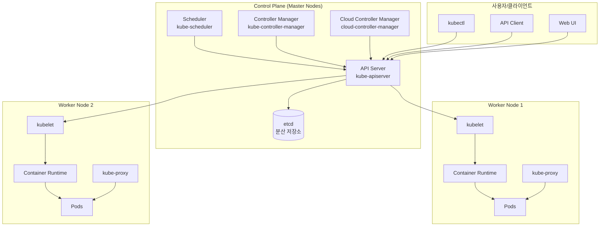
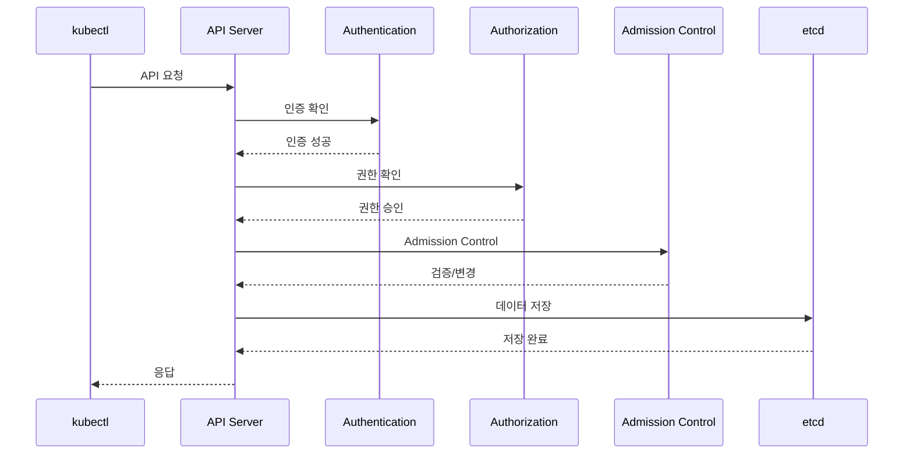
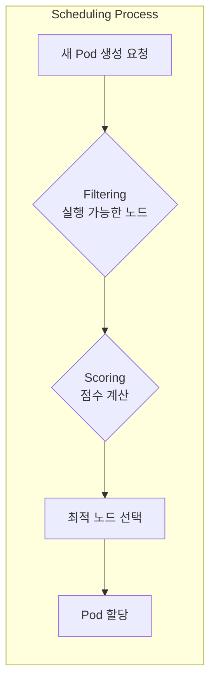
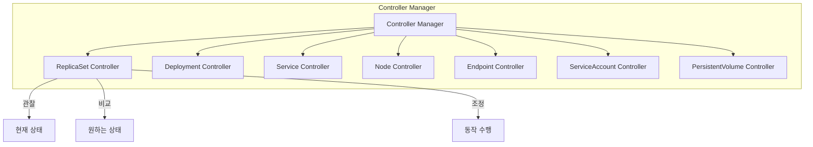
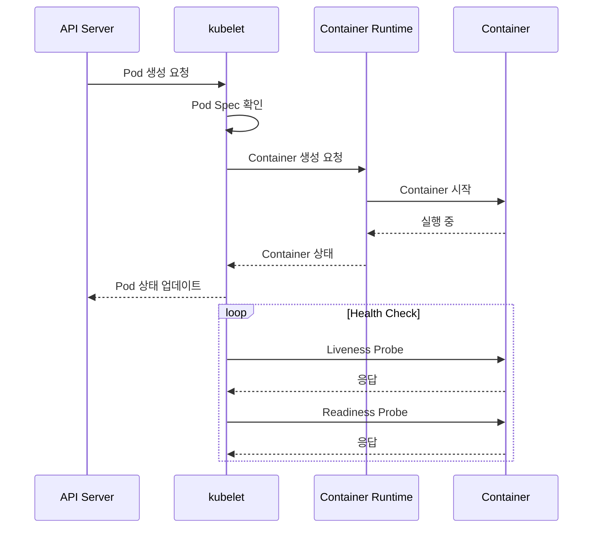
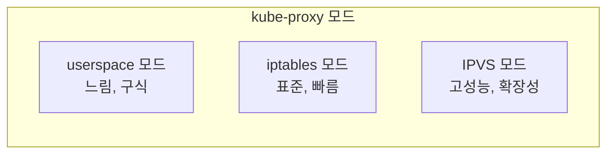
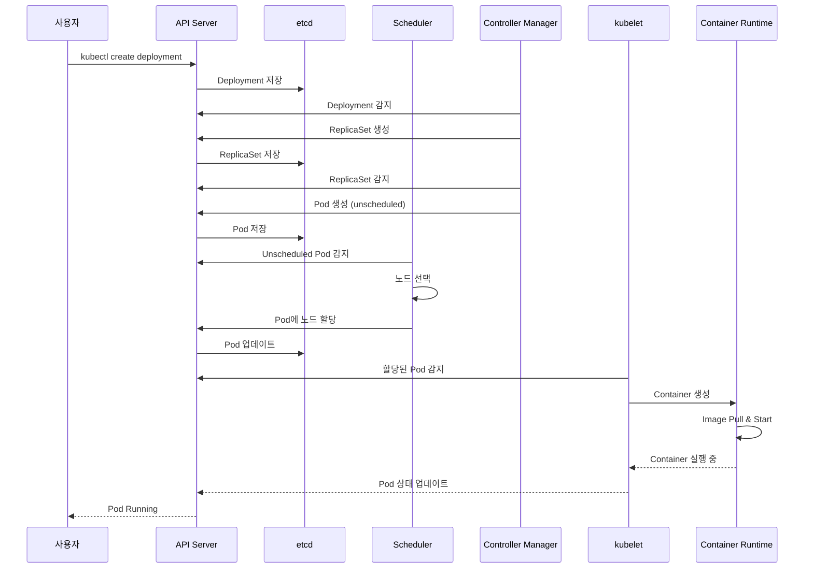
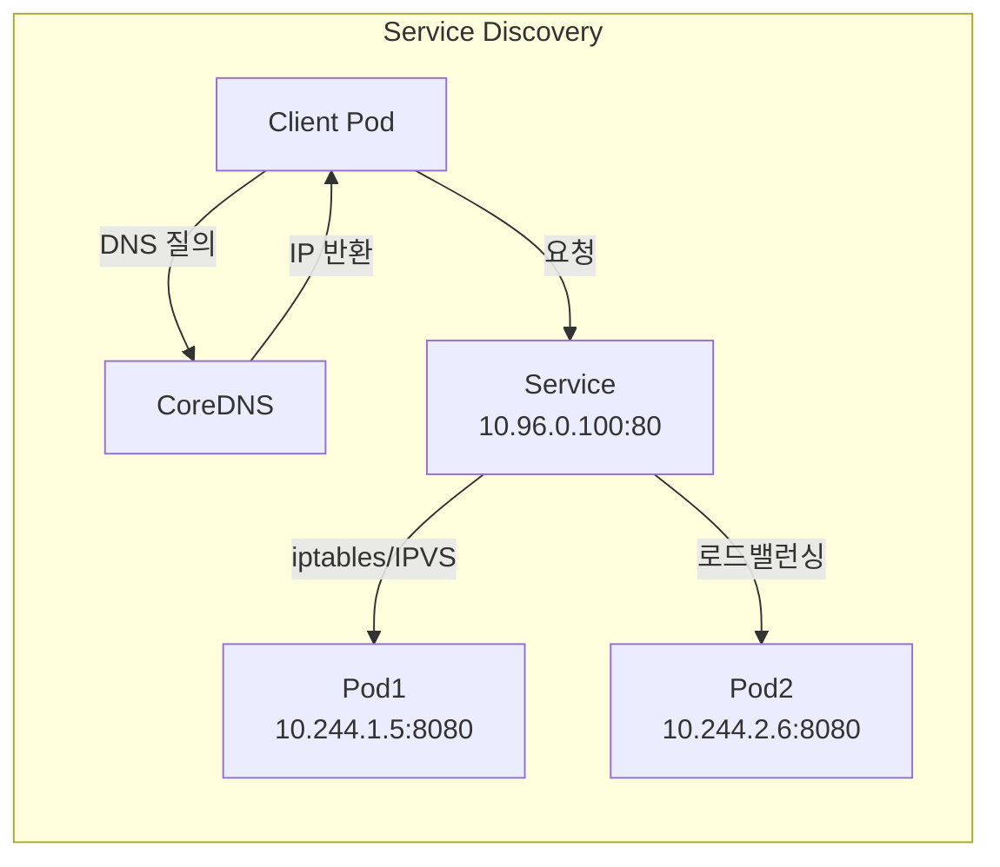
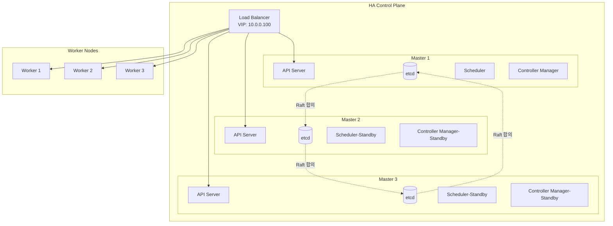

# 🏗️ Kubernetes 아키텍처 완벽 이해

> 💡 **목표**: Kubernetes의 내부 동작 원리를 깊이 이해하고, 각 컴포넌트가 어떻게 협력하는지 파악합니다.

## 📚 목차

1. [**아키텍처 전체 구조**](#아키텍처-전체-구조)
2. [**Control Plane 상세**](#control-plane-상세)
3. [**Worker Node 상세**](#worker-node-상세)
4. [**통신 흐름**](#통신-흐름)
5. [**고가용성(HA) 구성**](#고가용성ha-구성)
6. [**실습: 컴포넌트 모니터링**](#실습-컴포넌트-모니터링)

---

## 🏛️ 아키텍처 전체 구조

### Kubernetes 클러스터 구조도



### 🎯 각 컴포넌트의 역할

| 컴포넌트 | 위치 | 주요 역할 | 포트 |
|---------|------|----------|------|
| **kube-apiserver** | Control Plane | 모든 API 요청 처리 | 6443 (HTTPS) |
| **etcd** | Control Plane | 클러스터 데이터 저장 | 2379-2380 |
| **kube-scheduler** | Control Plane | Pod 배치 결정 | 10251 |
| **kube-controller-manager** | Control Plane | 컨트롤러 실행 | 10252 |
| **kubelet** | Worker Node | Pod 생명주기 관리 | 10250 |
| **kube-proxy** | Worker Node | 네트워크 프록시 | 10256 |

---

## 🎛️ Control Plane 상세

### 1. API Server (kube-apiserver)

API Server는 Kubernetes의 중앙 관리 지점입니다.



**주요 기능:**
```yaml
# API Server 설정 예시
apiVersion: v1
kind: Pod
metadata:
  name: kube-apiserver
  namespace: kube-system
spec:
  containers:
  - name: kube-apiserver
    image: k8s.gcr.io/kube-apiserver:v1.27.0
    command:
    - kube-apiserver
    - --advertise-address=10.0.1.10
    - --allow-privileged=true
    - --authorization-mode=Node,RBAC  # 권한 모드
    - --client-ca-file=/etc/kubernetes/pki/ca.crt
    - --enable-admission-plugins=NodeRestriction,ResourceQuota
    - --etcd-servers=https://127.0.0.1:2379  # etcd 연결
    - --secure-port=6443
```

### 2. etcd (분산 키-값 저장소)

etcd는 모든 클러스터 데이터를 저장하는 신뢰할 수 있는 분산 저장소입니다.

```bash
# etcd에 저장되는 데이터 구조
/registry/
├── pods/
│   ├── default/
│   │   ├── my-pod
│   │   └── web-app
│   └── kube-system/
│       ├── coredns
│       └── kube-proxy
├── services/
│   └── default/
│       └── kubernetes
├── deployments/
├── configmaps/
├── secrets/
└── namespaces/
```

**etcd 백업과 복구:**
```bash
# etcd 백업
ETCDCTL_API=3 etcdctl \
  --endpoints=https://127.0.0.1:2379 \
  --cacert=/etc/kubernetes/pki/etcd/ca.crt \
  --cert=/etc/kubernetes/pki/etcd/server.crt \
  --key=/etc/kubernetes/pki/etcd/server.key \
  snapshot save backup.db

# 백업 확인
ETCDCTL_API=3 etcdctl snapshot status backup.db

# etcd 복구
ETCDCTL_API=3 etcdctl snapshot restore backup.db \
  --data-dir=/var/lib/etcd-backup
```

### 3. Scheduler (kube-scheduler)

Scheduler는 새로운 Pod를 어느 Node에 배치할지 결정합니다.



**스케줄링 결정 요소:**
```yaml
# Pod의 스케줄링 요구사항 예시
apiVersion: v1
kind: Pod
metadata:
  name: gpu-pod
spec:
  # Node Selector
  nodeSelector:
    gpu: "true"
    disktype: "ssd"
  
  # Resource Requirements
  containers:
  - name: cuda-app
    image: nvidia/cuda
    resources:
      requests:
        memory: "8Gi"
        cpu: "4"
        nvidia.com/gpu: "1"
      limits:
        memory: "16Gi"
        cpu: "8"
        nvidia.com/gpu: "2"
  
  # Affinity Rules
  affinity:
    nodeAffinity:
      requiredDuringSchedulingIgnoredDuringExecution:
        nodeSelectorTerms:
        - matchExpressions:
          - key: kubernetes.io/e2e-az-name
            operator: In
            values:
            - az1
            - az2
    podAntiAffinity:
      requiredDuringSchedulingIgnoredDuringExecution:
      - labelSelector:
          matchExpressions:
          - key: app
            operator: In
            values:
            - gpu-app
        topologyKey: kubernetes.io/hostname
```

### 4. Controller Manager

Controller Manager는 여러 컨트롤러를 실행하여 클러스터 상태를 관리합니다.



**Controller 동작 예시 - ReplicaSet Controller:**
```yaml
# 원하는 상태: 3개 replica
apiVersion: apps/v1
kind: ReplicaSet
metadata:
  name: web-rs
spec:
  replicas: 3  # 원하는 상태
  selector:
    matchLabels:
      app: web
  template:
    metadata:
      labels:
        app: web
    spec:
      containers:
      - name: nginx
        image: nginx
```

```bash
# Controller의 조정 과정
# 1. 현재 상태 확인: 2개 Pod 실행 중
# 2. 원하는 상태: 3개 Pod
# 3. 차이 계산: 1개 부족
# 4. 동작: 1개 Pod 추가 생성
```

---

## 🖥️ Worker Node 상세

### 1. kubelet

kubelet은 각 Node에서 실행되며 Pod의 생명주기를 관리합니다.



**kubelet 설정:**
```yaml
# kubelet-config.yaml
apiVersion: kubelet.config.k8s.io/v1beta1
kind: KubeletConfiguration
clusterDNS:
- 10.96.0.10
clusterDomain: cluster.local
containerRuntime: docker
maxPods: 110
podPidsLimit: 4096
healthzBindAddress: 127.0.0.1
healthzPort: 10248
readOnlyPort: 0
cgroupDriver: systemd
authentication:
  webhook:
    enabled: true
authorization:
  mode: Webhook
```

### 2. kube-proxy

kube-proxy는 Service의 네트워크 규칙을 관리합니다.



**iptables 규칙 예시:**
```bash
# Service: my-service (ClusterIP: 10.96.0.100)
# Endpoints: 10.244.1.5:80, 10.244.2.6:80

# kube-proxy가 생성하는 iptables 규칙
iptables -t nat -A KUBE-SERVICES \
  -d 10.96.0.100/32 -p tcp --dport 80 \
  -j KUBE-SVC-XXXXX

# 로드밸런싱 규칙
iptables -t nat -A KUBE-SVC-XXXXX \
  -m statistic --mode random --probability 0.5 \
  -j KUBE-SEP-AAAAA  # Pod 1

iptables -t nat -A KUBE-SVC-XXXXX \
  -j KUBE-SEP-BBBBB  # Pod 2
```

### 3. Container Runtime

Container Runtime은 실제 컨테이너를 실행합니다.

```yaml
# Container Runtime Interface (CRI) 구현체들
Container_Runtimes:
  - Docker:
      deprecated: true
      version: "< 1.24"
      
  - containerd:
      recommended: true
      features:
        - "네이티브 Kubernetes 지원"
        - "경량화"
        - "높은 성능"
      
  - CRI-O:
      optimized_for: "Kubernetes"
      features:
        - "OCI 표준 준수"
        - "최소 기능 집합"
```

---

## 🔄 통신 흐름

### Pod 생성 과정 상세



### Service 통신 흐름

```yaml
# 1. Service 생성
apiVersion: v1
kind: Service
metadata:
  name: web-service
spec:
  selector:
    app: web
  ports:
  - port: 80
    targetPort: 8080
```



---

## 🔐 고가용성(HA) 구성

### HA Control Plane 구성



### etcd 클러스터 구성

```bash
# etcd 클러스터 초기화
etcd --name etcd1 \
  --initial-advertise-peer-urls http://10.0.1.10:2380 \
  --listen-peer-urls http://10.0.1.10:2380 \
  --listen-client-urls http://10.0.1.10:2379,http://127.0.0.1:2379 \
  --advertise-client-urls http://10.0.1.10:2379 \
  --initial-cluster-token etcd-cluster-1 \
  --initial-cluster etcd1=http://10.0.1.10:2380,etcd2=http://10.0.1.11:2380,etcd3=http://10.0.1.12:2380 \
  --initial-cluster-state new
```

### Leader Election

```yaml
# Scheduler와 Controller Manager의 Leader Election
apiVersion: v1
kind: ConfigMap
metadata:
  name: kube-scheduler
  namespace: kube-system
data:
  config.yaml: |
    apiVersion: kubescheduler.config.k8s.io/v1beta3
    kind: KubeSchedulerConfiguration
    leaderElection:
      leaderElect: true
      leaseDuration: 15s
      renewDeadline: 10s
      retryPeriod: 2s
      resourceLock: leases
      resourceName: kube-scheduler
      resourceNamespace: kube-system
```

---

## 🔬 실습: 컴포넌트 모니터링

### 실습 1: Control Plane 컴포넌트 상태 확인

```bash
# 1. Control Plane 컴포넌트 Pod 확인
kubectl get pods -n kube-system

# 2. 각 컴포넌트 로그 확인
kubectl logs -n kube-system kube-apiserver-master
kubectl logs -n kube-system kube-scheduler-master
kubectl logs -n kube-system kube-controller-manager-master

# 3. 컴포넌트 상태 확인
kubectl get componentstatuses

# 4. etcd 상태 확인
ETCDCTL_API=3 etcdctl \
  --endpoints=https://127.0.0.1:2379 \
  --cacert=/etc/kubernetes/pki/etcd/ca.crt \
  --cert=/etc/kubernetes/pki/etcd/server.crt \
  --key=/etc/kubernetes/pki/etcd/server.key \
  endpoint health
```

### 실습 2: kubelet 디버깅

```bash
# 1. kubelet 상태 확인
systemctl status kubelet

# 2. kubelet 로그 확인
journalctl -u kubelet -f

# 3. kubelet 설정 확인
cat /var/lib/kubelet/config.yaml

# 4. kubelet 메트릭 확인
curl -k https://localhost:10250/metrics

# 5. Node 상태 확인
kubectl describe node <node-name>
```

### 실습 3: kube-proxy 모니터링

```bash
# 1. kube-proxy 모드 확인
kubectl get configmap -n kube-system kube-proxy -o yaml | grep mode

# 2. iptables 규칙 확인
sudo iptables -t nat -L -n | grep KUBE

# 3. IPVS 규칙 확인 (IPVS 모드인 경우)
sudo ipvsadm -Ln

# 4. kube-proxy 메트릭
kubectl port-forward -n kube-system pods/kube-proxy-xxxxx 10249:10249
curl localhost:10249/metrics
```

### 실습 4: API Server 요청 추적

```bash
# 1. API Server 감사 로그 활성화
cat <<EOF > audit-policy.yaml
apiVersion: audit.k8s.io/v1
kind: Policy
rules:
- level: RequestResponse
  omitStages:
  - RequestReceived
  resources:
  - group: ""
    resources: ["pods", "services"]
  namespaces: ["default"]
EOF

# 2. API Server 인수에 감사 설정 추가
--audit-policy-file=/etc/kubernetes/audit-policy.yaml
--audit-log-path=/var/log/kubernetes/audit.log
--audit-log-maxage=30
--audit-log-maxbackup=10
--audit-log-maxsize=100

# 3. 감사 로그 확인
tail -f /var/log/kubernetes/audit.log | jq .
```

---

## 🎓 핵심 개념 정리

### 아키텍처 이해도 체크리스트

- [ ] Control Plane의 5가지 주요 컴포넌트를 설명할 수 있다
- [ ] Pod 생성 과정을 단계별로 설명할 수 있다
- [ ] etcd의 역할과 중요성을 이해한다
- [ ] Scheduler의 Pod 배치 결정 과정을 안다
- [ ] Controller의 조정 루프(Reconciliation Loop)를 이해한다
- [ ] kubelet과 Container Runtime의 관계를 안다
- [ ] kube-proxy의 3가지 모드 차이를 설명할 수 있다
- [ ] HA 구성의 필요성과 방법을 이해한다

### 🚀 심화 학습 주제

1. **Custom Controller 개발**: client-go 라이브러리 활용
2. **Admission Webhook**: ValidatingWebhook, MutatingWebhook
3. **CRI 구현체 비교**: containerd vs CRI-O
4. **etcd 성능 튜닝**: 대규모 클러스터 운영
5. **Federation**: 멀티 클러스터 관리

---

## 💡 트러블슈팅 가이드

### 일반적인 문제와 해결

| 증상 | 가능한 원인 | 해결 방법 |
|-----|-----------|----------|
| kubectl 명령 응답 없음 | API Server 문제 | API Server 로그 확인, 인증서 만료 확인 |
| Pod Pending 상태 | 리소스 부족, 스케줄링 실패 | Node 리소스 확인, Pod 요구사항 확인 |
| Node NotReady | kubelet 문제, 네트워크 문제 | kubelet 로그 확인, CNI 플러그인 확인 |
| Service 접속 불가 | Endpoint 없음, kube-proxy 문제 | Endpoint 확인, iptables 규칙 확인 |

---

> 🚀 **다음 문서**: [first-deployment.md](first-deployment.md)에서 실제 애플리케이션을 배포해보세요!