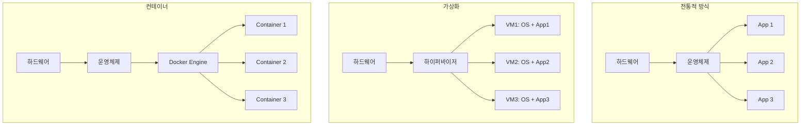
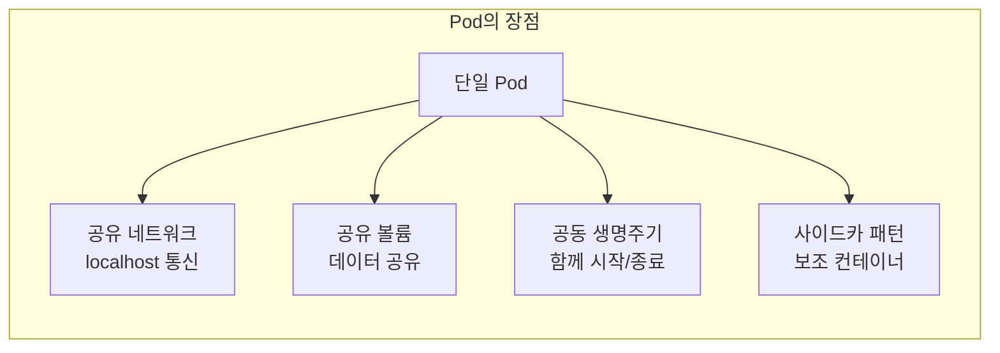
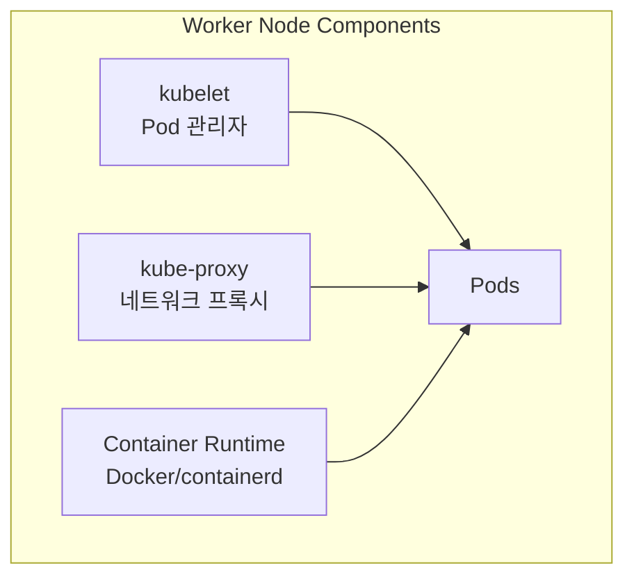
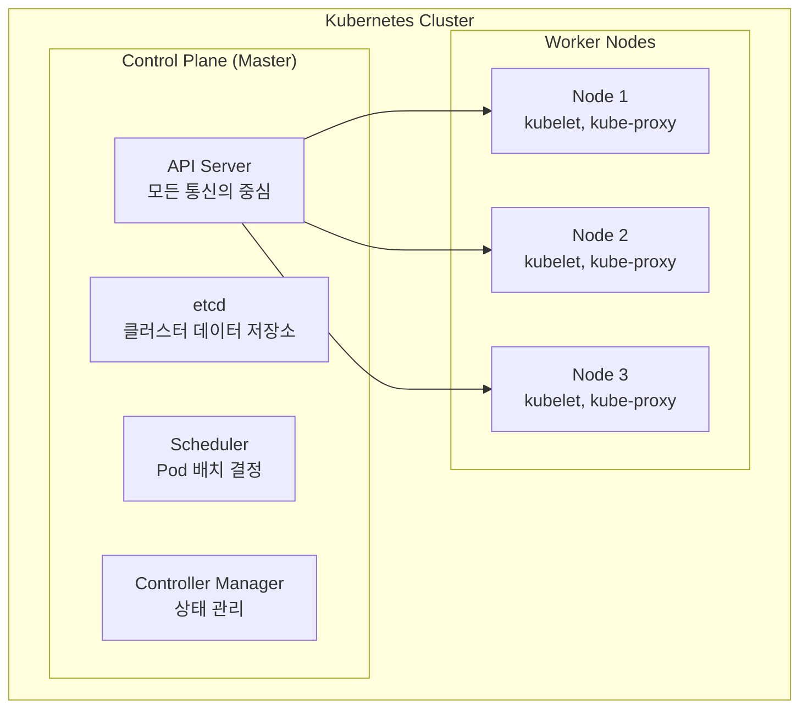
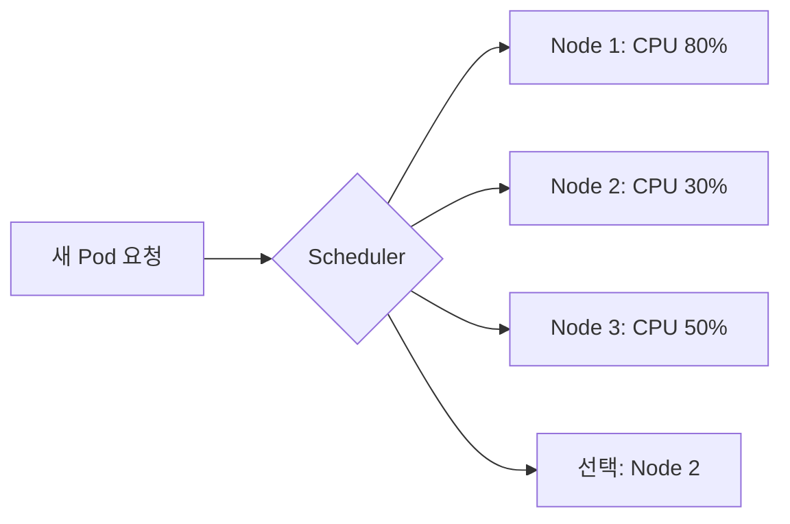
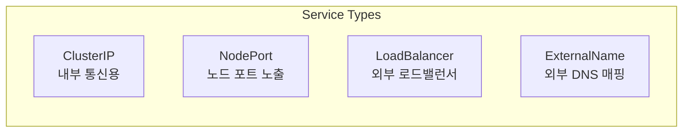
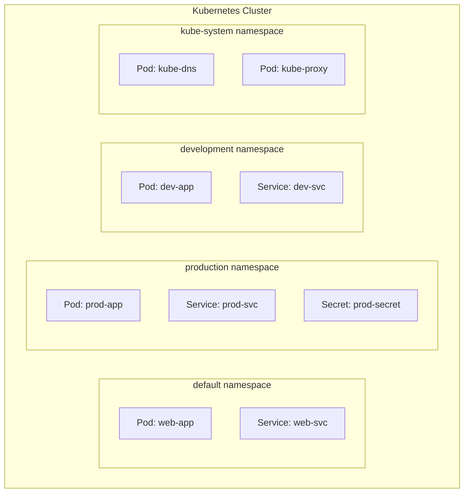

# 🎓 Kubernetes 핵심 개념 완벽 가이드

> 💡 **목표**: Kubernetes의 기본 구성 요소를 이해하고, 각 요소가 어떻게 상호작용하는지 파악합니다.

## 📚 목차

1. [**Container와 Pod**](#container와-pod)
2. [**Node와 Cluster**](#node와-cluster)
3. [**핵심 리소스 타입**](#핵심-리소스-타입)
4. [**Label과 Selector**](#label과-selector)
5. [**Namespace**](#namespace)
6. [**실습 예제**](#실습-예제)

---

## 🐳 Container와 Pod

### Container란?

컨테이너는 애플리케이션과 그 실행에 필요한 모든 것(코드, 라이브러리, 설정 등)을 패키징한 것입니다.



### Pod란? (쿠버네티스의 최소 단위)

Pod는 하나 이상의 컨테이너를 감싸는 쿠버네티스의 최소 배포 단위입니다.

```yaml
# pod-example.yaml
apiVersion: v1
kind: Pod
metadata:
  name: my-first-pod
  labels:
    app: web
    environment: dev
spec:
  containers:
  - name: nginx-container
    image: nginx:1.21
    ports:
    - containerPort: 80
    resources:
      requests:
        memory: "64Mi"
        cpu: "250m"
      limits:
        memory: "128Mi"
        cpu: "500m"
```

**🔑 핵심 특징:**
- **공유 네트워크**: Pod 내 모든 컨테이너는 localhost로 통신
- **공유 스토리지**: Volume을 통해 데이터 공유
- **생명주기**: Pod는 일시적(ephemeral) - 언제든 사라질 수 있음
- **IP 주소**: 각 Pod는 고유한 IP 주소를 가짐

### 🤔 왜 Container를 직접 실행하지 않고 Pod를 사용할까?



**실제 예시: 웹 서버 + 로그 수집기**
```yaml
apiVersion: v1
kind: Pod
metadata:
  name: web-with-sidecar
spec:
  containers:
  # 메인 애플리케이션
  - name: web-app
    image: nginx
    volumeMounts:
    - name: shared-logs
      mountPath: /var/log/nginx
  
  # 사이드카: 로그 수집
  - name: log-collector
    image: fluentd
    volumeMounts:
    - name: shared-logs
      mountPath: /logs
      readOnly: true
  
  volumes:
  - name: shared-logs
    emptyDir: {}
```

---

## 🖥️ Node와 Cluster

### Node (Worker Node)

Node는 Pod가 실행되는 물리적 또는 가상 머신입니다.



**Node 구성 요소:**
| 구성 요소 | 역할 | 상세 설명 |
|---------|------|----------|
| **kubelet** | Pod 실행 관리 | Control Plane의 지시를 받아 Pod 생성/삭제/모니터링 |
| **kube-proxy** | 네트워크 관리 | Service의 네트워크 규칙 관리, 로드 밸런싱 |
| **Container Runtime** | 컨테이너 실행 | Docker, containerd, CRI-O 등 |

### Cluster

Cluster는 Control Plane과 여러 Worker Node의 집합입니다.



### Control Plane 구성 요소 상세

#### 1. **API Server** (kube-apiserver)
```bash
# API Server와 상호작용
kubectl get pods  # → API Server → etcd
kubectl create deployment nginx --image=nginx  # → API Server → Scheduler → kubelet
```

#### 2. **etcd** (분산 키-값 저장소)
```bash
# etcd에 저장되는 정보 예시
/registry/pods/default/my-pod
/registry/services/default/my-service
/registry/namespaces/production
/registry/secrets/default/db-password
```

#### 3. **Scheduler**


#### 4. **Controller Manager**
```yaml
# Deployment Controller의 동작
# 목표: 3개 replica 유지
# 현재: 2개 실행 중 (1개 실패)
# 동작: 새로운 Pod 1개 생성
```

---

## 📦 핵심 리소스 타입

### 1. Workload Resources

| 리소스 | 용도 | 언제 사용? |
|-------|------|-----------|
| **Pod** | 컨테이너 실행 최소 단위 | 거의 직접 사용 안함 |
| **Deployment** | Stateless 앱 배포 | 웹 서버, API 서버 |
| **StatefulSet** | Stateful 앱 배포 | 데이터베이스, 큐 |
| **DaemonSet** | 모든 노드에 배포 | 로그 수집, 모니터링 |
| **Job** | 일회성 작업 | 배치 처리, 백업 |
| **CronJob** | 주기적 작업 | 정기 백업, 리포트 생성 |

### 2. Service Resources



### 3. Config & Storage

```yaml
# ConfigMap 예시
apiVersion: v1
kind: ConfigMap
metadata:
  name: app-config
data:
  database_url: "postgres://localhost:5432/mydb"
  cache_size: "100"
  feature_flag: "true"

---
# Secret 예시
apiVersion: v1
kind: Secret
metadata:
  name: db-secret
type: Opaque
data:
  username: YWRtaW4=  # base64로 인코딩된 "admin"
  password: cGFzc3dvcmQxMjM=  # base64로 인코딩된 "password123"
```

---

## 🏷️ Label과 Selector

### Label이란?

Label은 리소스를 구분하고 그룹화하는 키-값 쌍입니다.

```yaml
# Label 정의
metadata:
  labels:
    app: frontend
    version: v1.2.3
    environment: production
    team: platform
    cost-center: engineering
```

### Selector로 리소스 찾기

```bash
# Label selector 예시
kubectl get pods -l app=frontend
kubectl get pods -l 'environment in (production, staging)'
kubectl get pods -l 'version!=v1.0.0'
kubectl get pods -l 'team,!test'  # team 레이블 있고 test 레이블 없는 것
```

### 실제 활용 예시

```yaml
apiVersion: apps/v1
kind: Deployment
metadata:
  name: web-app
spec:
  replicas: 3
  selector:
    matchLabels:
      app: web  # 이 Label을 가진 Pod 관리
  template:
    metadata:
      labels:
        app: web  # Pod에 Label 부여
    spec:
      containers:
      - name: nginx
        image: nginx

---
apiVersion: v1
kind: Service
metadata:
  name: web-service
spec:
  selector:
    app: web  # 이 Label을 가진 Pod로 트래픽 전송
  ports:
  - port: 80
```

---

## 🗂️ Namespace

### Namespace란?

Namespace는 클러스터를 논리적으로 분리하는 가상 클러스터입니다.



### Namespace 활용

```bash
# Namespace 생성
kubectl create namespace production
kubectl create namespace development

# Namespace에 리소스 생성
kubectl create deployment nginx --image=nginx -n production

# 기본 Namespace 변경
kubectl config set-context --current --namespace=production

# Namespace별 리소스 쿼터 설정
cat <<EOF | kubectl apply -f -
apiVersion: v1
kind: ResourceQuota
metadata:
  name: compute-quota
  namespace: development
spec:
  hard:
    requests.cpu: "10"
    requests.memory: 20Gi
    limits.cpu: "20"
    limits.memory: 40Gi
    persistentvolumeclaims: "10"
EOF
```

### 🎯 Namespace 사용 전략

| Namespace | 용도 | 예시 리소스 |
|-----------|------|------------|
| **default** | 기본 작업 공간 | 테스트, 임시 리소스 |
| **kube-system** | 시스템 컴포넌트 | CoreDNS, kube-proxy |
| **kube-public** | 공개 리소스 | ConfigMap (클러스터 정보) |
| **production** | 운영 환경 | 실제 서비스 |
| **staging** | 스테이징 환경 | 테스트용 서비스 |
| **development** | 개발 환경 | 개발자 테스트 |
| **monitoring** | 모니터링 도구 | Prometheus, Grafana |

---

## 🧪 실습 예제

### 실습 1: 첫 Pod 생성하기

```bash
# 1. Pod 생성
cat <<EOF | kubectl apply -f -
apiVersion: v1
kind: Pod
metadata:
  name: hello-pod
  labels:
    app: hello
spec:
  containers:
  - name: hello
    image: busybox
    command: ['sh', '-c', 'echo "Hello Kubernetes!" && sleep 3600']
EOF

# 2. Pod 상태 확인
kubectl get pods
kubectl describe pod hello-pod

# 3. 로그 확인
kubectl logs hello-pod

# 4. Pod 내부 접속
kubectl exec -it hello-pod -- sh
# 내부에서 명령 실행
> hostname
> ps aux
> exit

# 5. Pod 삭제
kubectl delete pod hello-pod
```

### 실습 2: Label과 Selector 활용

```bash
# 1. 여러 Pod 생성 (다양한 Label)
kubectl run pod1 --image=nginx --labels="env=prod,app=web,version=v1"
kubectl run pod2 --image=nginx --labels="env=dev,app=web,version=v2"
kubectl run pod3 --image=nginx --labels="env=prod,app=api,version=v1"
kubectl run pod4 --image=nginx --labels="env=dev,app=api,version=v2"

# 2. Label selector로 조회
kubectl get pods -l env=prod
kubectl get pods -l app=web
kubectl get pods -l 'version in (v1, v2)'
kubectl get pods -l 'env=prod,app=web'

# 3. Label 추가/변경
kubectl label pod pod1 team=platform
kubectl label pod pod2 team=platform --overwrite

# 4. Label 삭제
kubectl label pod pod1 team-

# 5. 정리
kubectl delete pods --all
```

### 실습 3: Namespace 간 통신

```bash
# 1. Namespace 생성
kubectl create namespace frontend
kubectl create namespace backend

# 2. 각 Namespace에 앱 배포
kubectl create deployment frontend --image=nginx -n frontend
kubectl create deployment backend --image=nginx -n backend

# 3. Service 생성
kubectl expose deployment frontend --port=80 -n frontend
kubectl expose deployment backend --port=80 -n backend

# 4. Cross-namespace 통신 테스트
kubectl run test --image=busybox -n frontend --rm -it -- sh
# Pod 내부에서
> wget -O- backend.backend.svc.cluster.local
# 형식: <service-name>.<namespace>.svc.cluster.local

# 5. 정리
kubectl delete namespace frontend backend
```

### 실습 4: 리소스 계층 구조 이해하기

```bash
# 1. Deployment 생성 (자동으로 ReplicaSet과 Pod 생성)
kubectl create deployment my-app --image=nginx --replicas=3

# 2. 계층 구조 확인
kubectl get deployments
kubectl get replicasets
kubectl get pods

# 3. 관계 확인
kubectl describe deployment my-app | grep -A 5 "Replicas:"
kubectl describe replicaset | grep -A 5 "Controlled By:"
kubectl describe pod | grep -A 5 "Controlled By:"

# 4. Scale 테스트
kubectl scale deployment my-app --replicas=5
watch kubectl get pods  # Pod가 자동으로 생성되는 것 확인

# 5. 정리
kubectl delete deployment my-app
```

---

## 📊 개념 정리 체크리스트

### ✅ 이해도 자가 진단

- [ ] Container와 Pod의 차이를 설명할 수 있다
- [ ] Pod가 재시작되면 IP가 변경되는 이유를 안다
- [ ] Control Plane의 4가지 구성 요소 역할을 설명할 수 있다
- [ ] Label과 Selector의 관계를 이해한다
- [ ] Namespace를 언제 사용하는지 안다
- [ ] kubectl 기본 명령어를 사용할 수 있다

### 🎯 다음 단계

1. **Deployment 심화**: Rolling Update, Rollback 전략
2. **Service 네트워킹**: ClusterIP, NodePort, LoadBalancer 차이
3. **Storage**: Volume, PV, PVC 개념과 활용

---

## 💡 Pro Tips

### kubectl 생산성 향상

```bash
# 별칭 설정 (~/.bashrc 또는 ~/.zshrc)
alias k=kubectl
alias kgp='kubectl get pods'
alias kgs='kubectl get services'
alias kgd='kubectl get deployments'

# 자동완성 설정
source <(kubectl completion bash)  # bash
source <(kubectl completion zsh)   # zsh

# Context 빠른 전환
kubectl config get-contexts
kubectl config use-context <context-name>

# Dry-run으로 YAML 생성
kubectl create deployment my-app --image=nginx --dry-run=client -o yaml > deployment.yaml
```

### 디버깅 꿀팁

```bash
# 임시 디버그 Pod 실행
kubectl run debug --image=nicolaka/netshoot --rm -it -- bash

# 실행 중인 Pod에 디버그 컨테이너 추가
kubectl debug <pod-name> -it --image=busybox --share-processes

# 이벤트 모니터링
kubectl get events --watch

# 리소스 사용량 확인
kubectl top nodes
kubectl top pods
```

---

> 🚀 **다음 문서**: [architecture.md](architecture.md)에서 Kubernetes 아키텍처를 더 깊이 알아보세요!