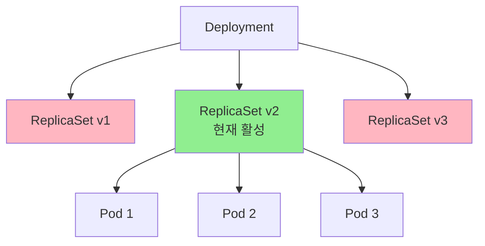
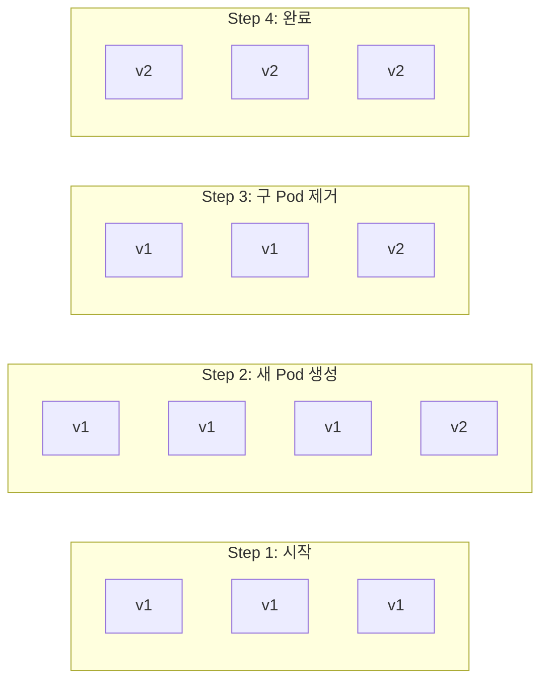

# 🚀 Deployment 완벽 마스터

> 💡 **목표**: Kubernetes에서 가장 많이 사용되는 Deployment를 완벽히 이해하고, 프로덕션 수준의 배포 전략을 구현합니다.

## 📚 목차

1. [**Deployment란?**](#deployment란)
2. [**Deployment 생성과 관리**](#deployment-생성과-관리)
3. [**배포 전략**](#배포-전략)
4. [**롤백과 이력 관리**](#롤백과-이력-관리)
5. [**스케일링**](#스케일링)
6. [**실전 예제**](#실전-예제)

---

## 📦 Deployment란?

### Deployment의 역할

Deployment는 Pod와 ReplicaSet을 선언적으로 관리하는 상위 리소스입니다.



### 왜 Pod나 ReplicaSet 대신 Deployment를 사용할까?

| 기능 | Pod | ReplicaSet | Deployment |
|-----|-----|-----------|------------|
| 복제본 관리 | ❌ | ✅ | ✅ |
| 롤링 업데이트 | ❌ | ❌ | ✅ |
| 롤백 | ❌ | ❌ | ✅ |
| 일시 중지/재개 | ❌ | ❌ | ✅ |
| 배포 전략 | ❌ | ❌ | ✅ |
| 이력 관리 | ❌ | ❌ | ✅ |

---

## 🛠️ Deployment 생성과 관리

### 기본 Deployment 생성

```yaml
# deployment.yaml
apiVersion: apps/v1
kind: Deployment
metadata:
  name: web-app
  labels:
    app: web
    version: v1.0.0
  annotations:
    description: "Production web application"
spec:
  replicas: 3
  selector:
    matchLabels:
      app: web
  template:
    metadata:
      labels:
        app: web
        version: v1.0.0
    spec:
      containers:
      - name: web
        image: nginx:1.21
        ports:
        - containerPort: 80
        resources:
          requests:
            memory: "128Mi"
            cpu: "100m"
          limits:
            memory: "256Mi"
            cpu: "200m"
        livenessProbe:
          httpGet:
            path: /
            port: 80
          initialDelaySeconds: 30
          periodSeconds: 10
        readinessProbe:
          httpGet:
            path: /
            port: 80
          initialDelaySeconds: 5
          periodSeconds: 5
```

### Deployment 명령어

```bash
# Deployment 생성
kubectl apply -f deployment.yaml

# 또는 명령어로 직접 생성
kubectl create deployment web-app --image=nginx:1.21 --replicas=3

# Deployment 목록 확인
kubectl get deployments
kubectl get deploy web-app -o wide

# 상세 정보 확인
kubectl describe deployment web-app

# Deployment 편집
kubectl edit deployment web-app

# Deployment 삭제
kubectl delete deployment web-app
```

### Deployment 상태 이해하기

```bash
$ kubectl get deployment web-app
NAME      READY   UP-TO-DATE   AVAILABLE   AGE
web-app   3/3     3            3           2m
```

| 필드 | 의미 |
|-----|------|
| **READY** | 준비된 Pod 수 / 원하는 Pod 수 |
| **UP-TO-DATE** | 최신 템플릿으로 업데이트된 Pod 수 |
| **AVAILABLE** | 사용 가능한 Pod 수 (Ready 상태) |
| **AGE** | Deployment 생성 후 경과 시간 |

---

## 🔄 배포 전략

### 1. Rolling Update (기본값)

점진적으로 새 버전으로 교체합니다.

```yaml
apiVersion: apps/v1
kind: Deployment
metadata:
  name: rolling-update-app
spec:
  replicas: 10
  strategy:
    type: RollingUpdate
    rollingUpdate:
      maxSurge: 2         # 동시에 생성할 수 있는 최대 Pod 수
      maxUnavailable: 1   # 동시에 삭제할 수 있는 최대 Pod 수
  selector:
    matchLabels:
      app: rolling
  template:
    metadata:
      labels:
        app: rolling
    spec:
      containers:
      - name: app
        image: myapp:v2
```

**Rolling Update 과정:**


### 2. Recreate

모든 Pod를 한 번에 교체합니다 (다운타임 발생).

```yaml
apiVersion: apps/v1
kind: Deployment
metadata:
  name: recreate-app
spec:
  replicas: 3
  strategy:
    type: Recreate  # 모든 Pod 삭제 후 재생성
  selector:
    matchLabels:
      app: recreate
  template:
    metadata:
      labels:
        app: recreate
    spec:
      containers:
      - name: app
        image: myapp:v2
```

### 3. Blue-Green 배포 (수동 구현)

```bash
# 1. Green(새 버전) 배포
kubectl create deployment green-app --image=myapp:v2 --replicas=3

# 2. Green 테스트
kubectl port-forward deployment/green-app 8080:80

# 3. Service를 Green으로 전환
kubectl patch service my-service -p '{"spec":{"selector":{"version":"v2"}}}'

# 4. Blue(구 버전) 삭제
kubectl delete deployment blue-app
```

### 4. Canary 배포

```yaml
# canary-deployment.yaml
# 10% 트래픽을 새 버전으로
apiVersion: apps/v1
kind: Deployment
metadata:
  name: app-canary
spec:
  replicas: 1  # 전체의 10%
  selector:
    matchLabels:
      app: myapp
      version: canary
  template:
    metadata:
      labels:
        app: myapp
        version: canary
    spec:
      containers:
      - name: app
        image: myapp:v2

---
# stable-deployment.yaml
# 90% 트래픽은 안정 버전
apiVersion: apps/v1
kind: Deployment
metadata:
  name: app-stable
spec:
  replicas: 9  # 전체의 90%
  selector:
    matchLabels:
      app: myapp
      version: stable
  template:
    metadata:
      labels:
        app: myapp
        version: stable
    spec:
      containers:
      - name: app
        image: myapp:v1

---
# Service는 두 버전 모두 선택
apiVersion: v1
kind: Service
metadata:
  name: myapp-service
spec:
  selector:
    app: myapp  # version 라벨 제외
  ports:
  - port: 80
```

---

## ⏮️ 롤백과 이력 관리

### Deployment 이력 확인

```bash
# 롤아웃 이력 확인
kubectl rollout history deployment web-app

# 특정 리비전 상세 정보
kubectl rollout history deployment web-app --revision=2

# 변경 원인 기록
kubectl annotate deployment web-app kubernetes.io/change-cause="Update nginx to 1.21"
```

### 롤백 수행

```bash
# 이전 버전으로 롤백
kubectl rollout undo deployment web-app

# 특정 리비전으로 롤백
kubectl rollout undo deployment web-app --to-revision=2

# 롤아웃 상태 확인
kubectl rollout status deployment web-app

# 롤아웃 일시 중지
kubectl rollout pause deployment web-app

# 롤아웃 재개
kubectl rollout resume deployment web-app
```

### 실습: 롤백 시나리오

```bash
# 1. 초기 배포
kubectl create deployment demo --image=nginx:1.19
kubectl rollout status deployment demo

# 2. 첫 번째 업데이트 (성공)
kubectl set image deployment/demo nginx=nginx:1.20
kubectl annotate deployment demo kubernetes.io/change-cause="Update to nginx 1.20"

# 3. 두 번째 업데이트 (실패 시뮬레이션)
kubectl set image deployment/demo nginx=nginx:invalid
kubectl annotate deployment demo kubernetes.io/change-cause="Failed update to invalid image"

# 4. 상태 확인 (ImagePullBackOff)
kubectl get pods
kubectl rollout status deployment demo

# 5. 이력 확인
kubectl rollout history deployment demo

# 6. 롤백
kubectl rollout undo deployment demo
kubectl rollout status deployment demo

# 7. 확인
kubectl get pods
kubectl describe deployment demo
```

---

## 📈 스케일링

### 수동 스케일링

```bash
# Scale up
kubectl scale deployment web-app --replicas=5

# Scale down
kubectl scale deployment web-app --replicas=2

# 조건부 스케일링
kubectl scale deployment web-app --current-replicas=2 --replicas=5
```

### 자동 스케일링 (HPA)

```yaml
# hpa.yaml
apiVersion: autoscaling/v2
kind: HorizontalPodAutoscaler
metadata:
  name: web-app-hpa
spec:
  scaleTargetRef:
    apiVersion: apps/v1
    kind: Deployment
    name: web-app
  minReplicas: 3
  maxReplicas: 10
  metrics:
  - type: Resource
    resource:
      name: cpu
      target:
        type: Utilization
        averageUtilization: 70
  - type: Resource
    resource:
      name: memory
      target:
        type: Utilization
        averageUtilization: 80
```

```bash
# HPA 생성
kubectl apply -f hpa.yaml

# 또는 명령어로
kubectl autoscale deployment web-app --min=3 --max=10 --cpu-percent=70

# HPA 상태 확인
kubectl get hpa
kubectl describe hpa web-app-hpa

# 부하 테스트
kubectl run -i --tty load-generator --rm --image=busybox --restart=Never -- /bin/sh
# Pod 내부에서
while true; do wget -q -O- http://web-app-service; done
```

### VPA (Vertical Pod Autoscaler)

```yaml
# vpa.yaml
apiVersion: autoscaling.k8s.io/v1
kind: VerticalPodAutoscaler
metadata:
  name: web-app-vpa
spec:
  targetRef:
    apiVersion: apps/v1
    kind: Deployment
    name: web-app
  updatePolicy:
    updateMode: "Auto"  # Off, Initial, Auto
  resourcePolicy:
    containerPolicies:
    - containerName: web
      minAllowed:
        memory: 50Mi
        cpu: 50m
      maxAllowed:
        memory: 500Mi
        cpu: 500m
```

---

## 💼 실전 예제

### 예제 1: 무중단 배포 with Health Checks

```yaml
apiVersion: apps/v1
kind: Deployment
metadata:
  name: production-app
spec:
  replicas: 3
  strategy:
    type: RollingUpdate
    rollingUpdate:
      maxSurge: 1
      maxUnavailable: 0  # 무중단 보장
  selector:
    matchLabels:
      app: production
  template:
    metadata:
      labels:
        app: production
    spec:
      containers:
      - name: app
        image: myapp:v2
        ports:
        - containerPort: 8080
        # 애플리케이션이 준비될 때까지 기다림
        readinessProbe:
          httpGet:
            path: /health
            port: 8080
          initialDelaySeconds: 10
          periodSeconds: 5
          successThreshold: 1
          failureThreshold: 3
        # 애플리케이션 상태 모니터링
        livenessProbe:
          httpGet:
            path: /health
            port: 8080
          initialDelaySeconds: 30
          periodSeconds: 10
          timeoutSeconds: 5
          failureThreshold: 3
        # Graceful Shutdown
        lifecycle:
          preStop:
            exec:
              command: ["/bin/sh", "-c", "sleep 15"]
```

### 예제 2: Multi-Stage Deployment

```yaml
# dev-deployment.yaml
apiVersion: apps/v1
kind: Deployment
metadata:
  name: app-dev
  namespace: development
  labels:
    env: dev
spec:
  replicas: 1
  selector:
    matchLabels:
      app: myapp
      env: dev
  template:
    metadata:
      labels:
        app: myapp
        env: dev
    spec:
      containers:
      - name: app
        image: myapp:dev
        env:
        - name: ENVIRONMENT
          value: "development"
        - name: LOG_LEVEL
          value: "debug"

---
# staging-deployment.yaml
apiVersion: apps/v1
kind: Deployment
metadata:
  name: app-staging
  namespace: staging
  labels:
    env: staging
spec:
  replicas: 2
  selector:
    matchLabels:
      app: myapp
      env: staging
  template:
    metadata:
      labels:
        app: myapp
        env: staging
    spec:
      containers:
      - name: app
        image: myapp:staging
        env:
        - name: ENVIRONMENT
          value: "staging"
        - name: LOG_LEVEL
          value: "info"
        resources:
          requests:
            memory: "256Mi"
            cpu: "250m"
          limits:
            memory: "512Mi"
            cpu: "500m"

---
# prod-deployment.yaml
apiVersion: apps/v1
kind: Deployment
metadata:
  name: app-prod
  namespace: production
  labels:
    env: prod
spec:
  replicas: 5
  strategy:
    type: RollingUpdate
    rollingUpdate:
      maxSurge: 2
      maxUnavailable: 1
  selector:
    matchLabels:
      app: myapp
      env: prod
  template:
    metadata:
      labels:
        app: myapp
        env: prod
    spec:
      affinity:
        podAntiAffinity:
          requiredDuringSchedulingIgnoredDuringExecution:
          - labelSelector:
              matchExpressions:
              - key: app
                operator: In
                values:
                - myapp
            topologyKey: kubernetes.io/hostname
      containers:
      - name: app
        image: myapp:v1.0.0
        env:
        - name: ENVIRONMENT
          value: "production"
        - name: LOG_LEVEL
          value: "warning"
        resources:
          requests:
            memory: "512Mi"
            cpu: "500m"
          limits:
            memory: "1Gi"
            cpu: "1"
```

### 예제 3: A/B Testing

```yaml
# version-a.yaml
apiVersion: apps/v1
kind: Deployment
metadata:
  name: app-version-a
spec:
  replicas: 5
  selector:
    matchLabels:
      app: myapp
      version: a
  template:
    metadata:
      labels:
        app: myapp
        version: a
    spec:
      containers:
      - name: app
        image: myapp:v1
        env:
        - name: VERSION
          value: "A"

---
# version-b.yaml
apiVersion: apps/v1
kind: Deployment
metadata:
  name: app-version-b
spec:
  replicas: 5
  selector:
    matchLabels:
      app: myapp
      version: b
  template:
    metadata:
      labels:
        app: myapp
        version: b
    spec:
      containers:
      - name: app
        image: myapp:v2
        env:
        - name: VERSION
          value: "B"

---
# service.yaml
apiVersion: v1
kind: Service
metadata:
  name: myapp-service
spec:
  selector:
    app: myapp  # 두 버전 모두 선택
  ports:
  - port: 80
  sessionAffinity: ClientIP  # 같은 클라이언트는 같은 버전으로
```

### 예제 4: Zero-Downtime Database Migration

```yaml
apiVersion: batch/v1
kind: Job
metadata:
  name: db-migration
spec:
  template:
    spec:
      restartPolicy: Never
      initContainers:
      # 데이터베이스 마이그레이션
      - name: migrate
        image: myapp:v2
        command: ["./migrate.sh"]
        env:
        - name: DB_HOST
          valueFrom:
            secretKeyRef:
              name: db-secret
              key: host
      containers:
      # 마이그레이션 완료 확인
      - name: verify
        image: myapp:v2
        command: ["./verify-migration.sh"]

---
# 마이그레이션 완료 후 Deployment 업데이트
apiVersion: apps/v1
kind: Deployment
metadata:
  name: app
spec:
  replicas: 3
  strategy:
    type: RollingUpdate
    rollingUpdate:
      maxSurge: 1
      maxUnavailable: 0
  selector:
    matchLabels:
      app: myapp
  template:
    metadata:
      labels:
        app: myapp
    spec:
      initContainers:
      # 마이그레이션 완료 대기
      - name: wait-migration
        image: busybox
        command: ['sh', '-c', 'until nc -z migration-service 80; do sleep 1; done']
      containers:
      - name: app
        image: myapp:v2
```

---

## 📊 모니터링과 디버깅

### Deployment 모니터링

```bash
# 실시간 모니터링
kubectl get deployment web-app --watch

# Pod 이벤트 확인
kubectl get events --sort-by='.lastTimestamp' | grep web-app

# 리소스 사용량 확인
kubectl top pods -l app=web

# Deployment 메트릭
kubectl get deployment web-app -o jsonpath='{.status}'
```

### 문제 해결 체크리스트

```bash
# 1. Deployment 상태 확인
kubectl describe deployment web-app

# 2. ReplicaSet 확인
kubectl get rs -l app=web

# 3. Pod 상태 확인
kubectl get pods -l app=web
kubectl describe pod <pod-name>

# 4. 로그 확인
kubectl logs -l app=web --tail=100
kubectl logs <pod-name> --previous  # 이전 컨테이너 로그

# 5. 이벤트 확인
kubectl get events --field-selector involvedObject.name=web-app

# 6. 롤아웃 상태
kubectl rollout status deployment web-app
```

---

## 🎯 Best Practices

### 1. 리소스 관리
```yaml
resources:
  requests:    # 스케줄링 시 보장
    memory: "256Mi"
    cpu: "250m"
  limits:      # 최대 사용량
    memory: "512Mi"
    cpu: "500m"
```

### 2. 라벨 전략
```yaml
labels:
  app: web
  version: v1.2.3
  environment: production
  team: platform
  component: frontend
```

### 3. 업데이트 전략
- **Production**: maxUnavailable: 0 (무중단)
- **Staging**: maxSurge: 50% (빠른 배포)
- **Development**: Recreate (단순함)

### 4. 이미지 태그
- ❌ latest 태그 사용 금지
- ✅ 구체적 버전 태그 (v1.2.3)
- ✅ Git commit SHA 사용

---

## 💡 Pro Tips

### 빠른 롤아웃
```bash
# 이미지 업데이트와 동시에 기록
kubectl set image deployment/web-app web=nginx:1.21 --record

# 여러 컨테이너 동시 업데이트
kubectl set image deployment/web-app web=nginx:1.21 sidecar=fluentd:v2

# 환경 변수 업데이트
kubectl set env deployment/web-app LOG_LEVEL=debug
```

### YAML 생성 팁
```bash
# Deployment YAML 생성
kubectl create deployment web --image=nginx --dry-run=client -o yaml > deployment.yaml

# 기존 Deployment를 YAML로 추출
kubectl get deployment web-app -o yaml > existing-deployment.yaml
```

---

> 🚀 **다음 문서**: [statefulsets.md](statefulsets.md)에서 상태를 가진 애플리케이션 관리를 알아보세요!