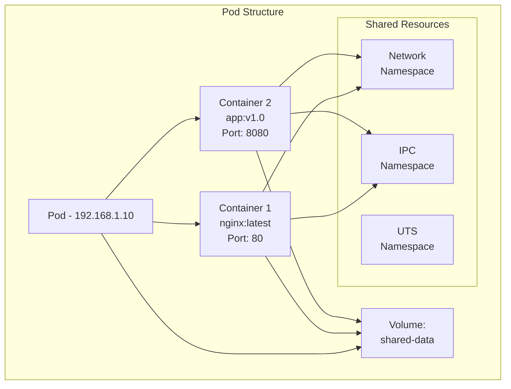
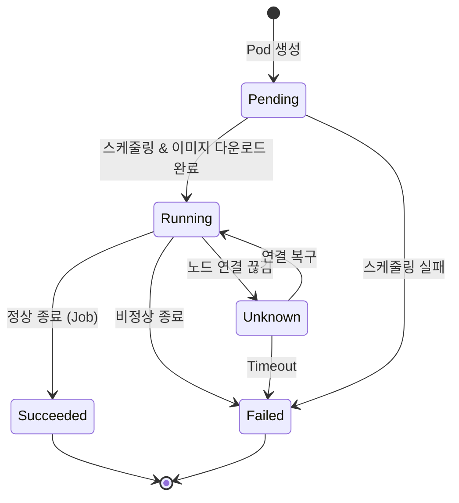

# 🎯 Kubernetes Pod 완벽 가이드

> 💡 **목표**: Kubernetes의 가장 작은 배포 단위인 Pod를 깊이 이해하고, 다양한 패턴과 고급 기능을 활용합니다.

## 📚 목차

1. [**Pod 개념과 구조**](#pod-개념과-구조)
2. [**Pod 생명주기**](#pod-생명주기)
3. [**Multi-Container Patterns**](#multi-container-patterns)
4. [**Pod 네트워킹과 스토리지**](#pod-네트워킹과-스토리지)
5. [**Pod 스케줄링**](#pod-스케줄링)
6. [**Health Checks**](#health-checks)
7. [**Pod 보안**](#pod-보안)
8. [**Best Practices**](#best-practices)

---

## 🎯 Pod 개념과 구조

### Pod란?



### 기본 Pod 정의

```yaml
apiVersion: v1
kind: Pod
metadata:
  name: my-pod
  namespace: default
  labels:
    app: myapp
    tier: frontend
    version: v1
  annotations:
    description: "This is my application pod"
spec:
  containers:
  - name: main-app
    image: myapp:1.0
    ports:
    - containerPort: 8080
      name: http
      protocol: TCP
    env:
    - name: ENV_VAR
      value: "production"
    resources:
      requests:
        memory: "64Mi"
        cpu: "250m"
      limits:
        memory: "128Mi"
        cpu: "500m"
```

### Pod vs Container

| 특성 | Pod | Container |
|-----|-----|-----------|
| **정의** | 컨테이너 그룹 | 단일 프로세스 |
| **IP 주소** | 하나의 IP 공유 | Pod IP 사용 |
| **저장소** | Volume 공유 가능 | 독립적 파일시스템 |
| **생명주기** | 함께 시작/종료 | 독립적 재시작 가능 |
| **통신** | localhost로 통신 | 네트워크 통신 |

---

## 🔄 Pod 생명주기

### Pod Phases



### Pod 상태별 설명

```yaml
# Pending 상태 예시
apiVersion: v1
kind: Pod
metadata:
  name: pending-pod
spec:
  containers:
  - name: app
    image: nonexistent-image:latest  # 존재하지 않는 이미지
    
# kubectl describe pod pending-pod
# Events:
#   Warning  Failed     3s   kubelet  Failed to pull image

---
# Running 상태 예시
apiVersion: v1
kind: Pod
metadata:
  name: running-pod
spec:
  containers:
  - name: app
    image: nginx
    livenessProbe:
      httpGet:
        path: /
        port: 80
      initialDelaySeconds: 5
      periodSeconds: 10

---
# Succeeded 상태 (Job 완료)
apiVersion: v1
kind: Pod
metadata:
  name: completed-pod
spec:
  restartPolicy: OnFailure
  containers:
  - name: job
    image: busybox
    command: ['sh', '-c', 'echo "Job completed" && exit 0']

---
# Failed 상태
apiVersion: v1
kind: Pod
metadata:
  name: failed-pod
spec:
  restartPolicy: Never
  containers:
  - name: app
    image: busybox
    command: ['sh', '-c', 'exit 1']
```

### Container States

```yaml
apiVersion: v1
kind: Pod
metadata:
  name: container-states-demo
spec:
  containers:
  - name: main
    image: nginx
    lifecycle:
      postStart:
        exec:
          command: ["/bin/sh", "-c", "echo 'Container started' > /usr/share/message"]
      preStop:
        exec:
          command: ["/bin/sh", "-c", "nginx -s quit; while killall -0 nginx; do sleep 1; done"]
    
  # Container 상태 확인
  # kubectl get pod container-states-demo -o jsonpath='{.status.containerStatuses[0].state}'
  # Waiting / Running / Terminated
```

---

## 🎨 Multi-Container Patterns

### 1. Sidecar Pattern

```yaml
apiVersion: v1
kind: Pod
metadata:
  name: sidecar-pattern
spec:
  containers:
  # Main application
  - name: main-app
    image: myapp:1.0
    ports:
    - containerPort: 8080
    volumeMounts:
    - name: logs
      mountPath: /var/log/app
  
  # Sidecar: Log collector
  - name: log-collector
    image: fluentd
    volumeMounts:
    - name: logs
      mountPath: /var/log/app
    - name: fluentd-config
      mountPath: /fluentd/etc
  
  volumes:
  - name: logs
    emptyDir: {}
  - name: fluentd-config
    configMap:
      name: fluentd-config
```

### 2. Ambassador Pattern

```yaml
apiVersion: v1
kind: Pod
metadata:
  name: ambassador-pattern
spec:
  containers:
  # Main application
  - name: main-app
    image: myapp:1.0
    env:
    - name: DB_HOST
      value: "localhost:6379"  # Ambassador proxy
  
  # Ambassador: Redis proxy
  - name: redis-ambassador
    image: redis-proxy
    ports:
    - containerPort: 6379
    env:
    - name: REDIS_SERVERS
      value: "redis-1:6379,redis-2:6379,redis-3:6379"
```

### 3. Adapter Pattern

```yaml
apiVersion: v1
kind: Pod
metadata:
  name: adapter-pattern
spec:
  containers:
  # Legacy application with custom log format
  - name: legacy-app
    image: legacy-app:1.0
    volumeMounts:
    - name: logs
      mountPath: /var/log
  
  # Adapter: Convert logs to standard format
  - name: log-adapter
    image: log-transformer
    volumeMounts:
    - name: logs
      mountPath: /input
      readOnly: true
    - name: formatted-logs
      mountPath: /output
    command: ["/bin/sh"]
    args: 
    - -c
    - |
      tail -F /input/app.log | while read line; do
        echo "{\"timestamp\": \"$(date -Iseconds)\", \"message\": \"$line\"}" >> /output/app.json
      done
  
  volumes:
  - name: logs
    emptyDir: {}
  - name: formatted-logs
    emptyDir: {}
```

### 4. Init Container Pattern

```yaml
apiVersion: v1
kind: Pod
metadata:
  name: init-container-pattern
spec:
  initContainers:
  # 1. 데이터베이스 대기
  - name: wait-for-db
    image: busybox:1.35
    command: ['sh', '-c']
    args:
    - |
      until nc -z postgres-service 5432; do
        echo "Waiting for database..."
        sleep 2
      done
      echo "Database is ready!"
  
  # 2. 설정 파일 다운로드
  - name: fetch-config
    image: busybox:1.35
    command: ['sh', '-c']
    args:
    - |
      wget -O /config/app.conf https://config-server.com/app.conf
      echo "Config downloaded"
    volumeMounts:
    - name: config
      mountPath: /config
  
  # 3. 스키마 마이그레이션
  - name: migrate-db
    image: migrate/migrate
    command: ['migrate']
    args: ['-path', '/migrations', '-database', 'postgres://...', 'up']
    volumeMounts:
    - name: migrations
      mountPath: /migrations
  
  # Main containers
  containers:
  - name: main-app
    image: myapp:1.0
    volumeMounts:
    - name: config
      mountPath: /etc/app
      readOnly: true
  
  volumes:
  - name: config
    emptyDir: {}
  - name: migrations
    configMap:
      name: db-migrations
```

---

## 🌐 Pod 네트워킹과 스토리지

### Pod 네트워킹

```yaml
apiVersion: v1
kind: Pod
metadata:
  name: networking-demo
spec:
  hostNetwork: false  # 호스트 네트워크 사용 (기본값: false)
  dnsPolicy: ClusterFirst  # DNS 정책
  hostname: my-pod  # Pod hostname
  subdomain: my-service  # FQDN: my-pod.my-service.default.svc.cluster.local
  
  hostAliases:  # /etc/hosts 항목 추가
  - ip: "127.0.0.1"
    hostnames:
    - "foo.local"
    - "bar.local"
  
  containers:
  - name: app
    image: nginx
    ports:
    - containerPort: 80
      name: http
      protocol: TCP
    - containerPort: 443
      name: https
      protocol: TCP

---
# DNS Policy 옵션
# ClusterFirst: 클러스터 DNS 먼저 사용 (기본값)
# ClusterFirstWithHostNet: hostNetwork: true일 때
# Default: 노드의 DNS 설정 사용
# None: 수동 DNS 설정
apiVersion: v1
kind: Pod
metadata:
  name: custom-dns
spec:
  dnsPolicy: None
  dnsConfig:
    nameservers:
    - 1.1.1.1
    - 8.8.8.8
    searches:
    - example.com
    - my.domain.com
    options:
    - name: ndots
      value: "5"
    - name: edns0
  containers:
  - name: app
    image: nginx
```

### Pod 스토리지

```yaml
apiVersion: v1
kind: Pod
metadata:
  name: storage-demo
spec:
  containers:
  - name: app
    image: nginx
    volumeMounts:
    # ConfigMap mount
    - name: config
      mountPath: /etc/nginx/conf.d
      readOnly: true
    
    # Secret mount
    - name: certs
      mountPath: /etc/ssl/certs
      readOnly: true
    
    # EmptyDir (임시 저장)
    - name: cache
      mountPath: /cache
    
    # PVC mount
    - name: data
      mountPath: /usr/share/nginx/html
    
    # Projected volume
    - name: all-in-one
      mountPath: /combined
      readOnly: true
  
  volumes:
  # ConfigMap
  - name: config
    configMap:
      name: nginx-config
      defaultMode: 0644
  
  # Secret
  - name: certs
    secret:
      secretName: tls-certs
      defaultMode: 0400
  
  # EmptyDir
  - name: cache
    emptyDir:
      medium: Memory  # RAM 사용
      sizeLimit: 100Mi
  
  # PersistentVolumeClaim
  - name: data
    persistentVolumeClaim:
      claimName: nginx-pvc
  
  # Projected (여러 소스 결합)
  - name: all-in-one
    projected:
      sources:
      - secret:
          name: mysecret
          items:
          - key: username
            path: my-username
      - configMap:
          name: myconfig
          items:
          - key: config
            path: my-config
      - downwardAPI:
          items:
          - path: "labels"
            fieldRef:
              fieldPath: metadata.labels
```

---

## 📍 Pod 스케줄링

### Node Selector

```yaml
apiVersion: v1
kind: Pod
metadata:
  name: node-selector-demo
spec:
  nodeSelector:
    disktype: ssd
    zone: us-west-2a
  containers:
  - name: app
    image: nginx
```

### Node Affinity

```yaml
apiVersion: v1
kind: Pod
metadata:
  name: node-affinity-demo
spec:
  affinity:
    nodeAffinity:
      # 필수 조건 (스케줄링 시점)
      requiredDuringSchedulingIgnoredDuringExecution:
        nodeSelectorTerms:
        - matchExpressions:
          - key: kubernetes.io/os
            operator: In
            values: ["linux"]
          - key: node-role.kubernetes.io/worker
            operator: Exists
      
      # 선호 조건 (가중치 기반)
      preferredDuringSchedulingIgnoredDuringExecution:
      - weight: 100
        preference:
          matchExpressions:
          - key: zone
            operator: In
            values: ["us-west-2a", "us-west-2b"]
      - weight: 50
        preference:
          matchExpressions:
          - key: disktype
            operator: In
            values: ["ssd"]
  
  containers:
  - name: app
    image: nginx
```

### Pod Affinity/Anti-Affinity

```yaml
apiVersion: v1
kind: Pod
metadata:
  name: pod-affinity-demo
  labels:
    app: web
spec:
  affinity:
    # Pod Affinity: 특정 Pod와 같은 노드에 배치
    podAffinity:
      requiredDuringSchedulingIgnoredDuringExecution:
      - labelSelector:
          matchExpressions:
          - key: app
            operator: In
            values: ["cache"]
        topologyKey: kubernetes.io/hostname
        namespaceSelector:
          matchLabels:
            name: production
    
    # Pod Anti-Affinity: 분산 배치
    podAntiAffinity:
      preferredDuringSchedulingIgnoredDuringExecution:
      - weight: 100
        podAffinityTerm:
          labelSelector:
            matchExpressions:
            - key: app
              operator: In
              values: ["web"]
          topologyKey: kubernetes.io/hostname
  
  containers:
  - name: app
    image: nginx
```

### Taints and Tolerations

```yaml
# Node에 Taint 추가
# kubectl taint nodes node1 key=value:NoSchedule
# kubectl taint nodes node1 key=value:NoExecute
# kubectl taint nodes node1 key=value:PreferNoSchedule

apiVersion: v1
kind: Pod
metadata:
  name: toleration-demo
spec:
  tolerations:
  # 특정 taint 허용
  - key: "key"
    operator: "Equal"
    value: "value"
    effect: "NoSchedule"
  
  # GPU 노드 허용
  - key: "nvidia.com/gpu"
    operator: "Exists"
    effect: "NoSchedule"
  
  # 모든 taint 허용 (주의!)
  - operator: "Exists"
  
  # NoExecute with tolerationSeconds
  - key: "temporary"
    operator: "Equal"
    value: "true"
    effect: "NoExecute"
    tolerationSeconds: 3600  # 1시간 후 eviction
  
  containers:
  - name: app
    image: nginx
```

### Priority and Preemption

```yaml
# PriorityClass 정의
apiVersion: scheduling.k8s.io/v1
kind: PriorityClass
metadata:
  name: high-priority
value: 1000
globalDefault: false
description: "High priority class for critical pods"

---
apiVersion: v1
kind: Pod
metadata:
  name: high-priority-pod
spec:
  priorityClassName: high-priority
  containers:
  - name: app
    image: nginx
```

---

## 🏥 Health Checks

### Liveness Probe

```yaml
apiVersion: v1
kind: Pod
metadata:
  name: liveness-probe-demo
spec:
  containers:
  - name: app
    image: myapp:1.0
    
    # HTTP GET probe
    livenessProbe:
      httpGet:
        path: /healthz
        port: 8080
        httpHeaders:
        - name: Custom-Header
          value: Awesome
      initialDelaySeconds: 30  # 컨테이너 시작 후 대기
      periodSeconds: 10         # 체크 간격
      timeoutSeconds: 5         # 타임아웃
      successThreshold: 1       # 성공 임계값
      failureThreshold: 3       # 실패 임계값
    
    # TCP socket probe
    # livenessProbe:
    #   tcpSocket:
    #     port: 8080
    #   initialDelaySeconds: 15
    #   periodSeconds: 10
    
    # Exec command probe
    # livenessProbe:
    #   exec:
    #     command:
    #     - cat
    #     - /tmp/healthy
    #   initialDelaySeconds: 5
    #   periodSeconds: 5
```

### Readiness Probe

```yaml
apiVersion: v1
kind: Pod
metadata:
  name: readiness-probe-demo
spec:
  containers:
  - name: app
    image: myapp:1.0
    
    # Readiness probe (트래픽 수신 준비 확인)
    readinessProbe:
      httpGet:
        path: /ready
        port: 8080
      initialDelaySeconds: 5
      periodSeconds: 5
      successThreshold: 2  # 2번 연속 성공 필요
      failureThreshold: 3
    
    # Readiness Gate (추가 조건)
    readinessGates:
    - conditionType: "MyCustomCondition"
    
    ports:
    - containerPort: 8080
```

### Startup Probe (1.16+)

```yaml
apiVersion: v1
kind: Pod
metadata:
  name: startup-probe-demo
spec:
  containers:
  - name: app
    image: slow-starting-app:1.0
    
    # Startup probe (느린 시작 애플리케이션용)
    startupProbe:
      httpGet:
        path: /startup
        port: 8080
      initialDelaySeconds: 0
      periodSeconds: 10
      timeoutSeconds: 3
      successThreshold: 1
      failureThreshold: 30  # 최대 30 * 10 = 300초 대기
    
    # Startup이 성공한 후에만 실행
    livenessProbe:
      httpGet:
        path: /healthz
        port: 8080
      periodSeconds: 10
    
    readinessProbe:
      httpGet:
        path: /ready
        port: 8080
      periodSeconds: 5
```

---

## 🔐 Pod 보안

### Security Context

```yaml
apiVersion: v1
kind: Pod
metadata:
  name: security-context-demo
spec:
  # Pod 레벨 보안 설정
  securityContext:
    runAsUser: 1000       # UID
    runAsGroup: 3000      # GID
    fsGroup: 2000         # 볼륨 파일 그룹
    supplementalGroups: [4000]
    fsGroupChangePolicy: "OnRootMismatch"
    seccompProfile:
      type: RuntimeDefault
    seLinuxOptions:
      level: "s0:c123,c456"
  
  containers:
  - name: app
    image: nginx
    
    # Container 레벨 보안 설정 (Pod 설정 오버라이드)
    securityContext:
      runAsUser: 2000
      runAsNonRoot: true
      readOnlyRootFilesystem: true
      allowPrivilegeEscalation: false
      privileged: false
      capabilities:
        drop: ["ALL"]
        add: ["NET_BIND_SERVICE"]
      procMount: "Default"
    
    volumeMounts:
    - name: cache
      mountPath: /var/cache/nginx
    - name: run
      mountPath: /var/run
  
  volumes:
  - name: cache
    emptyDir: {}
  - name: run
    emptyDir: {}
```

### Pod Security Standards

```yaml
# Pod Security Standards (1.23+)
# Enforce: 위반 시 거부
# Audit: 감사 로그 기록
# Warn: 경고 메시지

# Namespace 레벨 적용
apiVersion: v1
kind: Namespace
metadata:
  name: secure-namespace
  labels:
    pod-security.kubernetes.io/enforce: restricted
    pod-security.kubernetes.io/enforce-version: latest
    pod-security.kubernetes.io/audit: restricted
    pod-security.kubernetes.io/audit-version: latest
    pod-security.kubernetes.io/warn: restricted
    pod-security.kubernetes.io/warn-version: latest

---
# Restricted 정책 준수 Pod
apiVersion: v1
kind: Pod
metadata:
  name: restricted-pod
  namespace: secure-namespace
spec:
  securityContext:
    runAsNonRoot: true
    runAsUser: 1000
    fsGroup: 1000
    seccompProfile:
      type: RuntimeDefault
  
  containers:
  - name: app
    image: nginx:alpine
    securityContext:
      allowPrivilegeEscalation: false
      readOnlyRootFilesystem: true
      capabilities:
        drop: ["ALL"]
    
    volumeMounts:
    - name: tmp
      mountPath: /tmp
    - name: var-cache
      mountPath: /var/cache/nginx
    - name: var-run
      mountPath: /var/run
  
  volumes:
  - name: tmp
    emptyDir: {}
  - name: var-cache
    emptyDir: {}
  - name: var-run
    emptyDir: {}
```

---

## ✅ Best Practices

### 1. Resource Management

```yaml
apiVersion: v1
kind: Pod
metadata:
  name: resource-managed-pod
spec:
  containers:
  - name: app
    image: myapp:1.0
    
    # Resource requests and limits
    resources:
      requests:
        memory: "128Mi"
        cpu: "100m"
        ephemeral-storage: "1Gi"
      limits:
        memory: "256Mi"
        cpu: "200m"
        ephemeral-storage: "2Gi"
    
    # QoS Class
    # Guaranteed: requests == limits
    # Burstable: requests < limits
    # BestEffort: no requests/limits
```

### 2. Graceful Shutdown

```yaml
apiVersion: v1
kind: Pod
metadata:
  name: graceful-shutdown-demo
spec:
  terminationGracePeriodSeconds: 60  # SIGTERM 후 대기 시간
  
  containers:
  - name: app
    image: myapp:1.0
    
    # PreStop hook
    lifecycle:
      preStop:
        exec:
          command: ["/bin/sh", "-c", "sleep 15 && /app/graceful-shutdown.sh"]
    
    # Or HTTP preStop
    # lifecycle:
    #   preStop:
    #     httpGet:
    #       path: /shutdown
    #       port: 8080
```

### 3. Labels and Annotations

```yaml
apiVersion: v1
kind: Pod
metadata:
  name: well-labeled-pod
  labels:
    # 표준 레이블
    app.kubernetes.io/name: myapp
    app.kubernetes.io/instance: myapp-prod
    app.kubernetes.io/version: "1.0.0"
    app.kubernetes.io/component: frontend
    app.kubernetes.io/part-of: myapp-suite
    app.kubernetes.io/managed-by: helm
    
    # 커스텀 레이블
    environment: production
    tier: frontend
    team: platform
  
  annotations:
    # 설명적 메타데이터
    description: "Production frontend pod"
    prometheus.io/scrape: "true"
    prometheus.io/port: "9090"
    prometheus.io/path: "/metrics"
spec:
  containers:
  - name: app
    image: myapp:1.0
```

### 4. Service Account

```yaml
apiVersion: v1
kind: ServiceAccount
metadata:
  name: my-service-account
  namespace: default
  annotations:
    eks.amazonaws.com/role-arn: arn:aws:iam::123456789012:role/my-role

---
apiVersion: v1
kind: Pod
metadata:
  name: pod-with-sa
spec:
  serviceAccountName: my-service-account
  automountServiceAccountToken: true  # 토큰 자동 마운트
  
  containers:
  - name: app
    image: myapp:1.0
    
    # ServiceAccount 토큰 위치
    # /var/run/secrets/kubernetes.io/serviceaccount/token
    # /var/run/secrets/kubernetes.io/serviceaccount/ca.crt
    # /var/run/secrets/kubernetes.io/serviceaccount/namespace
```

### 5. Debugging Pods

```yaml
# Debug 컨테이너 추가 (ephemeral container)
kubectl debug my-pod -it --image=busybox --target=my-container

# 또는 yaml로 정의
apiVersion: v1
kind: Pod
metadata:
  name: debug-pod
spec:
  shareProcessNamespace: true  # 프로세스 네임스페이스 공유
  
  containers:
  - name: app
    image: myapp:1.0
  
  # Debug sidecar
  - name: debug
    image: nicolaka/netshoot
    command: ["/bin/sleep", "3600"]
    securityContext:
      capabilities:
        add: ["SYS_PTRACE"]
```

---

## 🔧 트러블슈팅

### Pod가 Pending 상태

```bash
# 이벤트 확인
kubectl describe pod my-pod

# 일반적인 원인:
# 1. 리소스 부족
kubectl get nodes -o custom-columns=NAME:.metadata.name,CPU:.status.allocatable.cpu,MEMORY:.status.allocatable.memory

# 2. 이미지 pull 실패
kubectl get pod my-pod -o jsonpath='{.status.containerStatuses[0].state.waiting.reason}'

# 3. 스케줄링 제약
kubectl get pod my-pod -o jsonpath='{.spec.affinity}'
kubectl get nodes --show-labels
```

### CrashLoopBackOff

```bash
# 로그 확인
kubectl logs my-pod --previous
kubectl logs my-pod -c my-container

# 상태 확인
kubectl get pod my-pod -o jsonpath='{.status.containerStatuses[0].lastState.terminated}'

# 재시작 횟수 확인
kubectl get pod my-pod -o jsonpath='{.status.containerStatuses[0].restartCount}'

# 임시 해결: 재시작 정책 변경
kubectl patch pod my-pod -p '{"spec":{"restartPolicy":"Never"}}'
```

### Pod Eviction

```bash
# Eviction 이유 확인
kubectl get events --field-selector involvedObject.name=my-pod

# Node pressure 확인
kubectl describe node <node-name> | grep -A5 Conditions

# PDB (Pod Disruption Budget) 확인
kubectl get pdb
```

---

## 💡 고급 팁

### 1. Ephemeral Containers (1.16+)

```bash
# 실행 중인 Pod에 디버그 컨테이너 추가
kubectl debug my-pod -it --image=busybox --target=my-container -- sh
```

### 2. Pod Presets (Deprecated, 대안: MutatingWebhook)

```yaml
# Webhook으로 자동 주입 설정
apiVersion: v1
kind: ConfigMap
metadata:
  name: pod-preset-config
data:
  inject: |
    env:
    - name: DB_HOST
      value: postgres.default.svc
    - name: CACHE_HOST  
      value: redis.default.svc
```

### 3. Pod Overhead (1.18+)

```yaml
# RuntimeClass with overhead
apiVersion: node.k8s.io/v1
kind: RuntimeClass
metadata:
  name: kata-containers
handler: kata
overhead:
  podFixed:
    memory: "120Mi"
    cpu: "250m"

---
apiVersion: v1
kind: Pod
metadata:
  name: kata-pod
spec:
  runtimeClassName: kata-containers
  containers:
  - name: app
    image: myapp:1.0
```

---

> 🚀 Pod는 Kubernetes의 기본 단위로, 다양한 패턴과 기능을 이해하면 강력한 애플리케이션을 구축할 수 있습니다!