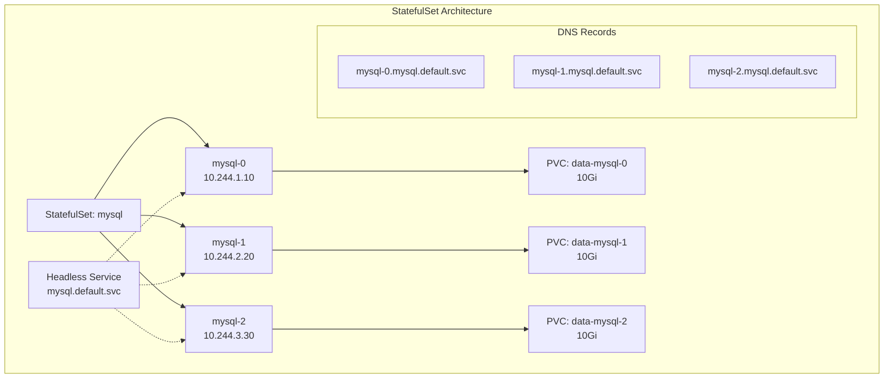

# 🗄️ StatefulSet 완벽 가이드

> 💡 **목표**: 상태를 가진 애플리케이션을 Kubernetes에서 안정적으로 운영하고, StatefulSet의 고급 기능을 마스터합니다.

## 📚 목차

1. [**StatefulSet 개념**](#statefulset-개념)
2. [**StatefulSet vs Deployment**](#statefulset-vs-deployment)
3. [**Persistent Storage**](#persistent-storage)
4. [**Ordered Deployment & Scaling**](#ordered-deployment--scaling)
5. [**Headless Service & Network Identity**](#headless-service--network-identity)
6. [**실전 시나리오**](#실전-시나리오)
7. [**운영 가이드**](#운영-가이드)
8. [**Best Practices**](#best-practices)

---

## 🎯 StatefulSet 개념

### StatefulSet이란?



### StatefulSet 특징

| 특징 | 설명 |
|-----|------|
| **고정된 네트워크 ID** | 각 Pod는 고유하고 안정적인 네트워크 식별자 보유 |
| **안정적인 스토리지** | 각 Pod는 자체 PersistentVolume 보유 |
| **순서대로 배포/스케일링** | 0부터 N-1까지 순차적으로 생성/삭제 |
| **순서대로 롤링 업데이트** | 역순으로 업데이트 (N-1부터 0까지) |

---

## 🆚 StatefulSet vs Deployment

### 비교표

| 기능 | StatefulSet | Deployment |
|------|------------|------------|
| **Pod 이름** | 예측 가능 (app-0, app-1) | 랜덤 (app-xyz123) |
| **스토리지** | 각 Pod별 PVC | 공유 가능 |
| **네트워크 ID** | 안정적 | 변경 가능 |
| **스케일링** | 순차적 | 병렬 |
| **업데이트** | 순차적 (롤링) | 병렬 (롤링) |
| **사용 사례** | DB, 메시지 큐 | 무상태 앱 |

### 언제 StatefulSet을 사용할까?

```yaml
# StatefulSet이 필요한 경우:
# 1. 안정적인 네트워크 식별자가 필요한 경우
# 2. 안정적인 영구 스토리지가 필요한 경우
# 3. 순서가 보장된 배포와 스케일링이 필요한 경우
# 4. 순서가 보장된 자동 롤링 업데이트가 필요한 경우

# 예시: 데이터베이스 클러스터
# - MySQL/PostgreSQL 복제
# - MongoDB ReplicaSet
# - Cassandra/Elasticsearch 클러스터
# - Kafka/ZooKeeper 클러스터
# - Redis Sentinel
```

---

## 💾 Persistent Storage

### VolumeClaimTemplate

```yaml
apiVersion: apps/v1
kind: StatefulSet
metadata:
  name: web
spec:
  serviceName: nginx
  replicas: 3
  selector:
    matchLabels:
      app: nginx
  template:
    metadata:
      labels:
        app: nginx
    spec:
      containers:
      - name: nginx
        image: nginx:1.20
        ports:
        - containerPort: 80
        volumeMounts:
        - name: www
          mountPath: /usr/share/nginx/html
  
  # 각 Pod별로 생성될 PVC 템플릿
  volumeClaimTemplates:
  - metadata:
      name: www
    spec:
      accessModes: ["ReadWriteOnce"]
      storageClassName: "fast-ssd"
      resources:
        requests:
          storage: 10Gi

# 생성되는 PVC:
# - www-web-0 (10Gi)
# - www-web-1 (10Gi)
# - www-web-2 (10Gi)
```

### 다중 Volume 사용

```yaml
apiVersion: apps/v1
kind: StatefulSet
metadata:
  name: postgres
spec:
  serviceName: postgres
  replicas: 3
  selector:
    matchLabels:
      app: postgres
  template:
    metadata:
      labels:
        app: postgres
    spec:
      containers:
      - name: postgres
        image: postgres:14
        env:
        - name: POSTGRES_PASSWORD
          valueFrom:
            secretKeyRef:
              name: postgres-secret
              key: password
        - name: PGDATA
          value: /var/lib/postgresql/data/pgdata
        volumeMounts:
        # 데이터 볼륨
        - name: data
          mountPath: /var/lib/postgresql/data
        # WAL 아카이브 볼륨
        - name: archive
          mountPath: /archive
        # 백업 볼륨
        - name: backup
          mountPath: /backup
  
  volumeClaimTemplates:
  # 데이터 스토리지
  - metadata:
      name: data
    spec:
      accessModes: ["ReadWriteOnce"]
      storageClassName: "fast-ssd"
      resources:
        requests:
          storage: 100Gi
  
  # WAL 아카이브 스토리지
  - metadata:
      name: archive
    spec:
      accessModes: ["ReadWriteOnce"]
      storageClassName: "standard"
      resources:
        requests:
          storage: 50Gi
  
  # 백업 스토리지
  - metadata:
      name: backup
    spec:
      accessModes: ["ReadWriteOnce"]
      storageClassName: "cold-storage"
      resources:
        requests:
          storage: 200Gi
```

---

## 🔢 Ordered Deployment & Scaling

### Pod Management Policy

```yaml
apiVersion: apps/v1
kind: StatefulSet
metadata:
  name: ordered-app
spec:
  podManagementPolicy: OrderedReady  # 기본값: 순차적
  # podManagementPolicy: Parallel    # 병렬 실행
  replicas: 5
  serviceName: ordered-app
  selector:
    matchLabels:
      app: ordered-app
  template:
    metadata:
      labels:
        app: ordered-app
    spec:
      containers:
      - name: app
        image: myapp:1.0
        readinessProbe:
          httpGet:
            path: /ready
            port: 8080
          initialDelaySeconds: 10
          periodSeconds: 5

# OrderedReady: 0 -> 1 -> 2 -> 3 -> 4 (순차적)
# Parallel: 0, 1, 2, 3, 4 (동시에)
```

### Update Strategy

```yaml
apiVersion: apps/v1
kind: StatefulSet
metadata:
  name: rolling-update-app
spec:
  serviceName: app
  replicas: 5
  updateStrategy:
    type: RollingUpdate
    rollingUpdate:
      partition: 2  # 인덱스 2 이상만 업데이트 (2, 3, 4)
  
  selector:
    matchLabels:
      app: myapp
  template:
    metadata:
      labels:
        app: myapp
        version: v2  # 새 버전
    spec:
      containers:
      - name: app
        image: myapp:2.0

# partition: 2인 경우
# - Pod 0, 1: 이전 버전 유지
# - Pod 2, 3, 4: 새 버전으로 업데이트
```

### OnDelete Update Strategy

```yaml
apiVersion: apps/v1
kind: StatefulSet
metadata:
  name: manual-update-app
spec:
  serviceName: app
  replicas: 3
  updateStrategy:
    type: OnDelete  # 수동 업데이트
  selector:
    matchLabels:
      app: myapp
  template:
    metadata:
      labels:
        app: myapp
    spec:
      containers:
      - name: app
        image: myapp:2.0

# Pod를 수동으로 삭제해야 새 버전으로 재생성
# kubectl delete pod manual-update-app-0
```

---

## 🌐 Headless Service & Network Identity

### Headless Service 설정

```yaml
# Headless Service (ClusterIP: None)
apiVersion: v1
kind: Service
metadata:
  name: mysql
  labels:
    app: mysql
spec:
  clusterIP: None  # Headless Service
  selector:
    app: mysql
  ports:
  - port: 3306
    targetPort: 3306

---
apiVersion: apps/v1
kind: StatefulSet
metadata:
  name: mysql
spec:
  serviceName: mysql  # Headless Service 이름
  replicas: 3
  selector:
    matchLabels:
      app: mysql
  template:
    metadata:
      labels:
        app: mysql
    spec:
      containers:
      - name: mysql
        image: mysql:8.0
        env:
        - name: MYSQL_ROOT_PASSWORD
          valueFrom:
            secretKeyRef:
              name: mysql-secret
              key: password
        ports:
        - containerPort: 3306

# DNS 레코드:
# mysql-0.mysql.default.svc.cluster.local
# mysql-1.mysql.default.svc.cluster.local
# mysql-2.mysql.default.svc.cluster.local
# 
# SRV 레코드:
# _mysql._tcp.mysql.default.svc.cluster.local
```

### Pod 간 통신

```yaml
apiVersion: v1
kind: ConfigMap
metadata:
  name: mysql-config
data:
  master.cnf: |
    [mysqld]
    log-bin
    server-id=1
  
  slave.cnf: |
    [mysqld]
    super-read-only
    server-id=2

---
apiVersion: apps/v1
kind: StatefulSet
metadata:
  name: mysql
spec:
  serviceName: mysql
  replicas: 3
  selector:
    matchLabels:
      app: mysql
  template:
    metadata:
      labels:
        app: mysql
    spec:
      initContainers:
      - name: init-mysql
        image: mysql:8.0
        command:
        - bash
        - "-c"
        - |
          set -ex
          # Pod 순서 ID를 서버 ID로 생성
          [[ `hostname` =~ -([0-9]+)$ ]] || exit 1
          ordinal=${BASH_REMATCH[1]}
          echo [mysqld] > /mnt/conf.d/server-id.cnf
          echo server-id=$((100 + $ordinal)) >> /mnt/conf.d/server-id.cnf
          
          # Master(0) vs Slave 구성 복사
          if [[ $ordinal -eq 0 ]]; then
            cp /mnt/config-map/master.cnf /mnt/conf.d/
          else
            cp /mnt/config-map/slave.cnf /mnt/conf.d/
          fi
        volumeMounts:
        - name: conf
          mountPath: /mnt/conf.d
        - name: config-map
          mountPath: /mnt/config-map
      
      containers:
      - name: mysql
        image: mysql:8.0
        env:
        - name: MYSQL_ALLOW_EMPTY_PASSWORD
          value: "1"
        volumeMounts:
        - name: data
          mountPath: /var/lib/mysql
        - name: conf
          mountPath: /etc/mysql/conf.d
      
      volumes:
      - name: conf
        emptyDir: {}
      - name: config-map
        configMap:
          name: mysql-config
  
  volumeClaimTemplates:
  - metadata:
      name: data
    spec:
      accessModes: ["ReadWriteOnce"]
      resources:
        requests:
          storage: 10Gi
```

---

## 💼 실전 시나리오

### 시나리오 1: MongoDB ReplicaSet

```yaml
apiVersion: v1
kind: Service
metadata:
  name: mongodb
spec:
  clusterIP: None
  selector:
    app: mongodb
  ports:
  - port: 27017

---
apiVersion: apps/v1
kind: StatefulSet
metadata:
  name: mongodb
spec:
  serviceName: mongodb
  replicas: 3
  selector:
    matchLabels:
      app: mongodb
  template:
    metadata:
      labels:
        app: mongodb
    spec:
      containers:
      - name: mongodb
        image: mongo:5.0
        command:
        - mongod
        - "--replSet"
        - rs0
        - "--bind_ip"
        - "0.0.0.0"
        ports:
        - containerPort: 27017
        volumeMounts:
        - name: data
          mountPath: /data/db
        env:
        - name: MONGO_INITDB_ROOT_USERNAME
          value: admin
        - name: MONGO_INITDB_ROOT_PASSWORD
          valueFrom:
            secretKeyRef:
              name: mongodb-secret
              key: password
        
        # Readiness probe
        readinessProbe:
          exec:
            command:
            - mongo
            - --eval
            - "db.adminCommand('ping')"
          initialDelaySeconds: 30
          periodSeconds: 10
        
        # Liveness probe
        livenessProbe:
          exec:
            command:
            - mongo
            - --eval
            - "db.adminCommand('ping')"
          initialDelaySeconds: 30
          periodSeconds: 20
      
      # Sidecar for replica set initialization
      - name: mongo-sidecar
        image: cvallance/mongo-k8s-sidecar
        env:
        - name: MONGO_SIDECAR_POD_LABELS
          value: "app=mongodb"
        - name: KUBERNETES_MONGO_SERVICE_NAME
          value: "mongodb"
        - name: MONGO_USERNAME
          value: admin
        - name: MONGO_PASSWORD
          valueFrom:
            secretKeyRef:
              name: mongodb-secret
              key: password
  
  volumeClaimTemplates:
  - metadata:
      name: data
    spec:
      accessModes: ["ReadWriteOnce"]
      storageClassName: fast-ssd
      resources:
        requests:
          storage: 20Gi
```

### 시나리오 2: Redis Cluster

```yaml
apiVersion: v1
kind: ConfigMap
metadata:
  name: redis-cluster-config
data:
  redis.conf: |
    cluster-enabled yes
    cluster-config-file /data/nodes.conf
    cluster-node-timeout 5000
    appendonly yes
    protected-mode no
    port 6379

---
apiVersion: v1
kind: Service
metadata:
  name: redis-cluster
spec:
  type: ClusterIP
  clusterIP: None
  selector:
    app: redis-cluster
  ports:
  - name: client
    port: 6379
  - name: gossip
    port: 16379

---
apiVersion: apps/v1
kind: StatefulSet
metadata:
  name: redis-cluster
spec:
  serviceName: redis-cluster
  replicas: 6
  selector:
    matchLabels:
      app: redis-cluster
  template:
    metadata:
      labels:
        app: redis-cluster
    spec:
      containers:
      - name: redis
        image: redis:7.0-alpine
        ports:
        - containerPort: 6379
          name: client
        - containerPort: 16379
          name: gossip
        command: ["redis-server"]
        args: ["/conf/redis.conf"]
        volumeMounts:
        - name: conf
          mountPath: /conf
        - name: data
          mountPath: /data
        
        readinessProbe:
          exec:
            command:
            - sh
            - -c
            - "redis-cli ping"
          initialDelaySeconds: 15
          periodSeconds: 5
        
        livenessProbe:
          exec:
            command:
            - sh
            - -c
            - "redis-cli ping"
          initialDelaySeconds: 30
          periodSeconds: 10
        
        resources:
          requests:
            cpu: 100m
            memory: 128Mi
          limits:
            cpu: 500m
            memory: 512Mi
      
      volumes:
      - name: conf
        configMap:
          name: redis-cluster-config
  
  volumeClaimTemplates:
  - metadata:
      name: data
    spec:
      accessModes: ["ReadWriteOnce"]
      storageClassName: fast-ssd
      resources:
        requests:
          storage: 5Gi

---
# Redis Cluster 초기화 Job
apiVersion: batch/v1
kind: Job
metadata:
  name: redis-cluster-init
spec:
  template:
    spec:
      containers:
      - name: redis-cluster-init
        image: redis:7.0-alpine
        command:
        - sh
        - -c
        - |
          sleep 30
          redis-cli --cluster create \
            redis-cluster-0.redis-cluster:6379 \
            redis-cluster-1.redis-cluster:6379 \
            redis-cluster-2.redis-cluster:6379 \
            redis-cluster-3.redis-cluster:6379 \
            redis-cluster-4.redis-cluster:6379 \
            redis-cluster-5.redis-cluster:6379 \
            --cluster-replicas 1 --cluster-yes
      restartPolicy: OnFailure
```

### 시나리오 3: Elasticsearch Cluster

```yaml
apiVersion: v1
kind: Service
metadata:
  name: elasticsearch
spec:
  clusterIP: None
  selector:
    app: elasticsearch
  ports:
  - name: rest
    port: 9200
  - name: inter-node
    port: 9300

---
apiVersion: apps/v1
kind: StatefulSet
metadata:
  name: elasticsearch
spec:
  serviceName: elasticsearch
  replicas: 3
  selector:
    matchLabels:
      app: elasticsearch
  template:
    metadata:
      labels:
        app: elasticsearch
    spec:
      initContainers:
      - name: fix-permissions
        image: busybox
        command: ["sh", "-c", "chown -R 1000:1000 /usr/share/elasticsearch/data"]
        securityContext:
          privileged: true
        volumeMounts:
        - name: data
          mountPath: /usr/share/elasticsearch/data
      
      - name: increase-vm-max-map
        image: busybox
        command: ["sysctl", "-w", "vm.max_map_count=262144"]
        securityContext:
          privileged: true
      
      - name: increase-fd-ulimit
        image: busybox
        command: ["sh", "-c", "ulimit -n 65536"]
        securityContext:
          privileged: true
      
      containers:
      - name: elasticsearch
        image: docker.elastic.co/elasticsearch/elasticsearch:8.11.0
        env:
        - name: cluster.name
          value: k8s-logs
        - name: node.name
          valueFrom:
            fieldRef:
              fieldPath: metadata.name
        - name: discovery.seed_hosts
          value: "elasticsearch-0.elasticsearch,elasticsearch-1.elasticsearch,elasticsearch-2.elasticsearch"
        - name: cluster.initial_master_nodes
          value: "elasticsearch-0,elasticsearch-1,elasticsearch-2"
        - name: ES_JAVA_OPTS
          value: "-Xms512m -Xmx512m"
        - name: xpack.security.enabled
          value: "false"
        
        ports:
        - containerPort: 9200
          name: rest
        - containerPort: 9300
          name: inter-node
        
        volumeMounts:
        - name: data
          mountPath: /usr/share/elasticsearch/data
        
        readinessProbe:
          httpGet:
            path: /_cluster/health?wait_for_status=yellow&timeout=1s
            port: 9200
          initialDelaySeconds: 60
          periodSeconds: 10
        
        livenessProbe:
          httpGet:
            path: /_cluster/health?wait_for_status=yellow&timeout=1s
            port: 9200
          initialDelaySeconds: 90
          periodSeconds: 30
        
        resources:
          requests:
            cpu: 500m
            memory: 1Gi
          limits:
            cpu: 1000m
            memory: 2Gi
  
  volumeClaimTemplates:
  - metadata:
      name: data
    spec:
      accessModes: ["ReadWriteOnce"]
      storageClassName: fast-ssd
      resources:
        requests:
          storage: 30Gi
```

---

## 🔧 운영 가이드

### 스케일링

```bash
# Scale up
kubectl scale statefulset mysql --replicas=5

# Scale down (역순으로 삭제: 4 -> 3)
kubectl scale statefulset mysql --replicas=3

# 자동 스케일링 (HPA)
kubectl autoscale statefulset mysql --min=3 --max=10 --cpu-percent=70
```

### 업데이트

```bash
# 이미지 업데이트
kubectl set image statefulset/mysql mysql=mysql:8.0.30

# Rollout 상태 확인
kubectl rollout status statefulset/mysql

# Rollout 일시 중지/재개
kubectl rollout pause statefulset/mysql
kubectl rollout resume statefulset/mysql

# Rollback
kubectl rollout undo statefulset/mysql
kubectl rollout undo statefulset/mysql --to-revision=2

# Partition 업데이트 (일부만)
kubectl patch statefulset mysql -p '{"spec":{"updateStrategy":{"type":"RollingUpdate","rollingUpdate":{"partition":3}}}}'
```

### 삭제와 복구

```bash
# StatefulSet 삭제 (PVC는 유지)
kubectl delete statefulset mysql

# PVC 확인
kubectl get pvc

# StatefulSet 재생성 (기존 PVC 재사용)
kubectl apply -f mysql-statefulset.yaml

# 완전 삭제 (StatefulSet + PVC)
kubectl delete statefulset mysql
kubectl delete pvc -l app=mysql
```

### 백업과 복구

```yaml
# 백업 Job
apiVersion: batch/v1
kind: Job
metadata:
  name: mysql-backup
spec:
  template:
    spec:
      containers:
      - name: backup
        image: mysql:8.0
        command:
        - /bin/bash
        - -c
        - |
          DATE=$(date +%Y%m%d_%H%M%S)
          # Master에서만 백업
          mysqldump -h mysql-0.mysql -u root -p$MYSQL_ROOT_PASSWORD \
            --all-databases --single-transaction --master-data=2 \
            > /backup/mysql_backup_$DATE.sql
          
          # S3 업로드 (옵션)
          aws s3 cp /backup/mysql_backup_$DATE.sql \
            s3://my-backup-bucket/mysql/
        
        env:
        - name: MYSQL_ROOT_PASSWORD
          valueFrom:
            secretKeyRef:
              name: mysql-secret
              key: password
        
        volumeMounts:
        - name: backup
          mountPath: /backup
      
      volumes:
      - name: backup
        persistentVolumeClaim:
          claimName: backup-pvc
      
      restartPolicy: OnFailure
```

---

## ✅ Best Practices

### 1. 안정적인 식별자 활용

```yaml
apiVersion: v1
kind: ConfigMap
metadata:
  name: app-config
data:
  configure.sh: |
    #!/bin/bash
    # Pod 인덱스 추출
    [[ `hostname` =~ -([0-9]+)$ ]] || exit 1
    ordinal=${BASH_REMATCH[1]}
    
    # 인덱스별 설정
    if [ $ordinal -eq 0 ]; then
      echo "Configuring as master..."
      # Master 설정
    else
      echo "Configuring as slave..."
      # Slave 설정
    fi
    
    # 다른 Pod 연결
    for i in $(seq 0 2); do
      if [ $i -ne $ordinal ]; then
        echo "Connecting to pod-$i.service..."
      fi
    done
```

### 2. PodDisruptionBudget 설정

```yaml
apiVersion: policy/v1
kind: PodDisruptionBudget
metadata:
  name: mysql-pdb
spec:
  minAvailable: 2  # 최소 2개는 항상 실행
  selector:
    matchLabels:
      app: mysql
```

### 3. 리소스 관리

```yaml
apiVersion: apps/v1
kind: StatefulSet
metadata:
  name: database
spec:
  template:
    spec:
      containers:
      - name: db
        resources:
          requests:
            memory: "1Gi"
            cpu: "500m"
          limits:
            memory: "2Gi"
            cpu: "1"
        
        # JVM 힙 설정 (Java 앱의 경우)
        env:
        - name: JAVA_OPTS
          value: "-Xmx1g -Xms1g"
```

### 4. Anti-Affinity 설정

```yaml
apiVersion: apps/v1
kind: StatefulSet
metadata:
  name: distributed-app
spec:
  template:
    spec:
      affinity:
        podAntiAffinity:
          requiredDuringSchedulingIgnoredDuringExecution:
          - labelSelector:
              matchExpressions:
              - key: app
                operator: In
                values: ["distributed-app"]
            topologyKey: kubernetes.io/hostname
```

### 5. 모니터링 설정

```yaml
apiVersion: v1
kind: Service
metadata:
  name: mysql-metrics
  labels:
    app: mysql
  annotations:
    prometheus.io/scrape: "true"
    prometheus.io/port: "9104"
spec:
  clusterIP: None
  selector:
    app: mysql
  ports:
  - name: metrics
    port: 9104
    targetPort: 9104

---
# StatefulSet에 metrics exporter 추가
spec:
  template:
    spec:
      containers:
      - name: mysql-exporter
        image: prom/mysqld-exporter
        env:
        - name: DATA_SOURCE_NAME
          value: "root:password@tcp(localhost:3306)/"
        ports:
        - containerPort: 9104
          name: metrics
```

---

## 🔧 트러블슈팅

### Pod가 Pending 상태

```bash
# PVC 바인딩 확인
kubectl get pvc
kubectl describe pvc data-mysql-0

# StorageClass 확인
kubectl get storageclass
kubectl describe storageclass fast-ssd

# 이벤트 확인
kubectl get events --sort-by='.lastTimestamp'
```

### 느린 시작 문제

```yaml
# StartupProbe 추가
spec:
  template:
    spec:
      containers:
      - name: app
        startupProbe:
          httpGet:
            path: /health
            port: 8080
          failureThreshold: 30  # 30 * 10 = 300초
          periodSeconds: 10
```

### Split Brain 방지

```yaml
# Quorum 기반 설정
spec:
  replicas: 3  # 홀수로 설정
  template:
    spec:
      containers:
      - name: app
        env:
        - name: QUORUM_SIZE
          value: "2"  # (replicas / 2) + 1
```

---

## 💡 고급 팁

### 1. 병렬 Pod 관리

```yaml
spec:
  podManagementPolicy: Parallel  # 동시 시작
  replicas: 10
```

### 2. Cascade 삭제 방지

```bash
# orphan으로 삭제 (Pod는 유지)
kubectl delete statefulset mysql --cascade=orphan
```

### 3. 선택적 업데이트

```bash
# 특정 Pod만 재시작
kubectl delete pod mysql-2
```

### 4. Force 삭제 (주의!)

```bash
# Stuck Pod 강제 삭제
kubectl delete pod mysql-0 --grace-period=0 --force
```

---

> 🚀 StatefulSet은 상태를 가진 애플리케이션을 Kubernetes에서 안정적으로 운영하기 위한 핵심 리소스입니다!