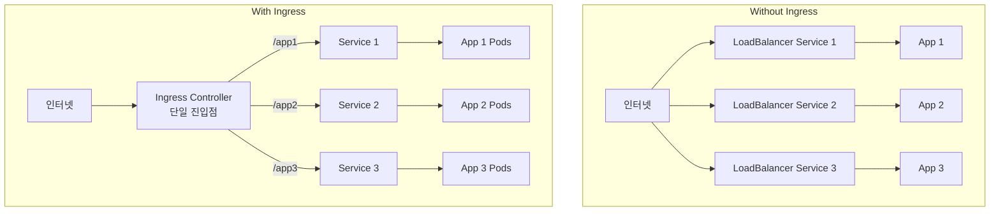

# 🌐 Kubernetes Ingress 완벽 가이드

> 💡 **목표**: Ingress를 활용하여 HTTP/HTTPS 라우팅, TLS 설정, 고급 트래픽 관리를 마스터합니다.

## 📚 목차

1. [**Ingress란?**](#ingress란)
2. [**Ingress Controller 설치**](#ingress-controller-설치)
3. [**Ingress 리소스 생성**](#ingress-리소스-생성)
4. [**TLS/SSL 설정**](#tlsssl-설정)
5. [**고급 라우팅**](#고급-라우팅)
6. [**실전 예제**](#실전-예제)
7. [**트러블슈팅**](#트러블슈팅)

---

## 🎯 Ingress란?

### Ingress vs Service



### Ingress의 장점

| 기능 | LoadBalancer Service | Ingress |
|------|---------------------|---------|
| **비용** | 서비스당 LB 필요 (비쌈) | 하나의 LB로 여러 서비스 |
| **SSL/TLS** | 서비스별 설정 | 중앙 집중 관리 |
| **라우팅** | L4 (TCP/UDP) | L7 (HTTP/HTTPS) |
| **경로 기반** | ❌ | ✅ |
| **도메인 기반** | ❌ | ✅ |
| **재작성/리다이렉트** | ❌ | ✅ |

---

## 🛠️ Ingress Controller 설치

### 1. NGINX Ingress Controller

```bash
# Helm으로 설치 (권장)
helm repo add ingress-nginx https://kubernetes.github.io/ingress-nginx
helm repo update

# 설치
helm install nginx-ingress ingress-nginx/ingress-nginx \
  --namespace ingress-nginx \
  --create-namespace \
  --set controller.service.type=LoadBalancer \
  --set controller.metrics.enabled=true \
  --set controller.podAnnotations."prometheus\.io/scrape"=true \
  --set controller.podAnnotations."prometheus\.io/port"=10254

# 또는 매니페스트로 설치
kubectl apply -f https://raw.githubusercontent.com/kubernetes/ingress-nginx/controller-v1.8.0/deploy/static/provider/cloud/deploy.yaml

# 상태 확인
kubectl get pods -n ingress-nginx
kubectl get svc -n ingress-nginx
```

### 2. Traefik Ingress Controller

```bash
# Helm 설치
helm repo add traefik https://helm.traefik.io/traefik
helm repo update

helm install traefik traefik/traefik \
  --namespace traefik \
  --create-namespace \
  --set ports.web.port=80 \
  --set ports.websecure.port=443 \
  --set service.type=LoadBalancer
```

### 3. HAProxy Ingress Controller

```bash
helm repo add haproxy-ingress https://haproxy-ingress.github.io/charts
helm install haproxy-ingress haproxy-ingress/haproxy-ingress \
  --namespace ingress-haproxy \
  --create-namespace
```

### 4. Cloud Provider Ingress

```yaml
# AWS ALB Ingress Controller
apiVersion: networking.k8s.io/v1
kind: Ingress
metadata:
  name: app-ingress
  annotations:
    kubernetes.io/ingress.class: alb
    alb.ingress.kubernetes.io/scheme: internet-facing
    alb.ingress.kubernetes.io/target-type: ip

# GCP GCE Ingress
metadata:
  annotations:
    kubernetes.io/ingress.class: gce
    ingress.gcp.kubernetes.io/pre-shared-cert: "my-cert"

# Azure Application Gateway
metadata:
  annotations:
    kubernetes.io/ingress.class: azure/application-gateway
```

---

## 📝 Ingress 리소스 생성

### 기본 Ingress

```yaml
apiVersion: networking.k8s.io/v1
kind: Ingress
metadata:
  name: basic-ingress
  annotations:
    nginx.ingress.kubernetes.io/rewrite-target: /
spec:
  rules:
  - host: myapp.example.com
    http:
      paths:
      - path: /
        pathType: Prefix
        backend:
          service:
            name: app-service
            port:
              number: 80
```

### 다중 경로 라우팅

```yaml
apiVersion: networking.k8s.io/v1
kind: Ingress
metadata:
  name: multi-path-ingress
spec:
  rules:
  - host: api.example.com
    http:
      paths:
      # 정확한 매칭
      - path: /users
        pathType: Exact
        backend:
          service:
            name: user-service
            port:
              number: 8080
      
      # Prefix 매칭
      - path: /products
        pathType: Prefix
        backend:
          service:
            name: product-service
            port:
              number: 8080
      
      # 정규식 매칭 (NGINX)
      - path: /api/v[0-9]+/.*
        pathType: ImplementationSpecific
        backend:
          service:
            name: api-service
            port:
              number: 3000
```

### 다중 호스트 라우팅

```yaml
apiVersion: networking.k8s.io/v1
kind: Ingress
metadata:
  name: multi-host-ingress
spec:
  rules:
  # 앱 1
  - host: app1.example.com
    http:
      paths:
      - path: /
        pathType: Prefix
        backend:
          service:
            name: app1-service
            port:
              number: 80
  
  # 앱 2
  - host: app2.example.com
    http:
      paths:
      - path: /
        pathType: Prefix
        backend:
          service:
            name: app2-service
            port:
              number: 80
  
  # 와일드카드 도메인
  - host: "*.apps.example.com"
    http:
      paths:
      - path: /
        pathType: Prefix
        backend:
          service:
            name: wildcard-service
            port:
              number: 80
  
  # 기본 백엔드 (호스트 매칭 안될 때)
  - http:
      paths:
      - path: /
        pathType: Prefix
        backend:
          service:
            name: default-service
            port:
              number: 80
```

---

## 🔐 TLS/SSL 설정

### 1. 자체 서명 인증서

```bash
# 인증서 생성
openssl req -x509 -nodes -days 365 -newkey rsa:2048 \
  -keyout tls.key -out tls.crt \
  -subj "/CN=myapp.example.com/O=myapp"

# Secret 생성
kubectl create secret tls myapp-tls \
  --cert=tls.crt \
  --key=tls.key
```

### 2. cert-manager로 Let's Encrypt

```bash
# cert-manager 설치
kubectl apply -f https://github.com/cert-manager/cert-manager/releases/download/v1.13.0/cert-manager.yaml

# ClusterIssuer 생성
cat <<EOF | kubectl apply -f -
apiVersion: cert-manager.io/v1
kind: ClusterIssuer
metadata:
  name: letsencrypt-prod
spec:
  acme:
    server: https://acme-v02.api.letsencrypt.org/directory
    email: admin@example.com
    privateKeySecretRef:
      name: letsencrypt-prod
    solvers:
    - http01:
        ingress:
          class: nginx
EOF

# Staging (테스트용)
cat <<EOF | kubectl apply -f -
apiVersion: cert-manager.io/v1
kind: ClusterIssuer
metadata:
  name: letsencrypt-staging
spec:
  acme:
    server: https://acme-staging-v02.api.letsencrypt.org/directory
    email: admin@example.com
    privateKeySecretRef:
      name: letsencrypt-staging
    solvers:
    - http01:
        ingress:
          class: nginx
EOF
```

### 3. TLS가 적용된 Ingress

```yaml
apiVersion: networking.k8s.io/v1
kind: Ingress
metadata:
  name: tls-ingress
  annotations:
    cert-manager.io/cluster-issuer: letsencrypt-prod
    nginx.ingress.kubernetes.io/ssl-redirect: "true"
    nginx.ingress.kubernetes.io/force-ssl-redirect: "true"
spec:
  tls:
  - hosts:
    - app.example.com
    - www.app.example.com
    secretName: app-tls
  rules:
  - host: app.example.com
    http:
      paths:
      - path: /
        pathType: Prefix
        backend:
          service:
            name: app-service
            port:
              number: 80
  - host: www.app.example.com
    http:
      paths:
      - path: /
        pathType: Prefix
        backend:
          service:
            name: app-service
            port:
              number: 80
```

### 4. 멀티 도메인 인증서

```yaml
apiVersion: cert-manager.io/v1
kind: Certificate
metadata:
  name: multi-domain-cert
spec:
  secretName: multi-domain-tls
  issuerRef:
    name: letsencrypt-prod
    kind: ClusterIssuer
  commonName: example.com
  dnsNames:
  - example.com
  - www.example.com
  - api.example.com
  - "*.apps.example.com"  # 와일드카드 (DNS-01 challenge 필요)
```

---

## 🚀 고급 라우팅

### 1. URL 재작성

```yaml
apiVersion: networking.k8s.io/v1
kind: Ingress
metadata:
  name: rewrite-ingress
  annotations:
    # /api/v1/users -> /users
    nginx.ingress.kubernetes.io/rewrite-target: /$2
spec:
  rules:
  - host: api.example.com
    http:
      paths:
      - path: /api/v1(/|$)(.*)
        pathType: Prefix
        backend:
          service:
            name: api-service
            port:
              number: 8080
```

### 2. 리다이렉션

```yaml
apiVersion: networking.k8s.io/v1
kind: Ingress
metadata:
  name: redirect-ingress
  annotations:
    # HTTP -> HTTPS
    nginx.ingress.kubernetes.io/ssl-redirect: "true"
    
    # www -> non-www
    nginx.ingress.kubernetes.io/from-to-www-redirect: "true"
    
    # 영구 리다이렉션
    nginx.ingress.kubernetes.io/permanent-redirect: https://new.example.com
    
    # 조건부 리다이렉션
    nginx.ingress.kubernetes.io/server-snippet: |
      if ($host = 'old.example.com') {
        return 301 https://new.example.com$request_uri;
      }
```

### 3. 헤더 조작

```yaml
apiVersion: networking.k8s.io/v1
kind: Ingress
metadata:
  name: header-ingress
  annotations:
    # 요청 헤더 추가
    nginx.ingress.kubernetes.io/configuration-snippet: |
      proxy_set_header X-Custom-Header "CustomValue";
      proxy_set_header X-Original-URI $request_uri;
    
    # 응답 헤더 추가
    nginx.ingress.kubernetes.io/add-headers: |
      X-Frame-Options: SAMEORIGIN
      X-Content-Type-Options: nosniff
      X-XSS-Protection: 1; mode=block
    
    # CORS 설정
    nginx.ingress.kubernetes.io/enable-cors: "true"
    nginx.ingress.kubernetes.io/cors-allow-origin: "*"
    nginx.ingress.kubernetes.io/cors-allow-methods: "GET, POST, PUT, DELETE, OPTIONS"
    nginx.ingress.kubernetes.io/cors-allow-headers: "DNT,X-CustomHeader,Keep-Alive,User-Agent,X-Requested-With,If-Modified-Since,Cache-Control,Content-Type,Authorization"
```

### 4. Rate Limiting

```yaml
apiVersion: networking.k8s.io/v1
kind: Ingress
metadata:
  name: rate-limit-ingress
  annotations:
    # 요청 제한
    nginx.ingress.kubernetes.io/limit-rps: "10"
    nginx.ingress.kubernetes.io/limit-rpm: "100"
    
    # 연결 제한
    nginx.ingress.kubernetes.io/limit-connections: "5"
    
    # IP 화이트리스트
    nginx.ingress.kubernetes.io/whitelist-source-range: "10.0.0.0/8,192.168.0.0/16"
```

### 5. 인증

```yaml
# Basic Authentication
apiVersion: v1
kind: Secret
metadata:
  name: basic-auth
type: Opaque
data:
  auth: |
    # htpasswd -c auth admin
    admin:$apr1$xyz...

---
apiVersion: networking.k8s.io/v1
kind: Ingress
metadata:
  name: auth-ingress
  annotations:
    nginx.ingress.kubernetes.io/auth-type: basic
    nginx.ingress.kubernetes.io/auth-secret: basic-auth
    nginx.ingress.kubernetes.io/auth-realm: "Authentication Required"
    
    # OAuth2 Proxy
    nginx.ingress.kubernetes.io/auth-url: "https://oauth2.example.com/oauth2/auth"
    nginx.ingress.kubernetes.io/auth-signin: "https://oauth2.example.com/oauth2/start?rd=$escaped_request_uri"
```

### 6. Canary Deployment

```yaml
# Production Ingress
apiVersion: networking.k8s.io/v1
kind: Ingress
metadata:
  name: production-ingress
spec:
  rules:
  - host: app.example.com
    http:
      paths:
      - path: /
        pathType: Prefix
        backend:
          service:
            name: production-service
            port:
              number: 80

---
# Canary Ingress (10% 트래픽)
apiVersion: networking.k8s.io/v1
kind: Ingress
metadata:
  name: canary-ingress
  annotations:
    nginx.ingress.kubernetes.io/canary: "true"
    nginx.ingress.kubernetes.io/canary-weight: "10"
spec:
  rules:
  - host: app.example.com
    http:
      paths:
      - path: /
        pathType: Prefix
        backend:
          service:
            name: canary-service
            port:
              number: 80

---
# Header 기반 Canary
apiVersion: networking.k8s.io/v1
kind: Ingress
metadata:
  name: canary-header
  annotations:
    nginx.ingress.kubernetes.io/canary: "true"
    nginx.ingress.kubernetes.io/canary-by-header: "X-Canary"
    nginx.ingress.kubernetes.io/canary-by-header-value: "always"
```

---

## 💼 실전 예제

### 예제 1: 마이크로서비스 API Gateway

```yaml
apiVersion: networking.k8s.io/v1
kind: Ingress
metadata:
  name: api-gateway
  annotations:
    nginx.ingress.kubernetes.io/use-regex: "true"
    nginx.ingress.kubernetes.io/ssl-redirect: "true"
    nginx.ingress.kubernetes.io/enable-cors: "true"
    nginx.ingress.kubernetes.io/cors-allow-origin: "*"
    nginx.ingress.kubernetes.io/proxy-body-size: "10m"
spec:
  tls:
  - hosts:
    - api.example.com
    secretName: api-tls
  rules:
  - host: api.example.com
    http:
      paths:
      # User Service
      - path: /api/v1/users(/|$)(.*)
        pathType: Prefix
        backend:
          service:
            name: user-service
            port:
              number: 8080
      
      # Product Service
      - path: /api/v1/products(/|$)(.*)
        pathType: Prefix
        backend:
          service:
            name: product-service
            port:
              number: 8080
      
      # Order Service
      - path: /api/v1/orders(/|$)(.*)
        pathType: Prefix
        backend:
          service:
            name: order-service
            port:
              number: 8080
      
      # Payment Service
      - path: /api/v1/payments(/|$)(.*)
        pathType: Prefix
        backend:
          service:
            name: payment-service
            port:
              number: 8080
      
      # GraphQL
      - path: /graphql
        pathType: Exact
        backend:
          service:
            name: graphql-service
            port:
              number: 4000
      
      # WebSocket
      - path: /ws
        pathType: Prefix
        backend:
          service:
            name: websocket-service
            port:
              number: 8080
```

### 예제 2: SPA + API 배포

```yaml
# Frontend SPA
apiVersion: networking.k8s.io/v1
kind: Ingress
metadata:
  name: spa-ingress
  annotations:
    nginx.ingress.kubernetes.io/ssl-redirect: "true"
    # SPA 라우팅을 위한 fallback
    nginx.ingress.kubernetes.io/configuration-snippet: |
      try_files $uri $uri/ /index.html;
spec:
  tls:
  - hosts:
    - app.example.com
    secretName: app-tls
  rules:
  - host: app.example.com
    http:
      paths:
      # Static files
      - path: /
        pathType: Prefix
        backend:
          service:
            name: frontend-service
            port:
              number: 80

---
# Backend API
apiVersion: networking.k8s.io/v1
kind: Ingress
metadata:
  name: api-ingress
  annotations:
    nginx.ingress.kubernetes.io/ssl-redirect: "true"
    nginx.ingress.kubernetes.io/enable-cors: "true"
    nginx.ingress.kubernetes.io/cors-allow-origin: "https://app.example.com"
    nginx.ingress.kubernetes.io/cors-allow-credentials: "true"
spec:
  tls:
  - hosts:
    - api.example.com
    secretName: api-tls
  rules:
  - host: api.example.com
    http:
      paths:
      - path: /
        pathType: Prefix
        backend:
          service:
            name: backend-service
            port:
              number: 3000
```

### 예제 3: Blue-Green Deployment

```yaml
# Blue (Current)
apiVersion: networking.k8s.io/v1
kind: Ingress
metadata:
  name: app-blue
spec:
  rules:
  - host: app.example.com
    http:
      paths:
      - path: /
        pathType: Prefix
        backend:
          service:
            name: app-blue-service
            port:
              number: 80

---
# Green (New) - Testing
apiVersion: networking.k8s.io/v1
kind: Ingress
metadata:
  name: app-green-test
spec:
  rules:
  - host: test.app.example.com
    http:
      paths:
      - path: /
        pathType: Prefix
        backend:
          service:
            name: app-green-service
            port:
              number: 80

---
# Switch to Green
# kubectl patch ingress app-blue --type='json' -p='[{"op": "replace", "path": "/spec/rules/0/http/paths/0/backend/service/name", "value":"app-green-service"}]'
```

### 예제 4: 멀티테넌트 SaaS

```yaml
apiVersion: networking.k8s.io/v1
kind: Ingress
metadata:
  name: multi-tenant-ingress
  annotations:
    nginx.ingress.kubernetes.io/use-regex: "true"
    nginx.ingress.kubernetes.io/server-snippet: |
      # 테넌트 ID 추출
      if ($host ~* ^([^.]+)\.app\.example\.com$) {
        set $tenant $1;
      }
spec:
  tls:
  - hosts:
    - "*.app.example.com"
    secretName: wildcard-tls
  rules:
  - host: "*.app.example.com"
    http:
      paths:
      - path: /
        pathType: Prefix
        backend:
          service:
            name: tenant-router
            port:
              number: 80
```

---

## 🔧 트러블슈팅

### Ingress가 동작하지 않음

```bash
# 1. Ingress Controller 확인
kubectl get pods -n ingress-nginx
kubectl logs -n ingress-nginx nginx-ingress-controller-xxx

# 2. Ingress 리소스 확인
kubectl get ingress
kubectl describe ingress my-ingress

# 3. Service/Endpoint 확인
kubectl get svc
kubectl get endpoints

# 4. DNS 확인
nslookup myapp.example.com
```

### 503 Service Unavailable

```bash
# Backend Service 확인
kubectl get svc backend-service
kubectl get endpoints backend-service

# Pod 상태 확인
kubectl get pods -l app=backend
kubectl describe pod backend-xxx

# Service selector 확인
kubectl get svc backend-service -o yaml | grep selector -A 5
kubectl get pods --show-labels
```

### SSL/TLS 인증서 문제

```bash
# Secret 확인
kubectl get secret myapp-tls
kubectl describe secret myapp-tls

# cert-manager 로그 확인
kubectl logs -n cert-manager cert-manager-xxx

# Certificate 상태 확인
kubectl get certificate
kubectl describe certificate myapp-cert

# 인증서 내용 확인
kubectl get secret myapp-tls -o jsonpath='{.data.tls\.crt}' | base64 -d | openssl x509 -text
```

### 리다이렉션 루프

```yaml
# 문제: HTTP -> HTTPS -> HTTP 루프
# 해결: Backend protocol 명시
metadata:
  annotations:
    nginx.ingress.kubernetes.io/backend-protocol: "HTTPS"
    # 또는
    nginx.ingress.kubernetes.io/ssl-passthrough: "true"
```

---

## 💡 Best Practices

### 1. 보안 헤더 설정

```yaml
annotations:
  nginx.ingress.kubernetes.io/configuration-snippet: |
    more_set_headers "X-Frame-Options: DENY";
    more_set_headers "X-Content-Type-Options: nosniff";
    more_set_headers "X-XSS-Protection: 1; mode=block";
    more_set_headers "Referrer-Policy: strict-origin-when-cross-origin";
    more_set_headers "Content-Security-Policy: default-src 'self'";
    more_set_headers "Permissions-Policy: geolocation=(), microphone=(), camera=()";
```

### 2. 리소스 제한

```yaml
annotations:
  nginx.ingress.kubernetes.io/proxy-body-size: "10m"
  nginx.ingress.kubernetes.io/proxy-connect-timeout: "60"
  nginx.ingress.kubernetes.io/proxy-send-timeout: "60"
  nginx.ingress.kubernetes.io/proxy-read-timeout: "60"
```

### 3. 모니터링 설정

```yaml
annotations:
  # Prometheus metrics
  prometheus.io/scrape: "true"
  prometheus.io/port: "10254"
  prometheus.io/path: "/metrics"
  
  # Access logs
  nginx.ingress.kubernetes.io/enable-access-log: "true"
```

### 4. 고가용성 구성

```yaml
# Ingress Controller Deployment
spec:
  replicas: 3
  affinity:
    podAntiAffinity:
      requiredDuringSchedulingIgnoredDuringExecution:
      - labelSelector:
          matchLabels:
            app: nginx-ingress
        topologyKey: kubernetes.io/hostname
```

---

> 🚀 **다음 문서**: [network-policies.md](network-policies.md)에서 네트워크 정책으로 트래픽을 제어하는 방법을 알아보세요!