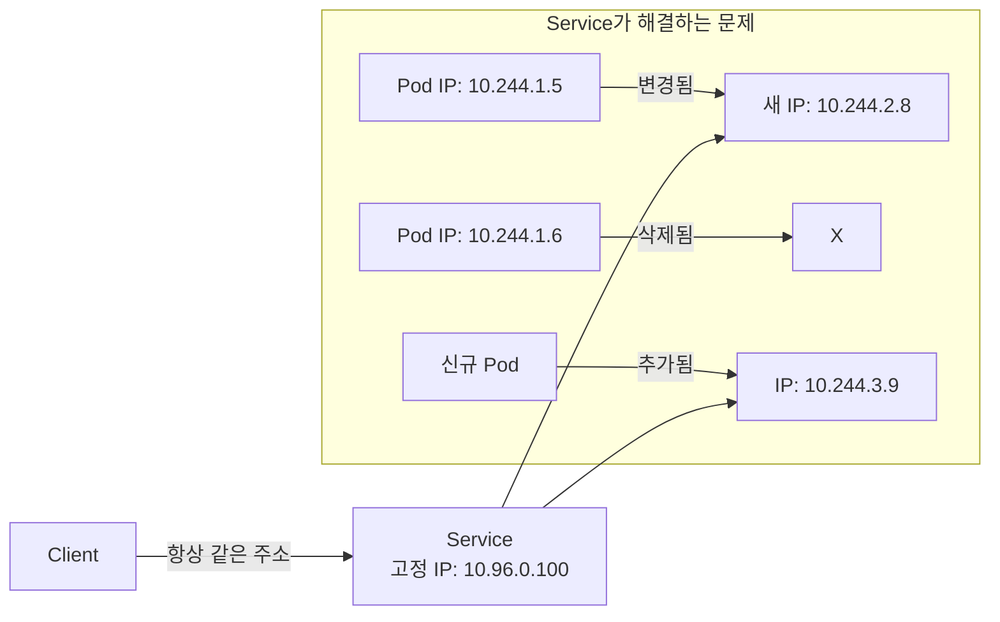
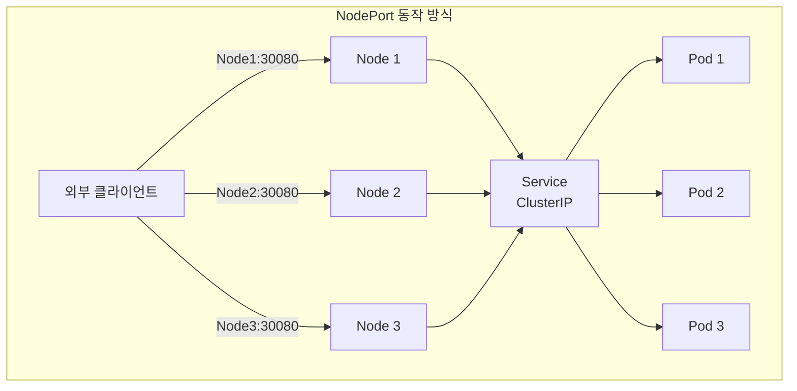
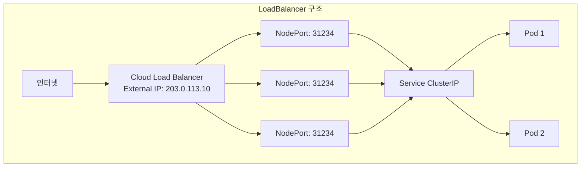

# 🌐 Kubernetes Service 완벽 가이드

> 💡 **목표**: Service의 모든 타입을 이해하고, Pod 간 통신과 외부 노출을 완벽히 구현합니다.

## 📚 목차

1. [**Service란?**](#service란)
2. [**Service 타입 상세**](#service-타입-상세)
3. [**Service Discovery**](#service-discovery)
4. [**EndpointSlices와 로드밸런싱**](#endpointslices와-로드밸런싱)
5. [**Headless Service**](#headless-service)
6. [**실전 예제**](#실전-예제)
7. [**트러블슈팅**](#트러블슈팅)

---

## 🎯 Service란?

### Service의 역할

Service는 Pod 집합에 대한 안정적인 네트워크 엔드포인트를 제공합니다.



### Service vs Pod IP

| 특성 | Pod IP | Service IP |
|-----|--------|------------|
| **수명** | Pod와 함께 생성/삭제 | Service 수명 동안 고정 |
| **접근성** | 클러스터 내부만 | 타입에 따라 외부 접근 가능 |
| **DNS** | 없음 | 자동 DNS 등록 |
| **로드밸런싱** | 없음 | 자동 로드밸런싱 |
| **고가용성** | 단일 Pod | 여러 Pod로 분산 |

---

## 🔍 Service 타입 상세

### 1. ClusterIP (기본값)

클러스터 내부에서만 접근 가능한 IP를 할당합니다.

```yaml
apiVersion: v1
kind: Service
metadata:
  name: backend-service
spec:
  type: ClusterIP  # 생략 가능 (기본값)
  selector:
    app: backend
  ports:
  - name: http
    protocol: TCP
    port: 80        # Service 포트
    targetPort: 8080  # Pod 포트
  - name: https
    protocol: TCP
    port: 443
    targetPort: 8443
```

**사용 사례:**
- 내부 마이크로서비스 통신
- 데이터베이스 서비스
- 캐시 서비스

**접근 방법:**
```bash
# 클러스터 내부에서
curl backend-service.default.svc.cluster.local
curl backend-service  # 같은 namespace인 경우

# 외부에서 테스트 (port-forward)
kubectl port-forward service/backend-service 8080:80
curl localhost:8080
```

### 2. NodePort

각 Node의 특정 포트를 Service에 매핑합니다.

```yaml
apiVersion: v1
kind: Service
metadata:
  name: web-nodeport
spec:
  type: NodePort
  selector:
    app: web
  ports:
  - name: http
    port: 80          # Service 포트
    targetPort: 8080   # Pod 포트
    nodePort: 30080    # Node 포트 (30000-32767)
    protocol: TCP
```



**접근 방법:**
```bash
# 모든 Node IP로 접근 가능
curl <node1-ip>:30080
curl <node2-ip>:30080
curl <node3-ip>:30080
```

### 3. LoadBalancer

클라우드 프로바이더의 로드밸런서를 자동으로 프로비저닝합니다.

```yaml
apiVersion: v1
kind: Service
metadata:
  name: web-loadbalancer
  annotations:
    # AWS ELB 설정
    service.beta.kubernetes.io/aws-load-balancer-type: "nlb"
    service.beta.kubernetes.io/aws-load-balancer-cross-zone-load-balancing-enabled: "true"
    
    # GCP GLB 설정
    cloud.google.com/load-balancer-type: "External"
    
    # Azure LB 설정
    service.beta.kubernetes.io/azure-load-balancer-internal: "false"
spec:
  type: LoadBalancer
  selector:
    app: web
  ports:
  - name: http
    port: 80
    targetPort: 8080
  - name: https
    port: 443
    targetPort: 8443
  # 특정 IP 요청 (클라우드 지원 시)
  loadBalancerIP: "203.0.113.10"
  # 접근 제한
  loadBalancerSourceRanges:
  - "10.0.0.0/8"
  - "192.168.0.0/16"
```



### 4. ExternalName

외부 서비스를 클러스터 내부에서 사용하기 위한 CNAME 레코드입니다.

```yaml
apiVersion: v1
kind: Service
metadata:
  name: external-database
spec:
  type: ExternalName
  externalName: database.example.com
  
---
# 사용 예: 외부 데이터베이스 연결
apiVersion: v1
kind: Service
metadata:
  name: rds-mysql
spec:
  type: ExternalName
  externalName: mysql-instance.123456789012.us-east-1.rds.amazonaws.com
```

**활용:**
```bash
# Pod 내부에서
mysql -h external-database  # → database.example.com으로 연결
```

---

## 🔎 Service Discovery

### 1. DNS 기반 Discovery

Kubernetes는 CoreDNS를 통해 자동으로 Service DNS를 제공합니다.

```bash
# DNS 형식
<service-name>.<namespace>.svc.cluster.local

# 예시
backend-service.default.svc.cluster.local  # 전체 주소
backend-service.default.svc               # cluster.local 생략
backend-service.default                    # svc.cluster.local 생략
backend-service                            # 같은 namespace면 생략
```

**DNS 레코드 타입:**
```yaml
# A 레코드 (일반 Service)
apiVersion: v1
kind: Service
metadata:
  name: web-service
spec:
  selector:
    app: web
  ports:
  - port: 80
# DNS: web-service → 10.96.0.100 (ClusterIP)

---
# SRV 레코드 (Named Port)
apiVersion: v1
kind: Service
metadata:
  name: web-service
spec:
  selector:
    app: web
  ports:
  - name: http
    port: 80
  - name: https
    port: 443
# DNS SRV: _http._tcp.web-service → 80
# DNS SRV: _https._tcp.web-service → 443
```

### 2. 환경 변수 Discovery

```bash
# Kubernetes가 자동으로 주입하는 환경 변수
# Service: redis-master
REDIS_MASTER_SERVICE_HOST=10.96.0.100
REDIS_MASTER_SERVICE_PORT=6379
REDIS_MASTER_PORT=tcp://10.96.0.100:6379
REDIS_MASTER_PORT_6379_TCP=tcp://10.96.0.100:6379
REDIS_MASTER_PORT_6379_TCP_PROTO=tcp
REDIS_MASTER_PORT_6379_TCP_PORT=6379
REDIS_MASTER_PORT_6379_TCP_ADDR=10.96.0.100
```

**주의사항:**
- Service가 Pod보다 먼저 생성되어야 환경 변수가 주입됨
- DNS가 더 유연하고 권장되는 방식

---

## ⚖️ EndpointSlices와 로드밸런싱

### EndpointSlices

Service와 매칭되는 Pod의 실제 IP 주소 목록입니다.

```yaml
# Service가 자동으로 생성하는 EndpointSlice
apiVersion: discovery.k8s.io/v1
kind: EndpointSlice
metadata:
  name: web-service-abc
  labels:
    kubernetes.io/service-name: web-service
addressType: IPv4
endpoints:
- addresses:
  - "10.244.1.5"
  conditions:
    ready: true
    serving: true
    terminating: false
  targetRef:
    kind: Pod
    name: web-pod-1
- addresses:
  - "10.244.2.6"
  conditions:
    ready: true
    serving: true
    terminating: false
  targetRef:
    kind: Pod
    name: web-pod-2
ports:
- port: 8080
  protocol: TCP
```

**EndpointSlice 확인:**
```bash
# Endpoints 확인 (레거시)
kubectl get endpoints web-service

# EndpointSlices 확인 (신규, 더 확장 가능)
kubectl get endpointslices -l kubernetes.io/service-name=web-service
```

### 로드밸런싱 알고리즘

```yaml
apiVersion: v1
kind: Service
metadata:
  name: web-service
spec:
  selector:
    app: web
  ports:
  - port: 80
  # Session Affinity 설정
  sessionAffinity: ClientIP  # None(기본값) 또는 ClientIP
  sessionAffinityConfig:
    clientIP:
      timeoutSeconds: 10800  # 3시간
```

**로드밸런싱 모드:**
| 모드 | 설명 | 사용 사례 |
|-----|------|----------|
| **Round Robin** | 순차적 분배 (기본값) | 일반적인 경우 |
| **ClientIP** | 같은 클라이언트는 같은 Pod | 세션 유지 필요 시 |
| **Random** | 무작위 분배 | IPVS 모드 |
| **Least Connection** | 연결 수가 적은 Pod 선택 | IPVS 모드 |

---

## 🔗 Headless Service

### Headless Service란?

ClusterIP가 없는 Service로, DNS를 통해 Pod IP를 직접 반환합니다.

```yaml
apiVersion: v1
kind: Service
metadata:
  name: database-headless
spec:
  clusterIP: None  # Headless Service
  selector:
    app: database
  ports:
  - port: 5432
```

**DNS 조회 결과:**
```bash
# 일반 Service
nslookup web-service
# → 10.96.0.100 (Service ClusterIP)

# Headless Service
nslookup database-headless
# → 10.244.1.5 (Pod IP)
# → 10.244.2.6 (Pod IP)
# → 10.244.3.7 (Pod IP)
```

### StatefulSet과 함께 사용

```yaml
apiVersion: v1
kind: Service
metadata:
  name: cassandra-headless
spec:
  clusterIP: None
  selector:
    app: cassandra
  ports:
  - port: 9042
    
---
apiVersion: apps/v1
kind: StatefulSet
metadata:
  name: cassandra
spec:
  serviceName: cassandra-headless  # Headless Service 지정
  replicas: 3
  selector:
    matchLabels:
      app: cassandra
  template:
    metadata:
      labels:
        app: cassandra
    spec:
      containers:
      - name: cassandra
        image: cassandra:3.11
```

**각 Pod별 DNS:**
```bash
# StatefulSet Pod의 고정 DNS
cassandra-0.cassandra-headless.default.svc.cluster.local
cassandra-1.cassandra-headless.default.svc.cluster.local
cassandra-2.cassandra-headless.default.svc.cluster.local
```

---

## 💼 실전 예제

### 예제 1: 마이크로서비스 통신

```yaml
# Frontend Service (외부 노출)
apiVersion: v1
kind: Service
metadata:
  name: frontend
spec:
  type: LoadBalancer
  selector:
    app: frontend
  ports:
  - port: 80
    targetPort: 3000
    
---
# Backend Service (내부 통신)
apiVersion: v1
kind: Service
metadata:
  name: backend
spec:
  type: ClusterIP
  selector:
    app: backend
  ports:
  - port: 8080
    
---
# Database Service (Headless)
apiVersion: v1
kind: Service
metadata:
  name: database
spec:
  clusterIP: None
  selector:
    app: postgres
  ports:
  - port: 5432
```

**Frontend에서 Backend 호출:**
```javascript
// Frontend 코드
const response = await fetch('http://backend:8080/api/users');
```

### 예제 2: Multi-Port Service

```yaml
apiVersion: v1
kind: Service
metadata:
  name: multi-port-service
spec:
  selector:
    app: multi-app
  ports:
  - name: http
    port: 80
    targetPort: 8080
    protocol: TCP
  - name: https
    port: 443
    targetPort: 8443
    protocol: TCP
  - name: grpc
    port: 50051
    targetPort: 50051
    protocol: TCP
  - name: metrics
    port: 9090
    targetPort: 9090
    protocol: TCP
```

### 예제 3: External Service 통합

```yaml
# 외부 데이터베이스를 Service로 노출
apiVersion: v1
kind: Service
metadata:
  name: external-mysql
spec:
  type: ClusterIP
  ports:
  - port: 3306
    
---
apiVersion: v1
kind: Endpoints
metadata:
  name: external-mysql
subsets:
- addresses:
  - ip: 203.0.113.10  # 외부 MySQL IP
  ports:
  - port: 3306
```

### 예제 4: Service Mesh Integration

```yaml
# Istio 사용 예시
apiVersion: v1
kind: Service
metadata:
  name: productpage
  labels:
    app: productpage
    service: productpage
spec:
  selector:
    app: productpage
  ports:
  - port: 9080
    name: http  # Istio는 named port 필요
    
---
# Istio VirtualService
apiVersion: networking.istio.io/v1beta1
kind: VirtualService
metadata:
  name: productpage
spec:
  hosts:
  - productpage
  http:
  - match:
    - headers:
        end-user:
          exact: jason
    route:
    - destination:
        host: productpage
        subset: v2
  - route:
    - destination:
        host: productpage
        subset: v1
      weight: 75
    - destination:
        host: productpage
        subset: v2
      weight: 25
```

### 예제 5: Blue-Green with Service

```bash
# Blue 배포 (현재 운영)
kubectl apply -f - <<EOF
apiVersion: apps/v1
kind: Deployment
metadata:
  name: app-blue
spec:
  replicas: 3
  selector:
    matchLabels:
      app: myapp
      version: blue
  template:
    metadata:
      labels:
        app: myapp
        version: blue
    spec:
      containers:
      - name: app
        image: myapp:v1.0
EOF

# Service는 Blue를 가리킴
kubectl apply -f - <<EOF
apiVersion: v1
kind: Service
metadata:
  name: myapp-service
spec:
  selector:
    app: myapp
    version: blue
  ports:
  - port: 80
EOF

# Green 배포 (새 버전)
kubectl apply -f - <<EOF
apiVersion: apps/v1
kind: Deployment
metadata:
  name: app-green
spec:
  replicas: 3
  selector:
    matchLabels:
      app: myapp
      version: green
  template:
    metadata:
      labels:
        app: myapp
        version: green
    spec:
      containers:
      - name: app
        image: myapp:v2.0
EOF

# 테스트 후 Service를 Green으로 전환
kubectl patch service myapp-service -p '{"spec":{"selector":{"version":"green"}}}'

# Blue 제거
kubectl delete deployment app-blue
```

---

## 🔧 트러블슈팅

### 일반적인 문제와 해결

#### 1. Service에 연결할 수 없음

```bash
# 1. Service 존재 확인
kubectl get service web-service

# 2. Endpoints 확인
kubectl get endpoints web-service
# 비어있으면 selector가 잘못됨

# 3. Selector 확인
kubectl get service web-service -o yaml | grep -A 3 selector
kubectl get pods --show-labels

# 4. Pod Ready 상태 확인
kubectl get pods -l app=web

# 5. DNS 확인
kubectl run test --rm -it --image=busybox -- nslookup web-service
```

#### 2. LoadBalancer가 Pending 상태

```bash
# 1. 클라우드 프로바이더 확인
kubectl describe service web-loadbalancer

# 2. 이벤트 확인
kubectl get events | grep web-loadbalancer

# 3. 로컬 환경인 경우 MetalLB 사용
kubectl apply -f https://raw.githubusercontent.com/metallb/metallb/v0.13.7/config/manifests/metallb-native.yaml
```

#### 3. Session Affinity가 동작하지 않음

```yaml
# 올바른 설정
apiVersion: v1
kind: Service
metadata:
  name: web-service
spec:
  selector:
    app: web
  ports:
  - port: 80
  sessionAffinity: ClientIP
  sessionAffinityConfig:
    clientIP:
      timeoutSeconds: 10800
```

```bash
# 테스트
for i in {1..10}; do
  curl -s http://web-service | grep "Pod:"
done
# 같은 Pod로 가는지 확인
```

#### 4. NodePort 접근 불가

```bash
# 1. NodePort 범위 확인 (30000-32767)
kubectl get service web-nodeport -o yaml | grep nodePort

# 2. 방화벽 규칙 확인
sudo iptables -L -n | grep 30080

# 3. Node IP 확인
kubectl get nodes -o wide

# 4. kube-proxy 상태 확인
kubectl get pods -n kube-system | grep kube-proxy
kubectl logs -n kube-system kube-proxy-xxxxx
```

---

## 📋 Service 설계 Best Practices

### 1. 명명 규칙
```yaml
# ✅ 좋은 예
name: user-api
name: payment-service
name: cache-redis

# ❌ 나쁜 예
name: service1
name: svc
name: my-service
```

### 2. 포트 명명
```yaml
# ✅ Named ports 사용
ports:
- name: http
  port: 80
- name: grpc
  port: 50051
- name: metrics
  port: 9090
```

### 3. 라벨 셀렉터
```yaml
# ✅ 구체적인 셀렉터
selector:
  app: user-api
  tier: backend
  environment: production

# ❌ 너무 광범위한 셀렉터
selector:
  app: backend
```

### 4. 모니터링 설정
```yaml
metadata:
  annotations:
    prometheus.io/scrape: "true"
    prometheus.io/port: "9090"
    prometheus.io/path: "/metrics"
```

---

## 💡 고급 기능

### 1. Service Topology

```yaml
# 같은 zone의 Pod 우선 라우팅
apiVersion: v1
kind: Service
metadata:
  name: my-service
  annotations:
    service.kubernetes.io/topology-aware-hints: "Auto"
spec:
  selector:
    app: my-app
  ports:
  - port: 80
```

### 2. IPv6 Dual Stack

```yaml
apiVersion: v1
kind: Service
metadata:
  name: dual-stack-service
spec:
  ipFamilyPolicy: PreferDualStack
  ipFamilies:
  - IPv4
  - IPv6
  selector:
    app: web
  ports:
  - port: 80
```

### 3. Service Internal Traffic Policy

```yaml
# Node-local 트래픽만 처리
apiVersion: v1
kind: Service
metadata:
  name: local-service
spec:
  type: ClusterIP
  internalTrafficPolicy: Local  # Cluster(기본) 또는 Local
  selector:
    app: web
  ports:
  - port: 80
```

---

> 🚀 **다음 문서**: [ingress.md](ingress.md)에서 Ingress를 통한 고급 라우팅과 TLS 설정을 알아보세요!