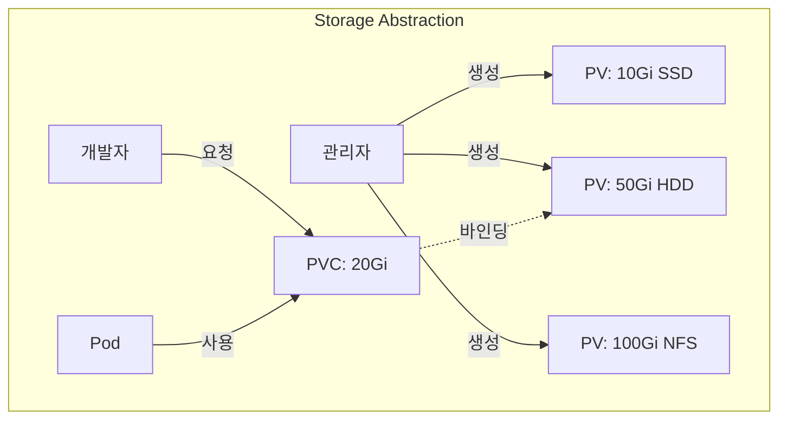
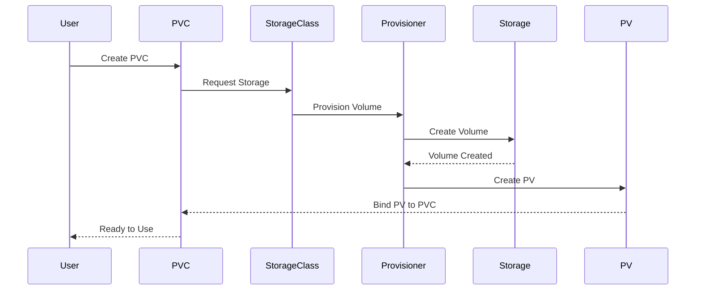
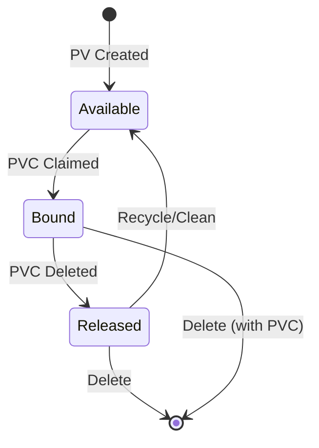

# 💾 PersistentVolume & PersistentVolumeClaim 완벽 가이드

> 💡 **목표**: Kubernetes의 영구 스토리지 시스템을 이해하고, PV/PVC를 활용한 데이터 영속성을 구현합니다.

## 📚 목차

1. [**PV/PVC 개념**](#pvpvc-개념)
2. [**StorageClass**](#storageclass)
3. [**동적 프로비저닝**](#동적-프로비저닝)
4. [**PV/PVC 생명주기**](#pvpvc-생명주기)
5. [**실전 시나리오**](#실전-시나리오)
6. [**볼륨 확장과 스냅샷**](#볼륨-확장과-스냅샷)
7. [**Best Practices**](#best-practices)

---

## 🎯 PV/PVC 개념

### PersistentVolume (PV) & PersistentVolumeClaim (PVC)



### PV vs PVC vs StorageClass

| 구분 | 역할 | 관리자 | 생명주기 |
|------|-----|--------|----------|
| **PV** | 실제 스토리지 리소스 | 클러스터 관리자 | 독립적 |
| **PVC** | 스토리지 요청/청구서 | 개발자/사용자 | Namespace 범위 |
| **StorageClass** | 동적 프로비저닝 템플릿 | 클러스터 관리자 | 클러스터 범위 |

---

## 📦 PersistentVolume 생성

### 1. 정적 PV 생성

```yaml
# NFS PersistentVolume
apiVersion: v1
kind: PersistentVolume
metadata:
  name: nfs-pv
  labels:
    type: nfs
    environment: production
spec:
  capacity:
    storage: 10Gi
  volumeMode: Filesystem  # Filesystem 또는 Block
  accessModes:
    - ReadWriteMany      # 여러 노드에서 읽기/쓰기
  persistentVolumeReclaimPolicy: Retain  # Retain, Delete, Recycle
  storageClassName: nfs-storage
  mountOptions:
    - hard
    - nfsvers=4.1
  nfs:
    path: /exports/data
    server: nfs-server.example.com

---
# Local PersistentVolume
apiVersion: v1
kind: PersistentVolume
metadata:
  name: local-pv
spec:
  capacity:
    storage: 100Gi
  volumeMode: Filesystem
  accessModes:
    - ReadWriteOnce
  persistentVolumeReclaimPolicy: Delete
  storageClassName: local-storage
  local:
    path: /mnt/disks/ssd1
  nodeAffinity:  # Local PV는 노드 지정 필수
    required:
      nodeSelectorTerms:
      - matchExpressions:
        - key: kubernetes.io/hostname
          operator: In
          values:
          - worker-node-1

---
# Cloud Provider PV (AWS EBS)
apiVersion: v1
kind: PersistentVolume
metadata:
  name: aws-ebs-pv
spec:
  capacity:
    storage: 50Gi
  accessModes:
    - ReadWriteOnce
  persistentVolumeReclaimPolicy: Retain
  storageClassName: aws-ebs
  awsElasticBlockStore:
    volumeID: vol-0123456789abcdef
    fsType: ext4
    partition: 0
    readOnly: false
```

### Access Modes 상세

| Mode | 약어 | 설명 | 사용 예시 |
|------|------|------|----------|
| **ReadWriteOnce** | RWO | 단일 노드 읽기/쓰기 | 데이터베이스 |
| **ReadOnlyMany** | ROX | 여러 노드 읽기 전용 | 정적 콘텐츠 |
| **ReadWriteMany** | RWX | 여러 노드 읽기/쓰기 | 공유 파일시스템 |
| **ReadWriteOncePod** | RWOP | 단일 Pod 읽기/쓰기 (1.27+) | 싱글톤 앱 |

### Reclaim Policy

```yaml
# Retain: PVC 삭제 시 PV 유지 (수동 정리 필요)
persistentVolumeReclaimPolicy: Retain

# Delete: PVC 삭제 시 PV와 실제 스토리지 삭제
persistentVolumeReclaimPolicy: Delete

# Recycle: PVC 삭제 시 데이터만 삭제 (Deprecated)
persistentVolumeReclaimPolicy: Recycle
```

---

## 📝 PersistentVolumeClaim 생성

### 기본 PVC

```yaml
apiVersion: v1
kind: PersistentVolumeClaim
metadata:
  name: app-pvc
  namespace: production
spec:
  accessModes:
    - ReadWriteOnce
  volumeMode: Filesystem
  resources:
    requests:
      storage: 10Gi
  storageClassName: fast-ssd
  selector:  # 특정 PV 선택 (옵션)
    matchLabels:
      environment: production
    matchExpressions:
    - key: type
      operator: In
      values: [ssd, nvme]
```

### PVC와 Pod 연결

```yaml
apiVersion: apps/v1
kind: StatefulSet
metadata:
  name: postgres
spec:
  serviceName: postgres
  replicas: 1
  selector:
    matchLabels:
      app: postgres
  template:
    metadata:
      labels:
        app: postgres
    spec:
      containers:
      - name: postgres
        image: postgres:13
        env:
        - name: POSTGRES_PASSWORD
          valueFrom:
            secretKeyRef:
              name: postgres-secret
              key: password
        - name: PGDATA
          value: /var/lib/postgresql/data/pgdata
        ports:
        - containerPort: 5432
        volumeMounts:
        - name: postgres-storage
          mountPath: /var/lib/postgresql/data
        livenessProbe:
          exec:
            command:
            - /bin/sh
            - -c
            - pg_isready -U postgres
          initialDelaySeconds: 30
          periodSeconds: 10
        readinessProbe:
          exec:
            command:
            - /bin/sh
            - -c
            - pg_isready -U postgres
          initialDelaySeconds: 5
          periodSeconds: 5
      volumes:
      - name: postgres-storage
        persistentVolumeClaim:
          claimName: postgres-pvc

---
apiVersion: v1
kind: PersistentVolumeClaim
metadata:
  name: postgres-pvc
spec:
  accessModes:
    - ReadWriteOnce
  resources:
    requests:
      storage: 20Gi
  storageClassName: fast-ssd
```

---

## 🎯 StorageClass

### StorageClass 정의

```yaml
# AWS EBS StorageClass
apiVersion: storage.k8s.io/v1
kind: StorageClass
metadata:
  name: fast-ssd
  annotations:
    storageclass.kubernetes.io/is-default-class: "true"
provisioner: kubernetes.io/aws-ebs
parameters:
  type: gp3
  iopsPerGB: "100"
  fsType: ext4
  encrypted: "true"
reclaimPolicy: Delete
allowVolumeExpansion: true
volumeBindingMode: WaitForFirstConsumer
mountOptions:
  - debug
  - noatime

---
# GCP PD StorageClass
apiVersion: storage.k8s.io/v1
kind: StorageClass
metadata:
  name: ssd-regional
provisioner: kubernetes.io/gce-pd
parameters:
  type: pd-ssd
  replication-type: regional-pd
  zones: us-central1-a,us-central1-b
volumeBindingMode: WaitForFirstConsumer
allowVolumeExpansion: true

---
# Local StorageClass
apiVersion: storage.k8s.io/v1
kind: StorageClass
metadata:
  name: local-storage
provisioner: kubernetes.io/no-provisioner
volumeBindingMode: WaitForFirstConsumer

---
# NFS StorageClass (nfs-subdir-external-provisioner)
apiVersion: storage.k8s.io/v1
kind: StorageClass
metadata:
  name: nfs-client
provisioner: k8s-sigs.io/nfs-subdir-external-provisioner
parameters:
  archiveOnDelete: "false"
  pathPattern: "${.PVC.namespace}/${.PVC.name}"
```

### VolumeBindingMode

```yaml
# Immediate: PVC 생성 즉시 바인딩 (기본값)
volumeBindingMode: Immediate

# WaitForFirstConsumer: Pod가 생성될 때까지 대기
# - 장점: Pod가 스케줄링된 노드에 볼륨 생성
# - Zone 고려한 배치 가능
volumeBindingMode: WaitForFirstConsumer
```

---

## 🔄 동적 프로비저닝

### 동적 프로비저닝 플로우



### CSI (Container Storage Interface) Driver

```yaml
# CSI Driver 설치 예시 (AWS EBS CSI)
# 1. Driver 설치
kubectl apply -k "github.com/kubernetes-sigs/aws-ebs-csi-driver/deploy/kubernetes/overlays/stable/?ref=release-1.19"

# 2. StorageClass 생성
apiVersion: storage.k8s.io/v1
kind: StorageClass
metadata:
  name: ebs-csi-gp3
provisioner: ebs.csi.aws.com
parameters:
  type: gp3
  iops: "3000"
  throughput: "125"  # MB/s
  encrypted: "true"
  kmsKeyId: arn:aws:kms:us-west-2:111122223333:key/1234abcd-12ab-34cd-56ef-1234567890ab
volumeBindingMode: WaitForFirstConsumer
reclaimPolicy: Delete
allowVolumeExpansion: true

---
# PVC 생성 (자동으로 PV 생성됨)
apiVersion: v1
kind: PersistentVolumeClaim
metadata:
  name: dynamic-pvc
spec:
  accessModes:
    - ReadWriteOnce
  storageClassName: ebs-csi-gp3
  resources:
    requests:
      storage: 100Gi
```

---

## 🔄 PV/PVC 생명주기

### 상태 전이



### 생명주기 상태

| 상태 | PV | PVC | 설명 |
|-----|-----|-----|------|
| **Available** | ✅ | - | PV 사용 가능 |
| **Bound** | ✅ | ✅ | PV-PVC 바인딩됨 |
| **Released** | ✅ | - | PVC 삭제됨, PV 정리 대기 |
| **Failed** | ✅ | ❌ | 바인딩 실패 |
| **Pending** | - | ✅ | PVC가 적합한 PV 대기 |

---

## 💼 실전 시나리오

### 시나리오 1: StatefulSet with 동적 PVC

```yaml
apiVersion: apps/v1
kind: StatefulSet
metadata:
  name: redis-cluster
spec:
  serviceName: redis-cluster
  replicas: 3
  selector:
    matchLabels:
      app: redis-cluster
  template:
    metadata:
      labels:
        app: redis-cluster
    spec:
      containers:
      - name: redis
        image: redis:6-alpine
        ports:
        - containerPort: 6379
        command: ["redis-server"]
        args:
        - --cluster-enabled yes
        - --cluster-config-file /data/nodes.conf
        - --cluster-node-timeout 5000
        - --appendonly yes
        - --appenddir /data
        volumeMounts:
        - name: data
          mountPath: /data
        resources:
          requests:
            cpu: 100m
            memory: 256Mi
          limits:
            cpu: 500m
            memory: 512Mi
  volumeClaimTemplates:  # StatefulSet의 동적 PVC
  - metadata:
      name: data
    spec:
      accessModes: ["ReadWriteOnce"]
      storageClassName: fast-ssd
      resources:
        requests:
          storage: 10Gi
```

### 시나리오 2: 데이터베이스 마이그레이션

```yaml
# Step 1: 기존 데이터베이스 백업
apiVersion: batch/v1
kind: Job
metadata:
  name: backup-database
spec:
  template:
    spec:
      containers:
      - name: backup
        image: postgres:13
        command: ["/bin/bash"]
        args:
        - -c
        - |
          pg_dump -h old-postgres -U postgres mydb > /backup/dump.sql
          echo "Backup completed at $(date)"
        env:
        - name: PGPASSWORD
          valueFrom:
            secretKeyRef:
              name: postgres-secret
              key: password
        volumeMounts:
        - name: backup
          mountPath: /backup
      volumes:
      - name: backup
        persistentVolumeClaim:
          claimName: backup-pvc
      restartPolicy: OnFailure

---
# Step 2: 새 PVC로 데이터 복원
apiVersion: batch/v1
kind: Job
metadata:
  name: restore-database
spec:
  template:
    spec:
      initContainers:
      - name: wait-for-db
        image: busybox
        command: ['sh', '-c', 'until nc -z new-postgres 5432; do sleep 1; done']
      
      containers:
      - name: restore
        image: postgres:13
        command: ["/bin/bash"]
        args:
        - -c
        - |
          psql -h new-postgres -U postgres < /backup/dump.sql
          echo "Restore completed at $(date)"
        env:
        - name: PGPASSWORD
          valueFrom:
            secretKeyRef:
              name: postgres-secret
              key: password
        volumeMounts:
        - name: backup
          mountPath: /backup
          readOnly: true
      volumes:
      - name: backup
        persistentVolumeClaim:
          claimName: backup-pvc
      restartPolicy: OnFailure
```

### 시나리오 3: 멀티테넌트 스토리지 격리

```yaml
# Namespace별 ResourceQuota
apiVersion: v1
kind: ResourceQuota
metadata:
  name: storage-quota
  namespace: tenant-a
spec:
  hard:
    requests.storage: 100Gi
    persistentvolumeclaims: "10"

---
# Tenant A - StorageClass
apiVersion: storage.k8s.io/v1
kind: StorageClass
metadata:
  name: tenant-a-storage
provisioner: kubernetes.io/aws-ebs
parameters:
  type: gp3
  tagSpecification_1: "ResourceType=volume,Tags=[{Key=Tenant,Value=A},{Key=Environment,Value=Production}]"
volumeBindingMode: WaitForFirstConsumer
allowVolumeExpansion: true

---
# Tenant A - PVC
apiVersion: v1
kind: PersistentVolumeClaim
metadata:
  name: tenant-a-data
  namespace: tenant-a
  labels:
    tenant: a
spec:
  accessModes:
    - ReadWriteOnce
  storageClassName: tenant-a-storage
  resources:
    requests:
      storage: 50Gi
```

### 시나리오 4: 고가용성 스토리지

```yaml
# Regional Persistent Disk (GCP)
apiVersion: storage.k8s.io/v1
kind: StorageClass
metadata:
  name: ha-regional-storage
provisioner: kubernetes.io/gce-pd
parameters:
  type: pd-standard
  replication-type: regional-pd
  zones: us-central1-a,us-central1-b
volumeBindingMode: WaitForFirstConsumer

---
# Replicated Storage with Rook/Ceph
apiVersion: ceph.rook.io/v1
kind: CephBlockPool
metadata:
  name: replicated-pool
  namespace: rook-ceph
spec:
  replicated:
    size: 3  # 3개 복제본
    requireSafeReplicaSize: true
  compressionMode: aggressive
  parameters:
    compression_mode: aggressive

---
apiVersion: storage.k8s.io/v1
kind: StorageClass
metadata:
  name: rook-ceph-block
provisioner: rook-ceph.rbd.csi.ceph.com
parameters:
  clusterID: rook-ceph
  pool: replicated-pool
  imageFormat: "2"
  imageFeatures: layering
  csi.storage.k8s.io/provisioner-secret-name: rook-csi-rbd-provisioner
  csi.storage.k8s.io/provisioner-secret-namespace: rook-ceph
  csi.storage.k8s.io/controller-expand-secret-name: rook-csi-rbd-provisioner
  csi.storage.k8s.io/controller-expand-secret-namespace: rook-ceph
  csi.storage.k8s.io/node-stage-secret-name: rook-csi-rbd-node
  csi.storage.k8s.io/node-stage-secret-namespace: rook-ceph
  csi.storage.k8s.io/fstype: ext4
reclaimPolicy: Delete
allowVolumeExpansion: true
```

---

## 📸 볼륨 확장과 스냅샷

### PVC 확장

```bash
# StorageClass에서 확장 허용 필요
# allowVolumeExpansion: true

# PVC 크기 변경
kubectl patch pvc my-pvc -p '{"spec":{"resources":{"requests":{"storage":"50Gi"}}}}'

# 상태 확인
kubectl get pvc my-pvc --watch

# Pod 재시작 (파일시스템 확장)
kubectl delete pod my-pod
```

### Volume Snapshot

```yaml
# VolumeSnapshotClass
apiVersion: snapshot.storage.k8s.io/v1
kind: VolumeSnapshotClass
metadata:
  name: csi-snapclass
driver: ebs.csi.aws.com
deletionPolicy: Delete
parameters:
  encrypted: "true"

---
# VolumeSnapshot 생성
apiVersion: snapshot.storage.k8s.io/v1
kind: VolumeSnapshot
metadata:
  name: data-snapshot
spec:
  volumeSnapshotClassName: csi-snapclass
  source:
    persistentVolumeClaimName: source-pvc

---
# Snapshot에서 PVC 생성
apiVersion: v1
kind: PersistentVolumeClaim
metadata:
  name: restored-pvc
spec:
  accessModes:
    - ReadWriteOnce
  storageClassName: fast-ssd
  resources:
    requests:
      storage: 20Gi
  dataSource:
    name: data-snapshot
    kind: VolumeSnapshot
    apiGroup: snapshot.storage.k8s.io
```

### Volume Clone

```yaml
# 기존 PVC 복제
apiVersion: v1
kind: PersistentVolumeClaim
metadata:
  name: cloned-pvc
spec:
  accessModes:
    - ReadWriteOnce
  storageClassName: fast-ssd
  resources:
    requests:
      storage: 20Gi
  dataSource:
    name: source-pvc
    kind: PersistentVolumeClaim
```

---

## ✅ Best Practices

### 1. 적절한 StorageClass 선택

```yaml
# 용도별 StorageClass
# 데이터베이스: 높은 IOPS
storageClassName: fast-ssd-db

# 로그/백업: 저렴한 스토리지
storageClassName: slow-hdd-backup

# 캐시: 임시 로컬 스토리지
storageClassName: local-ssd-cache
```

### 2. 리소스 제한

```yaml
# Namespace별 스토리지 제한
apiVersion: v1
kind: ResourceQuota
metadata:
  name: storage-quota
spec:
  hard:
    requests.storage: 500Gi
    persistentvolumeclaims: "20"
    fast-ssd.storageclass.storage.k8s.io/requests.storage: 100Gi
    slow-hdd.storageclass.storage.k8s.io/requests.storage: 400Gi
```

### 3. 백업 전략

```yaml
# CronJob으로 정기 스냅샷
apiVersion: batch/v1
kind: CronJob
metadata:
  name: daily-snapshot
spec:
  schedule: "0 2 * * *"
  jobTemplate:
    spec:
      template:
        spec:
          serviceAccountName: snapshot-creator
          containers:
          - name: snapshot
            image: bitnami/kubectl:latest
            command:
            - /bin/bash
            - -c
            - |
              DATE=$(date +%Y%m%d)
              kubectl apply -f - <<EOF
              apiVersion: snapshot.storage.k8s.io/v1
              kind: VolumeSnapshot
              metadata:
                name: daily-snapshot-$DATE
              spec:
                volumeSnapshotClassName: csi-snapclass
                source:
                  persistentVolumeClaimName: production-data
              EOF
          restartPolicy: OnFailure
```

### 4. 모니터링

```yaml
# Prometheus 메트릭
- alert: PVCNearlyFull
  expr: |
    (kubelet_volume_stats_used_bytes / kubelet_volume_stats_capacity_bytes) > 0.85
  for: 5m
  annotations:
    summary: "PVC {{ $labels.persistentvolumeclaim }} is nearly full"
    description: "PVC {{ $labels.persistentvolumeclaim }} is {{ $value | humanizePercentage }} full"
```

---

## 🔧 트러블슈팅

### PVC가 Pending 상태

```bash
# 원인 파악
kubectl describe pvc my-pvc

# 일반적인 원인:
# 1. 적합한 PV 없음
kubectl get pv

# 2. StorageClass 없음
kubectl get storageclass

# 3. 프로비저너 문제
kubectl logs -n kube-system deployment/ebs-csi-controller

# 4. 리소스 부족
kubectl get resourcequota -A
```

### PV가 Released 상태에서 멈춤

```bash
# PV 정리 후 재사용
kubectl patch pv my-pv -p '{"spec":{"claimRef":null}}'

# 또는 수동으로 데이터 정리 후
kubectl patch pv my-pv -p '{"spec":{"persistentVolumeReclaimPolicy":"Retain"}}'
```

### 볼륨 마운트 실패

```bash
# Node에서 볼륨 상태 확인
kubectl describe pod my-pod | grep -A10 "Events:"

# CSI driver 로그 확인
kubectl logs -n kube-system daemonset/ebs-csi-node

# 권한 문제 해결
spec:
  securityContext:
    fsGroup: 2000
    runAsUser: 1000
```

---

## 💡 고급 팁

### 1. Topology-Aware Volume Provisioning

```yaml
# Zone 인식 스토리지
apiVersion: storage.k8s.io/v1
kind: StorageClass
metadata:
  name: zone-aware-storage
provisioner: ebs.csi.aws.com
volumeBindingMode: WaitForFirstConsumer
allowedTopologies:
- matchLabelExpressions:
  - key: topology.kubernetes.io/zone
    values:
    - us-west-2a
    - us-west-2b
```

### 2. Volume Populator

```yaml
# 데이터가 미리 채워진 PVC 생성
apiVersion: v1
kind: PersistentVolumeClaim
metadata:
  name: populated-pvc
spec:
  accessModes:
    - ReadWriteOnce
  resources:
    requests:
      storage: 10Gi
  dataSourceRef:
    apiGroup: populator.storage.k8s.io
    kind: VolumePopulator
    name: s3-populator
```

### 3. ReadWriteOncePod 모드 (1.27+)

```yaml
# 단일 Pod만 사용 가능
apiVersion: v1
kind: PersistentVolumeClaim
metadata:
  name: single-pod-pvc
spec:
  accessModes:
    - ReadWriteOncePod  # 더 강력한 격리
  resources:
    requests:
      storage: 10Gi
```

---

> 🚀 이제 Kubernetes의 영구 스토리지를 완벽히 마스터했습니다!