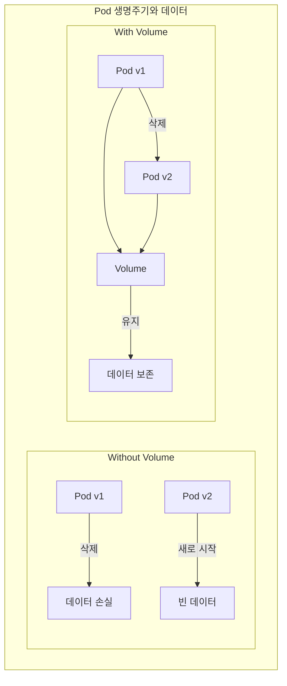

# 📦 Kubernetes Volume 완벽 가이드

> 💡 **목표**: Kubernetes의 다양한 Volume 타입을 이해하고, 데이터 저장과 공유를 효과적으로 구현합니다.

## 📚 목차

1. [**Volume 개념**](#volume-개념)
2. [**Volume 타입**](#volume-타입)
3. [**실전 Volume 사용**](#실전-volume-사용)
4. [**Volume 공유 패턴**](#volume-공유-패턴)
5. [**Best Practices**](#best-practices)
6. [**트러블슈팅**](#트러블슈팅)

---

## 🎯 Volume 개념

### Pod와 Volume의 관계



### Volume vs PersistentVolume

| 특성 | Volume | PersistentVolume |
|-----|--------|-----------------|
| **생명주기** | Pod와 함께 | 독립적 |
| **정의 위치** | Pod spec 내부 | 별도 리소스 |
| **데이터 보존** | Pod 삭제 시 삭제 (타입에 따라) | 항상 보존 |
| **관리 주체** | 사용자 | 관리자 |
| **동적 프로비저닝** | ❌ | ✅ |

---

## 📂 Volume 타입

### 1. emptyDir

빈 디렉토리를 생성하여 Pod 내 컨테이너 간 데이터 공유

```yaml
apiVersion: v1
kind: Pod
metadata:
  name: emptydir-pod
spec:
  containers:
  # 데이터 생성 컨테이너
  - name: writer
    image: busybox
    command: ['sh', '-c']
    args:
      - while true; do
          echo "$(date) - Data from writer" >> /data/log.txt;
          sleep 5;
        done
    volumeMounts:
    - name: shared-data
      mountPath: /data
  
  # 데이터 읽기 컨테이너
  - name: reader
    image: busybox
    command: ['sh', '-c']
    args:
      - tail -f /data/log.txt
    volumeMounts:
    - name: shared-data
      mountPath: /data
  
  volumes:
  - name: shared-data
    emptyDir: {}  # 기본: 노드 디스크 사용

---
# 메모리 기반 emptyDir (빠른 임시 저장)
apiVersion: v1
kind: Pod
metadata:
  name: memory-emptydir
spec:
  containers:
  - name: app
    image: nginx
    volumeMounts:
    - name: cache-volume
      mountPath: /cache
  volumes:
  - name: cache-volume
    emptyDir:
      medium: Memory  # RAM 사용
      sizeLimit: 1Gi  # 크기 제한
```

**사용 사례:**
- 임시 캐시
- 컨테이너 간 데이터 공유
- 스크래치 공간
- 정렬/처리를 위한 임시 저장

### 2. hostPath

노드의 파일시스템을 Pod에 마운트

```yaml
apiVersion: v1
kind: Pod
metadata:
  name: hostpath-pod
spec:
  containers:
  - name: app
    image: nginx
    volumeMounts:
    - name: host-volume
      mountPath: /host-data
    - name: docker-socket
      mountPath: /var/run/docker.sock
  volumes:
  # 디렉토리 마운트
  - name: host-volume
    hostPath:
      path: /data
      type: DirectoryOrCreate  # 없으면 생성
  
  # Docker 소켓 마운트 (DinD)
  - name: docker-socket
    hostPath:
      path: /var/run/docker.sock
      type: Socket

---
# hostPath 타입
# DirectoryOrCreate - 디렉토리가 없으면 생성
# Directory - 디렉토리가 있어야 함
# FileOrCreate - 파일이 없으면 생성
# File - 파일이 있어야 함
# Socket - Unix 소켓이어야 함
# CharDevice - Character device이어야 함
# BlockDevice - Block device이어야 함
```

⚠️ **주의사항:**
- Pod가 특정 노드에 고정됨
- 보안 위험 (노드 파일시스템 접근)
- 포터빌리티 문제

### 3. configMap & secret Volume

```yaml
# ConfigMap을 Volume으로 마운트
apiVersion: v1
kind: Pod
metadata:
  name: configmap-volume
spec:
  containers:
  - name: app
    image: nginx
    volumeMounts:
    # 전체 ConfigMap 마운트
    - name: config-volume
      mountPath: /etc/config
    
    # 특정 key만 특정 경로에 마운트
    - name: nginx-config
      mountPath: /etc/nginx/nginx.conf
      subPath: nginx.conf
  
  volumes:
  - name: config-volume
    configMap:
      name: app-config
      defaultMode: 0644
  
  - name: nginx-config
    configMap:
      name: nginx-config
      items:
      - key: nginx.conf
        path: nginx.conf
        mode: 0644

---
# Secret을 Volume으로 마운트
apiVersion: v1
kind: Pod
metadata:
  name: secret-volume
spec:
  containers:
  - name: app
    image: myapp
    volumeMounts:
    - name: secret-volume
      mountPath: /etc/secrets
      readOnly: true
  
  volumes:
  - name: secret-volume
    secret:
      secretName: app-secrets
      defaultMode: 0400  # 읽기 전용
      optional: false     # 필수
```

### 4. downwardAPI Volume

Pod/Container 메타데이터를 파일로 노출

```yaml
apiVersion: v1
kind: Pod
metadata:
  name: downward-api-pod
  labels:
    app: myapp
    version: v1
  annotations:
    build: "1234"
spec:
  containers:
  - name: app
    image: busybox
    command: ['sh', '-c']
    args:
    - while true; do
        echo "=== Pod Info ===";
        cat /podinfo/*;
        echo "=== Container Info ===";
        cat /containerinfo/*;
        sleep 30;
      done
    resources:
      requests:
        memory: "32Mi"
        cpu: "125m"
      limits:
        memory: "64Mi"
        cpu: "250m"
    volumeMounts:
    - name: podinfo
      mountPath: /podinfo
    - name: containerinfo
      mountPath: /containerinfo
  
  volumes:
  # Pod 정보
  - name: podinfo
    downwardAPI:
      items:
      - path: "name"
        fieldRef:
          fieldPath: metadata.name
      - path: "namespace"
        fieldRef:
          fieldPath: metadata.namespace
      - path: "uid"
        fieldRef:
          fieldPath: metadata.uid
      - path: "labels"
        fieldRef:
          fieldPath: metadata.labels
      - path: "annotations"
        fieldRef:
          fieldPath: metadata.annotations
      - path: "node"
        fieldRef:
          fieldPath: spec.nodeName
      - path: "serviceaccount"
        fieldRef:
          fieldPath: spec.serviceAccountName
  
  # Container 정보
  - name: containerinfo
    downwardAPI:
      items:
      - path: "cpu_request"
        resourceFieldRef:
          containerName: app
          resource: requests.cpu
      - path: "mem_request"
        resourceFieldRef:
          containerName: app
          resource: requests.memory
      - path: "cpu_limit"
        resourceFieldRef:
          containerName: app
          resource: limits.cpu
      - path: "mem_limit"
        resourceFieldRef:
          containerName: app
          resource: limits.memory
```

### 5. projected Volume

여러 소스를 하나의 Volume으로 결합

```yaml
apiVersion: v1
kind: Pod
metadata:
  name: projected-volume
spec:
  containers:
  - name: app
    image: busybox
    volumeMounts:
    - name: all-in-one
      mountPath: /projected-volume
  
  volumes:
  - name: all-in-one
    projected:
      sources:
      # Secret
      - secret:
          name: mysecret
          items:
          - key: username
            path: secret/username
      
      # ConfigMap
      - configMap:
          name: myconfigmap
          items:
          - key: config
            path: config/app.conf
      
      # Downward API
      - downwardAPI:
          items:
          - path: "labels"
            fieldRef:
              fieldPath: metadata.labels
      
      # ServiceAccount Token
      - serviceAccountToken:
          path: token
          expirationSeconds: 3600
          audience: api
```

### 6. Cloud Provider Volumes

#### AWS EBS
```yaml
apiVersion: v1
kind: Pod
metadata:
  name: ebs-pod
spec:
  containers:
  - name: app
    image: nginx
    volumeMounts:
    - name: ebs-volume
      mountPath: /data
  volumes:
  - name: ebs-volume
    awsElasticBlockStore:
      volumeID: vol-0123456789abcdef0
      fsType: ext4
      readOnly: false
```

#### GCE Persistent Disk
```yaml
volumes:
- name: gce-pd
  gcePersistentDisk:
    pdName: my-disk
    fsType: ext4
```

#### Azure Disk
```yaml
volumes:
- name: azure-disk
  azureDisk:
    diskName: myDisk
    diskURI: /subscriptions/.../myDisk.vhd
    cachingMode: ReadWrite
    fsType: ext4
```

### 7. NFS Volume

```yaml
apiVersion: v1
kind: Pod
metadata:
  name: nfs-pod
spec:
  containers:
  - name: app
    image: nginx
    volumeMounts:
    - name: nfs-volume
      mountPath: /shared
  volumes:
  - name: nfs-volume
    nfs:
      server: nfs-server.example.com
      path: /exports/data
      readOnly: false
```

---

## 💼 실전 Volume 사용

### 예제 1: 로그 수집 사이드카 패턴

```yaml
apiVersion: apps/v1
kind: Deployment
metadata:
  name: app-with-logging
spec:
  replicas: 3
  selector:
    matchLabels:
      app: myapp
  template:
    metadata:
      labels:
        app: myapp
    spec:
      containers:
      # 메인 애플리케이션
      - name: app
        image: myapp:1.0
        volumeMounts:
        - name: logs
          mountPath: /var/log/app
        - name: config
          mountPath: /etc/app
          readOnly: true
      
      # 로그 수집 사이드카
      - name: log-collector
        image: fluentd:latest
        volumeMounts:
        - name: logs
          mountPath: /var/log/app
          readOnly: true
        - name: fluentd-config
          mountPath: /fluentd/etc
          readOnly: true
      
      volumes:
      # 로그 공유 볼륨
      - name: logs
        emptyDir: {}
      
      # 앱 설정
      - name: config
        configMap:
          name: app-config
      
      # Fluentd 설정
      - name: fluentd-config
        configMap:
          name: fluentd-config
```

### 예제 2: Init Container와 데이터 준비

```yaml
apiVersion: v1
kind: Pod
metadata:
  name: init-container-pod
spec:
  initContainers:
  # 데이터 다운로드
  - name: download-data
    image: busybox
    command: ['sh', '-c']
    args:
    - |
      echo "Downloading data..."
      wget -O /data/dataset.tar.gz https://example.com/dataset.tar.gz
      tar -xzf /data/dataset.tar.gz -C /data
      rm /data/dataset.tar.gz
      echo "Data ready!"
    volumeMounts:
    - name: data-volume
      mountPath: /data
  
  # 데이터 전처리
  - name: preprocess-data
    image: python:3.9
    command: ['python', '-c']
    args:
    - |
      import os
      print("Processing data...")
      # 데이터 처리 로직
      for file in os.listdir('/data'):
          print(f"Processing {file}")
      print("Processing complete!")
    volumeMounts:
    - name: data-volume
      mountPath: /data
  
  containers:
  # 메인 애플리케이션
  - name: main-app
    image: myapp:1.0
    volumeMounts:
    - name: data-volume
      mountPath: /app/data
      readOnly: true
  
  volumes:
  - name: data-volume
    emptyDir:
      sizeLimit: 5Gi
```

### 예제 3: 멀티 컨테이너 개발 환경

```yaml
apiVersion: v1
kind: Pod
metadata:
  name: dev-environment
spec:
  containers:
  # 웹 서버
  - name: web
    image: nginx
    volumeMounts:
    - name: html
      mountPath: /usr/share/nginx/html
    - name: nginx-config
      mountPath: /etc/nginx/conf.d
    ports:
    - containerPort: 80
  
  # PHP-FPM
  - name: php
    image: php:8-fpm
    volumeMounts:
    - name: html
      mountPath: /var/www/html
    - name: php-config
      mountPath: /usr/local/etc/php/conf.d
  
  # MySQL
  - name: mysql
    image: mysql:8
    env:
    - name: MYSQL_ROOT_PASSWORD
      value: rootpass
    - name: MYSQL_DATABASE
      value: myapp
    volumeMounts:
    - name: mysql-data
      mountPath: /var/lib/mysql
    - name: mysql-init
      mountPath: /docker-entrypoint-initdb.d
  
  volumes:
  # 웹 콘텐츠
  - name: html
    hostPath:
      path: /home/user/project/html
      type: Directory
  
  # Nginx 설정
  - name: nginx-config
    configMap:
      name: nginx-config
  
  # PHP 설정
  - name: php-config
    configMap:
      name: php-config
  
  # MySQL 데이터
  - name: mysql-data
    emptyDir: {}
  
  # MySQL 초기화 스크립트
  - name: mysql-init
    configMap:
      name: mysql-init
```

### 예제 4: 백업과 복구

```yaml
apiVersion: batch/v1
kind: CronJob
metadata:
  name: backup-job
spec:
  schedule: "0 2 * * *"  # 매일 새벽 2시
  jobTemplate:
    spec:
      template:
        spec:
          containers:
          - name: backup
            image: postgres:13
            env:
            - name: PGPASSWORD
              valueFrom:
                secretKeyRef:
                  name: postgres-secret
                  key: password
            command: ["/bin/bash"]
            args:
            - -c
            - |
              DATE=$(date +%Y%m%d_%H%M%S)
              pg_dump -h postgres-service -U postgres mydb > /backup/backup_$DATE.sql
              
              # 오래된 백업 삭제 (7일 이상)
              find /backup -name "*.sql" -mtime +7 -delete
              
              # S3 업로드 (옵션)
              aws s3 cp /backup/backup_$DATE.sql s3://my-backup-bucket/postgres/
            volumeMounts:
            - name: backup-volume
              mountPath: /backup
            - name: aws-credentials
              mountPath: /root/.aws
              readOnly: true
          
          restartPolicy: OnFailure
          volumes:
          # 백업 저장소
          - name: backup-volume
            persistentVolumeClaim:
              claimName: backup-pvc
          
          # AWS 인증
          - name: aws-credentials
            secret:
              secretName: aws-credentials
```

---

## 🔄 Volume 공유 패턴

### 1. Sidecar Pattern

```yaml
apiVersion: v1
kind: Pod
metadata:
  name: sidecar-pattern
spec:
  containers:
  # Main container
  - name: main
    image: myapp
    volumeMounts:
    - name: shared
      mountPath: /data
  
  # Sidecar
  - name: sidecar
    image: helper
    volumeMounts:
    - name: shared
      mountPath: /data
  
  volumes:
  - name: shared
    emptyDir: {}
```

### 2. Ambassador Pattern

```yaml
apiVersion: v1
kind: Pod
metadata:
  name: ambassador-pattern
spec:
  containers:
  # Main container
  - name: main
    image: myapp
    env:
    - name: DB_HOST
      value: localhost:6379
  
  # Ambassador (Redis proxy)
  - name: redis-proxy
    image: redis-proxy
    ports:
    - containerPort: 6379
    volumeMounts:
    - name: config
      mountPath: /etc/proxy
  
  volumes:
  - name: config
    configMap:
      name: proxy-config
```

### 3. Adapter Pattern

```yaml
apiVersion: v1
kind: Pod
metadata:
  name: adapter-pattern
spec:
  containers:
  # Main container
  - name: main
    image: legacy-app
    volumeMounts:
    - name: logs
      mountPath: /var/log
  
  # Adapter (로그 포맷 변환)
  - name: adapter
    image: log-adapter
    volumeMounts:
    - name: logs
      mountPath: /input
      readOnly: true
    - name: formatted-logs
      mountPath: /output
  
  volumes:
  - name: logs
    emptyDir: {}
  - name: formatted-logs
    emptyDir: {}
```

---

## ✅ Best Practices

### 1. Volume 타입 선택 가이드

| 용도 | 추천 Volume 타입 |
|-----|-----------------|
| **임시 캐시** | emptyDir |
| **컨테이너 간 공유** | emptyDir |
| **설정 파일** | configMap |
| **민감 정보** | secret |
| **영구 데이터** | PersistentVolume |
| **노드 특정 파일** | hostPath (주의) |
| **클라우드 스토리지** | CSI driver |

### 2. 보안 고려사항

```yaml
# ReadOnly 마운트
volumeMounts:
- name: config
  mountPath: /etc/config
  readOnly: true

# 파일 권한 설정
volumes:
- name: secret-volume
  secret:
    secretName: my-secret
    defaultMode: 0400  # r--------

# SubPath 사용 시 주의
volumeMounts:
- name: config
  mountPath: /etc/app.conf
  subPath: app.conf  # 심볼릭 링크 주의
```

### 3. 성능 최적화

```yaml
# Memory 기반 emptyDir (빠른 I/O)
volumes:
- name: cache
  emptyDir:
    medium: Memory
    sizeLimit: 1Gi

# SSD 스토리지 클래스 사용
persistentVolumeClaim:
  storageClassName: fast-ssd
```

### 4. 모니터링

```bash
# Volume 사용량 확인
kubectl exec <pod-name> -- df -h

# PVC 상태 확인
kubectl get pvc

# Volume 마운트 확인
kubectl describe pod <pod-name> | grep -A10 Mounts
```

---

## 🔧 트러블슈팅

### Volume 마운트 실패

```bash
# 에러: Volume mount timeout
# 해결:
kubectl describe pod <pod-name>
kubectl get events --field-selector involvedObject.name=<pod-name>

# 일반적인 원인:
# 1. PVC not bound
# 2. Volume plugin 없음
# 3. 권한 문제
# 4. 노드에 공간 부족
```

### Permission Denied

```yaml
# Security Context로 해결
spec:
  securityContext:
    runAsUser: 1000
    runAsGroup: 1000
    fsGroup: 2000
  containers:
  - name: app
    securityContext:
      allowPrivilegeEscalation: false
```

### Volume 크기 부족

```bash
# df로 확인
kubectl exec <pod-name> -- df -h /data

# PVC 크기 조정 (확장 가능한 StorageClass)
kubectl patch pvc my-pvc -p '{"spec":{"resources":{"requests":{"storage":"10Gi"}}}}'
```

### SubPath 문제

```yaml
# 문제: subPath와 ConfigMap 업데이트
# ConfigMap 업데이트가 반영 안됨

# 해결: subPath 대신 전체 마운트
volumeMounts:
- name: config
  mountPath: /etc/config
# 앱에서 /etc/config/app.conf 참조
```

---

## 💡 고급 팁

### 1. Volume 스냅샷

```yaml
apiVersion: snapshot.storage.k8s.io/v1
kind: VolumeSnapshot
metadata:
  name: my-snapshot
spec:
  volumeSnapshotClassName: csi-snapclass
  source:
    persistentVolumeClaimName: my-pvc
```

### 2. Volume 클론

```yaml
apiVersion: v1
kind: PersistentVolumeClaim
metadata:
  name: cloned-pvc
spec:
  dataSource:
    name: my-pvc
    kind: PersistentVolumeClaim
  accessModes:
  - ReadWriteOnce
  resources:
    requests:
      storage: 10Gi
```

### 3. Init Container로 권한 설정

```yaml
initContainers:
- name: fix-permissions
  image: busybox
  command: ['sh', '-c']
  args: ['chown -R 1000:1000 /data']
  volumeMounts:
  - name: data
    mountPath: /data
```

---

> 🚀 **다음 문서**: [persistent-volumes.md](persistent-volumes.md)에서 영구 스토리지 관리를 알아보세요!