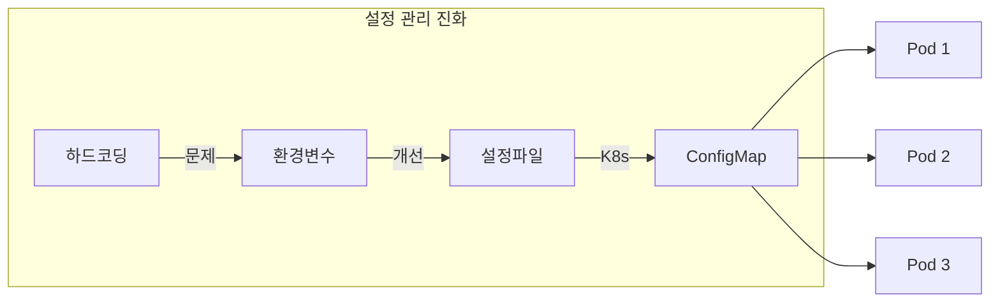

# 📝 ConfigMap 완벽 가이드

> 💡 **목표**: ConfigMap을 활용하여 애플리케이션 설정을 효과적으로 관리하는 방법을 마스터합니다.

## 📚 목차

1. [**ConfigMap이란?**](#configmap이란)
2. [**ConfigMap 생성 방법**](#configmap-생성-방법)
3. [**ConfigMap 사용 패턴**](#configmap-사용-패턴)
4. [**실전 활용 예제**](#실전-활용-예제)
5. [**Best Practices**](#best-practices)
6. [**트러블슈팅**](#트러블슈팅)

---

## 🎯 ConfigMap이란?

### ConfigMap의 역할

ConfigMap은 설정 데이터를 저장하고 Pod에 제공하는 Kubernetes 리소스입니다.



### ConfigMap vs Secret vs 하드코딩

| 방식 | 용도 | 장점 | 단점 |
|-----|------|------|------|
| **하드코딩** | 절대 사용 X | 없음 | 변경 시 재빌드 필요 |
| **환경변수** | 간단한 설정 | 단순함 | 많아지면 관리 어려움 |
| **ConfigMap** | 일반 설정 | 중앙 관리, 동적 업데이트 | 민감 정보 X |
| **Secret** | 민감 정보 | 암호화 저장 | 크기 제한 (1MB) |

---

## 🛠️ ConfigMap 생성 방법

### 1. 리터럴 값으로 생성

```bash
# 단일 값
kubectl create configmap app-config --from-literal=APP_NAME=myapp

# 여러 값
kubectl create configmap app-config \
  --from-literal=APP_NAME=myapp \
  --from-literal=APP_ENV=production \
  --from-literal=LOG_LEVEL=info
```

### 2. 파일에서 생성

```bash
# application.properties 파일
cat <<EOF > application.properties
database.host=localhost
database.port=5432
database.name=mydb
cache.size=100
feature.flag=true
EOF

# ConfigMap 생성
kubectl create configmap app-config --from-file=application.properties

# 여러 파일
kubectl create configmap app-config \
  --from-file=application.properties \
  --from-file=logging.properties
```

### 3. 디렉토리에서 생성

```bash
# config 디렉토리 구조
mkdir config
echo "server.port=8080" > config/server.conf
echo "db.url=jdbc:postgresql://localhost/mydb" > config/database.conf

# 디렉토리 전체를 ConfigMap으로
kubectl create configmap app-config --from-file=config/
```

### 4. YAML 파일로 생성

```yaml
# configmap.yaml
apiVersion: v1
kind: ConfigMap
metadata:
  name: app-config
  namespace: default
data:
  # 단순 key-value
  APP_NAME: "MyApplication"
  APP_VERSION: "1.0.0"
  LOG_LEVEL: "info"
  
  # 파일 형태의 데이터
  application.yaml: |
    server:
      port: 8080
      context-path: /api
    
    database:
      host: postgres
      port: 5432
      name: mydb
      pool:
        min: 5
        max: 20
    
    cache:
      type: redis
      ttl: 3600
      
  nginx.conf: |
    server {
      listen 80;
      server_name example.com;
      
      location / {
        proxy_pass http://backend:8080;
        proxy_set_header Host $host;
        proxy_set_header X-Real-IP $remote_addr;
      }
    }
```

```bash
kubectl apply -f configmap.yaml
```

### 5. Kustomize로 생성

```yaml
# kustomization.yaml
configMapGenerator:
- name: app-config
  literals:
  - APP_NAME=myapp
  - LOG_LEVEL=debug
  files:
  - application.properties
  - configs/database.yaml
```

---

## 📦 ConfigMap 사용 패턴

### 패턴 1: 환경 변수로 사용

```yaml
apiVersion: v1
kind: Pod
metadata:
  name: app-pod
spec:
  containers:
  - name: app
    image: myapp:1.0
    env:
    # 개별 key 참조
    - name: APP_NAME
      valueFrom:
        configMapKeyRef:
          name: app-config
          key: APP_NAME
    
    # 선택적 참조 (ConfigMap 없어도 실행)
    - name: LOG_LEVEL
      valueFrom:
        configMapKeyRef:
          name: app-config
          key: LOG_LEVEL
          optional: true
    
    # 전체 ConfigMap을 환경변수로
    envFrom:
    - configMapRef:
        name: app-config
      prefix: CONFIG_  # 모든 key에 prefix 추가
```

### 패턴 2: Volume으로 마운트

```yaml
apiVersion: v1
kind: Pod
metadata:
  name: app-pod
spec:
  containers:
  - name: app
    image: myapp:1.0
    volumeMounts:
    # 전체 ConfigMap 마운트
    - name: config-volume
      mountPath: /etc/config
    
    # 특정 key만 마운트
    - name: nginx-config
      mountPath: /etc/nginx/nginx.conf
      subPath: nginx.conf
      
  volumes:
  - name: config-volume
    configMap:
      name: app-config
      
  - name: nginx-config
    configMap:
      name: app-config
      items:
      - key: nginx.conf
        path: nginx.conf
        mode: 0644  # 파일 권한 설정
```

### 패턴 3: 초기화 컨테이너에서 사용

```yaml
apiVersion: v1
kind: Pod
metadata:
  name: app-pod
spec:
  initContainers:
  - name: config-processor
    image: busybox
    command: ['sh', '-c']
    args:
    - |
      # ConfigMap 데이터 처리
      cat /config/application.yaml | sed 's/localhost/production-db/g' > /processed/app.yaml
    volumeMounts:
    - name: config-volume
      mountPath: /config
    - name: processed-config
      mountPath: /processed
      
  containers:
  - name: app
    image: myapp:1.0
    volumeMounts:
    - name: processed-config
      mountPath: /app/config
      
  volumes:
  - name: config-volume
    configMap:
      name: app-config
  - name: processed-config
    emptyDir: {}
```

### 패턴 4: 동적 업데이트

```yaml
apiVersion: v1
kind: ConfigMap
metadata:
  name: feature-flags
data:
  features.json: |
    {
      "newUI": true,
      "betaFeature": false,
      "maintenanceMode": false
    }

---
apiVersion: apps/v1
kind: Deployment
metadata:
  name: app
spec:
  template:
    spec:
      containers:
      - name: app
        image: myapp:1.0
        volumeMounts:
        - name: feature-flags
          mountPath: /config/features
          readOnly: true
        # 파일 변경 감지 로직 필요
        command: ["/bin/sh"]
        args:
        - -c
        - |
          while true; do
            if [ -f /config/features/features.json ]; then
              cp /config/features/features.json /app/features.json
            fi
            sleep 10
          done &
          exec /app/main
      volumes:
      - name: feature-flags
        configMap:
          name: feature-flags
```

---

## 💼 실전 활용 예제

### 예제 1: 다중 환경 설정 관리

```yaml
# base/configmap.yaml
apiVersion: v1
kind: ConfigMap
metadata:
  name: app-config
data:
  APP_NAME: "MyApp"
  LOG_FORMAT: "json"
  
---
# environments/dev/configmap.yaml
apiVersion: v1
kind: ConfigMap
metadata:
  name: app-config
data:
  ENVIRONMENT: "development"
  DATABASE_HOST: "dev-db.example.com"
  LOG_LEVEL: "debug"
  FEATURE_FLAGS: |
    experimental: true
    debug_mode: true
    
---
# environments/staging/configmap.yaml
apiVersion: v1
kind: ConfigMap
metadata:
  name: app-config
data:
  ENVIRONMENT: "staging"
  DATABASE_HOST: "staging-db.example.com"
  LOG_LEVEL: "info"
  FEATURE_FLAGS: |
    experimental: true
    debug_mode: false
    
---
# environments/prod/configmap.yaml
apiVersion: v1
kind: ConfigMap
metadata:
  name: app-config
data:
  ENVIRONMENT: "production"
  DATABASE_HOST: "prod-db.example.com"
  LOG_LEVEL: "warning"
  FEATURE_FLAGS: |
    experimental: false
    debug_mode: false
```

배포:
```bash
# 환경별 배포
kubectl apply -f base/
kubectl apply -f environments/dev/   # 개발
# kubectl apply -f environments/staging/  # 스테이징
# kubectl apply -f environments/prod/     # 프로덕션
```

### 예제 2: Nginx 설정 관리

```yaml
apiVersion: v1
kind: ConfigMap
metadata:
  name: nginx-config
data:
  nginx.conf: |
    user nginx;
    worker_processes auto;
    
    events {
        worker_connections 1024;
    }
    
    http {
        include /etc/nginx/mime.types;
        default_type application/octet-stream;
        
        log_format main '$remote_addr - $remote_user [$time_local] "$request" '
                        '$status $body_bytes_sent "$http_referer" '
                        '"$http_user_agent" "$http_x_forwarded_for"';
        
        access_log /var/log/nginx/access.log main;
        
        sendfile on;
        keepalive_timeout 65;
        
        include /etc/nginx/conf.d/*.conf;
    }
    
  default.conf: |
    upstream backend {
        server backend-service:8080;
    }
    
    server {
        listen 80;
        server_name _;
        
        location / {
            proxy_pass http://backend;
            proxy_set_header Host $host;
            proxy_set_header X-Real-IP $remote_addr;
            proxy_set_header X-Forwarded-For $proxy_add_x_forwarded_for;
            proxy_set_header X-Forwarded-Proto $scheme;
        }
        
        location /health {
            access_log off;
            return 200 "healthy\n";
            add_header Content-Type text/plain;
        }
    }

---
apiVersion: apps/v1
kind: Deployment
metadata:
  name: nginx
spec:
  replicas: 3
  selector:
    matchLabels:
      app: nginx
  template:
    metadata:
      labels:
        app: nginx
    spec:
      containers:
      - name: nginx
        image: nginx:alpine
        ports:
        - containerPort: 80
        volumeMounts:
        - name: nginx-config
          mountPath: /etc/nginx/nginx.conf
          subPath: nginx.conf
        - name: nginx-config
          mountPath: /etc/nginx/conf.d/default.conf
          subPath: default.conf
      volumes:
      - name: nginx-config
        configMap:
          name: nginx-config
```

### 예제 3: 애플리케이션 설정 주입

```yaml
apiVersion: v1
kind: ConfigMap
metadata:
  name: spring-config
data:
  application.yml: |
    spring:
      application:
        name: user-service
      
      datasource:
        url: jdbc:postgresql://postgres:5432/userdb
        username: ${DB_USER}
        password: ${DB_PASSWORD}
        hikari:
          maximum-pool-size: 20
          minimum-idle: 5
      
      redis:
        host: redis
        port: 6379
        timeout: 2000
        lettuce:
          pool:
            max-active: 10
            max-idle: 5
      
      kafka:
        bootstrap-servers: kafka:9092
        consumer:
          group-id: user-service
          auto-offset-reset: latest
        producer:
          key-serializer: org.apache.kafka.common.serialization.StringSerializer
          value-serializer: org.springframework.kafka.support.serializer.JsonSerializer
    
    server:
      port: 8080
      servlet:
        context-path: /api
    
    management:
      endpoints:
        web:
          exposure:
            include: health,info,metrics,prometheus
      metrics:
        export:
          prometheus:
            enabled: true
    
    logging:
      level:
        root: INFO
        com.example: DEBUG
      pattern:
        console: "%d{yyyy-MM-dd HH:mm:ss} - %msg%n"

---
apiVersion: apps/v1
kind: Deployment
metadata:
  name: spring-app
spec:
  replicas: 2
  selector:
    matchLabels:
      app: spring-app
  template:
    metadata:
      labels:
        app: spring-app
    spec:
      containers:
      - name: app
        image: spring-app:1.0
        ports:
        - containerPort: 8080
        env:
        - name: SPRING_CONFIG_LOCATION
          value: /config/application.yml
        - name: DB_USER
          valueFrom:
            secretKeyRef:
              name: db-secret
              key: username
        - name: DB_PASSWORD
          valueFrom:
            secretKeyRef:
              name: db-secret
              key: password
        volumeMounts:
        - name: config
          mountPath: /config
        livenessProbe:
          httpGet:
            path: /api/actuator/health
            port: 8080
          initialDelaySeconds: 60
        readinessProbe:
          httpGet:
            path: /api/actuator/health/readiness
            port: 8080
          initialDelaySeconds: 30
      volumes:
      - name: config
        configMap:
          name: spring-config
```

### 예제 4: 스크립트 주입

```yaml
apiVersion: v1
kind: ConfigMap
metadata:
  name: scripts
data:
  startup.sh: |
    #!/bin/bash
    set -e
    
    echo "Starting application..."
    
    # 환경 확인
    if [ "$ENVIRONMENT" == "production" ]; then
        echo "Running in production mode"
        export JAVA_OPTS="-Xmx2g -Xms2g"
    else
        echo "Running in $ENVIRONMENT mode"
        export JAVA_OPTS="-Xmx512m -Xms256m"
    fi
    
    # 데이터베이스 마이그레이션
    echo "Running database migrations..."
    /app/migrate.sh
    
    # 애플리케이션 시작
    exec java $JAVA_OPTS -jar /app/application.jar
    
  health-check.sh: |
    #!/bin/bash
    
    # Health check 스크립트
    response=$(curl -s -o /dev/null -w "%{http_code}" http://localhost:8080/health)
    
    if [ $response -eq 200 ]; then
        echo "Application is healthy"
        exit 0
    else
        echo "Application is unhealthy (HTTP $response)"
        exit 1
    fi
    
  backup.sh: |
    #!/bin/bash
    
    # 백업 스크립트
    BACKUP_DIR="/backup"
    TIMESTAMP=$(date +%Y%m%d_%H%M%S)
    
    echo "Starting backup at $TIMESTAMP"
    
    # 데이터베이스 백업
    pg_dump -h $DB_HOST -U $DB_USER -d $DB_NAME > "$BACKUP_DIR/db_$TIMESTAMP.sql"
    
    # 파일 백업
    tar -czf "$BACKUP_DIR/files_$TIMESTAMP.tar.gz" /data
    
    # S3 업로드
    aws s3 cp "$BACKUP_DIR/" s3://my-backup-bucket/ --recursive
    
    echo "Backup completed"

---
apiVersion: batch/v1
kind: CronJob
metadata:
  name: backup-job
spec:
  schedule: "0 2 * * *"  # 매일 새벽 2시
  jobTemplate:
    spec:
      template:
        spec:
          containers:
          - name: backup
            image: postgres:13
            command: ["/scripts/backup.sh"]
            env:
            - name: DB_HOST
              value: postgres
            - name: DB_USER
              valueFrom:
                secretKeyRef:
                  name: db-secret
                  key: username
            volumeMounts:
            - name: scripts
              mountPath: /scripts
            - name: backup
              mountPath: /backup
          volumes:
          - name: scripts
            configMap:
              name: scripts
              defaultMode: 0755  # 실행 권한
          - name: backup
            persistentVolumeClaim:
              claimName: backup-pvc
          restartPolicy: OnFailure
```

---

## ✅ Best Practices

### 1. 불변성 유지

```yaml
# Immutable ConfigMap (1.21+)
apiVersion: v1
kind: ConfigMap
metadata:
  name: app-config-v1
immutable: true  # 생성 후 변경 불가
data:
  config: "value"
```

### 2. 버전 관리

```bash
# ConfigMap 버전 관리
kubectl create configmap app-config-v1 --from-file=config/
kubectl create configmap app-config-v2 --from-file=config/

# Deployment에서 참조
spec:
  containers:
  - name: app
    envFrom:
    - configMapRef:
        name: app-config-v2  # 버전 명시
```

### 3. 크기 제한 고려

```yaml
# ConfigMap 크기 제한: 1MB
# 큰 파일은 PersistentVolume 사용

# 압축 활용
apiVersion: v1
kind: ConfigMap
metadata:
  name: large-config
data:
  # base64로 인코딩된 압축 파일
  config.gz: |
    H4sIAAAAAAAAA+3BAQ0AAADCoPdPbQ43oAAAAAAAAAAAAAAAAAAAAIC3AYbSO08ACAAA
```

### 4. 설정 검증

```yaml
# Init container로 설정 검증
initContainers:
- name: config-validator
  image: myapp:1.0
  command: ['sh', '-c']
  args:
  - |
    # 설정 파일 검증
    /app/validate-config /config/application.yaml || exit 1
  volumeMounts:
  - name: config
    mountPath: /config
```

### 5. 민감 정보 분리

```yaml
# ConfigMap: 일반 설정
apiVersion: v1
kind: ConfigMap
metadata:
  name: app-config
data:
  database_host: "postgres"
  database_port: "5432"

---
# Secret: 민감 정보
apiVersion: v1
kind: Secret
metadata:
  name: app-secret
type: Opaque
data:
  database_password: cGFzc3dvcmQxMjM=  # base64
```

---

## 🔧 트러블슈팅

### ConfigMap이 업데이트되지 않음

```bash
# ConfigMap 업데이트
kubectl edit configmap app-config

# Pod 재시작 (ConfigMap 변경 자동 반영 안됨)
kubectl rollout restart deployment/app

# 또는 annotation으로 강제 재시작
kubectl patch deployment app -p \
  '{"spec":{"template":{"metadata":{"annotations":{"date":"'$(date)'"}}}}}'
```

### Volume 마운트 시 기존 파일 사라짐

```yaml
# 문제: /etc/nginx 전체를 덮어씀
volumeMounts:
- name: config
  mountPath: /etc/nginx

# 해결: subPath 사용
volumeMounts:
- name: config
  mountPath: /etc/nginx/nginx.conf
  subPath: nginx.conf
```

### ConfigMap 키 이름 제약

```bash
# 유효한 키 이름: 알파벳, 숫자, -, _, .
# 유효하지 않은 예: my/config, config@file

# 파일 이름이 유효하지 않을 때
kubectl create configmap app-config \
  --from-file=valid-name=/path/to/invalid@name.conf
```

### 동적 업데이트 구현

```go
// ConfigMap 변경 감지 (Go 예시)
package main

import (
    "io/ioutil"
    "time"
    "crypto/md5"
)

func watchConfig(path string, callback func()) {
    var lastHash [16]byte
    
    for {
        data, _ := ioutil.ReadFile(path)
        currentHash := md5.Sum(data)
        
        if currentHash != lastHash {
            lastHash = currentHash
            callback()
        }
        
        time.Sleep(10 * time.Second)
    }
}
```

---

## 💡 고급 팁

### 1. Helm과 함께 사용

```yaml
# values.yaml
config:
  app_name: "{{ .Values.appName }}"
  environment: "{{ .Values.environment }}"
  features:
    newUI: {{ .Values.features.newUI }}
    beta: {{ .Values.features.beta }}

# templates/configmap.yaml
apiVersion: v1
kind: ConfigMap
metadata:
  name: {{ .Release.Name }}-config
data:
  {{- range $key, $value := .Values.config }}
  {{ $key }}: {{ $value | quote }}
  {{- end }}
```

### 2. Kustomize로 환경별 관리

```yaml
# base/kustomization.yaml
resources:
- deployment.yaml

configMapGenerator:
- name: app-config
  files:
  - application.properties

# overlays/prod/kustomization.yaml
bases:
- ../../base

configMapGenerator:
- name: app-config
  behavior: merge
  literals:
  - ENVIRONMENT=production
  - LOG_LEVEL=warning
```

### 3. External ConfigMap (External Secrets Operator)

```yaml
apiVersion: external-secrets.io/v1beta1
kind: ExternalSecret
metadata:
  name: app-config
spec:
  secretStoreRef:
    name: aws-parameter-store
  target:
    name: app-config
    creationPolicy: Owner
  data:
  - secretKey: database_url
    remoteRef:
      key: /myapp/prod/database_url
```

---

> 🚀 **다음 문서**: [secrets.md](secrets.md)에서 민감 정보를 안전하게 관리하는 방법을 알아보세요!