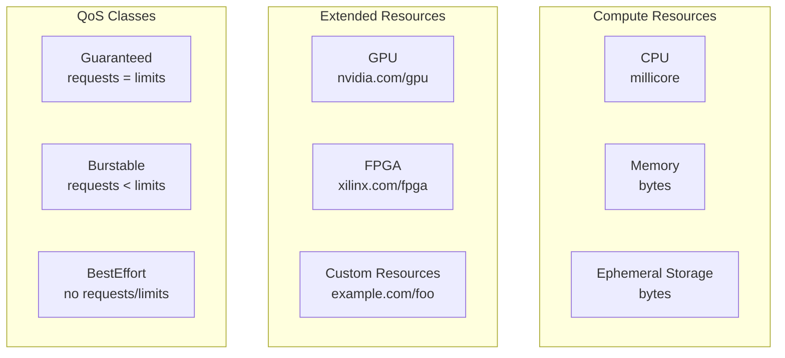
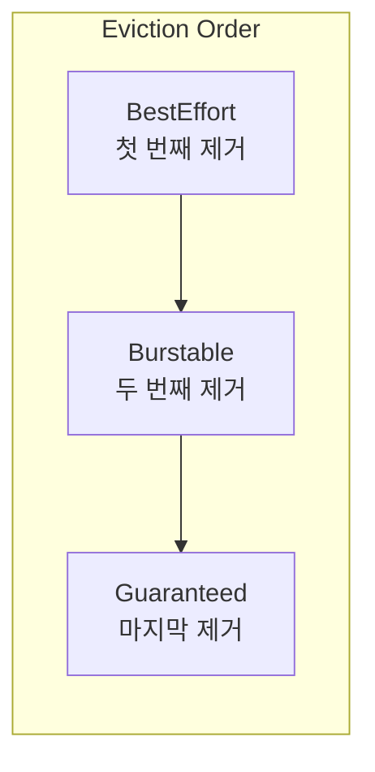

# 📊 Resource Management & Limits 완벽 가이드

> 💡 **목표**: Kubernetes에서 리소스를 효율적으로 관리하고, 애플리케이션의 안정성과 성능을 보장하는 방법을 마스터합니다.

## 📚 목차

1. [**리소스 관리 개념**](#리소스-관리-개념)
2. [**Requests와 Limits**](#requests와-limits)
3. [**QoS Classes**](#qos-classes)
4. [**LimitRange**](#limitrange)
5. [**ResourceQuota**](#resourcequota)
6. [**Pod Disruption Budget**](#pod-disruption-budget)
7. [**Horizontal & Vertical Pod Autoscaling**](#horizontal--vertical-pod-autoscaling)
8. [**Best Practices**](#best-practices)

---

## 🎯 리소스 관리 개념

### Kubernetes 리소스 타입



### 리소스 단위

```yaml
# CPU 단위
# 1 = 1000m = 1 vCPU/Core
# 0.5 = 500m = 절반 CPU
# 0.1 = 100m = 1/10 CPU

# Memory 단위
# E, P, T, G, M, K (1000 단위)
# Ei, Pi, Ti, Gi, Mi, Ki (1024 단위)
# 128974848 = 129M = 123Mi

# 예제
resources:
  requests:
    cpu: "100m"      # 0.1 CPU
    memory: "128Mi"  # 128 메가바이트
    ephemeral-storage: "1Gi"
  limits:
    cpu: "500m"      # 0.5 CPU
    memory: "256Mi"  # 256 메가바이트
    ephemeral-storage: "2Gi"
```

---

## 📦 Requests와 Limits

### 기본 설정

```yaml
apiVersion: v1
kind: Pod
metadata:
  name: resource-demo
spec:
  containers:
  - name: app
    image: nginx
    resources:
      requests:
        memory: "64Mi"
        cpu: "250m"
        ephemeral-storage: "100Mi"
      limits:
        memory: "128Mi"
        cpu: "500m"
        ephemeral-storage: "200Mi"
```

### Requests vs Limits

| 구분 | Requests | Limits |
|------|----------|--------|
| **목적** | 스케줄링 보장 | 최대 사용량 제한 |
| **CPU** | 최소 보장 | Throttling |
| **Memory** | 최소 보장 | OOMKilled |
| **Storage** | 최소 보장 | Eviction |
| **오버커밋** | 가능 | 불가능 |

### 다양한 리소스 타입

```yaml
apiVersion: v1
kind: Pod
metadata:
  name: gpu-pod
spec:
  containers:
  - name: cuda-container
    image: nvidia/cuda:11.0-base
    resources:
      requests:
        memory: "4Gi"
        cpu: "2"
        nvidia.com/gpu: 1  # GPU 요청
      limits:
        memory: "8Gi"
        cpu: "4"
        nvidia.com/gpu: 1  # GPU 제한
    
    # GPU 환경 변수
    env:
    - name: NVIDIA_VISIBLE_DEVICES
      value: "all"
    - name: NVIDIA_DRIVER_CAPABILITIES
      value: "compute,utility"

---
# Hugepages 사용
apiVersion: v1
kind: Pod
metadata:
  name: hugepage-pod
spec:
  containers:
  - name: app
    image: myapp
    resources:
      requests:
        memory: "1Gi"
        hugepages-2Mi: "100Mi"  # 2Mi hugepages
      limits:
        memory: "1Gi"
        hugepages-2Mi: "100Mi"
    volumeMounts:
    - name: hugepage
      mountPath: /hugepages
  
  volumes:
  - name: hugepage
    emptyDir:
      medium: HugePages
```

---

## 🎖️ QoS Classes

### QoS Class 결정 로직

```yaml
# 1. Guaranteed Class
# - 모든 컨테이너가 requests와 limits 설정
# - requests == limits
apiVersion: v1
kind: Pod
metadata:
  name: guaranteed-pod
spec:
  containers:
  - name: app
    image: nginx
    resources:
      requests:
        memory: "200Mi"
        cpu: "100m"
      limits:
        memory: "200Mi"  # requests와 동일
        cpu: "100m"      # requests와 동일

---
# 2. Burstable Class
# - 최소 하나의 requests 설정
# - requests != limits
apiVersion: v1
kind: Pod
metadata:
  name: burstable-pod
spec:
  containers:
  - name: app
    image: nginx
    resources:
      requests:
        memory: "100Mi"
        cpu: "50m"
      limits:
        memory: "200Mi"  # requests보다 큼
        cpu: "100m"      # requests보다 큼

---
# 3. BestEffort Class
# - requests/limits 없음
apiVersion: v1
kind: Pod
metadata:
  name: besteffort-pod
spec:
  containers:
  - name: app
    image: nginx
    # resources 섹션 없음
```

### QoS와 Eviction 우선순위



---

## 📏 LimitRange

### Namespace 레벨 제한

```yaml
apiVersion: v1
kind: LimitRange
metadata:
  name: limit-range
  namespace: development
spec:
  limits:
  # Container 제한
  - type: Container
    default:  # 기본값
      cpu: "500m"
      memory: "256Mi"
    defaultRequest:  # 기본 requests
      cpu: "100m"
      memory: "128Mi"
    min:  # 최소값
      cpu: "50m"
      memory: "64Mi"
    max:  # 최대값
      cpu: "2"
      memory: "1Gi"
    maxLimitRequestRatio:  # limits/requests 비율
      cpu: "10"
      memory: "4"
  
  # Pod 제한
  - type: Pod
    min:
      cpu: "50m"
      memory: "64Mi"
    max:
      cpu: "4"
      memory: "2Gi"
  
  # PVC 제한
  - type: PersistentVolumeClaim
    min:
      storage: "1Gi"
    max:
      storage: "100Gi"
```

### 다양한 LimitRange 예제

```yaml
# 개발 환경용 LimitRange
apiVersion: v1
kind: LimitRange
metadata:
  name: dev-limits
  namespace: dev
spec:
  limits:
  - type: Container
    default:
      cpu: "200m"
      memory: "256Mi"
    defaultRequest:
      cpu: "100m"
      memory: "128Mi"

---
# 프로덕션 환경용 LimitRange
apiVersion: v1
kind: LimitRange
metadata:
  name: prod-limits
  namespace: production
spec:
  limits:
  - type: Container
    min:
      cpu: "100m"
      memory: "128Mi"
    max:
      cpu: "4"
      memory: "8Gi"
    defaultRequest:
      cpu: "500m"
      memory: "512Mi"
    default:
      cpu: "1"
      memory: "1Gi"

---
# Storage LimitRange
apiVersion: v1
kind: LimitRange
metadata:
  name: storage-limits
  namespace: default
spec:
  limits:
  - type: PersistentVolumeClaim
    min:
      storage: "5Gi"
    max:
      storage: "500Gi"
```

---

## 🎯 ResourceQuota

### Namespace 총량 제한

```yaml
apiVersion: v1
kind: ResourceQuota
metadata:
  name: compute-quota
  namespace: development
spec:
  hard:
    # Compute Resources
    requests.cpu: "10"
    requests.memory: "10Gi"
    limits.cpu: "20"
    limits.memory: "20Gi"
    
    # Storage Resources
    requests.storage: "100Gi"
    persistentvolumeclaims: "10"
    
    # Object Count
    pods: "50"
    services: "10"
    services.loadbalancers: "2"
    services.nodeports: "5"
    configmaps: "20"
    secrets: "20"
    
    # Extended Resources
    requests.nvidia.com/gpu: "4"
```

### Scope 기반 ResourceQuota

```yaml
apiVersion: v1
kind: ResourceQuota
metadata:
  name: quota-by-priority
  namespace: production
spec:
  hard:
    pods: "10"
    requests.cpu: "1000"
    requests.memory: "10Gi"
  scopeSelector:
    matchExpressions:
    - operator: In
      scopeName: PriorityClass
      values: ["high", "medium"]

---
# BestEffort Pods 제한
apiVersion: v1
kind: ResourceQuota
metadata:
  name: besteffort-quota
  namespace: default
spec:
  hard:
    pods: "5"
  scopes:
  - BestEffort

---
# Terminating/NotTerminating 구분
apiVersion: v1
kind: ResourceQuota
metadata:
  name: terminating-quota
  namespace: batch
spec:
  hard:
    pods: "20"
    requests.cpu: "10"
    requests.memory: "20Gi"
  scopes:
  - Terminating  # Job, CronJob Pods

---
apiVersion: v1
kind: ResourceQuota
metadata:
  name: non-terminating-quota
  namespace: apps
spec:
  hard:
    pods: "50"
    requests.cpu: "20"
    requests.memory: "40Gi"
  scopes:
  - NotTerminating  # Deployment, StatefulSet Pods
```

### StorageClass별 Quota

```yaml
apiVersion: v1
kind: ResourceQuota
metadata:
  name: storage-class-quota
  namespace: default
spec:
  hard:
    # StorageClass별 제한
    fast-ssd.storageclass.storage.k8s.io/requests.storage: "500Gi"
    fast-ssd.storageclass.storage.k8s.io/persistentvolumeclaims: "10"
    
    standard.storageclass.storage.k8s.io/requests.storage: "1Ti"
    standard.storageclass.storage.k8s.io/persistentvolumeclaims: "50"
```

---

## 🛡️ Pod Disruption Budget

### PDB 설정

```yaml
apiVersion: policy/v1
kind: PodDisruptionBudget
metadata:
  name: app-pdb
spec:
  minAvailable: 2  # 최소 유지 Pod 수
  # 또는
  # maxUnavailable: 1  # 최대 중단 가능 Pod 수
  
  selector:
    matchLabels:
      app: myapp
  
  # Unhealthy Pod 제거 정책 (1.26+)
  unhealthyPodEvictionPolicy: IfHealthyBudget  # 기본값

---
# 백분율 기반 PDB
apiVersion: policy/v1
kind: PodDisruptionBudget
metadata:
  name: percentage-pdb
spec:
  maxUnavailable: "30%"  # 30% 까지 중단 가능
  selector:
    matchLabels:
      app: web
```

### PDB 사용 사례

```yaml
# 데이터베이스 클러스터용 PDB
apiVersion: policy/v1
kind: PodDisruptionBudget
metadata:
  name: mysql-pdb
spec:
  minAvailable: 2  # 쿼럼 유지
  selector:
    matchLabels:
      app: mysql

---
# 웹 서버용 PDB
apiVersion: policy/v1
kind: PodDisruptionBudget
metadata:
  name: web-pdb
spec:
  maxUnavailable: "25%"  # 점진적 업데이트
  selector:
    matchLabels:
      app: web-server

---
# Critical 서비스용 PDB
apiVersion: policy/v1
kind: PodDisruptionBudget
metadata:
  name: critical-pdb
spec:
  minAvailable: 3
  selector:
    matchLabels:
      tier: critical
```

---

## 📈 Horizontal & Vertical Pod Autoscaling

### HPA (Horizontal Pod Autoscaler)

```yaml
# CPU 기반 HPA
apiVersion: autoscaling/v2
kind: HorizontalPodAutoscaler
metadata:
  name: app-hpa
spec:
  scaleTargetRef:
    apiVersion: apps/v1
    kind: Deployment
    name: app-deployment
  
  minReplicas: 2
  maxReplicas: 10
  
  metrics:
  # CPU 사용률
  - type: Resource
    resource:
      name: cpu
      target:
        type: Utilization
        averageUtilization: 50
  
  # Memory 사용률
  - type: Resource
    resource:
      name: memory
      target:
        type: Utilization
        averageUtilization: 70
  
  # Custom Metrics
  - type: Pods
    pods:
      metric:
        name: http_requests_per_second
      target:
        type: AverageValue
        averageValue: "1000"
  
  # External Metrics
  - type: External
    external:
      metric:
        name: queue_messages
        selector:
          matchLabels:
            queue: "worker-queue"
      target:
        type: Value
        value: "30"
  
  # 스케일링 동작 제어
  behavior:
    scaleUp:
      stabilizationWindowSeconds: 60
      selectPolicy: Max
      policies:
      - type: Percent
        value: 100  # 100% 증가
        periodSeconds: 60
      - type: Pods
        value: 4    # 또는 4개 Pod 증가
        periodSeconds: 60
    
    scaleDown:
      stabilizationWindowSeconds: 300
      selectPolicy: Min
      policies:
      - type: Percent
        value: 50   # 50% 감소
        periodSeconds: 60
      - type: Pods
        value: 2    # 또는 2개 Pod 감소
        periodSeconds: 60
```

### VPA (Vertical Pod Autoscaler)

```yaml
apiVersion: autoscaling.k8s.io/v1
kind: VerticalPodAutoscaler
metadata:
  name: app-vpa
spec:
  targetRef:
    apiVersion: apps/v1
    kind: Deployment
    name: app-deployment
  
  updatePolicy:
    updateMode: "Auto"  # Off, Initial, Auto
  
  resourcePolicy:
    containerPolicies:
    - containerName: app
      minAllowed:
        cpu: 100m
        memory: 128Mi
      maxAllowed:
        cpu: 2
        memory: 2Gi
      controlledResources: ["cpu", "memory"]
      
      # 권장사항 모드
      mode: Auto  # Off, Auto
```

### HPA + VPA 조합

```yaml
# HPA와 VPA를 함께 사용할 때 주의사항
# - VPA는 CPU/Memory를 업데이트하지 않도록 설정
# - HPA는 replica 수만 조정

apiVersion: autoscaling.k8s.io/v1
kind: VerticalPodAutoscaler
metadata:
  name: combo-vpa
spec:
  targetRef:
    apiVersion: apps/v1
    kind: Deployment
    name: app-deployment
  
  updatePolicy:
    updateMode: "Off"  # 권장사항만 제공
  
  resourcePolicy:
    containerPolicies:
    - containerName: app
      controlledResources: ["memory"]  # CPU 제외

---
apiVersion: autoscaling/v2
kind: HorizontalPodAutoscaler
metadata:
  name: combo-hpa
spec:
  scaleTargetRef:
    apiVersion: apps/v1
    kind: Deployment
    name: app-deployment
  
  minReplicas: 2
  maxReplicas: 10
  
  metrics:
  - type: Resource
    resource:
      name: cpu
      target:
        type: Utilization
        averageUtilization: 70
```

---

## ✅ Best Practices

### 1. 리소스 설정 가이드라인

```yaml
# 개발/테스트 환경
apiVersion: v1
kind: Pod
metadata:
  name: dev-pod
spec:
  containers:
  - name: app
    resources:
      requests:
        memory: "128Mi"
        cpu: "100m"
      limits:
        memory: "256Mi"
        cpu: "500m"

---
# 프로덕션 환경
apiVersion: v1
kind: Pod
metadata:
  name: prod-pod
spec:
  containers:
  - name: app
    resources:
      requests:
        memory: "512Mi"  # 실제 사용량 기반
        cpu: "500m"      # 실제 사용량 기반
      limits:
        memory: "1Gi"    # requests의 2배
        cpu: "1000m"     # requests의 2배
```

### 2. JVM 애플리케이션 설정

```yaml
apiVersion: v1
kind: Pod
metadata:
  name: java-app
spec:
  containers:
  - name: app
    image: openjdk:11
    resources:
      requests:
        memory: "1Gi"
        cpu: "500m"
      limits:
        memory: "2Gi"
        cpu: "1000m"
    env:
    # JVM 메모리 설정
    - name: JAVA_OPTS
      value: "-Xmx1536m -Xms1024m -XX:MaxRAMPercentage=75.0"
    
    # 컨테이너 인식
    - name: JAVA_TOOL_OPTIONS
      value: "-XX:+UseContainerSupport"
```

### 3. 모니터링 설정

```yaml
# Prometheus 메트릭 수집
apiVersion: v1
kind: Service
metadata:
  name: app-metrics
  annotations:
    prometheus.io/scrape: "true"
    prometheus.io/port: "9090"
    prometheus.io/path: "/metrics"
spec:
  selector:
    app: myapp
  ports:
  - name: metrics
    port: 9090
```

### 4. Namespace 전략

```yaml
# 팀별 Namespace와 Quota
apiVersion: v1
kind: Namespace
metadata:
  name: team-a
  labels:
    team: a
    environment: dev

---
apiVersion: v1
kind: ResourceQuota
metadata:
  name: team-a-quota
  namespace: team-a
spec:
  hard:
    requests.cpu: "10"
    requests.memory: "20Gi"
    limits.cpu: "20"
    limits.memory: "40Gi"
    persistentvolumeclaims: "10"
    pods: "50"

---
apiVersion: v1
kind: LimitRange
metadata:
  name: team-a-limits
  namespace: team-a
spec:
  limits:
  - type: Container
    defaultRequest:
      cpu: "100m"
      memory: "128Mi"
    default:
      cpu: "200m"
      memory: "256Mi"
```

---

## 🔧 트러블슈팅

### Pod가 Pending 상태

```bash
# 리소스 부족 확인
kubectl describe pod <pod-name>
kubectl describe nodes
kubectl top nodes

# ResourceQuota 확인
kubectl describe resourcequota -n <namespace>

# LimitRange 확인
kubectl describe limitrange -n <namespace>
```

### OOMKilled

```bash
# 메모리 사용량 확인
kubectl top pod <pod-name>

# 이벤트 확인
kubectl get events --field-selector involvedObject.name=<pod-name>

# 메모리 limit 증가
kubectl set resources deployment <deployment-name> \
  -c=<container-name> \
  --limits=memory=1Gi
```

### CPU Throttling

```bash
# CPU 사용량 확인
kubectl exec <pod-name> -- cat /sys/fs/cgroup/cpu/cpu.stat | grep throttled

# CPU limit 조정
kubectl patch deployment <deployment-name> -p \
  '{"spec":{"template":{"spec":{"containers":[{"name":"app","resources":{"limits":{"cpu":"2"}}}]}}}}'
```

---

## 💡 고급 팁

### 1. 리소스 사용량 예측

```bash
# VPA 권장사항 확인
kubectl describe vpa <vpa-name>

# 실제 사용량 기반 설정
kubectl top pod <pod-name> --containers
```

### 2. 동적 리소스 조정

```yaml
# Init Container로 리소스 계산
spec:
  initContainers:
  - name: resource-calculator
    image: busybox
    command: ['sh', '-c']
    args:
    - |
      # 시스템 리소스 확인
      TOTAL_MEMORY=$(cat /proc/meminfo | grep MemTotal | awk '{print $2}')
      APP_MEMORY=$((TOTAL_MEMORY * 75 / 100 / 1024))
      echo "APP_MEMORY=${APP_MEMORY}Mi" > /config/resources
    volumeMounts:
    - name: config
      mountPath: /config
```

### 3. 비용 최적화

```yaml
# Spot Instance용 Node Selector
spec:
  nodeSelector:
    node.kubernetes.io/lifecycle: spot
  
  tolerations:
  - key: "spot"
    operator: "Equal"
    value: "true"
    effect: "NoSchedule"
```

---

> 🚀 효과적인 리소스 관리는 Kubernetes 클러스터의 안정성과 효율성의 핵심입니다!