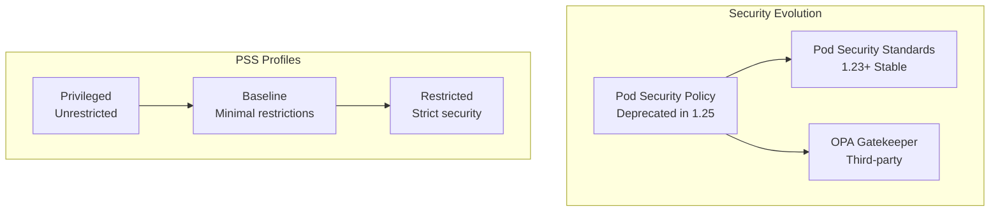

# 🛡️ Pod Security Standards 완벽 가이드

> 💡 **목표**: Kubernetes Pod Security Standards(PSS)와 Pod Security Admission(PSA)을 활용하여 클러스터 보안을 강화하는 방법을 마스터합니다.

## 📚 목차

1. [**Pod Security Standards 개념**](#pod-security-standards-개념)
2. [**Security Profiles**](#security-profiles)
3. [**Pod Security Admission**](#pod-security-admission)
4. [**Migration from PSP**](#migration-from-psp)
5. [**실전 구현**](#실전-구현)
6. [**모니터링과 감사**](#모니터링과-감사)
7. [**Best Practices**](#best-practices)

---

## 🎯 Pod Security Standards 개념

### PSS vs PSP vs OPA Gatekeeper



### PSS 모드

| 모드 | 설명 | 동작 |
|------|------|------|
| **enforce** | 위반 시 Pod 생성 거부 | 실제 차단 |
| **audit** | 위반 사항을 감사 로그에 기록 | 로깅만 |
| **warn** | 위반 시 경고 메시지 출력 | 경고만 |

---

## 📋 Security Profiles

### Privileged Profile

```yaml
# Privileged - 제한 없음
apiVersion: v1
kind: Namespace
metadata:
  name: privileged-namespace
  labels:
    pod-security.kubernetes.io/enforce: privileged
    pod-security.kubernetes.io/enforce-version: latest

---
# 모든 설정 허용
apiVersion: v1
kind: Pod
metadata:
  name: privileged-pod
  namespace: privileged-namespace
spec:
  hostNetwork: true
  hostPID: true
  hostIPC: true
  
  containers:
  - name: app
    image: nginx
    securityContext:
      privileged: true
      runAsUser: 0
    volumeMounts:
    - name: host
      mountPath: /host
  
  volumes:
  - name: host
    hostPath:
      path: /
```

### Baseline Profile

```yaml
# Baseline - 기본 제한사항
apiVersion: v1
kind: Namespace
metadata:
  name: baseline-namespace
  labels:
    pod-security.kubernetes.io/enforce: baseline
    pod-security.kubernetes.io/enforce-version: latest

---
# Baseline 정책 준수 Pod
apiVersion: v1
kind: Pod
metadata:
  name: baseline-pod
  namespace: baseline-namespace
spec:
  # hostNetwork: false (기본값)
  # hostPID: false (기본값)
  # hostIPC: false (기본값)
  
  containers:
  - name: app
    image: nginx
    securityContext:
      # privileged: false (기본값)
      # allowPrivilegeEscalation는 허용
      capabilities:
        # 일부 위험한 capabilities 금지
        drop: ["NET_RAW"]
    ports:
    - containerPort: 80
    
    volumeMounts:
    - name: config
      mountPath: /etc/config
  
  volumes:
  - name: config
    configMap:
      name: app-config
```

### Restricted Profile

```yaml
# Restricted - 엄격한 보안
apiVersion: v1
kind: Namespace
metadata:
  name: restricted-namespace
  labels:
    pod-security.kubernetes.io/enforce: restricted
    pod-security.kubernetes.io/enforce-version: latest

---
# Restricted 정책 준수 Pod
apiVersion: v1
kind: Pod
metadata:
  name: restricted-pod
  namespace: restricted-namespace
spec:
  securityContext:
    # 필수: non-root 사용자
    runAsNonRoot: true
    runAsUser: 1000
    fsGroup: 2000
    # 필수: seccomp profile
    seccompProfile:
      type: RuntimeDefault
  
  containers:
  - name: app
    image: nginx:alpine
    securityContext:
      # 필수 설정들
      allowPrivilegeEscalation: false
      readOnlyRootFilesystem: true
      runAsNonRoot: true
      runAsUser: 1000
      capabilities:
        # 필수: 모든 capabilities 제거
        drop: ["ALL"]
    
    # 포트 80은 privileged이므로 8080 사용
    ports:
    - containerPort: 8080
    
    volumeMounts:
    - name: tmp
      mountPath: /tmp
    - name: var-run
      mountPath: /var/run
    - name: var-cache-nginx
      mountPath: /var/cache/nginx
  
  volumes:
  # hostPath 사용 불가, emptyDir만 허용
  - name: tmp
    emptyDir: {}
  - name: var-run
    emptyDir: {}
  - name: var-cache-nginx
    emptyDir: {}
```

---

## 🚪 Pod Security Admission

### Namespace 레벨 설정

```yaml
# 모든 모드 적용
apiVersion: v1
kind: Namespace
metadata:
  name: multi-mode-namespace
  labels:
    # Enforce: restricted 정책 적용
    pod-security.kubernetes.io/enforce: restricted
    pod-security.kubernetes.io/enforce-version: v1.26
    
    # Audit: baseline 위반사항 로깅
    pod-security.kubernetes.io/audit: baseline
    pod-security.kubernetes.io/audit-version: v1.26
    
    # Warn: privileged 위반 시 경고
    pod-security.kubernetes.io/warn: privileged
    pod-security.kubernetes.io/warn-version: v1.26

---
# 단계적 마이그레이션 예제
apiVersion: v1
kind: Namespace
metadata:
  name: migration-namespace
  labels:
    # 현재는 경고만, 나중에 enforce로 변경 예정
    pod-security.kubernetes.io/warn: restricted
    pod-security.kubernetes.io/warn-version: v1.28
    
    # 현재 상황 파악을 위한 audit
    pod-security.kubernetes.io/audit: baseline
    pod-security.kubernetes.io/audit-version: v1.26
```

### 클러스터 레벨 기본 설정

```yaml
# AdmissionConfiguration
apiVersion: apiserver.config.k8s.io/v1
kind: AdmissionConfiguration
plugins:
- name: PodSecurity
  configuration:
    apiVersion: pod-security.admission.config.k8s.io/v1beta1
    kind: PodSecurityConfiguration
    
    # 클러스터 기본값
    defaults:
      enforce: baseline
      enforce-version: latest
      audit: restricted
      audit-version: latest
      warn: restricted
      warn-version: latest
    
    # 시스템 네임스페이스 예외
    exemptions:
      usernames: []
      runtimeClasses: []
      namespaces:
      - kube-system
      - kube-public
      - kube-node-lease
      - local-path-storage
```

### 동적 설정 변경

```bash
# Namespace 레이블 수정
kubectl label namespace my-app \
  pod-security.kubernetes.io/enforce=restricted

# 버전 지정
kubectl label namespace my-app \
  pod-security.kubernetes.io/enforce-version=v1.26

# 여러 모드 동시 설정
kubectl label namespace my-app \
  pod-security.kubernetes.io/enforce=baseline \
  pod-security.kubernetes.io/audit=restricted \
  pod-security.kubernetes.io/warn=restricted

# 설정 확인
kubectl describe namespace my-app
```

---

## 🔄 Migration from PSP

### PSP to PSS 매핑

```yaml
# 기존 PodSecurityPolicy
apiVersion: policy/v1beta1
kind: PodSecurityPolicy
metadata:
  name: restricted-psp
spec:
  privileged: false
  runAsUser:
    rule: MustRunAsNonRoot
  runAsGroup:
    rule: MustRunAs
    ranges:
    - min: 1
      max: 65535
  fsGroup:
    rule: RunAsAny
  allowPrivilegeEscalation: false
  requiredDropCapabilities:
  - ALL
  volumes:
  - configMap
  - emptyDir
  - projected
  - secret
  - downwardAPI
  - persistentVolumeClaim

---
# 해당하는 PSS Restricted 설정
apiVersion: v1
kind: Namespace
metadata:
  name: psp-migration
  labels:
    pod-security.kubernetes.io/enforce: restricted
    pod-security.kubernetes.io/enforce-version: latest
```

### 마이그레이션 단계

```yaml
# Phase 1: Audit 모드로 현황 파악
apiVersion: v1
kind: Namespace
metadata:
  name: migration-phase1
  labels:
    pod-security.kubernetes.io/audit: baseline
    pod-security.kubernetes.io/warn: baseline

---
# Phase 2: Baseline 적용
apiVersion: v1
kind: Namespace
metadata:
  name: migration-phase2
  labels:
    pod-security.kubernetes.io/enforce: baseline
    pod-security.kubernetes.io/audit: restricted
    pod-security.kubernetes.io/warn: restricted

---
# Phase 3: Restricted 적용
apiVersion: v1
kind: Namespace
metadata:
  name: migration-phase3
  labels:
    pod-security.kubernetes.io/enforce: restricted
    pod-security.kubernetes.io/enforce-version: latest
```

---

## 🏗️ 실전 구현

### 개발 환경 설정

```yaml
# 개발 환경: 유연한 정책
apiVersion: v1
kind: Namespace
metadata:
  name: development
  labels:
    environment: dev
    # 경고만, 차단하지 않음
    pod-security.kubernetes.io/warn: baseline
    pod-security.kubernetes.io/audit: restricted

---
apiVersion: apps/v1
kind: Deployment
metadata:
  name: dev-app
  namespace: development
spec:
  replicas: 1
  selector:
    matchLabels:
      app: dev-app
  template:
    metadata:
      labels:
        app: dev-app
    spec:
      containers:
      - name: app
        image: nginx
        # 개발 중이므로 root로 실행 가능
        # 하지만 경고는 받게 됨
```

### 스테이징 환경 설정

```yaml
# 스테이징: Baseline 적용
apiVersion: v1
kind: Namespace
metadata:
  name: staging
  labels:
    environment: staging
    pod-security.kubernetes.io/enforce: baseline
    pod-security.kubernetes.io/audit: restricted
    pod-security.kubernetes.io/warn: restricted

---
apiVersion: apps/v1
kind: Deployment
metadata:
  name: staging-app
  namespace: staging
spec:
  replicas: 2
  selector:
    matchLabels:
      app: staging-app
  template:
    metadata:
      labels:
        app: staging-app
    spec:
      securityContext:
        fsGroup: 2000
      containers:
      - name: app
        image: nginx:alpine
        securityContext:
          runAsUser: 101  # nginx user
          runAsNonRoot: true
          allowPrivilegeEscalation: false
```

### 프로덕션 환경 설정

```yaml
# 프로덕션: Restricted 적용
apiVersion: v1
kind: Namespace
metadata:
  name: production
  labels:
    environment: prod
    pod-security.kubernetes.io/enforce: restricted
    pod-security.kubernetes.io/enforce-version: v1.26

---
apiVersion: apps/v1
kind: Deployment
metadata:
  name: prod-app
  namespace: production
spec:
  replicas: 3
  selector:
    matchLabels:
      app: prod-app
  template:
    metadata:
      labels:
        app: prod-app
    spec:
      securityContext:
        runAsNonRoot: true
        runAsUser: 1000
        fsGroup: 2000
        seccompProfile:
          type: RuntimeDefault
      
      containers:
      - name: app
        image: nginx:alpine
        securityContext:
          allowPrivilegeEscalation: false
          readOnlyRootFilesystem: true
          runAsNonRoot: true
          runAsUser: 1000
          capabilities:
            drop: ["ALL"]
        
        ports:
        - containerPort: 8080  # non-privileged port
        
        volumeMounts:
        - name: tmp
          mountPath: /tmp
        - name: var-run
          mountPath: /var/run
        - name: nginx-cache
          mountPath: /var/cache/nginx
      
      volumes:
      - name: tmp
        emptyDir: {}
      - name: var-run
        emptyDir: {}
      - name: nginx-cache
        emptyDir: {}
```

### 시스템 네임스페이스

```yaml
# 시스템 컴포넌트용 네임스페이스
apiVersion: v1
kind: Namespace
metadata:
  name: monitoring
  labels:
    pod-security.kubernetes.io/enforce: baseline
    pod-security.kubernetes.io/audit: restricted
    
---
# 특권이 필요한 시스템 네임스페이스
apiVersion: v1
kind: Namespace
metadata:
  name: system-privileged
  labels:
    pod-security.kubernetes.io/enforce: privileged
    # 감사는 여전히 수행
    pod-security.kubernetes.io/audit: baseline
```

---

## 📊 모니터링과 감사

### 감사 로그 모니터링

```bash
# PSS 위반 사항 확인
kubectl get events --all-namespaces | grep "violates PodSecurity"

# 감사 로그 확인 (audit 모드)
grep "PodSecurity" /var/log/audit.log | tail -10

# Prometheus 쿼리 예제
# PSS violations by namespace
sum by (namespace) (rate(apiserver_audit_total{objectRef_apiVersion="v1",objectRef_resource="pods",verb="create",response_code!~"2.."}[5m]))
```

### 대시보드 구성

```yaml
# ServiceMonitor for PSS metrics
apiVersion: monitoring.coreos.com/v1
kind: ServiceMonitor
metadata:
  name: pss-metrics
spec:
  selector:
    matchLabels:
      app: kubernetes-apiserver
  endpoints:
  - port: https
    path: /metrics
    scheme: https
    tlsConfig:
      caFile: /var/run/secrets/kubernetes.io/serviceaccount/ca.crt
      serverName: kubernetes
    bearerTokenFile: /var/run/secrets/kubernetes.io/serviceaccount/token
```

### 자동화된 검사

```yaml
apiVersion: batch/v1
kind: CronJob
metadata:
  name: pss-compliance-check
  namespace: monitoring
spec:
  schedule: "0 8 * * *"  # 매일 오전 8시
  jobTemplate:
    spec:
      template:
        spec:
          serviceAccountName: pss-checker
          restartPolicy: OnFailure
          containers:
          - name: checker
            image: bitnami/kubectl
            command: ["/bin/bash"]
            args:
            - -c
            - |
              echo "Checking Pod Security Standards compliance..."
              
              # 각 네임스페이스의 PSS 설정 확인
              for ns in $(kubectl get namespaces -o name | cut -d/ -f2); do
                echo "Namespace: $ns"
                kubectl get namespace $ns -o jsonpath='{.metadata.labels}' | grep pod-security || echo "No PSS labels"
                echo ""
              done
              
              # 위반 사항이 있는 Pod 확인
              kubectl get events --all-namespaces | grep "violates PodSecurity" || echo "No violations found"
```

---

## ✅ Best Practices

### 1. 점진적 적용

```yaml
# 1단계: 모니터링부터 시작
apiVersion: v1
kind: Namespace
metadata:
  name: app-namespace
  labels:
    pod-security.kubernetes.io/audit: baseline
    pod-security.kubernetes.io/warn: baseline

# 2단계: Baseline 적용
# labels:
#   pod-security.kubernetes.io/enforce: baseline
#   pod-security.kubernetes.io/audit: restricted

# 3단계: Restricted 적용
# labels:
#   pod-security.kubernetes.io/enforce: restricted
```

### 2. 예외 처리

```yaml
# 특정 ServiceAccount에 대한 예외 처리
apiVersion: pod-security.admission.config.k8s.io/v1beta1
kind: PodSecurityConfiguration
exemptions:
  usernames:
  - "system:serviceaccount:kube-system:privileged-sa"
  namespaces:
  - "kube-system"
  - "monitoring"
```

### 3. 테스트 전략

```bash
# 정책 테스트용 임시 Pod 생성
kubectl run test-pod --image=nginx --dry-run=server
kubectl run test-pod --image=nginx --restart=Never --rm -it

# 네임스페이스별 테스트
kubectl apply -f test-pod.yaml --namespace=restricted-ns --dry-run=server
```

### 4. 문서화

```yaml
# Namespace에 정책 설명 추가
apiVersion: v1
kind: Namespace
metadata:
  name: my-app
  labels:
    pod-security.kubernetes.io/enforce: restricted
  annotations:
    pod-security.policy/description: |
      This namespace enforces restricted pod security standards.
      All pods must run as non-root with read-only filesystem.
    pod-security.policy/contact: "platform-team@company.com"
    pod-security.policy/exceptions: "None"
```

---

## 🔧 트러블슈팅

### PSS 위반 해결

```bash
# 위반 사항 확인
kubectl describe pod <pod-name>

# 일반적인 위반 사항과 해결책:
# 1. runAsNonRoot 필요
securityContext:
  runAsNonRoot: true
  runAsUser: 1000

# 2. allowPrivilegeEscalation 금지
securityContext:
  allowPrivilegeEscalation: false

# 3. capabilities 제거
securityContext:
  capabilities:
    drop: ["ALL"]

# 4. seccomp profile 필요
securityContext:
  seccompProfile:
    type: RuntimeDefault

# 5. readOnlyRootFilesystem 적용
securityContext:
  readOnlyRootFilesystem: true
```

### 네임스페이스 설정 확인

```bash
# PSS 설정 확인
kubectl get namespace <namespace> -o yaml | grep pod-security

# 설정 변경
kubectl label namespace <namespace> \
  pod-security.kubernetes.io/enforce-
  pod-security.kubernetes.io/enforce=baseline
```

### 시스템 Pod 문제

```bash
# 시스템 네임스페이스 예외 설정
kubectl label namespace kube-system \
  pod-security.kubernetes.io/enforce=privileged
```

---

## 💡 고급 팁

### 1. 커스텀 정책 (OPA Gatekeeper와 조합)

```yaml
# PSS + Gatekeeper 조합
apiVersion: v1
kind: Namespace
metadata:
  name: custom-security
  labels:
    pod-security.kubernetes.io/enforce: baseline
    # Gatekeeper로 추가 정책 적용
    gatekeeper.sh/system: "yes"
```

### 2. 이미지 보안 스캔 통합

```yaml
# 이미지 정책과 PSS 조합
apiVersion: kyverno.io/v1
kind: Policy
metadata:
  name: disallow-latest-tag
  namespace: restricted-namespace
spec:
  validationFailureAction: enforce
  rules:
  - name: disallow-latest-tag
    match:
      any:
      - resources:
          kinds:
          - Pod
    validate:
      message: "Latest tag is not allowed"
      pattern:
        spec:
          containers:
          - image: "!*:latest"
```

### 3. 자동 수정 (Admission Webhooks)

```yaml
# 자동으로 보안 설정을 추가하는 MutatingAdmissionWebhook
apiVersion: admissionregistration.k8s.io/v1
kind: MutatingAdmissionWebhook
metadata:
  name: pod-security-defaults
webhooks:
- name: pod-security-defaults.example.com
  clientConfig:
    service:
      name: pod-security-webhook
      namespace: webhook-system
  rules:
  - operations: ["CREATE"]
    apiGroups: [""]
    apiVersions: ["v1"]
    resources: ["pods"]
```

---

> 🚀 Pod Security Standards는 Kubernetes 보안의 기본이자 핵심입니다!