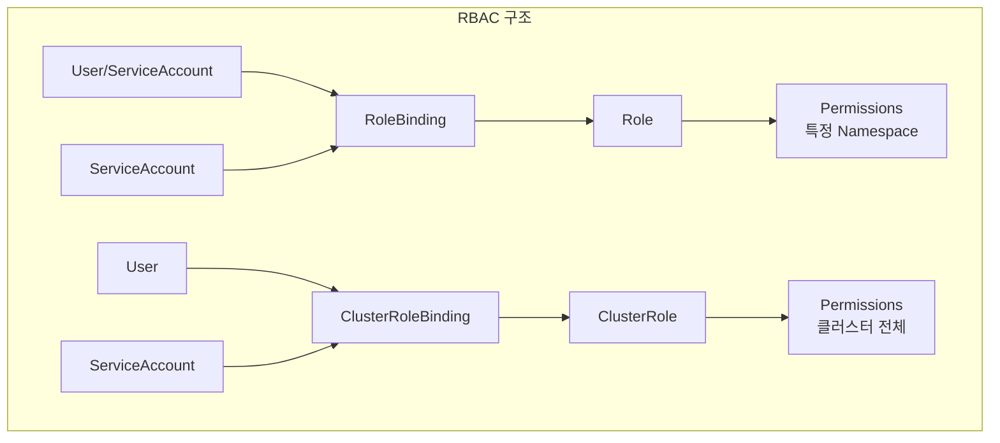

# 🔐 Kubernetes RBAC 완벽 가이드

> 💡 **목표**: Role-Based Access Control(RBAC)을 활용하여 Kubernetes 클러스터의 보안을 강화하고 세밀한 권한 관리를 구현합니다.

## 📚 목차

1. [**RBAC 개념 이해**](#rbac-개념-이해)
2. [**RBAC 리소스 타입**](#rbac-리소스-타입)
3. [**Role과 ClusterRole**](#role과-clusterrole)
4. [**RoleBinding과 ClusterRoleBinding**](#rolebinding과-clusterrolebinding)
5. [**ServiceAccount 관리**](#serviceaccount-관리)
6. [**실전 시나리오**](#실전-시나리오)
7. [**Best Practices**](#best-practices)

---

## 🎯 RBAC 개념 이해

### RBAC란?

RBAC는 사용자나 서비스가 Kubernetes 리소스에 대해 수행할 수 있는 작업을 제어하는 권한 관리 시스템입니다.



### RBAC 핵심 개념

| 개념 | 설명 | 범위 |
|------|------|------|
| **Subject** | 권한을 부여받는 대상 (User, Group, ServiceAccount) | - |
| **Role** | 네임스페이스 내 권한 정의 | Namespace |
| **ClusterRole** | 클러스터 수준 권한 정의 | Cluster |
| **RoleBinding** | Subject와 Role 연결 | Namespace |
| **ClusterRoleBinding** | Subject와 ClusterRole 연결 | Cluster |

---

## 📋 RBAC 리소스 타입

### Verbs (동작)

```yaml
# 리소스에 대해 수행 가능한 동작
verbs:
  - get       # 개별 리소스 조회
  - list      # 리소스 목록 조회
  - watch     # 리소스 변경 감시
  - create    # 리소스 생성
  - update    # 리소스 수정
  - patch     # 리소스 부분 수정
  - delete    # 리소스 삭제
  - exec      # Pod 내부 명령 실행
  - proxy     # 리소스에 대한 프록시
```

### API Groups

```yaml
# Core API Group (v1)
- apiGroups: [""]  # core API group
  resources: ["pods", "services", "configmaps", "secrets"]

# Apps API Group
- apiGroups: ["apps"]
  resources: ["deployments", "replicasets", "statefulsets"]

# Batch API Group  
- apiGroups: ["batch"]
  resources: ["jobs", "cronjobs"]

# Networking API Group
- apiGroups: ["networking.k8s.io"]
  resources: ["ingresses", "networkpolicies"]
```

---

## 👤 Role과 ClusterRole

### Role (네임스페이스 범위)

```yaml
# 개발자 Role
apiVersion: rbac.authorization.k8s.io/v1
kind: Role
metadata:
  name: developer
  namespace: development
rules:
# Pods 전체 권한
- apiGroups: [""]
  resources: ["pods", "pods/log", "pods/exec"]
  verbs: ["*"]

# Services 읽기 권한
- apiGroups: [""]
  resources: ["services"]
  verbs: ["get", "list", "watch"]

# Deployments 관리
- apiGroups: ["apps"]
  resources: ["deployments", "replicasets"]
  verbs: ["get", "list", "watch", "create", "update", "patch"]

# ConfigMaps, Secrets 읽기
- apiGroups: [""]
  resources: ["configmaps", "secrets"]
  verbs: ["get", "list"]

---
# 읽기 전용 Role
apiVersion: rbac.authorization.k8s.io/v1
kind: Role
metadata:
  name: viewer
  namespace: production
rules:
- apiGroups: ["", "apps", "batch", "networking.k8s.io"]
  resources: ["*"]
  verbs: ["get", "list", "watch"]

---
# 특정 리소스 이름 지정
apiVersion: rbac.authorization.k8s.io/v1
kind: Role
metadata:
  name: config-editor
  namespace: default
rules:
- apiGroups: [""]
  resources: ["configmaps"]
  resourceNames: ["app-config", "web-config"]
  verbs: ["get", "update", "patch"]
```

### ClusterRole (클러스터 범위)

```yaml
# 클러스터 관리자
apiVersion: rbac.authorization.k8s.io/v1
kind: ClusterRole
metadata:
  name: cluster-admin
rules:
- apiGroups: ["*"]
  resources: ["*"]
  verbs: ["*"]

---
# 노드 관리자
apiVersion: rbac.authorization.k8s.io/v1
kind: ClusterRole
metadata:
  name: node-manager
rules:
- apiGroups: [""]
  resources: ["nodes"]
  verbs: ["get", "list", "watch", "update", "patch"]
- apiGroups: [""]
  resources: ["nodes/status"]
  verbs: ["update", "patch"]

---
# 모니터링 Role
apiVersion: rbac.authorization.k8s.io/v1
kind: ClusterRole
metadata:
  name: monitoring
rules:
- apiGroups: [""]
  resources: ["pods", "nodes", "namespaces"]
  verbs: ["get", "list", "watch"]
- apiGroups: ["apps"]
  resources: ["deployments", "daemonsets", "statefulsets"]
  verbs: ["get", "list", "watch"]
- apiGroups: ["metrics.k8s.io"]
  resources: ["pods", "nodes"]
  verbs: ["get", "list"]

---
# PersistentVolume 관리자
apiVersion: rbac.authorization.k8s.io/v1
kind: ClusterRole
metadata:
  name: pv-manager
rules:
- apiGroups: [""]
  resources: ["persistentvolumes"]
  verbs: ["*"]
- apiGroups: ["storage.k8s.io"]
  resources: ["storageclasses"]
  verbs: ["get", "list", "watch"]
```

### Aggregated ClusterRole

```yaml
# 기본 Role
apiVersion: rbac.authorization.k8s.io/v1
kind: ClusterRole
metadata:
  name: monitoring-base
  labels:
    rbac.authorization.k8s.io/aggregate-to-monitoring: "true"
rules:
- apiGroups: [""]
  resources: ["pods", "services"]
  verbs: ["get", "list"]

---
# 추가 Role
apiVersion: rbac.authorization.k8s.io/v1
kind: ClusterRole
metadata:
  name: monitoring-extra
  labels:
    rbac.authorization.k8s.io/aggregate-to-monitoring: "true"
rules:
- apiGroups: ["apps"]
  resources: ["deployments"]
  verbs: ["get", "list"]

---
# Aggregated Role (자동으로 rules 결합)
apiVersion: rbac.authorization.k8s.io/v1
kind: ClusterRole
metadata:
  name: monitoring-aggregated
aggregationRule:
  clusterRoleSelectors:
  - matchLabels:
      rbac.authorization.k8s.io/aggregate-to-monitoring: "true"
rules: []  # 자동으로 채워짐
```

---

## 🔗 RoleBinding과 ClusterRoleBinding

### RoleBinding

```yaml
# User에게 Role 부여
apiVersion: rbac.authorization.k8s.io/v1
kind: RoleBinding
metadata:
  name: developer-binding
  namespace: development
subjects:
- kind: User
  name: jane.doe@example.com
  apiGroup: rbac.authorization.k8s.io
roleRef:
  kind: Role
  name: developer
  apiGroup: rbac.authorization.k8s.io

---
# ServiceAccount에게 Role 부여
apiVersion: rbac.authorization.k8s.io/v1
kind: RoleBinding
metadata:
  name: app-binding
  namespace: production
subjects:
- kind: ServiceAccount
  name: app-sa
  namespace: production
roleRef:
  kind: Role
  name: app-role
  apiGroup: rbac.authorization.k8s.io

---
# Group에게 Role 부여
apiVersion: rbac.authorization.k8s.io/v1
kind: RoleBinding
metadata:
  name: dev-team-binding
  namespace: development
subjects:
- kind: Group
  name: dev-team
  apiGroup: rbac.authorization.k8s.io
roleRef:
  kind: Role
  name: developer
  apiGroup: rbac.authorization.k8s.io

---
# ClusterRole을 특정 Namespace에 바인딩
apiVersion: rbac.authorization.k8s.io/v1
kind: RoleBinding
metadata:
  name: admin-binding
  namespace: staging
subjects:
- kind: User
  name: admin@example.com
roleRef:
  kind: ClusterRole  # ClusterRole 참조
  name: admin
  apiGroup: rbac.authorization.k8s.io
```

### ClusterRoleBinding

```yaml
# 클러스터 관리자 권한 부여
apiVersion: rbac.authorization.k8s.io/v1
kind: ClusterRoleBinding
metadata:
  name: cluster-admin-binding
subjects:
- kind: User
  name: admin@example.com
  apiGroup: rbac.authorization.k8s.io
roleRef:
  kind: ClusterRole
  name: cluster-admin
  apiGroup: rbac.authorization.k8s.io

---
# 모든 ServiceAccount에게 읽기 권한
apiVersion: rbac.authorization.k8s.io/v1
kind: ClusterRoleBinding
metadata:
  name: global-read-only
subjects:
- kind: Group
  name: system:serviceaccounts  # 모든 ServiceAccount
  apiGroup: rbac.authorization.k8s.io
roleRef:
  kind: ClusterRole
  name: view
  apiGroup: rbac.authorization.k8s.io
```

---

## 🤖 ServiceAccount 관리

### ServiceAccount 생성과 사용

```yaml
# ServiceAccount 생성
apiVersion: v1
kind: ServiceAccount
metadata:
  name: app-sa
  namespace: production
automountServiceAccountToken: true

---
# ServiceAccount를 사용하는 Pod
apiVersion: v1
kind: Pod
metadata:
  name: app-pod
  namespace: production
spec:
  serviceAccountName: app-sa
  containers:
  - name: app
    image: myapp:1.0
    # Token 자동 마운트: /var/run/secrets/kubernetes.io/serviceaccount/

---
# ServiceAccount에 권한 부여
apiVersion: rbac.authorization.k8s.io/v1
kind: Role
metadata:
  name: app-role
  namespace: production
rules:
- apiGroups: [""]
  resources: ["configmaps", "secrets"]
  verbs: ["get", "list"]

---
apiVersion: rbac.authorization.k8s.io/v1
kind: RoleBinding
metadata:
  name: app-sa-binding
  namespace: production
subjects:
- kind: ServiceAccount
  name: app-sa
  namespace: production
roleRef:
  kind: Role
  name: app-role
  apiGroup: rbac.authorization.k8s.io
```

### ServiceAccount 토큰 관리

```yaml
# 수동 토큰 생성 (1.24+)
apiVersion: v1
kind: Secret
metadata:
  name: app-sa-token
  namespace: production
  annotations:
    kubernetes.io/service-account.name: app-sa
type: kubernetes.io/service-account-token

---
# 장기 토큰 생성
apiVersion: v1
kind: Secret
metadata:
  name: jenkins-token
  namespace: ci-cd
  annotations:
    kubernetes.io/service-account.name: jenkins
type: kubernetes.io/service-account-token
```

---

## 💼 실전 시나리오

### 시나리오 1: 개발팀 권한 설정

```yaml
# 개발 네임스페이스 생성
apiVersion: v1
kind: Namespace
metadata:
  name: dev-team-a

---
# 개발팀 ServiceAccount
apiVersion: v1
kind: ServiceAccount
metadata:
  name: dev-team-a-sa
  namespace: dev-team-a

---
# 개발팀 Role
apiVersion: rbac.authorization.k8s.io/v1
kind: Role
metadata:
  name: dev-team-a-developer
  namespace: dev-team-a
rules:
# 전체 권한 (Secrets 제외)
- apiGroups: ["", "apps", "batch"]
  resources: ["*"]
  verbs: ["*"]
# Secrets는 읽기만
- apiGroups: [""]
  resources: ["secrets"]
  verbs: ["get", "list"]
# Pod exec/port-forward 권한
- apiGroups: [""]
  resources: ["pods/exec", "pods/portforward"]
  verbs: ["create"]

---
# RoleBinding
apiVersion: rbac.authorization.k8s.io/v1
kind: RoleBinding
metadata:
  name: dev-team-a-binding
  namespace: dev-team-a
subjects:
# ServiceAccount
- kind: ServiceAccount
  name: dev-team-a-sa
  namespace: dev-team-a
# User
- kind: User
  name: alice@example.com
  apiGroup: rbac.authorization.k8s.io
# Group
- kind: Group
  name: dev-team-a
  apiGroup: rbac.authorization.k8s.io
roleRef:
  kind: Role
  name: dev-team-a-developer
  apiGroup: rbac.authorization.k8s.io

---
# 읽기 권한만 있는 QA 팀
apiVersion: rbac.authorization.k8s.io/v1
kind: RoleBinding
metadata:
  name: qa-viewer-binding
  namespace: dev-team-a
subjects:
- kind: Group
  name: qa-team
  apiGroup: rbac.authorization.k8s.io
roleRef:
  kind: ClusterRole
  name: view  # 기본 제공 ClusterRole
  apiGroup: rbac.authorization.k8s.io
```

### 시나리오 2: CI/CD 파이프라인

```yaml
# CI/CD 네임스페이스
apiVersion: v1
kind: Namespace
metadata:
  name: ci-cd

---
# Jenkins ServiceAccount
apiVersion: v1
kind: ServiceAccount
metadata:
  name: jenkins
  namespace: ci-cd

---
# Jenkins가 여러 네임스페이스에서 배포할 수 있는 권한
apiVersion: rbac.authorization.k8s.io/v1
kind: ClusterRole
metadata:
  name: jenkins-deployer
rules:
# 네임스페이스 조회
- apiGroups: [""]
  resources: ["namespaces"]
  verbs: ["get", "list"]
# 배포 관련 리소스
- apiGroups: ["apps"]
  resources: ["deployments", "replicasets"]
  verbs: ["*"]
- apiGroups: [""]
  resources: ["services", "configmaps"]
  verbs: ["*"]
# 이미지 Pull Secret
- apiGroups: [""]
  resources: ["secrets"]
  verbs: ["create", "update", "get", "list"]
  
---
# Development 네임스페이스 배포 권한
apiVersion: rbac.authorization.k8s.io/v1
kind: RoleBinding
metadata:
  name: jenkins-dev-binding
  namespace: development
subjects:
- kind: ServiceAccount
  name: jenkins
  namespace: ci-cd
roleRef:
  kind: ClusterRole
  name: jenkins-deployer
  apiGroup: rbac.authorization.k8s.io

---
# Staging 네임스페이스 배포 권한
apiVersion: rbac.authorization.k8s.io/v1
kind: RoleBinding
metadata:
  name: jenkins-staging-binding
  namespace: staging
subjects:
- kind: ServiceAccount
  name: jenkins
  namespace: ci-cd
roleRef:
  kind: ClusterRole
  name: jenkins-deployer
  apiGroup: rbac.authorization.k8s.io

---
# Production은 제한된 권한
apiVersion: rbac.authorization.k8s.io/v1
kind: Role
metadata:
  name: jenkins-prod-limited
  namespace: production
rules:
- apiGroups: ["apps"]
  resources: ["deployments"]
  verbs: ["get", "update", "patch"]  # create, delete 불가
  
---
apiVersion: rbac.authorization.k8s.io/v1
kind: RoleBinding
metadata:
  name: jenkins-prod-binding
  namespace: production
subjects:
- kind: ServiceAccount
  name: jenkins
  namespace: ci-cd
roleRef:
  kind: Role
  name: jenkins-prod-limited
  apiGroup: rbac.authorization.k8s.io
```

### 시나리오 3: 모니터링 시스템

```yaml
# Prometheus ServiceAccount
apiVersion: v1
kind: ServiceAccount
metadata:
  name: prometheus
  namespace: monitoring

---
# Prometheus ClusterRole
apiVersion: rbac.authorization.k8s.io/v1
kind: ClusterRole
metadata:
  name: prometheus
rules:
# 메트릭 수집을 위한 읽기 권한
- apiGroups: [""]
  resources:
  - nodes
  - nodes/metrics
  - services
  - endpoints
  - pods
  verbs: ["get", "list", "watch"]
- apiGroups: ["extensions", "networking.k8s.io"]
  resources: ["ingresses"]
  verbs: ["get", "list", "watch"]
- apiGroups: ["apps"]
  resources: ["deployments", "daemonsets", "replicasets", "statefulsets"]
  verbs: ["get", "list", "watch"]

---
# ClusterRoleBinding
apiVersion: rbac.authorization.k8s.io/v1
kind: ClusterRoleBinding
metadata:
  name: prometheus
subjects:
- kind: ServiceAccount
  name: prometheus
  namespace: monitoring
roleRef:
  kind: ClusterRole
  name: prometheus
  apiGroup: rbac.authorization.k8s.io

---
# Grafana는 읽기 전용
apiVersion: rbac.authorization.k8s.io/v1
kind: ClusterRoleBinding
metadata:
  name: grafana-viewer
subjects:
- kind: ServiceAccount
  name: grafana
  namespace: monitoring
roleRef:
  kind: ClusterRole
  name: view
  apiGroup: rbac.authorization.k8s.io
```

### 시나리오 4: 멀티테넌트 환경

```yaml
# Tenant A
apiVersion: v1
kind: Namespace
metadata:
  name: tenant-a
  labels:
    tenant: a

---
# Tenant A Admin
apiVersion: rbac.authorization.k8s.io/v1
kind: Role
metadata:
  name: tenant-admin
  namespace: tenant-a
rules:
- apiGroups: ["*"]
  resources: ["*"]
  verbs: ["*"]

---
apiVersion: rbac.authorization.k8s.io/v1
kind: RoleBinding
metadata:
  name: tenant-a-admin-binding
  namespace: tenant-a
subjects:
- kind: User
  name: tenant-a-admin@example.com
  apiGroup: rbac.authorization.k8s.io
roleRef:
  kind: Role
  name: tenant-admin
  apiGroup: rbac.authorization.k8s.io

---
# ResourceQuota로 리소스 제한
apiVersion: v1
kind: ResourceQuota
metadata:
  name: tenant-a-quota
  namespace: tenant-a
spec:
  hard:
    requests.cpu: "10"
    requests.memory: 20Gi
    limits.cpu: "20"
    limits.memory: 40Gi
    persistentvolumeclaims: "5"
    services.loadbalancers: "2"

---
# NetworkPolicy로 격리
apiVersion: networking.k8s.io/v1
kind: NetworkPolicy
metadata:
  name: tenant-isolation
  namespace: tenant-a
spec:
  podSelector: {}
  policyTypes:
  - Ingress
  - Egress
  ingress:
  - from:
    - podSelector: {}  # 같은 네임스페이스 내부만
  egress:
  - to:
    - podSelector: {}  # 같은 네임스페이스 내부만
  - to:
    - namespaceSelector:
        matchLabels:
          name: kube-system  # DNS 허용
    ports:
    - protocol: TCP
      port: 53
    - protocol: UDP
      port: 53
```

---

## ✅ Best Practices

### 1. 최소 권한 원칙

```yaml
# ❌ 나쁜 예: 너무 광범위한 권한
rules:
- apiGroups: ["*"]
  resources: ["*"]
  verbs: ["*"]

# ✅ 좋은 예: 필요한 권한만
rules:
- apiGroups: ["apps"]
  resources: ["deployments"]
  verbs: ["get", "list", "update"]
  resourceNames: ["my-app"]  # 특정 리소스만
```

### 2. 기본 제공 Role 활용

```bash
# 기본 제공 ClusterRole 확인
kubectl get clusterroles | grep -E "^(view|edit|admin|cluster-admin)"

# view: 읽기 전용
# edit: 수정 가능 (RBAC 제외)
# admin: 네임스페이스 관리자
# cluster-admin: 클러스터 관리자
```

### 3. 권한 검증

```bash
# 현재 사용자 권한 확인
kubectl auth can-i create pods
kubectl auth can-i delete deployments --namespace=production

# 특정 사용자 권한 확인
kubectl auth can-i create pods --as=jane@example.com
kubectl auth can-i get secrets --as=system:serviceaccount:default:my-sa

# 모든 권한 확인
kubectl auth can-i --list --namespace=production
```

### 4. RBAC 디버깅

```bash
# RoleBinding 확인
kubectl get rolebindings -A
kubectl describe rolebinding developer-binding -n development

# ClusterRoleBinding 확인
kubectl get clusterrolebindings
kubectl describe clusterrolebinding cluster-admin-binding

# ServiceAccount 권한 추적
kubectl get rolebindings,clusterrolebindings \
  -A -o custom-columns='KIND:kind,NAMESPACE:metadata.namespace,NAME:metadata.name,SERVICE ACCOUNTS:subjects[?(@.kind=="ServiceAccount")].name' | grep my-sa
```

### 5. 감사 로깅

```yaml
# Audit Policy
apiVersion: audit.k8s.io/v1
kind: Policy
rules:
# RBAC 변경 감사
- level: RequestResponse
  omitStages:
  - RequestReceived
  resources:
  - group: "rbac.authorization.k8s.io"
    resources: ["roles", "rolebindings", "clusterroles", "clusterrolebindings"]
  namespaces: ["production"]
```

---

## 🔧 트러블슈팅

### "Forbidden" 오류

```bash
# 오류 메시지 예시
Error from server (Forbidden): pods is forbidden: 
User "jane@example.com" cannot list resource "pods" in API group "" 
in the namespace "production"

# 해결 방법
# 1. 현재 권한 확인
kubectl auth can-i list pods -n production --as=jane@example.com

# 2. RoleBinding 확인
kubectl get rolebindings -n production -o yaml | grep jane

# 3. Role 권한 확인
kubectl get role -n production -o yaml
```

### ServiceAccount 토큰 문제

```bash
# ServiceAccount 토큰 확인
kubectl get sa my-sa -n default -o yaml

# 수동으로 토큰 생성 (K8s 1.24+)
kubectl create token my-sa -n default

# 토큰 테스트
TOKEN=$(kubectl create token my-sa -n default)
curl -k -H "Authorization: Bearer $TOKEN" https://kubernetes.default/api/v1/namespaces/default/pods
```

---

## 💡 고급 팁

### 1. OIDC 통합

```yaml
# OIDC 사용자를 위한 ClusterRoleBinding
apiVersion: rbac.authorization.k8s.io/v1
kind: ClusterRoleBinding
metadata:
  name: oidc-admin-binding
subjects:
- kind: User
  name: https://example.com/users/12345  # OIDC subject
  apiGroup: rbac.authorization.k8s.io
roleRef:
  kind: ClusterRole
  name: admin
  apiGroup: rbac.authorization.k8s.io
```

### 2. 임시 권한 부여

```bash
# kubectl을 사용한 임시 권한 테스트
kubectl create rolebinding temp-admin \
  --clusterrole=admin \
  --user=temp-user@example.com \
  --namespace=test \
  --dry-run=client -o yaml | \
  kubectl apply -f -

# 테스트 후 삭제
kubectl delete rolebinding temp-admin -n test
```

### 3. RBAC Manager 도구

```yaml
# RBAC Manager로 간편한 관리
apiVersion: rbacmanager.io/v1beta1
kind: RBACDefinition
metadata:
  name: dev-team-access
rbacBindings:
  - name: dev-team
    subjects:
      - kind: Group
        name: dev-team
    roleBindings:
      - namespace: development
        clusterRole: edit
      - namespace: staging
        clusterRole: view
```

---

> 🚀 **다음 문서**: [security-contexts.md](security-contexts.md)에서 Pod와 Container의 보안 설정을 알아보세요!