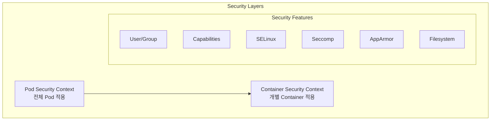

# 🔐 Security Contexts 완벽 가이드

> 💡 **목표**: Kubernetes에서 Security Context를 활용하여 컨테이너와 Pod의 보안을 강화하는 방법을 마스터합니다.

## 📚 목차

1. [**Security Context 개념**](#security-context-개념)
2. [**User와 Group 설정**](#user와-group-설정)
3. [**Capabilities 관리**](#capabilities-관리)
4. [**SELinux와 AppArmor**](#selinux와-apparmor)
5. [**Seccomp Profiles**](#seccomp-profiles)
6. [**파일시스템 보안**](#파일시스템-보안)
7. [**실전 시나리오**](#실전-시나리오)
8. [**Best Practices**](#best-practices)

---

## 🎯 Security Context 개념

### Security Context 계층 구조



### 기본 Security Context

```yaml
apiVersion: v1
kind: Pod
metadata:
  name: security-context-demo
spec:
  # Pod-level security context
  securityContext:
    runAsUser: 1000
    runAsGroup: 3000
    fsGroup: 2000
    fsGroupChangePolicy: "OnRootMismatch"
    supplementalGroups: [4000, 5000]
    
  containers:
  - name: app
    image: nginx
    # Container-level security context (overrides pod-level)
    securityContext:
      runAsUser: 2000
      runAsNonRoot: true
      readOnlyRootFilesystem: true
      allowPrivilegeEscalation: false
      privileged: false
      capabilities:
        drop: ["ALL"]
        add: ["NET_BIND_SERVICE"]
```

---

## 👤 User와 Group 설정

### RunAs 설정

```yaml
apiVersion: v1
kind: Pod
metadata:
  name: user-group-demo
spec:
  securityContext:
    # UID로 실행
    runAsUser: 1000
    
    # GID로 실행
    runAsGroup: 3000
    
    # Root가 아닌 사용자로 실행 강제
    runAsNonRoot: true
    
    # 추가 그룹
    supplementalGroups: [4000, 5000, 6000]
    
    # 볼륨 파일의 그룹 소유권
    fsGroup: 2000
    
    # fsGroup 변경 정책 (1.20+)
    # "OnRootMismatch" - root 소유일 때만 변경
    # "Always" - 항상 변경
    fsGroupChangePolicy: "OnRootMismatch"
  
  containers:
  - name: app
    image: busybox
    command: ['sh', '-c']
    args:
    - |
      echo "Current user: $(id)"
      echo "Home directory: $HOME"
      echo "Working directory: $(pwd)"
      
      # 파일 생성 테스트
      touch /data/test-file
      ls -la /data/
      
      sleep 3600
    
    volumeMounts:
    - name: data
      mountPath: /data
  
  volumes:
  - name: data
    emptyDir: {}
```

### User Namespace (실험적 기능)

```yaml
apiVersion: v1
kind: Pod
metadata:
  name: userns-demo
spec:
  hostUsers: false  # User namespace 사용 (1.25+)
  
  securityContext:
    runAsUser: 1000
    runAsGroup: 1000
  
  containers:
  - name: app
    image: nginx
    securityContext:
      runAsUser: 1000
```

### Windows Container Security

```yaml
apiVersion: v1
kind: Pod
metadata:
  name: windows-security
spec:
  securityContext:
    windowsOptions:
      gmsaCredentialSpecName: "my-gmsa"
      runAsUserName: "ContainerUser"
      hostProcess: false
  
  containers:
  - name: windows-app
    image: mcr.microsoft.com/windows/servercore:ltsc2022
    securityContext:
      windowsOptions:
        runAsUserName: "ContainerAdministrator"
```

---

## 🛡️ Capabilities 관리

### Linux Capabilities

```yaml
apiVersion: v1
kind: Pod
metadata:
  name: capabilities-demo
spec:
  containers:
  - name: app
    image: nginx
    securityContext:
      capabilities:
        # 모든 capability 제거
        drop:
        - ALL
        
        # 필요한 capability만 추가
        add:
        - NET_BIND_SERVICE  # 1024 이하 포트 바인딩
        - CHOWN             # 파일 소유자 변경
        - DAC_OVERRIDE      # 파일 권한 무시
        - SETUID            # UID 설정
        - SETGID            # GID 설정
        - NET_RAW           # RAW 소켓 사용

---
# Network Admin 예제
apiVersion: v1
kind: Pod
metadata:
  name: network-admin
spec:
  containers:
  - name: net-tools
    image: nicolaka/netshoot
    securityContext:
      capabilities:
        add:
        - NET_ADMIN  # 네트워크 설정 변경
        - NET_RAW    # tcpdump 등 사용
        - SYS_TIME   # 시스템 시간 변경

---
# Minimal Capabilities
apiVersion: v1
kind: Pod
metadata:
  name: minimal-caps
spec:
  containers:
  - name: app
    image: alpine
    securityContext:
      runAsUser: 1000
      runAsNonRoot: true
      allowPrivilegeEscalation: false
      capabilities:
        drop: ["ALL"]
        # 최소한의 capability만 유지
```

### Capability 목록

```yaml
# 주요 Capabilities
# AUDIT_WRITE         - 감사 로그 작성
# CHOWN               - 파일 소유자 변경
# DAC_OVERRIDE        - 파일 권한 검사 우회
# FOWNER              - 파일 소유자 권한 우회
# FSETID              - setuid/setgid 비트 설정
# KILL                - 프로세스 종료
# MKNOD               - 특수 파일 생성
# NET_ADMIN           - 네트워크 관리
# NET_BIND_SERVICE    - 특권 포트 바인딩
# NET_RAW             - RAW 소켓 사용
# SETFCAP             - 파일 capability 설정
# SETGID              - GID 변경
# SETPCAP             - capability 변경
# SETUID              - UID 변경
# SYS_ADMIN           - 시스템 관리 (위험!)
# SYS_CHROOT          - chroot 사용
# SYS_MODULE          - 커널 모듈 로드
# SYS_NICE            - 프로세스 우선순위 변경
# SYS_PTRACE          - 프로세스 트레이싱
# SYS_RESOURCE        - 리소스 제한 변경
# SYS_TIME            - 시스템 시간 변경
```

---

## 🔒 SELinux와 AppArmor

### SELinux 설정

```yaml
apiVersion: v1
kind: Pod
metadata:
  name: selinux-demo
spec:
  securityContext:
    seLinuxOptions:
      level: "s0:c123,c456"  # MCS 레벨
      role: "system_r"       # SELinux 역할
      type: "svirt_lxc_net_t"  # SELinux 타입
      user: "system_u"       # SELinux 사용자
  
  containers:
  - name: app
    image: nginx
    securityContext:
      seLinuxOptions:
        level: "s0:c789"
        type: "container_t"
```

### AppArmor 프로파일

```yaml
apiVersion: v1
kind: Pod
metadata:
  name: apparmor-demo
  annotations:
    # AppArmor 프로파일 지정
    container.apparmor.security.beta.kubernetes.io/app: "runtime/default"
    # 또는 custom profile
    # container.apparmor.security.beta.kubernetes.io/app: "localhost/my-profile"
spec:
  containers:
  - name: app
    image: nginx

---
# Custom AppArmor Profile (호스트에 설치 필요)
# /etc/apparmor.d/my-profile
#
# #include <tunables/global>
# 
# profile my-profile flags=(attach_disconnected) {
#   #include <abstractions/base>
#   
#   network inet tcp,
#   network inet udp,
#   
#   file,
#   
#   # Deny specific paths
#   deny /host/proc/** rwklx,
#   deny /host/sys/** rwklx,
#   
#   # Allow specific paths
#   /var/log/** rw,
#   /tmp/** rw,
# }
```

---

## 📝 Seccomp Profiles

### Seccomp 설정

```yaml
apiVersion: v1
kind: Pod
metadata:
  name: seccomp-demo
spec:
  securityContext:
    # Pod 레벨 seccomp
    seccompProfile:
      type: RuntimeDefault  # 또는 Localhost, Unconfined
      # localhostProfile: "profiles/audit.json"  # type: Localhost일 때
  
  containers:
  - name: app
    image: nginx
    securityContext:
      seccompProfile:
        type: RuntimeDefault

---
# Custom Seccomp Profile
apiVersion: v1
kind: Pod
metadata:
  name: custom-seccomp
spec:
  securityContext:
    seccompProfile:
      type: Localhost
      localhostProfile: "profiles/fine-grained.json"
  
  containers:
  - name: app
    image: nginx
```

### Custom Seccomp Profile 예제

```json
{
  "defaultAction": "SCMP_ACT_ERRNO",
  "architectures": [
    "SCMP_ARCH_X86_64",
    "SCMP_ARCH_X86"
  ],
  "syscalls": [
    {
      "names": [
        "accept",
        "accept4",
        "bind",
        "connect",
        "listen",
        "socket",
        "socketpair"
      ],
      "action": "SCMP_ACT_ALLOW"
    },
    {
      "names": [
        "open",
        "openat",
        "read",
        "write",
        "close"
      ],
      "action": "SCMP_ACT_ALLOW"
    },
    {
      "names": [
        "execve",
        "exit",
        "exit_group"
      ],
      "action": "SCMP_ACT_ALLOW"
    },
    {
      "names": [
        "kill",
        "tkill",
        "tgkill"
      ],
      "action": "SCMP_ACT_ALLOW",
      "args": [
        {
          "index": 1,
          "value": 15,
          "op": "SCMP_CMP_EQ"
        }
      ]
    }
  ]
}
```

---

## 📁 파일시스템 보안

### ReadOnly 파일시스템

```yaml
apiVersion: v1
kind: Pod
metadata:
  name: readonly-fs-demo
spec:
  containers:
  - name: app
    image: nginx
    securityContext:
      readOnlyRootFilesystem: true
    
    volumeMounts:
    # 쓰기 가능한 디렉토리만 별도 마운트
    - name: tmp
      mountPath: /tmp
    - name: var-cache-nginx
      mountPath: /var/cache/nginx
    - name: var-run
      mountPath: /var/run
    - name: var-log-nginx
      mountPath: /var/log/nginx
  
  volumes:
  - name: tmp
    emptyDir: {}
  - name: var-cache-nginx
    emptyDir: {}
  - name: var-run
    emptyDir: {}
  - name: var-log-nginx
    emptyDir: {}
```

### Privileged와 Device Access

```yaml
# Privileged Container (위험!)
apiVersion: v1
kind: Pod
metadata:
  name: privileged-demo
spec:
  containers:
  - name: privileged
    image: busybox
    securityContext:
      privileged: true  # 모든 권한 (위험!)
    volumeMounts:
    - name: host-root
      mountPath: /host
  volumes:
  - name: host-root
    hostPath:
      path: /

---
# Device Access
apiVersion: v1
kind: Pod
metadata:
  name: device-access
spec:
  containers:
  - name: gpu-app
    image: nvidia/cuda
    securityContext:
      privileged: false
      allowPrivilegeEscalation: false
    resources:
      limits:
        nvidia.com/gpu: 1
```

### ProcMount 옵션

```yaml
apiVersion: v1
kind: Pod
metadata:
  name: procmount-demo
spec:
  containers:
  - name: app
    image: alpine
    securityContext:
      procMount: Default  # 또는 Unmasked
      # Unmasked: /proc의 모든 내용 노출
      # Default: 일부 경로 마스킹
```

---

## 💼 실전 시나리오

### 시나리오 1: 웹 애플리케이션

```yaml
apiVersion: apps/v1
kind: Deployment
metadata:
  name: secure-web-app
spec:
  replicas: 3
  selector:
    matchLabels:
      app: web
  template:
    metadata:
      labels:
        app: web
      annotations:
        container.apparmor.security.beta.kubernetes.io/web: "runtime/default"
    spec:
      securityContext:
        runAsUser: 1000
        runAsGroup: 1000
        fsGroup: 2000
        runAsNonRoot: true
        seccompProfile:
          type: RuntimeDefault
      
      containers:
      - name: web
        image: nginx:alpine
        ports:
        - containerPort: 8080
        securityContext:
          allowPrivilegeEscalation: false
          readOnlyRootFilesystem: true
          capabilities:
            drop: ["ALL"]
            add: ["NET_BIND_SERVICE"]
        
        volumeMounts:
        - name: nginx-cache
          mountPath: /var/cache/nginx
        - name: nginx-run
          mountPath: /var/run
        - name: nginx-tmp
          mountPath: /tmp
        
        # nginx.conf에서 포트 8080 사용
        command: ["/bin/sh"]
        args:
        - -c
        - |
          sed -i 's/listen       80/listen    8080/g' /etc/nginx/nginx.conf
          nginx -g 'daemon off;'
      
      volumes:
      - name: nginx-cache
        emptyDir: {}
      - name: nginx-run
        emptyDir: {}
      - name: nginx-tmp
        emptyDir: {}
```

### 시나리오 2: 데이터베이스

```yaml
apiVersion: apps/v1
kind: StatefulSet
metadata:
  name: secure-postgres
spec:
  serviceName: postgres
  replicas: 1
  selector:
    matchLabels:
      app: postgres
  template:
    metadata:
      labels:
        app: postgres
    spec:
      securityContext:
        runAsUser: 999  # postgres user
        runAsGroup: 999
        fsGroup: 999
        fsGroupChangePolicy: "OnRootMismatch"
        runAsNonRoot: true
      
      containers:
      - name: postgres
        image: postgres:14-alpine
        securityContext:
          allowPrivilegeEscalation: false
          capabilities:
            drop: ["ALL"]
            add: ["CHOWN", "DAC_OVERRIDE", "FOWNER", "SETGID", "SETUID"]
        
        env:
        - name: POSTGRES_PASSWORD
          valueFrom:
            secretKeyRef:
              name: postgres-secret
              key: password
        - name: PGDATA
          value: /var/lib/postgresql/data/pgdata
        
        volumeMounts:
        - name: data
          mountPath: /var/lib/postgresql/data
        
        livenessProbe:
          exec:
            command:
            - /bin/sh
            - -c
            - pg_isready -U postgres
          initialDelaySeconds: 30
          periodSeconds: 10
  
  volumeClaimTemplates:
  - metadata:
      name: data
    spec:
      accessModes: ["ReadWriteOnce"]
      resources:
        requests:
          storage: 10Gi
```

### 시나리오 3: CI/CD Agent

```yaml
apiVersion: v1
kind: Pod
metadata:
  name: ci-agent
spec:
  serviceAccountName: ci-agent
  
  securityContext:
    runAsUser: 1000
    runAsGroup: 1000
    runAsNonRoot: true
    seccompProfile:
      type: RuntimeDefault
  
  containers:
  # Docker in Docker (DinD) - 보안 위험!
  - name: docker
    image: docker:20-dind
    securityContext:
      privileged: true  # DinD requires privileged
    env:
    - name: DOCKER_TLS_CERTDIR
      value: "/certs"
    volumeMounts:
    - name: docker-certs
      mountPath: /certs/client
    - name: docker-socket
      mountPath: /var/run
  
  # CI Agent
  - name: agent
    image: jenkins/inbound-agent
    securityContext:
      allowPrivilegeEscalation: false
      readOnlyRootFilesystem: true
      capabilities:
        drop: ["ALL"]
    env:
    - name: DOCKER_HOST
      value: tcp://localhost:2376
    - name: DOCKER_CERT_PATH
      value: /certs/client
    - name: DOCKER_TLS_VERIFY
      value: "1"
    volumeMounts:
    - name: docker-certs
      mountPath: /certs/client
      readOnly: true
    - name: workspace
      mountPath: /home/jenkins/agent
  
  volumes:
  - name: docker-certs
    emptyDir: {}
  - name: docker-socket
    emptyDir: {}
  - name: workspace
    emptyDir: {}
```

---

## ✅ Best Practices

### 1. 최소 권한 원칙

```yaml
apiVersion: v1
kind: Pod
metadata:
  name: least-privilege
spec:
  securityContext:
    runAsNonRoot: true
    runAsUser: 10000
    fsGroup: 20000
    seccompProfile:
      type: RuntimeDefault
  
  containers:
  - name: app
    image: myapp:latest
    securityContext:
      allowPrivilegeEscalation: false
      readOnlyRootFilesystem: true
      capabilities:
        drop: ["ALL"]
```

### 2. 보안 정책 템플릿

```yaml
# Restricted Security Template
apiVersion: v1
kind: Pod
metadata:
  name: restricted-pod
spec:
  securityContext:
    runAsNonRoot: true
    runAsUser: 1000
    fsGroup: 3000
    seccompProfile:
      type: RuntimeDefault
  
  containers:
  - name: app
    image: myapp
    securityContext:
      allowPrivilegeEscalation: false
      capabilities:
        drop: ["ALL"]
      readOnlyRootFilesystem: true
      runAsNonRoot: true
```

### 3. 네트워크 보안

```yaml
apiVersion: v1
kind: Pod
metadata:
  name: network-secure
spec:
  hostNetwork: false  # 호스트 네트워크 사용 안함
  hostPID: false     # 호스트 PID 네임스페이스 사용 안함
  hostIPC: false     # 호스트 IPC 네임스페이스 사용 안함
  
  containers:
  - name: app
    image: myapp
    securityContext:
      capabilities:
        drop: ["ALL"]
        add: ["NET_BIND_SERVICE"]  # 필요한 경우만
```

### 4. 감사 설정

```yaml
# Audit-friendly configuration
apiVersion: v1
kind: Pod
metadata:
  name: audit-friendly
  labels:
    security: strict
    compliance: required
spec:
  securityContext:
    runAsNonRoot: true
    runAsUser: 1000
    seccompProfile:
      type: RuntimeDefault
  
  containers:
  - name: app
    image: myapp
    securityContext:
      allowPrivilegeEscalation: false
      capabilities:
        drop: ["ALL"]
```

---

## 🔧 트러블슈팅

### Permission Denied 오류

```bash
# 파일 권한 확인
kubectl exec <pod> -- ls -la /path/to/file

# 현재 사용자 확인
kubectl exec <pod> -- id

# fsGroup 확인
kubectl get pod <pod> -o jsonpath='{.spec.securityContext.fsGroup}'
```

### Capability 관련 오류

```bash
# 현재 capabilities 확인
kubectl exec <pod> -- cat /proc/self/status | grep Cap

# 필요한 capability 추가
kubectl patch pod <pod> -p '{"spec":{"containers":[{"name":"app","securityContext":{"capabilities":{"add":["NET_ADMIN"]}}}]}}'
```

### SELinux/AppArmor 이슈

```bash
# SELinux 컨텍스트 확인
kubectl exec <pod> -- ls -Z /path

# AppArmor 프로파일 확인
kubectl exec <pod> -- cat /proc/self/attr/current
```

---

## 💡 고급 팁

### 1. Security Context 상속

```yaml
# Pod 레벨 설정이 Container로 상속됨
spec:
  securityContext:
    runAsUser: 1000  # 모든 container에 적용
  containers:
  - name: app1
    image: app1
    # runAsUser: 1000 상속됨
  - name: app2
    image: app2
    securityContext:
      runAsUser: 2000  # Override
```

### 2. Init Container 보안

```yaml
spec:
  initContainers:
  - name: init
    image: busybox
    securityContext:
      runAsUser: 0  # root로 초기화
      capabilities:
        add: ["CHOWN"]
    command: ['sh', '-c', 'chown -R 1000:1000 /data']
  
  containers:
  - name: app
    image: myapp
    securityContext:
      runAsUser: 1000  # non-root로 실행
```

### 3. Multi-arch Security

```yaml
# Architecture별 seccomp profile
spec:
  securityContext:
    seccompProfile:
      type: Localhost
      localhostProfile: "profiles/default-$(ARCH).json"
```

---

> 🚀 Security Context는 Defense in Depth 전략의 핵심 구성 요소입니다!