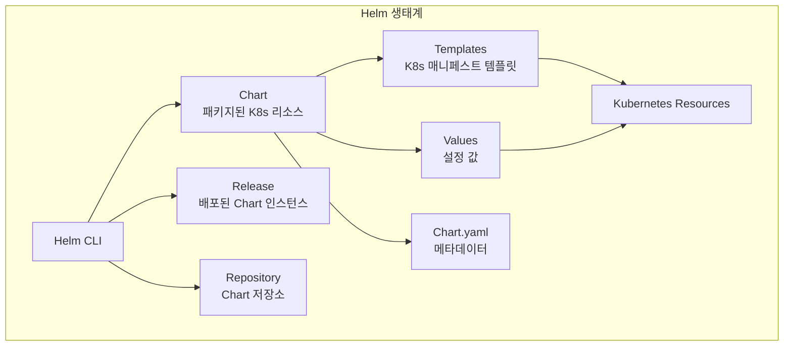

# ⚓ Helm 완벽 가이드 - Kubernetes 패키지 매니저

> 💡 **목표**: Helm을 사용하여 복잡한 Kubernetes 애플리케이션을 패키징하고, 배포하고, 관리하는 방법을 마스터합니다.

## 📚 목차

1. [**Helm이란?**](#helm이란)
2. [**Helm 설치와 기본 사용법**](#helm-설치와-기본-사용법)
3. [**Chart 구조와 개발**](#chart-구조와-개발)
4. [**Values와 템플릿**](#values와-템플릿)
5. [**Chart Repository**](#chart-repository)
6. [**실전 예제**](#실전-예제)
7. [**Best Practices**](#best-practices)

---

## 🎯 Helm이란?

### Helm의 핵심 개념



### 왜 Helm을 사용하나?

| 문제점 | Helm 없이 | Helm으로 |
|-------|----------|----------|
| **복잡한 배포** | 수십 개 YAML 파일 관리 | 하나의 Chart로 관리 |
| **환경별 설정** | 환경마다 다른 YAML | values 파일로 통합 |
| **버전 관리** | 수동 버전 추적 | 자동 버전 관리 |
| **롤백** | 복잡한 수동 작업 | `helm rollback` 한 번 |
| **의존성** | 수동 설치 순서 관리 | 자동 의존성 해결 |

---

## 🛠️ Helm 설치와 기본 사용법

### Helm 설치

```bash
# macOS
brew install helm

# Linux
curl https://raw.githubusercontent.com/helm/helm/main/scripts/get-helm-3 | bash

# Windows (Chocolatey)
choco install kubernetes-helm

# 설치 확인
helm version
```

### 기본 명령어

```bash
# Repository 관리
helm repo add bitnami https://charts.bitnami.com/bitnami
helm repo add stable https://charts.helm.sh/stable
helm repo update
helm repo list

# Chart 검색
helm search repo wordpress
helm search hub prometheus

# Chart 설치
helm install my-wordpress bitnami/wordpress
helm install my-release bitnami/mysql --version 9.3.4

# Release 관리
helm list
helm status my-wordpress
helm get values my-wordpress
helm get manifest my-wordpress

# 업그레이드
helm upgrade my-wordpress bitnami/wordpress
helm upgrade --install my-app ./my-chart

# 롤백
helm rollback my-wordpress 1
helm history my-wordpress

# 삭제
helm uninstall my-wordpress
helm uninstall my-wordpress --keep-history
```

---

## 📦 Chart 구조와 개발

### Chart 디렉토리 구조

```bash
my-chart/
├── Chart.yaml          # Chart 메타데이터
├── values.yaml         # 기본 설정 값
├── charts/            # 의존 Chart
├── templates/         # 템플릿 파일
│   ├── deployment.yaml
│   ├── service.yaml
│   ├── ingress.yaml
│   ├── configmap.yaml
│   ├── secret.yaml
│   ├── NOTES.txt      # 설치 후 메시지
│   ├── helpers.tpl    # 템플릿 헬퍼
│   └── tests/         # 테스트
│       └── test-connection.yaml
├── crds/              # Custom Resource Definitions
├── .helmignore        # 무시할 파일
└── README.md          # 문서
```

### Chart 생성

```bash
# 새 Chart 생성
helm create my-app

# 생성된 구조
tree my-app/
```

### Chart.yaml 예시

```yaml
apiVersion: v2
name: my-app
description: A Helm chart for my application
type: application  # application 또는 library
version: 1.0.0     # Chart 버전
appVersion: "2.0.0"  # 애플리케이션 버전
keywords:
  - web
  - frontend
home: https://example.com
sources:
  - https://github.com/myorg/my-app
maintainers:
  - name: John Doe
    email: john@example.com
    url: https://example.com
dependencies:  # 의존성
  - name: postgresql
    version: 11.x.x
    repository: https://charts.bitnami.com/bitnami
    condition: postgresql.enabled
  - name: redis
    version: 17.x.x
    repository: https://charts.bitnami.com/bitnami
    tags:
      - cache
```

---

## 🎨 Values와 템플릿

### values.yaml 구조

```yaml
# values.yaml
# 기본값 정의
replicaCount: 3

image:
  repository: nginx
  pullPolicy: IfNotPresent
  tag: "1.21"

imagePullSecrets: []
nameOverride: ""
fullnameOverride: ""

service:
  type: ClusterIP
  port: 80
  targetPort: 8080
  annotations: {}

ingress:
  enabled: false
  className: nginx
  annotations:
    cert-manager.io/cluster-issuer: letsencrypt-prod
  hosts:
    - host: example.com
      paths:
        - path: /
          pathType: Prefix
  tls:
    - secretName: example-tls
      hosts:
        - example.com

resources:
  limits:
    cpu: 200m
    memory: 256Mi
  requests:
    cpu: 100m
    memory: 128Mi

autoscaling:
  enabled: false
  minReplicas: 2
  maxReplicas: 10
  targetCPUUtilizationPercentage: 80
  targetMemoryUtilizationPercentage: 80

# 환경 변수
env:
  - name: LOG_LEVEL
    value: info
  - name: DATABASE_URL
    valueFrom:
      secretKeyRef:
        name: db-secret
        key: url

# 데이터베이스 설정
postgresql:
  enabled: true
  auth:
    username: myuser
    password: mypassword
    database: mydb
  persistence:
    enabled: true
    size: 10Gi

# 모니터링
monitoring:
  enabled: true
  serviceMonitor:
    enabled: true
    interval: 30s
```

### 템플릿 문법

#### 1. 기본 템플릿

```yaml
# templates/deployment.yaml
apiVersion: apps/v1
kind: Deployment
metadata:
  name: {{ include "my-app.fullname" . }}
  labels:
    {{- include "my-app.labels" . | nindent 4 }}
spec:
  {{- if not .Values.autoscaling.enabled }}
  replicas: {{ .Values.replicaCount }}
  {{- end }}
  selector:
    matchLabels:
      {{- include "my-app.selectorLabels" . | nindent 6 }}
  template:
    metadata:
      labels:
        {{- include "my-app.selectorLabels" . | nindent 8 }}
    spec:
      containers:
      - name: {{ .Chart.Name }}
        image: "{{ .Values.image.repository }}:{{ .Values.image.tag | default .Chart.AppVersion }}"
        imagePullPolicy: {{ .Values.image.pullPolicy }}
        ports:
        - name: http
          containerPort: {{ .Values.service.targetPort }}
          protocol: TCP
        {{- with .Values.env }}
        env:
          {{- toYaml . | nindent 10 }}
        {{- end }}
        {{- if .Values.resources }}
        resources:
          {{- toYaml .Values.resources | nindent 10 }}
        {{- end }}
```

#### 2. 헬퍼 템플릿

```yaml
# templates/_helpers.tpl
{{/*
Expand the name of the chart.
*/}}
{{- define "my-app.name" -}}
{{- default .Chart.Name .Values.nameOverride | trunc 63 | trimSuffix "-" }}
{{- end }}

{{/*
Create a default fully qualified app name.
*/}}
{{- define "my-app.fullname" -}}
{{- if .Values.fullnameOverride }}
{{- .Values.fullnameOverride | trunc 63 | trimSuffix "-" }}
{{- else }}
{{- $name := default .Chart.Name .Values.nameOverride }}
{{- if contains $name .Release.Name }}
{{- .Release.Name | trunc 63 | trimSuffix "-" }}
{{- else }}
{{- printf "%s-%s" .Release.Name $name | trunc 63 | trimSuffix "-" }}
{{- end }}
{{- end }}
{{- end }}

{{/*
Common labels
*/}}
{{- define "my-app.labels" -}}
helm.sh/chart: {{ include "my-app.chart" . }}
{{ include "my-app.selectorLabels" . }}
{{- if .Chart.AppVersion }}
app.kubernetes.io/version: {{ .Chart.AppVersion | quote }}
{{- end }}
app.kubernetes.io/managed-by: {{ .Release.Service }}
{{- end }}
```

#### 3. 조건부 렌더링

```yaml
# templates/ingress.yaml
{{- if .Values.ingress.enabled -}}
apiVersion: networking.k8s.io/v1
kind: Ingress
metadata:
  name: {{ include "my-app.fullname" . }}
  {{- with .Values.ingress.annotations }}
  annotations:
    {{- toYaml . | nindent 4 }}
  {{- end }}
spec:
  {{- if .Values.ingress.className }}
  ingressClassName: {{ .Values.ingress.className }}
  {{- end }}
  {{- if .Values.ingress.tls }}
  tls:
    {{- range .Values.ingress.tls }}
    - hosts:
        {{- range .hosts }}
        - {{ . | quote }}
        {{- end }}
      secretName: {{ .secretName }}
    {{- end }}
  {{- end }}
  rules:
    {{- range .Values.ingress.hosts }}
    - host: {{ .host | quote }}
      http:
        paths:
          {{- range .paths }}
          - path: {{ .path }}
            pathType: {{ .pathType }}
            backend:
              service:
                name: {{ include "my-app.fullname" $ }}
                port:
                  number: {{ $.Values.service.port }}
          {{- end }}
    {{- end }}
{{- end }}
```

#### 4. 반복문과 범위

```yaml
# ConfigMap with loop
apiVersion: v1
kind: ConfigMap
metadata:
  name: {{ include "my-app.fullname" . }}-config
data:
  {{- range $key, $value := .Values.configData }}
  {{ $key }}: |
    {{ $value | nindent 4 }}
  {{- end }}
```

### 환경별 Values 관리

```bash
# 개발 환경
# values-dev.yaml
replicaCount: 1
image:
  tag: "dev"
resources:
  limits:
    cpu: 100m
    memory: 128Mi

# 스테이징 환경
# values-staging.yaml
replicaCount: 2
image:
  tag: "staging"
ingress:
  enabled: true
  hosts:
    - host: staging.example.com

# 프로덕션 환경
# values-prod.yaml
replicaCount: 5
image:
  tag: "1.0.0"
autoscaling:
  enabled: true
  minReplicas: 3
  maxReplicas: 10
resources:
  limits:
    cpu: 500m
    memory: 512Mi
```

배포:
```bash
# 개발 환경 배포
helm install my-app ./my-chart -f values-dev.yaml

# 스테이징 환경 배포
helm install my-app ./my-chart -f values-staging.yaml

# 프로덕션 환경 배포
helm install my-app ./my-chart -f values-prod.yaml

# 여러 values 파일 조합
helm install my-app ./my-chart \
  -f values.yaml \
  -f values-prod.yaml \
  --set image.tag=1.0.1
```

---

## 📚 Chart Repository

### Public Repository 사용

```bash
# 인기있는 Public Repository
helm repo add bitnami https://charts.bitnami.com/bitnami
helm repo add ingress-nginx https://kubernetes.github.io/ingress-nginx
helm repo add prometheus-community https://prometheus-community.github.io/helm-charts
helm repo add grafana https://grafana.github.io/helm-charts
helm repo add elastic https://helm.elastic.co
helm repo add jetstack https://charts.jetstack.io

# Repository 업데이트
helm repo update

# Chart 검색
helm search repo nginx
helm search repo prometheus --versions
```

### Private Repository 구축

#### 1. ChartMuseum 사용

```bash
# ChartMuseum 설치
helm repo add chartmuseum https://chartmuseum.github.io/charts
helm install chartmuseum chartmuseum/chartmuseum \
  --set persistence.enabled=true \
  --set persistence.size=10Gi \
  --set env.open.DISABLE_API=false

# Chart 업로드
curl --data-binary "@my-chart-1.0.0.tgz" http://chartmuseum.example.com/api/charts
```

#### 2. GitHub Pages 사용

```bash
# gh-pages 브랜치 생성
git checkout --orphan gh-pages
git rm -rf .

# Chart 패키징
helm package ./my-chart
helm repo index . --url https://myorg.github.io/helm-charts

# 커밋 및 푸시
git add .
git commit -m "Add helm charts"
git push origin gh-pages

# Repository 추가
helm repo add myrepo https://myorg.github.io/helm-charts
```

#### 3. OCI Registry 사용 (Helm 3.8+)

```bash
# Docker Hub, GitHub Container Registry, ECR 등 사용 가능
# 로그인
helm registry login docker.io

# Chart 푸시
helm push my-chart-1.0.0.tgz oci://docker.io/myorg

# Chart 설치
helm install my-app oci://docker.io/myorg/my-chart --version 1.0.0
```

---

## 💼 실전 예제

### 예제 1: WordPress 풀스택 애플리케이션

```yaml
# wordpress-chart/values.yaml
wordpress:
  image:
    registry: docker.io
    repository: bitnami/wordpress
    tag: 6.1.1
  
  username: admin
  email: admin@example.com
  firstName: Admin
  lastName: User
  
  persistence:
    enabled: true
    size: 10Gi
    
  service:
    type: LoadBalancer
    port: 80
    httpsPort: 443

mariadb:
  enabled: true
  auth:
    rootPassword: secretpassword
    database: wordpress
    username: wordpress
    password: wordpress
    
  primary:
    persistence:
      enabled: true
      size: 8Gi

ingress:
  enabled: true
  hostname: wordpress.example.com
  tls: true
  certManager: true
  annotations:
    cert-manager.io/cluster-issuer: letsencrypt-prod
```

배포:
```bash
# 의존성 업데이트
helm dependency update ./wordpress-chart

# 설치
helm install my-wordpress ./wordpress-chart

# 상태 확인
helm status my-wordpress
```

### 예제 2: Microservices 애플리케이션

```yaml
# microservices-chart/Chart.yaml
apiVersion: v2
name: microservices
version: 1.0.0
dependencies:
  - name: frontend
    version: "1.0.0"
    repository: "file://./charts/frontend"
    
  - name: backend
    version: "1.0.0"
    repository: "file://./charts/backend"
    
  - name: postgresql
    version: "11.x.x"
    repository: "https://charts.bitnami.com/bitnami"
    condition: postgresql.enabled
    
  - name: redis
    version: "17.x.x"
    repository: "https://charts.bitnami.com/bitnami"
    condition: redis.enabled
```

```yaml
# microservices-chart/values.yaml
global:
  environment: production
  domain: example.com

frontend:
  replicaCount: 3
  image:
    tag: "v2.0.0"
  ingress:
    enabled: true
    host: www.example.com

backend:
  replicaCount: 5
  image:
    tag: "v2.0.0"
  service:
    type: ClusterIP
  
postgresql:
  enabled: true
  auth:
    database: myapp
    
redis:
  enabled: true
  auth:
    enabled: false
```

### 예제 3: Monitoring Stack

```bash
# Prometheus + Grafana + Loki 스택
cat <<EOF > monitoring-values.yaml
prometheus:
  alertmanager:
    enabled: true
    persistentVolume:
      enabled: true
      size: 10Gi
  
  server:
    persistentVolume:
      enabled: true
      size: 20Gi
    retention: "15d"
  
  pushgateway:
    enabled: true
    
grafana:
  adminPassword: "admin123"
  persistence:
    enabled: true
    size: 5Gi
  datasources:
    datasources.yaml:
      apiVersion: 1
      datasources:
      - name: Prometheus
        type: prometheus
        url: http://prometheus-server
        access: proxy
        isDefault: true
      - name: Loki
        type: loki
        url: http://loki:3100
        access: proxy
        
loki:
  persistence:
    enabled: true
    size: 10Gi
    
promtail:
  config:
    clients:
      - url: http://loki:3100/loki/api/v1/push
EOF

# 설치
helm install monitoring prometheus-community/kube-prometheus-stack \
  -f monitoring-values.yaml
```

### 예제 4: Blue-Green 배포 with Helm

```bash
# Blue 배포
helm install app-blue ./my-app \
  --set image.tag=v1.0.0 \
  --set service.selector=blue

# Green 배포
helm install app-green ./my-app \
  --set image.tag=v2.0.0 \
  --set service.selector=green

# Service 전환
kubectl patch service my-app -p '{"spec":{"selector":{"version":"green"}}}'

# Blue 삭제
helm uninstall app-blue
```

---

## 📋 Best Practices

### 1. Chart 개발 Best Practices

```yaml
# ✅ 좋은 예
{{- if .Values.nodeSelector }}
nodeSelector:
  {{- toYaml .Values.nodeSelector | nindent 8 }}
{{- end }}

# ❌ 나쁜 예
nodeSelector:
  disktype: {{ .Values.disktype }}  # 하드코딩된 키
```

### 2. 보안 Best Practices

```yaml
# Secret 관리
# 1. Helm Secrets 플러그인 사용
helm plugin install https://github.com/jkroepke/helm-secrets

# secrets.yaml (암호화됨)
database:
  password: !vault |
    $ANSIBLE_VAULT;1.1;AES256
    66386439386...

# 2. External Secrets Operator 사용
apiVersion: external-secrets.io/v1beta1
kind: ExternalSecret
metadata:
  name: {{ include "my-app.fullname" . }}-secret
spec:
  secretStoreRef:
    name: vault-backend
    kind: SecretStore
  target:
    name: {{ include "my-app.fullname" . }}-secret
  data:
  - secretKey: password
    remoteRef:
      key: secret/data/database
      property: password
```

### 3. 테스트

```yaml
# templates/tests/test-connection.yaml
apiVersion: v1
kind: Pod
metadata:
  name: "{{ include "my-app.fullname" . }}-test"
  annotations:
    "helm.sh/hook": test
spec:
  containers:
  - name: wget
    image: busybox
    command: ['wget']
    args: ['{{ include "my-app.fullname" . }}:{{ .Values.service.port }}']
  restartPolicy: Never
```

실행:
```bash
helm test my-release
```

### 4. Hook 활용

```yaml
# Pre-install/upgrade 데이터베이스 마이그레이션
apiVersion: batch/v1
kind: Job
metadata:
  name: "{{ .Release.Name }}-db-migration"
  annotations:
    "helm.sh/hook": pre-install,pre-upgrade
    "helm.sh/hook-weight": "-5"
    "helm.sh/hook-delete-policy": before-hook-creation
spec:
  template:
    spec:
      restartPolicy: Never
      containers:
      - name: db-migration
        image: "{{ .Values.image.repository }}:{{ .Values.image.tag }}"
        command: ["./migrate.sh"]
```

### 5. 버전 관리

```bash
# Semantic Versioning 준수
# MAJOR.MINOR.PATCH
# 1.0.0 -> 1.0.1 (버그 수정)
# 1.0.0 -> 1.1.0 (기능 추가)
# 1.0.0 -> 2.0.0 (Breaking Change)

# Chart 버전 업데이트
helm package ./my-chart --version 1.0.1

# AppVersion 업데이트
helm package ./my-chart --app-version 2.0.0
```

---

## 🔧 디버깅과 트러블슈팅

### 디버깅 명령어

```bash
# Dry-run으로 생성될 매니페스트 확인
helm install my-app ./my-chart --dry-run --debug

# 템플릿 렌더링 결과 확인
helm template my-app ./my-chart

# 특정 값으로 템플릿 렌더링
helm template my-app ./my-chart --set image.tag=v2.0.0

# Release의 실제 매니페스트 확인
helm get manifest my-release

# Values 확인
helm get values my-release
helm get values my-release -a  # 모든 값 (기본값 포함)

# Hook 확인
helm get hooks my-release

# 노트 확인
helm get notes my-release
```

### 일반적인 문제 해결

```bash
# 1. "Error: INSTALLATION FAILED: cannot re-use a name"
helm uninstall my-release
# 또는
helm upgrade --install my-release ./my-chart

# 2. "Error: UPGRADE FAILED: another operation in progress"
kubectl delete secret -l owner=helm,name=my-release

# 3. 의존성 문제
helm dependency update ./my-chart
helm dependency build ./my-chart

# 4. 롤백 실패
helm rollback my-release --force

# 5. 완전 삭제
helm uninstall my-release --no-hooks
kubectl delete all -l app.kubernetes.io/instance=my-release
```

---

## 💡 고급 팁

### 1. Helm Diff 플러그인

```bash
# 설치
helm plugin install https://github.com/databus23/helm-diff

# 사용
helm diff upgrade my-release ./my-chart
```

### 2. Helmfile 사용

```yaml
# helmfile.yaml
repositories:
  - name: bitnami
    url: https://charts.bitnami.com/bitnami

releases:
  - name: wordpress
    namespace: production
    chart: bitnami/wordpress
    values:
      - values-prod.yaml
    
  - name: mysql
    namespace: production
    chart: bitnami/mysql
    values:
      - values-mysql.yaml
```

```bash
# Helmfile 설치
brew install helmfile

# 배포
helmfile sync
```

### 3. ArgoCD와 통합

```yaml
apiVersion: argoproj.io/v1alpha1
kind: Application
metadata:
  name: my-app
spec:
  source:
    repoURL: https://github.com/myorg/helm-charts
    path: charts/my-app
    targetRevision: HEAD
    helm:
      valueFiles:
        - values-prod.yaml
  destination:
    server: https://kubernetes.default.svc
    namespace: production
  syncPolicy:
    automated:
      prune: true
      selfHeal: true
```

---

> 🚀 **다음 문서**: [monitoring.md](monitoring.md)에서 Prometheus와 Grafana를 활용한 모니터링 시스템 구축을 알아보세요!