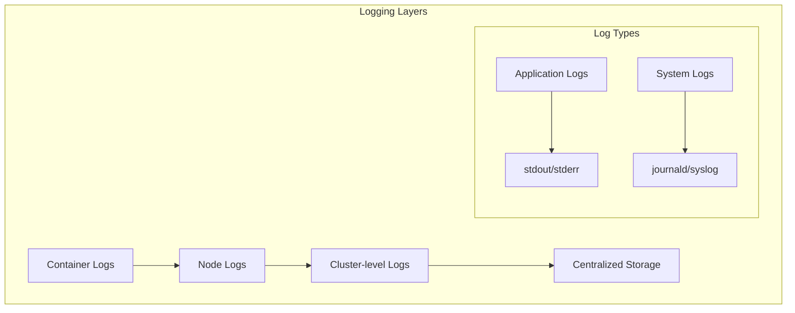

# 📊 Kubernetes Logging 완벽 가이드

> 💡 **목표**: Kubernetes 환경에서 효과적인 로깅 시스템을 구축하고 중앙화된 로그 관리를 구현합니다.

## 📚 목차

1. [**로깅 아키텍처**](#로깅-아키텍처)
2. [**컨테이너 로그 수집**](#컨테이너-로그-수집)
3. [**EFK Stack 구축**](#efk-stack-구축)
4. [**PLG Stack (Promtail, Loki, Grafana)**](#plg-stack)
5. [**Fluentd 고급 설정**](#fluentd-고급-설정)
6. [**로그 필터링과 파싱**](#로그-필터링과-파싱)
7. [**Best Practices**](#best-practices)

---

## 🎯 로깅 아키텍처

### Kubernetes 로깅 레벨



### 로깅 패턴

| 패턴 | 설명 | 사용 사례 |
|------|------|----------|
| **Node-level** | 각 노드에서 로그 수집 | 작은 클러스터 |
| **Sidecar** | Pod마다 로그 수집 컨테이너 | 특별한 로그 처리 |
| **DaemonSet** | 노드당 하나의 수집기 | 대규모 클러스터 |
| **Central Agent** | 중앙 집중식 수집 | 클라우드 환경 |

---

## 📝 컨테이너 로그 수집

### 기본 로그 확인

```bash
# Pod 로그 보기
kubectl logs <pod-name>
kubectl logs <pod-name> -c <container-name>
kubectl logs <pod-name> --previous  # 이전 컨테이너 로그
kubectl logs <pod-name> --tail=100  # 마지막 100줄
kubectl logs <pod-name> -f          # 실시간 로그
kubectl logs <pod-name> --since=1h  # 1시간 이내 로그

# Label selector로 여러 Pod 로그
kubectl logs -l app=myapp --all-containers=true

# Deployment의 모든 Pod 로그
kubectl logs deployment/myapp-deployment --all-containers=true --tail=50
```

### 로그 로테이션 설정

```yaml
# kubelet 설정 (--container-log-max-size, --container-log-max-files)
apiVersion: kubelet.config.k8s.io/v1beta1
kind: KubeletConfiguration
containerLogMaxSize: 10Mi
containerLogMaxFiles: 5
```

### Sidecar 패턴으로 로그 수집

```yaml
apiVersion: v1
kind: Pod
metadata:
  name: app-with-sidecar-logging
spec:
  containers:
  # 메인 애플리케이션
  - name: app
    image: myapp:1.0
    volumeMounts:
    - name: shared-logs
      mountPath: /var/log
  
  # 로그 수집 사이드카
  - name: log-forwarder
    image: busybox
    command: ['sh', '-c']
    args:
    - tail -f /logs/app.log | while read line; do
        echo "$(date '+%Y-%m-%d %H:%M:%S') $line";
      done
    volumeMounts:
    - name: shared-logs
      mountPath: /logs
  
  volumes:
  - name: shared-logs
    emptyDir: {}
```

---

## 🔥 EFK Stack 구축

### 1. Elasticsearch 설치

```yaml
# elasticsearch-values.yaml
apiVersion: v1
kind: Namespace
metadata:
  name: logging

---
apiVersion: apps/v1
kind: StatefulSet
metadata:
  name: elasticsearch
  namespace: logging
spec:
  serviceName: elasticsearch
  replicas: 3
  selector:
    matchLabels:
      app: elasticsearch
  template:
    metadata:
      labels:
        app: elasticsearch
    spec:
      initContainers:
      - name: increase-vm-max-map
        image: busybox
        command: ["sysctl", "-w", "vm.max_map_count=262144"]
        securityContext:
          privileged: true
      
      containers:
      - name: elasticsearch
        image: docker.elastic.co/elasticsearch/elasticsearch:8.11.0
        ports:
        - containerPort: 9200
          name: http
        - containerPort: 9300
          name: transport
        env:
        - name: cluster.name
          value: k8s-logs
        - name: node.name
          valueFrom:
            fieldRef:
              fieldPath: metadata.name
        - name: discovery.seed_hosts
          value: elasticsearch-0.elasticsearch,elasticsearch-1.elasticsearch,elasticsearch-2.elasticsearch
        - name: cluster.initial_master_nodes
          value: elasticsearch-0,elasticsearch-1,elasticsearch-2
        - name: ES_JAVA_OPTS
          value: "-Xms1g -Xmx1g"
        - name: xpack.security.enabled
          value: "false"
        volumeMounts:
        - name: data
          mountPath: /usr/share/elasticsearch/data
        resources:
          requests:
            cpu: 500m
            memory: 2Gi
          limits:
            cpu: 1000m
            memory: 2Gi
  
  volumeClaimTemplates:
  - metadata:
      name: data
    spec:
      accessModes: ["ReadWriteOnce"]
      storageClassName: fast-ssd
      resources:
        requests:
          storage: 30Gi

---
apiVersion: v1
kind: Service
metadata:
  name: elasticsearch
  namespace: logging
spec:
  selector:
    app: elasticsearch
  clusterIP: None
  ports:
  - port: 9200
    name: http
  - port: 9300
    name: transport
```

### 2. Fluentd DaemonSet

```yaml
# fluentd-configmap.yaml
apiVersion: v1
kind: ConfigMap
metadata:
  name: fluentd-config
  namespace: logging
data:
  fluent.conf: |
    <source>
      @type tail
      @id in_tail_container_logs
      path /var/log/containers/*.log
      pos_file /var/log/fluentd-containers.log.pos
      tag kubernetes.*
      read_from_head true
      <parse>
        @type multi_format
        <pattern>
          format json
          time_format %Y-%m-%dT%H:%M:%S.%NZ
        </pattern>
        <pattern>
          format regexp
          expression /^(?<time>.+) (?<stream>stdout|stderr) (?<flags>[^ ]*) (?<message>.*)$/
          time_format %Y-%m-%dT%H:%M:%S.%N%:z
        </pattern>
      </parse>
    </source>
    
    # Kubernetes 메타데이터 추가
    <filter kubernetes.**>
      @type kubernetes_metadata
      @id filter_kube_metadata
      kubernetes_url "#{ENV['FLUENT_FILTER_KUBERNETES_URL'] || 'https://' + ENV.fetch('KUBERNETES_SERVICE_HOST') + ':' + ENV.fetch('KUBERNETES_SERVICE_PORT') + '/api'}"
      verify_ssl "#{ENV['KUBERNETES_VERIFY_SSL'] || true}"
      ca_file "#{ENV['KUBERNETES_CA_FILE']}"
      skip_labels "#{ENV['FLUENT_KUBERNETES_METADATA_SKIP_LABELS'] || 'false'}"
      skip_container_metadata "#{ENV['FLUENT_KUBERNETES_METADATA_SKIP_CONTAINER_METADATA'] || 'false'}"
      skip_master_url "#{ENV['FLUENT_KUBERNETES_METADATA_SKIP_MASTER_URL'] || 'false'}"
      skip_namespace_metadata "#{ENV['FLUENT_KUBERNETES_METADATA_SKIP_NAMESPACE_METADATA'] || 'false'}"
    </filter>
    
    # 시스템 로그 제외
    <filter kubernetes.**>
      @type grep
      <exclude>
        key $.kubernetes.namespace_name
        pattern ^(kube-system|kube-public|kube-node-lease)$
      </exclude>
    </filter>
    
    # Elasticsearch로 전송
    <match kubernetes.**>
      @type elasticsearch
      @id out_es
      @log_level info
      include_tag_key true
      host elasticsearch.logging.svc.cluster.local
      port 9200
      logstash_format true
      logstash_prefix kubernetes
      logstash_dateformat %Y.%m.%d
      request_timeout 30s
      <buffer>
        @type file
        path /var/log/fluentd-buffers/kubernetes.system.buffer
        flush_mode interval
        retry_type exponential_backoff
        flush_thread_count 2
        flush_interval 5s
        retry_forever
        retry_max_interval 30
        chunk_limit_size 2M
        queue_limit_length 8
        overflow_action block
      </buffer>
    </match>

---
# fluentd-daemonset.yaml
apiVersion: apps/v1
kind: DaemonSet
metadata:
  name: fluentd
  namespace: logging
  labels:
    k8s-app: fluentd-logging
spec:
  selector:
    matchLabels:
      k8s-app: fluentd-logging
  template:
    metadata:
      labels:
        k8s-app: fluentd-logging
    spec:
      serviceAccountName: fluentd
      tolerations:
      - key: node-role.kubernetes.io/control-plane
        effect: NoSchedule
      - key: node-role.kubernetes.io/master
        effect: NoSchedule
      containers:
      - name: fluentd
        image: fluent/fluentd-kubernetes-daemonset:v1.16-debian-elasticsearch8-1
        env:
        - name: FLUENT_ELASTICSEARCH_HOST
          value: "elasticsearch.logging.svc.cluster.local"
        - name: FLUENT_ELASTICSEARCH_PORT
          value: "9200"
        - name: FLUENT_ELASTICSEARCH_SCHEME
          value: "http"
        - name: FLUENT_UID
          value: "0"
        - name: FLUENTD_SYSTEMD_CONF
          value: disable
        - name: FLUENT_ELASTICSEARCH_LOGSTASH_PREFIX
          value: "kubernetes"
        - name: FLUENT_ELASTICSEARCH_LOGSTASH_DATEFORMAT
          value: "%Y.%m.%d"
        volumeMounts:
        - name: config
          mountPath: /fluentd/etc
        - name: varlog
          mountPath: /var/log
        - name: varlibdockercontainers
          mountPath: /var/lib/docker/containers
          readOnly: true
        resources:
          limits:
            memory: 500Mi
          requests:
            cpu: 100m
            memory: 200Mi
      volumes:
      - name: config
        configMap:
          name: fluentd-config
      - name: varlog
        hostPath:
          path: /var/log
      - name: varlibdockercontainers
        hostPath:
          path: /var/lib/docker/containers

---
apiVersion: v1
kind: ServiceAccount
metadata:
  name: fluentd
  namespace: logging

---
apiVersion: rbac.authorization.k8s.io/v1
kind: ClusterRole
metadata:
  name: fluentd
rules:
- apiGroups: [""]
  resources:
  - pods
  - namespaces
  verbs: ["get", "list", "watch"]

---
apiVersion: rbac.authorization.k8s.io/v1
kind: ClusterRoleBinding
metadata:
  name: fluentd
roleRef:
  kind: ClusterRole
  name: fluentd
  apiGroup: rbac.authorization.k8s.io
subjects:
- kind: ServiceAccount
  name: fluentd
  namespace: logging
```

### 3. Kibana 설치

```yaml
apiVersion: apps/v1
kind: Deployment
metadata:
  name: kibana
  namespace: logging
spec:
  replicas: 1
  selector:
    matchLabels:
      app: kibana
  template:
    metadata:
      labels:
        app: kibana
    spec:
      containers:
      - name: kibana
        image: docker.elastic.co/kibana/kibana:8.11.0
        ports:
        - containerPort: 5601
        env:
        - name: ELASTICSEARCH_HOSTS
          value: http://elasticsearch:9200
        - name: SERVER_HOST
          value: "0.0.0.0"
        resources:
          requests:
            cpu: 100m
            memory: 512Mi
          limits:
            cpu: 500m
            memory: 1Gi

---
apiVersion: v1
kind: Service
metadata:
  name: kibana
  namespace: logging
spec:
  type: LoadBalancer
  selector:
    app: kibana
  ports:
  - port: 5601
    targetPort: 5601
```

---

## 📊 PLG Stack

### Promtail, Loki, Grafana 스택

```yaml
# loki-stack.yaml
# Loki 설치
apiVersion: v1
kind: ConfigMap
metadata:
  name: loki-config
  namespace: logging
data:
  loki.yaml: |
    auth_enabled: false
    server:
      http_listen_port: 3100
    ingester:
      lifecycler:
        address: 127.0.0.1
        ring:
          kvstore:
            store: inmemory
          replication_factor: 1
    schema_config:
      configs:
        - from: 2020-10-24
          store: boltdb-shipper
          object_store: filesystem
          schema: v11
          index:
            prefix: index_
            period: 24h
    storage_config:
      boltdb_shipper:
        active_index_directory: /loki/boltdb-shipper-active
        cache_location: /loki/boltdb-shipper-cache
        cache_ttl: 24h
      filesystem:
        directory: /loki/chunks
    limits_config:
      enforce_metric_name: false
      reject_old_samples: true
      reject_old_samples_max_age: 168h

---
apiVersion: apps/v1
kind: StatefulSet
metadata:
  name: loki
  namespace: logging
spec:
  serviceName: loki
  replicas: 1
  selector:
    matchLabels:
      app: loki
  template:
    metadata:
      labels:
        app: loki
    spec:
      containers:
      - name: loki
        image: grafana/loki:2.9.0
        args:
        - -config.file=/etc/loki/loki.yaml
        ports:
        - containerPort: 3100
          name: http
        volumeMounts:
        - name: config
          mountPath: /etc/loki
        - name: storage
          mountPath: /loki
        resources:
          requests:
            cpu: 100m
            memory: 128Mi
          limits:
            cpu: 500m
            memory: 512Mi
      volumes:
      - name: config
        configMap:
          name: loki-config
  volumeClaimTemplates:
  - metadata:
      name: storage
    spec:
      accessModes: ["ReadWriteOnce"]
      resources:
        requests:
          storage: 10Gi

---
# Promtail DaemonSet
apiVersion: v1
kind: ConfigMap
metadata:
  name: promtail-config
  namespace: logging
data:
  promtail.yaml: |
    server:
      http_listen_port: 9080
      grpc_listen_port: 0
    
    positions:
      filename: /tmp/positions.yaml
    
    clients:
      - url: http://loki:3100/loki/api/v1/push
    
    scrape_configs:
    - job_name: kubernetes-pods
      kubernetes_sd_configs:
      - role: pod
      pipeline_stages:
      - docker: {}
      relabel_configs:
      - source_labels:
        - __meta_kubernetes_pod_node_name
        target_label: __host__
      - action: replace
        source_labels:
        - __meta_kubernetes_namespace
        target_label: namespace
      - action: replace
        source_labels:
        - __meta_kubernetes_pod_name
        target_label: pod
      - action: replace
        source_labels:
        - __meta_kubernetes_container_name
        target_label: container
      - replacement: /var/log/pods/*$1/*.log
        separator: /
        source_labels:
        - __meta_kubernetes_pod_uid
        - __meta_kubernetes_container_name
        target_label: __path__

---
apiVersion: apps/v1
kind: DaemonSet
metadata:
  name: promtail
  namespace: logging
spec:
  selector:
    matchLabels:
      name: promtail
  template:
    metadata:
      labels:
        name: promtail
    spec:
      serviceAccountName: promtail
      containers:
      - name: promtail
        image: grafana/promtail:2.9.0
        args:
        - -config.file=/etc/promtail/promtail.yaml
        volumeMounts:
        - name: config
          mountPath: /etc/promtail
        - name: varlog
          mountPath: /var/log
          readOnly: true
        - name: varlibdockercontainers
          mountPath: /var/lib/docker/containers
          readOnly: true
        resources:
          requests:
            cpu: 100m
            memory: 128Mi
          limits:
            cpu: 200m
            memory: 256Mi
      volumes:
      - name: config
        configMap:
          name: promtail-config
      - name: varlog
        hostPath:
          path: /var/log
      - name: varlibdockercontainers
        hostPath:
          path: /var/lib/docker/containers
```

---

## 🔧 Fluentd 고급 설정

### 멀티라인 로그 처리

```yaml
apiVersion: v1
kind: ConfigMap
metadata:
  name: fluentd-multiline
  namespace: logging
data:
  fluent.conf: |
    <source>
      @type tail
      path /var/log/containers/*.log
      pos_file /var/log/fluentd-multiline.log.pos
      tag kubernetes.*
      <parse>
        @type multiline
        format_firstline /^\d{4}-\d{2}-\d{2}/
        format1 /^(?<time>\d{4}-\d{2}-\d{2} \d{2}:\d{2}:\d{2}) \[(?<level>\w+)\] (?<message>.*)$/
        time_format %Y-%m-%d %H:%M:%S
      </parse>
    </source>
    
    # Java Stack Trace 처리
    <filter kubernetes.**>
      @type concat
      key message
      multiline_start_regexp /^\d{4}-\d{2}-\d{2}|^[A-Z][a-z]+Exception:/
      multiline_end_regexp /^\s+at\s+|^\s+\.\.\.\s+\d+\s+more/
    </filter>
```

### 로그 변환 및 필터링

```yaml
# 로그 레벨별 필터링
<filter kubernetes.**>
  @type grep
  <regexp>
    key log_level
    pattern /^(ERROR|WARN|INFO)$/
  </regexp>
</filter>

# 로그 포맷 변환
<filter kubernetes.**>
  @type record_transformer
  enable_ruby true
  <record>
    hostname ${hostname}
    timestamp ${time}
    environment production
    cluster_name my-k8s-cluster
    log_level ${record["log"].match(/ERROR|WARN|INFO|DEBUG/) ? $& : "UNKNOWN"}
  </record>
</filter>

# 민감 정보 마스킹
<filter kubernetes.**>
  @type record_modifier
  <replace>
    key message
    expression /password=\S+/
    replace password=***MASKED***
  </replace>
  <replace>
    key message
    expression /token=\S+/
    replace token=***MASKED***
  </replace>
</filter>
```

---

## 🎨 로그 필터링과 파싱

### 구조화된 로그 파싱

```yaml
# JSON 로그 파싱
<filter kubernetes.**>
  @type parser
  key_name log
  reserve_data true
  <parse>
    @type json
  </parse>
</filter>

# nginx 액세스 로그 파싱
<filter kubernetes.nginx.**>
  @type parser
  key_name log
  <parse>
    @type nginx
    expression /^(?<remote>[^ ]*) (?<host>[^ ]*) (?<user>[^ ]*) \[(?<time>[^\]]*)\] "(?<method>\S+)(?: +(?<path>[^\"]*?)(?: +\S*)?)?" (?<code>[^ ]*) (?<size>[^ ]*)(?: "(?<referer>[^\"]*)" "(?<agent>[^\"]*)")?$/
    time_format %d/%b/%Y:%H:%M:%S %z
  </parse>
</filter>

# Apache 로그 파싱
<filter kubernetes.apache.**>
  @type parser
  key_name log
  <parse>
    @type apache2
  </parse>
</filter>
```

### 애플리케이션별 라우팅

```yaml
# 네임스페이스별 라우팅
<match kubernetes.production.**>
  @type elasticsearch
  host elasticsearch.logging.svc
  port 9200
  index_name production-logs
  <buffer>
    @type memory
    flush_interval 10s
  </buffer>
</match>

<match kubernetes.staging.**>
  @type elasticsearch
  host elasticsearch.logging.svc
  port 9200
  index_name staging-logs
  <buffer>
    @type memory
    flush_interval 10s
  </buffer>
</match>

# 애플리케이션별 라우팅
<match kubernetes.**app-frontend**>
  @type s3
  aws_key_id YOUR_AWS_KEY
  aws_sec_key YOUR_AWS_SECRET
  s3_bucket frontend-logs
  s3_region us-west-2
  path logs/frontend/%Y/%m/%d/
  <buffer>
    @type file
    path /var/log/fluentd-buffers/s3.buffer
  </buffer>
</match>
```

---

## ✅ Best Practices

### 1. 로그 표준화

```json
// 표준 로그 포맷
{
  "timestamp": "2024-01-01T10:00:00Z",
  "level": "INFO",
  "service": "user-service",
  "trace_id": "abc123",
  "span_id": "def456",
  "user_id": "user123",
  "message": "User login successful",
  "metadata": {
    "ip": "192.168.1.1",
    "user_agent": "Mozilla/5.0"
  }
}
```

### 2. 로그 레벨 가이드라인

| 레벨 | 사용 시점 | 예시 |
|------|----------|------|
| **DEBUG** | 개발/디버깅 정보 | 변수 값, 상태 변화 |
| **INFO** | 일반 정보 | 요청 처리, 작업 완료 |
| **WARN** | 경고 상황 | 높은 메모리 사용, 느린 쿼리 |
| **ERROR** | 오류 발생 | 예외 처리, 실패한 작업 |
| **FATAL** | 치명적 오류 | 서비스 중단, 데이터 손실 |

### 3. 보안 고려사항

```yaml
# 민감 정보 필터링
<filter kubernetes.**>
  @type record_modifier
  <replace>
    key message
    expression /(password|token|secret|key)=\S+/i
    replace \1=***REDACTED***
  </replace>
</filter>

# 특정 네임스페이스 제외
<filter kubernetes.**>
  @type grep
  <exclude>
    key $.kubernetes.namespace_name
    pattern ^(secrets|sensitive)$
  </exclude>
</filter>
```

### 4. 성능 최적화

```yaml
# 버퍼 설정 최적화
<buffer>
  @type file
  path /var/log/fluentd-buffers/
  flush_mode interval
  flush_interval 10s
  flush_at_shutdown true
  retry_type exponential_backoff
  retry_forever false
  retry_max_interval 30
  chunk_limit_size 5M
  queue_limit_length 10
  overflow_action drop_oldest_chunk
</buffer>

# 로그 샘플링
<filter kubernetes.**>
  @type sampling
  interval 10  # 10개 중 1개만 수집
</filter>
```

### 5. 모니터링

```yaml
# Prometheus 메트릭
apiVersion: v1
kind: Service
metadata:
  name: fluentd-metrics
  namespace: logging
  labels:
    app: fluentd
  annotations:
    prometheus.io/scrape: "true"
    prometheus.io/port: "24231"
spec:
  ports:
  - name: metrics
    port: 24231
    targetPort: 24231
  selector:
    k8s-app: fluentd-logging
```

---

## 🔧 트러블슈팅

### 로그 수집 안됨

```bash
# Fluentd 상태 확인
kubectl logs -n logging daemonset/fluentd

# 파일 권한 확인
kubectl exec -n logging fluentd-xxx -- ls -la /var/log/containers/

# Buffer 상태 확인
kubectl exec -n logging fluentd-xxx -- ls -la /var/log/fluentd-buffers/
```

### Elasticsearch 연결 실패

```bash
# Elasticsearch 상태 확인
kubectl get pods -n logging | grep elasticsearch
kubectl logs -n logging elasticsearch-0

# 네트워크 연결 테스트
kubectl exec -n logging fluentd-xxx -- curl elasticsearch:9200/_cluster/health
```

### 높은 메모리 사용

```yaml
# 메모리 제한 및 버퍼 크기 조정
resources:
  limits:
    memory: 1Gi
  requests:
    memory: 512Mi

<buffer>
  chunk_limit_size 2M  # 청크 크기 줄이기
  queue_limit_length 4  # 큐 길이 줄이기
</buffer>
```

---

## 💡 고급 팁

### 1. 멀티 클러스터 로깅

```yaml
# 클러스터 정보 추가
<filter kubernetes.**>
  @type record_transformer
  <record>
    cluster_name ${ENV["CLUSTER_NAME"]}
    region ${ENV["AWS_REGION"]}
  </record>
</filter>
```

### 2. 로그 아카이빙

```bash
# S3로 오래된 로그 아카이빙
curl -XPUT "elasticsearch:9200/_ilm/policy/archive-policy" -H 'Content-Type: application/json' -d'
{
  "policy": {
    "phases": {
      "hot": {
        "actions": {
          "rollover": {
            "max_age": "7d",
            "max_size": "50GB"
          }
        }
      },
      "warm": {
        "min_age": "7d",
        "actions": {
          "shrink": {
            "number_of_shards": 1
          }
        }
      },
      "cold": {
        "min_age": "30d",
        "actions": {
          "freeze": {}
        }
      },
      "delete": {
        "min_age": "90d",
        "actions": {
          "delete": {}
        }
      }
    }
  }
}'
```

### 3. 실시간 로그 스트리밍

```bash
# stern 사용 (여러 Pod 로그 동시 확인)
stern -n production "app-.*" --tail 100

# kubetail 사용
kubetail -n production -l app=myapp
```

---

> 🚀 효과적인 로깅 시스템으로 운영 가시성을 확보했습니다!