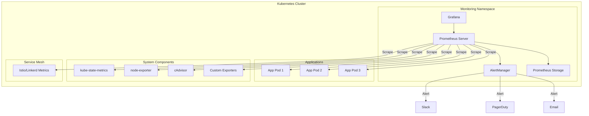

# 📊 Kubernetes 모니터링 완벽 구축 가이드

> 💡 **목표**: Prometheus와 Grafana를 활용하여 프로덕션급 Kubernetes 모니터링 시스템을 구축하고 운영합니다.

## 📚 목차

1. [**모니터링 아키텍처**](#모니터링-아키텍처)
2. [**Prometheus 구축**](#prometheus-구축)
3. [**Grafana 대시보드**](#grafana-대시보드)
4. [**메트릭 수집 전략**](#메트릭-수집-전략)
5. [**알림 설정**](#알림-설정)
6. [**실전 모니터링 시나리오**](#실전-모니터링-시나리오)
7. [**성능 최적화**](#성능-최적화)

---

## 🏗️ 모니터링 아키텍처

### 전체 구성도



### 핵심 컴포넌트

| 컴포넌트 | 역할 | 수집 메트릭 |
|---------|------|------------|
| **Prometheus** | 메트릭 수집 및 저장 | 모든 메트릭 |
| **Grafana** | 시각화 | - |
| **AlertManager** | 알림 관리 | - |
| **kube-state-metrics** | K8s 오브젝트 상태 | Deployment, Pod, Node 상태 |
| **node-exporter** | 노드 메트릭 | CPU, Memory, Disk, Network |
| **cAdvisor** | 컨테이너 메트릭 | 컨테이너 리소스 사용량 |

---

## 🚀 Prometheus 구축

### 1. Prometheus Operator 설치

```bash
# Helm으로 설치 (권장)
helm repo add prometheus-community https://prometheus-community.github.io/helm-charts
helm repo update

# values.yaml 생성
cat <<EOF > prometheus-values.yaml
prometheus:
  prometheusSpec:
    retention: 30d
    retentionSize: "50GB"
    
    resources:
      requests:
        memory: 2Gi
        cpu: 1000m
      limits:
        memory: 4Gi
        cpu: 2000m
    
    storageSpec:
      volumeClaimTemplate:
        spec:
          accessModes: ["ReadWriteOnce"]
          resources:
            requests:
              storage: 100Gi
    
    serviceMonitorSelectorNilUsesHelmValues: false
    podMonitorSelectorNilUsesHelmValues: false
    ruleSelectorNilUsesHelmValues: false

alertmanager:
  alertmanagerSpec:
    retention: 120h
    storage:
      volumeClaimTemplate:
        spec:
          accessModes: ["ReadWriteOnce"]
          resources:
            requests:
              storage: 10Gi

grafana:
  adminPassword: "admin123!"
  persistence:
    enabled: true
    size: 10Gi
  
  sidecar:
    dashboards:
      enabled: true
      provider:
        allowUiUpdates: true
    datasources:
      enabled: true

prometheusOperator:
  resources:
    limits:
      cpu: 200m
      memory: 200Mi
    requests:
      cpu: 100m
      memory: 100Mi

nodeExporter:
  enabled: true

kubeStateMetrics:
  enabled: true

kubelet:
  enabled: true
  serviceMonitor:
    metricRelabelings:
    - action: replace
      sourceLabels:
      - node
      targetLabel: instance
EOF

# 설치
helm install prometheus prometheus-community/kube-prometheus-stack \
  -f prometheus-values.yaml \
  --namespace monitoring \
  --create-namespace
```

### 2. Prometheus 설정

```yaml
# prometheus-config.yaml
apiVersion: v1
kind: ConfigMap
metadata:
  name: prometheus-config
  namespace: monitoring
data:
  prometheus.yml: |
    global:
      scrape_interval: 15s
      evaluation_interval: 15s
      external_labels:
        cluster: 'production'
        region: 'us-east-1'
    
    # Alerting 설정
    alerting:
      alertmanagers:
      - static_configs:
        - targets:
          - alertmanager:9093
    
    # Rule 파일 로드
    rule_files:
      - "/etc/prometheus/rules/*.yml"
    
    # Scrape 설정
    scrape_configs:
      # Kubernetes API Server
      - job_name: 'kubernetes-apiservers'
        kubernetes_sd_configs:
        - role: endpoints
        scheme: https
        tls_config:
          ca_file: /var/run/secrets/kubernetes.io/serviceaccount/ca.crt
        bearer_token_file: /var/run/secrets/kubernetes.io/serviceaccount/token
        relabel_configs:
        - source_labels: [__meta_kubernetes_namespace, __meta_kubernetes_service_name, __meta_kubernetes_endpoint_port_name]
          action: keep
          regex: default;kubernetes;https
      
      # Kubernetes Nodes
      - job_name: 'kubernetes-nodes'
        kubernetes_sd_configs:
        - role: node
        scheme: https
        tls_config:
          ca_file: /var/run/secrets/kubernetes.io/serviceaccount/ca.crt
        bearer_token_file: /var/run/secrets/kubernetes.io/serviceaccount/token
        relabel_configs:
        - action: labelmap
          regex: __meta_kubernetes_node_label_(.+)
      
      # Kubernetes Pods
      - job_name: 'kubernetes-pods'
        kubernetes_sd_configs:
        - role: pod
        relabel_configs:
        - source_labels: [__meta_kubernetes_pod_annotation_prometheus_io_scrape]
          action: keep
          regex: true
        - source_labels: [__meta_kubernetes_pod_annotation_prometheus_io_path]
          action: replace
          target_label: __metrics_path__
          regex: (.+)
        - source_labels: [__address__, __meta_kubernetes_pod_annotation_prometheus_io_port]
          action: replace
          regex: ([^:]+)(?::\d+)?;(\d+)
          replacement: $1:$2
          target_label: __address__
```

### 3. ServiceMonitor 설정

```yaml
# ServiceMonitor로 애플리케이션 모니터링
apiVersion: monitoring.coreos.com/v1
kind: ServiceMonitor
metadata:
  name: app-metrics
  namespace: monitoring
spec:
  selector:
    matchLabels:
      app: my-app
  endpoints:
  - port: metrics
    interval: 30s
    path: /metrics
    relabelings:
    - sourceLabels: [__meta_kubernetes_pod_name]
      targetLabel: pod
    - sourceLabels: [__meta_kubernetes_namespace]
      targetLabel: namespace
```

### 4. PodMonitor 설정

```yaml
# PodMonitor로 직접 Pod 모니터링
apiVersion: monitoring.coreos.com/v1
kind: PodMonitor
metadata:
  name: app-pods
  namespace: monitoring
spec:
  selector:
    matchLabels:
      app: my-app
  podMetricsEndpoints:
  - port: metrics
    interval: 30s
    path: /metrics
```

---

## 📈 Grafana 대시보드

### 1. 필수 대시보드 설치

```bash
# 대시보드 ID로 import
# 1. Kubernetes Cluster Overview - 8685
# 2. Kubernetes Pods - 6417
# 3. Node Exporter Full - 1860
# 4. NGINX Ingress Controller - 9614
# 5. Kubernetes Deployment - 8349

# ConfigMap으로 대시보드 자동 프로비저닝
cat <<EOF > grafana-dashboards.yaml
apiVersion: v1
kind: ConfigMap
metadata:
  name: grafana-dashboard-k8s-overview
  namespace: monitoring
  labels:
    grafana_dashboard: "1"
data:
  k8s-overview.json: |
    {
      "dashboard": {
        "title": "Kubernetes Overview",
        "panels": [
          {
            "title": "CPU Usage",
            "targets": [
              {
                "expr": "sum(rate(container_cpu_usage_seconds_total[5m])) by (pod)"
              }
            ]
          },
          {
            "title": "Memory Usage",
            "targets": [
              {
                "expr": "sum(container_memory_usage_bytes) by (pod)"
              }
            ]
          }
        ]
      }
    }
EOF
```

### 2. Custom Dashboard 생성

```json
{
  "dashboard": {
    "title": "Application Metrics",
    "templating": {
      "list": [
        {
          "name": "namespace",
          "type": "query",
          "query": "label_values(kube_pod_info, namespace)"
        },
        {
          "name": "pod",
          "type": "query",
          "query": "label_values(kube_pod_info{namespace=\"$namespace\"}, pod)"
        }
      ]
    },
    "panels": [
      {
        "title": "Request Rate",
        "gridPos": {"h": 8, "w": 12, "x": 0, "y": 0},
        "targets": [
          {
            "expr": "sum(rate(http_requests_total{namespace=\"$namespace\"}[5m])) by (status)"
          }
        ]
      },
      {
        "title": "Response Time",
        "gridPos": {"h": 8, "w": 12, "x": 12, "y": 0},
        "targets": [
          {
            "expr": "histogram_quantile(0.99, sum(rate(http_request_duration_seconds_bucket[5m])) by (le))"
          }
        ]
      },
      {
        "title": "Error Rate",
        "gridPos": {"h": 8, "w": 12, "x": 0, "y": 8},
        "targets": [
          {
            "expr": "sum(rate(http_requests_total{status=~\"5..\"}[5m])) / sum(rate(http_requests_total[5m]))"
          }
        ]
      }
    ]
  }
}
```

### 3. 대시보드 자동화

```yaml
# Dashboard as Code
apiVersion: integreatly.org/v1alpha1
kind: GrafanaDashboard
metadata:
  name: app-dashboard
  namespace: monitoring
spec:
  json: |
    {
      "dashboard": {
        "title": "Application Dashboard",
        "refresh": "10s",
        "time": {
          "from": "now-1h",
          "to": "now"
        },
        "panels": [...]
      }
    }
  datasources:
  - inputName: "DS_PROMETHEUS"
    datasourceName: "Prometheus"
```

---

## 📊 메트릭 수집 전략

### 1. 애플리케이션 메트릭

```go
// Go 애플리케이션 예시
package main

import (
    "net/http"
    "github.com/prometheus/client_golang/prometheus"
    "github.com/prometheus/client_golang/prometheus/promhttp"
)

var (
    httpRequestsTotal = prometheus.NewCounterVec(
        prometheus.CounterOpts{
            Name: "http_requests_total",
            Help: "Total number of HTTP requests",
        },
        []string{"method", "endpoint", "status"},
    )
    
    httpDuration = prometheus.NewHistogramVec(
        prometheus.HistogramOpts{
            Name: "http_request_duration_seconds",
            Help: "Duration of HTTP requests in seconds",
            Buckets: prometheus.DefBuckets,
        },
        []string{"method", "endpoint"},
    )
)

func init() {
    prometheus.MustRegister(httpRequestsTotal)
    prometheus.MustRegister(httpDuration)
}

func main() {
    http.Handle("/metrics", promhttp.Handler())
    http.ListenAndServe(":2112", nil)
}
```

```python
# Python 애플리케이션 예시
from prometheus_client import Counter, Histogram, generate_latest
from flask import Flask, Response

app = Flask(__name__)

REQUEST_COUNT = Counter(
    'app_requests_total', 
    'Total request count',
    ['method', 'endpoint', 'status']
)

REQUEST_LATENCY = Histogram(
    'app_request_latency_seconds',
    'Request latency',
    ['method', 'endpoint']
)

@app.route('/metrics')
def metrics():
    return Response(generate_latest(), mimetype='text/plain')

@app.route('/')
@REQUEST_LATENCY.time()
@REQUEST_COUNT.count_exceptions()
def index():
    return 'Hello World!'
```

### 2. Custom Metrics

```yaml
# HPA with Custom Metrics
apiVersion: autoscaling/v2
kind: HorizontalPodAutoscaler
metadata:
  name: app-hpa
spec:
  scaleTargetRef:
    apiVersion: apps/v1
    kind: Deployment
    name: app
  minReplicas: 2
  maxReplicas: 10
  metrics:
  - type: Pods
    pods:
      metric:
        name: http_requests_per_second
      target:
        type: AverageValue
        averageValue: "100"
```

### 3. 메트릭 분류

```yaml
# RED Method
- Rate: 요청 비율
  expr: sum(rate(http_requests_total[5m]))
  
- Errors: 오류율
  expr: sum(rate(http_requests_total{status=~"5.."}[5m]))
  
- Duration: 응답 시간
  expr: histogram_quantile(0.99, sum(rate(http_request_duration_seconds_bucket[5m])) by (le))

# USE Method
- Utilization: 사용률
  expr: (1 - avg(irate(node_cpu_seconds_total{mode="idle"}[5m]))) * 100
  
- Saturation: 포화도
  expr: node_load1 / count(node_cpu_seconds_total{mode="idle"}) by (instance)
  
- Errors: 오류
  expr: rate(node_network_receive_errs_total[5m])
```

---

## 🚨 알림 설정

### 1. PrometheusRule 설정

```yaml
apiVersion: monitoring.coreos.com/v1
kind: PrometheusRule
metadata:
  name: app-alerts
  namespace: monitoring
spec:
  groups:
  - name: app.rules
    interval: 30s
    rules:
    # Pod 관련 알림
    - alert: PodCrashLooping
      expr: rate(kube_pod_container_status_restarts_total[15m]) > 0
      for: 5m
      labels:
        severity: critical
        team: platform
      annotations:
        summary: "Pod {{ $labels.namespace }}/{{ $labels.pod }} crash looping"
        description: "Pod {{ $labels.namespace }}/{{ $labels.pod }} has restarted {{ $value }} times in 15 minutes"
    
    # 메모리 알림
    - alert: HighMemoryUsage
      expr: (container_memory_usage_bytes / container_spec_memory_limit_bytes) > 0.9
      for: 5m
      labels:
        severity: warning
      annotations:
        summary: "High memory usage in {{ $labels.namespace }}/{{ $labels.pod }}"
        description: "Memory usage is above 90% (current: {{ $value | humanizePercentage }})"
    
    # CPU 알림
    - alert: HighCPUUsage
      expr: (rate(container_cpu_usage_seconds_total[5m]) / container_spec_cpu_quota) > 0.8
      for: 5m
      labels:
        severity: warning
      annotations:
        summary: "High CPU usage in {{ $labels.namespace }}/{{ $labels.pod }}"
    
    # 디스크 알림
    - alert: DiskSpaceLow
      expr: (node_filesystem_avail_bytes{mountpoint="/"} / node_filesystem_size_bytes{mountpoint="/"}) < 0.1
      for: 5m
      labels:
        severity: critical
      annotations:
        summary: "Low disk space on {{ $labels.instance }}"
    
    # 애플리케이션 알림
    - alert: HighErrorRate
      expr: (sum(rate(http_requests_total{status=~"5.."}[5m])) / sum(rate(http_requests_total[5m]))) > 0.01
      for: 5m
      labels:
        severity: critical
        team: backend
      annotations:
        summary: "High error rate detected"
        description: "Error rate is {{ $value | humanizePercentage }}"
    
    - alert: SlowResponseTime
      expr: histogram_quantile(0.95, sum(rate(http_request_duration_seconds_bucket[5m])) by (le)) > 1
      for: 5m
      labels:
        severity: warning
      annotations:
        summary: "Slow response time detected"
        description: "95th percentile response time is {{ $value }}s"
```

### 2. AlertManager 설정

```yaml
apiVersion: v1
kind: ConfigMap
metadata:
  name: alertmanager-config
  namespace: monitoring
data:
  alertmanager.yml: |
    global:
      resolve_timeout: 5m
      slack_api_url: 'YOUR_SLACK_WEBHOOK_URL'
    
    templates:
    - '/etc/alertmanager/templates/*.tmpl'
    
    route:
      group_by: ['alertname', 'cluster', 'service']
      group_wait: 10s
      group_interval: 10s
      repeat_interval: 12h
      receiver: 'default'
      
      routes:
      - match:
          severity: critical
        receiver: 'critical'
        continue: true
        
      - match:
          severity: warning
        receiver: 'warning'
        
      - match:
          team: platform
        receiver: 'platform-team'
    
    inhibit_rules:
    - source_match:
        severity: 'critical'
      target_match:
        severity: 'warning'
      equal: ['alertname', 'namespace']
    
    receivers:
    - name: 'default'
      slack_configs:
      - channel: '#alerts'
        title: 'Kubernetes Alert'
        text: '{{ range .Alerts }}{{ .Annotations.summary }}\n{{ .Annotations.description }}{{ end }}'
    
    - name: 'critical'
      slack_configs:
      - channel: '#critical-alerts'
        title: '🚨 CRITICAL Alert'
        color: 'danger'
      pagerduty_configs:
      - service_key: 'YOUR_PAGERDUTY_KEY'
      
    - name: 'warning'
      slack_configs:
      - channel: '#warnings'
        title: '⚠️ Warning'
        color: 'warning'
    
    - name: 'platform-team'
      email_configs:
      - to: 'platform-team@example.com'
        from: 'alerts@example.com'
        smarthost: 'smtp.example.com:587'
        auth_username: 'alerts@example.com'
        auth_password: 'password'
```

### 3. 알림 템플릿

```yaml
apiVersion: v1
kind: ConfigMap
metadata:
  name: alertmanager-templates
  namespace: monitoring
data:
  slack.tmpl: |
    {{ define "slack.title" }}
    [{{ .Status | toUpper }}{{ if eq .Status "firing" }}:{{ .Alerts.Firing | len }}{{ end }}] {{ .GroupLabels.SortedPairs.Values | join " " }}
    {{ end }}
    
    {{ define "slack.text" }}
    {{ range .Alerts }}
    *Alert:* {{ .Annotations.summary }}
    *Description:* {{ .Annotations.description }}
    *Severity:* {{ .Labels.severity }}
    *Details:*
    {{ range .Labels.SortedPairs }} • *{{ .Name }}:* `{{ .Value }}`
    {{ end }}
    {{ end }}
    {{ end }}
```

---

## 🎯 실전 모니터링 시나리오

### 시나리오 1: 성능 저하 감지

```yaml
# SLO 기반 모니터링
- alert: SLOViolation
  expr: |
    (
      sum(rate(http_requests_total{status!~"5.."}[5m]))
      /
      sum(rate(http_requests_total[5m]))
    ) < 0.999
  for: 5m
  labels:
    severity: critical
  annotations:
    summary: "SLO violation: availability below 99.9%"
```

### 시나리오 2: 리소스 최적화

```promql
# 미사용 리소스 찾기
# CPU 요청 대비 실제 사용률
(sum by (namespace, pod) (rate(container_cpu_usage_seconds_total[5m]))) 
/ 
(sum by (namespace, pod) (container_spec_cpu_quota)) < 0.1

# 메모리 요청 대비 실제 사용률
(sum by (namespace, pod) (container_memory_usage_bytes)) 
/ 
(sum by (namespace, pod) (container_spec_memory_limit_bytes)) < 0.1
```

### 시나리오 3: 비용 최적화

```yaml
# 비용 관련 메트릭
- record: namespace:cpu:cost_per_hour
  expr: |
    sum by (namespace) (
      rate(container_cpu_usage_seconds_total[1h]) * 0.032
    )
    
- record: namespace:memory:cost_per_hour
  expr: |
    sum by (namespace) (
      container_memory_usage_bytes / 1024 / 1024 / 1024 * 0.004
    )
```

---

## ⚡ 성능 최적화

### 1. Prometheus 최적화

```yaml
# 스토리지 설정
storage:
  tsdb:
    retention.time: 15d
    retention.size: 50GB
    wal-compression: true
    
# 쿼리 최적화
query:
  max-samples: 50000000
  timeout: 2m
  max-concurrency: 20
  
# 메모리 최적화
limits:
  memory: 4Gi
```

### 2. 레코딩 룰 활용

```yaml
apiVersion: monitoring.coreos.com/v1
kind: PrometheusRule
metadata:
  name: recording-rules
spec:
  groups:
  - name: cpu_recording
    interval: 30s
    rules:
    - record: instance:node_cpu_utilisation:rate5m
      expr: |
        1 - avg by (instance) (
          rate(node_cpu_seconds_total{mode="idle"}[5m])
        )
    
    - record: namespace:container_cpu:sum_rate
      expr: |
        sum by (namespace) (
          rate(container_cpu_usage_seconds_total[5m])
        )
```

### 3. 카디널리티 관리

```promql
# 높은 카디널리티 메트릭 찾기
topk(10, count by (__name__)({__name__=~".+"}))

# 레이블 카디널리티 확인
count(count by (label_name) (metric_name))
```

---

## 🔧 트러블슈팅

### 문제 해결 체크리스트

```bash
# 1. Prometheus 상태 확인
kubectl get pods -n monitoring
kubectl logs -n monitoring prometheus-server-0

# 2. 타겟 상태 확인
curl http://prometheus:9090/api/v1/targets

# 3. 메트릭 수집 확인
curl http://prometheus:9090/api/v1/query?query=up

# 4. Grafana 연결 확인
kubectl logs -n monitoring grafana-xxx

# 5. AlertManager 상태
curl http://alertmanager:9093/api/v1/status
```

---

> 🚀 **다음 문서**: [logging.md](logging.md)에서 EFK Stack을 활용한 로깅 시스템 구축을 알아보세요!