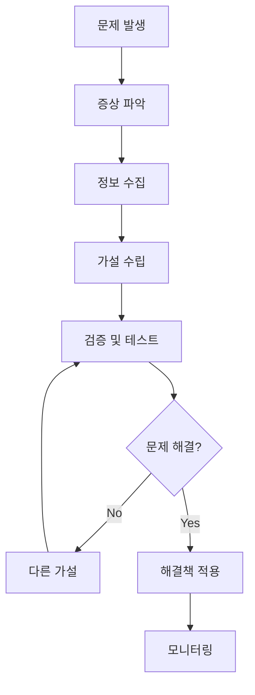

# 🔧 Kubernetes Troubleshooting 완벽 가이드

> 💡 **목표**: Kubernetes 환경에서 발생하는 다양한 문제를 체계적으로 진단하고 해결하는 방법을 마스터합니다.

## 📚 목차

1. [**문제 해결 방법론**](#문제-해결-방법론)
2. [**Pod 문제 해결**](#pod-문제-해결)
3. [**Service & Networking 문제**](#service--networking-문제)
4. [**Storage 문제**](#storage-문제)
5. [**Node 문제**](#node-문제)
6. [**Control Plane 문제**](#control-plane-문제)
7. [**성능 최적화**](#성능-최적화)
8. [**필수 도구와 명령어**](#필수-도구와-명령어)

---

## 🔍 문제 해결 방법론

### 체계적 접근법



### 진단 체크리스트

```bash
# 1. 클러스터 전체 상태
kubectl get nodes
kubectl get componentstatuses  # deprecated but useful
kubectl cluster-info

# 2. 리소스 상태
kubectl get all -A
kubectl top nodes
kubectl top pods -A

# 3. 이벤트 확인
kubectl get events -A --sort-by='.lastTimestamp'

# 4. 로그 확인
kubectl logs -n kube-system -l component=kube-apiserver
kubectl logs -n kube-system -l k8s-app=kube-dns

# 5. 네트워크 연결성
kubectl run test-pod --image=busybox --rm -it -- ping kubernetes.default
```

---

## 🎯 Pod 문제 해결

### Pod 상태별 문제 해결

#### Pending 상태

```bash
# 문제 진단
kubectl describe pod <pod-name>
kubectl get events --field-selector involvedObject.name=<pod-name>

# 일반적인 원인과 해결책
echo "=== Resource 부족 ==="
kubectl describe nodes | grep -A5 "Allocated resources"
kubectl top nodes

echo "=== Image Pull 문제 ==="
kubectl get pods -o wide | grep ImagePull
# 해결: 이미지 이름 확인, registry 접근 권한 확인

echo "=== Node Selector/Affinity 문제 ==="
kubectl get nodes --show-labels
# 해결: 노드 라벨 추가 또는 selector 수정

echo "=== PVC 바인딩 문제 ==="
kubectl get pvc
kubectl describe pvc <pvc-name>
# 해결: PV 생성 또는 StorageClass 확인
```

#### CrashLoopBackOff 상태

```bash
# 로그 확인
kubectl logs <pod-name> --previous
kubectl logs <pod-name> --tail=100

# 자주 발생하는 원인
echo "=== 설정 오류 ==="
kubectl get configmap <config-name> -o yaml
kubectl get secret <secret-name> -o yaml

echo "=== 리소스 부족 ==="
kubectl describe pod <pod-name> | grep -A10 "Limits\|Requests"

echo "=== Liveness Probe 실패 ==="
kubectl get pod <pod-name> -o yaml | grep -A10 "livenessProbe"
# 해결: Probe 설정 조정

# 임시 디버깅
kubectl run debug-pod --image=busybox --rm -it -- sh
```

#### ImagePullBackOff 상태

```yaml
# 문제 해결 예제
apiVersion: v1
kind: Pod
metadata:
  name: image-debug
spec:
  containers:
  - name: app
    # image: wrong-registry/my-app:latest  # 잘못된 이미지
    image: nginx:latest  # 수정된 이미지
    imagePullPolicy: Always
  imagePullSecrets:  # Private registry용
  - name: registry-secret

---
# Registry Secret 생성
apiVersion: v1
kind: Secret
type: kubernetes.io/dockerconfigjson
metadata:
  name: registry-secret
data:
  .dockerconfigjson: <base64-encoded-config>

# 또는 kubectl 명령으로
# kubectl create secret docker-registry registry-secret \
#   --docker-server=<registry> \
#   --docker-username=<username> \
#   --docker-password=<password> \
#   --docker-email=<email>
```

### Health Check 문제

```yaml
# 적절한 Probe 설정
apiVersion: v1
kind: Pod
metadata:
  name: health-check-example
spec:
  containers:
  - name: app
    image: nginx
    
    # Startup Probe (느린 시작 앱용)
    startupProbe:
      httpGet:
        path: /health
        port: 8080
      initialDelaySeconds: 0
      periodSeconds: 10
      timeoutSeconds: 3
      failureThreshold: 30  # 5분 대기
    
    # Liveness Probe
    livenessProbe:
      httpGet:
        path: /health
        port: 8080
        httpHeaders:
        - name: Custom-Header
          value: liveness
      initialDelaySeconds: 30
      periodSeconds: 10
      timeoutSeconds: 5
      successThreshold: 1
      failureThreshold: 3
    
    # Readiness Probe
    readinessProbe:
      httpGet:
        path: /ready
        port: 8080
      initialDelaySeconds: 5
      periodSeconds: 5
      timeoutSeconds: 3
      successThreshold: 1
      failureThreshold: 3
```

---

## 🌐 Service & Networking 문제

### Service Discovery 문제

```bash
# Service 연결성 테스트
kubectl run test-pod --image=busybox --rm -it -- nslookup kubernetes.default
kubectl run test-pod --image=busybox --rm -it -- nslookup <service-name>.<namespace>

# Service 상태 확인
kubectl get svc <service-name> -o wide
kubectl get endpoints <service-name>
kubectl describe svc <service-name>

# 일반적인 문제
echo "=== Selector 불일치 ==="
kubectl get svc <service-name> -o yaml | grep selector -A5
kubectl get pods --show-labels | grep <app-label>

echo "=== Port 설정 오류 ==="
kubectl get svc <service-name> -o jsonpath='{.spec.ports[*]}'
kubectl get pod <pod-name> -o jsonpath='{.spec.containers[*].ports[*]}'
```

### Network Policy 문제

```bash
# Network Policy 확인
kubectl get networkpolicies -A
kubectl describe networkpolicy <policy-name>

# CNI Plugin 상태 확인
kubectl get pods -n kube-system | grep -E "calico|flannel|weave|cilium"
kubectl logs -n kube-system <cni-pod-name>

# 네트워크 연결성 테스트
kubectl exec -it <pod-name> -- curl <service-ip>:<port>
kubectl exec -it <pod-name> -- telnet <service-ip> <port>
```

### DNS 문제

```bash
# DNS 설정 확인
kubectl get pods -n kube-system -l k8s-app=kube-dns
kubectl get svc -n kube-system kube-dns
kubectl describe configmap -n kube-system coredns

# DNS 해결 테스트
kubectl run dns-test --image=busybox --rm -it -- nslookup kubernetes.default.svc.cluster.local

# CoreDNS 로그 확인
kubectl logs -n kube-system -l k8s-app=kube-dns

# DNS 설정 디버깅
kubectl exec -it <pod-name> -- cat /etc/resolv.conf
kubectl exec -it <pod-name> -- dig kubernetes.default.svc.cluster.local
```

### Ingress 문제

```yaml
# Ingress 디버깅용 설정
apiVersion: networking.k8s.io/v1
kind: Ingress
metadata:
  name: debug-ingress
  annotations:
    nginx.ingress.kubernetes.io/rewrite-target: /
    nginx.ingress.kubernetes.io/ssl-redirect: "false"
    # 디버깅용 로깅 활성화
    nginx.ingress.kubernetes.io/enable-access-log: "true"
    nginx.ingress.kubernetes.io/configuration-snippet: |
      more_set_headers "X-Debug: true";
spec:
  rules:
  - host: debug.example.com
    http:
      paths:
      - path: /
        pathType: Prefix
        backend:
          service:
            name: debug-service
            port:
              number: 80

---
# Ingress Controller 상태 확인
# kubectl get pods -n ingress-nginx
# kubectl logs -n ingress-nginx <controller-pod>
# kubectl describe ingress <ingress-name>
```

---

## 💾 Storage 문제

### PVC 바인딩 문제

```bash
# PVC 상태 확인
kubectl get pvc
kubectl describe pvc <pvc-name>

# PV 상태 확인
kubectl get pv
kubectl describe pv <pv-name>

# StorageClass 확인
kubectl get storageclass
kubectl describe storageclass <sc-name>

# 일반적인 해결책
echo "=== PV 수동 생성 ==="
cat <<EOF | kubectl apply -f -
apiVersion: v1
kind: PersistentVolume
metadata:
  name: manual-pv
spec:
  capacity:
    storage: 1Gi
  accessModes:
    - ReadWriteOnce
  persistentVolumeReclaimPolicy: Retain
  storageClassName: manual
  hostPath:
    path: /tmp/data
EOF

echo "=== Dynamic Provisioning 문제 ==="
kubectl get pods -n kube-system | grep provisioner
kubectl logs -n kube-system <provisioner-pod>
```

### Volume Mount 문제

```yaml
# 권한 문제 해결
apiVersion: v1
kind: Pod
metadata:
  name: volume-permission-fix
spec:
  securityContext:
    runAsUser: 1000
    runAsGroup: 1000
    fsGroup: 2000  # 볼륨 권한 설정
  
  initContainers:
  - name: fix-permissions
    image: busybox
    command: ['sh', '-c']
    args:
    - |
      chown -R 1000:1000 /data
      chmod -R 755 /data
    securityContext:
      runAsUser: 0  # root로 권한 변경
    volumeMounts:
    - name: data
      mountPath: /data
  
  containers:
  - name: app
    image: nginx
    securityContext:
      runAsUser: 1000
      runAsNonRoot: true
    volumeMounts:
    - name: data
      mountPath: /usr/share/nginx/html
  
  volumes:
  - name: data
    persistentVolumeClaim:
      claimName: nginx-pvc
```

---

## 🖥️ Node 문제

### Node 상태 문제

```bash
# Node 상태 확인
kubectl get nodes -o wide
kubectl describe node <node-name>

# Node 조건 확인
kubectl get nodes -o custom-columns=NAME:.metadata.name,READY:.status.conditions[?(@.type==\"Ready\")].status,REASON:.status.conditions[?(@.type==\"Ready\")].reason

# 일반적인 문제들
echo "=== Disk Pressure ==="
kubectl describe node <node-name> | grep -A5 "DiskPressure"
# 해결: 디스크 정리 또는 확장

echo "=== Memory Pressure ==="
kubectl top node <node-name>
# 해결: 메모리 정리 또는 Pod 이동

echo "=== Network Unavailable ==="
kubectl describe node <node-name> | grep -A5 "NetworkUnavailable"
# 해결: CNI 재시작, 네트워크 설정 확인
```

### kubelet 문제

```bash
# kubelet 로그 확인 (각 노드에서)
journalctl -u kubelet -f

# kubelet 상태 확인
systemctl status kubelet

# kubelet 설정 확인
cat /var/lib/kubelet/config.yaml
cat /etc/kubernetes/kubelet.conf

# kubelet 재시작
sudo systemctl restart kubelet
```

### Resource 부족

```bash
# 리소스 사용량 확인
kubectl top nodes
kubectl top pods -A --sort-by=cpu
kubectl top pods -A --sort-by=memory

# 리소스 부족 Pod 찾기
kubectl get pods -A -o custom-columns=NAME:.metadata.name,NAMESPACE:.metadata.namespace,CPU_REQ:.spec.containers[*].resources.requests.cpu,MEM_REQ:.spec.containers[*].resources.requests.memory

# Node에서 직접 확인
df -h  # 디스크 사용량
free -h  # 메모리 사용량
cat /proc/loadavg  # CPU 부하
```

---

## 🎛️ Control Plane 문제

### API Server 문제

```bash
# API Server 상태 확인
kubectl get pods -n kube-system -l component=kube-apiserver
kubectl logs -n kube-system <apiserver-pod> --previous

# API Server 연결성 테스트
curl -k https://<api-server-ip>:6443/version
kubectl cluster-info

# 인증서 문제
openssl x509 -in /etc/kubernetes/pki/apiserver.crt -text -noout
```

### etcd 문제

```bash
# etcd 상태 확인
kubectl get pods -n kube-system -l component=etcd
kubectl logs -n kube-system <etcd-pod>

# etcd 직접 접근 (마스터 노드에서)
sudo ETCDCTL_API=3 etcdctl \
  --endpoints=https://127.0.0.1:2379 \
  --cacert=/etc/kubernetes/pki/etcd/ca.crt \
  --cert=/etc/kubernetes/pki/etcd/server.crt \
  --key=/etc/kubernetes/pki/etcd/server.key \
  endpoint health

# etcd 백업 및 복구
sudo ETCDCTL_API=3 etcdctl snapshot save /backup/etcd-snapshot.db \
  --endpoints=https://127.0.0.1:2379 \
  --cacert=/etc/kubernetes/pki/etcd/ca.crt \
  --cert=/etc/kubernetes/pki/etcd/server.crt \
  --key=/etc/kubernetes/pki/etcd/server.key
```

### Scheduler 문제

```bash
# Scheduler 상태 확인
kubectl get pods -n kube-system -l component=kube-scheduler
kubectl logs -n kube-system <scheduler-pod>

# 스케줄링 실패 이벤트 확인
kubectl get events --field-selector reason=FailedScheduling
kubectl describe pod <pending-pod>
```

---

## ⚡ 성능 최적화

### CPU 병목 해결

```bash
# CPU 사용량이 높은 Pod 찾기
kubectl top pods -A --sort-by=cpu

# CPU throttling 확인
kubectl exec <pod-name> -- cat /sys/fs/cgroup/cpu/cpu.stat | grep throttled

# 해결책
cat <<EOF | kubectl apply -f -
apiVersion: v1
kind: Pod
metadata:
  name: cpu-optimized
spec:
  containers:
  - name: app
    resources:
      requests:
        cpu: "500m"
      limits:
        cpu: "2"  # CPU limit 증가
EOF
```

### Memory 최적화

```bash
# 메모리 사용량 확인
kubectl top pods -A --sort-by=memory

# OOM Killed Pod 찾기
kubectl get events | grep OOMKilling

# JVM 애플리케이션 최적화
cat <<EOF | kubectl apply -f -
apiVersion: v1
kind: Pod
metadata:
  name: java-optimized
spec:
  containers:
  - name: app
    image: openjdk:11
    env:
    - name: JAVA_OPTS
      value: "-Xmx1g -Xms512m -XX:+UseG1GC"
    resources:
      requests:
        memory: "1Gi"
      limits:
        memory: "1.5Gi"
EOF
```

### Network 최적화

```yaml
# Network latency 최적화
apiVersion: v1
kind: Pod
metadata:
  name: network-optimized
spec:
  dnsPolicy: ClusterFirst
  dnsConfig:
    options:
    - name: ndots
      value: "1"  # DNS 쿼리 최적화
  containers:
  - name: app
    image: nginx
    resources:
      requests:
        cpu: "100m"
        memory: "128Mi"
```

---

## 🛠️ 필수 도구와 명령어

### 기본 진단 명령어

```bash
#!/bin/bash
# k8s-diagnostic.sh - Kubernetes 진단 스크립트

echo "=== Cluster Information ==="
kubectl cluster-info
kubectl version --short

echo "=== Node Status ==="
kubectl get nodes -o wide
kubectl describe nodes | grep -E "Name:|Taints:|Conditions:" -A5

echo "=== Pod Status ==="
kubectl get pods -A -o wide | grep -v Running

echo "=== Recent Events ==="
kubectl get events -A --sort-by='.lastTimestamp' | tail -20

echo "=== Resource Usage ==="
kubectl top nodes
kubectl top pods -A --sort-by=cpu | head -10

echo "=== Storage Status ==="
kubectl get pv,pvc -A
kubectl get sc

echo "=== Network ==="
kubectl get svc -A | grep -v ClusterIP
kubectl get ingress -A
```

### 고급 디버깅 도구

```bash
# 네트워크 문제 진단용 Pod
kubectl run netshoot --image=nicolaka/netshoot --rm -it

# 멀티 목적 디버깅 Pod
kubectl run debug --image=busybox --rm -it

# 특정 노드에서 실행
kubectl run node-debug --image=busybox --rm -it \
  --overrides='{"spec":{"nodeSelector":{"kubernetes.io/hostname":"worker-1"}}}'

# 호스트 네트워크 모드
kubectl run host-debug --image=busybox --rm -it \
  --overrides='{"spec":{"hostNetwork":true}}'
```

### 유용한 kubectl 플러그인

```bash
# kubectl-debug 설치 (ephemeral containers)
kubectl krew install debug

# kubectl-tree 설치 (리소스 관계 시각화)
kubectl krew install tree
kubectl tree deployment nginx-deployment

# kubectl-who-can 설치 (RBAC 확인)
kubectl krew install who-can
kubectl who-can create pods

# kubectl-outdated 설치 (구버전 리소스 찾기)
kubectl krew install outdated
kubectl outdated
```

### 모니터링 설정

```yaml
# 클러스터 모니터링을 위한 DaemonSet
apiVersion: apps/v1
kind: DaemonSet
metadata:
  name: node-problem-detector
  namespace: kube-system
spec:
  selector:
    matchLabels:
      app: node-problem-detector
  template:
    metadata:
      labels:
        app: node-problem-detector
    spec:
      hostNetwork: true
      hostPID: true
      containers:
      - name: node-problem-detector
        image: k8s.gcr.io/node-problem-detector:v0.8.12
        securityContext:
          privileged: true
        volumeMounts:
        - name: log
          mountPath: /var/log
          readOnly: true
        - name: kmsg
          mountPath: /dev/kmsg
          readOnly: true
      volumes:
      - name: log
        hostPath:
          path: /var/log/
      - name: kmsg
        hostPath:
          path: /dev/kmsg
```

### 자동화된 Health Check

```bash
#!/bin/bash
# health-check.sh - 주기적 헬스체크

check_nodes() {
  echo "Checking node health..."
  NOT_READY=$(kubectl get nodes | grep -v Ready | grep -c NotReady)
  if [ $NOT_READY -gt 0 ]; then
    echo "WARNING: $NOT_READY nodes are not ready"
    kubectl get nodes | grep NotReady
  fi
}

check_pods() {
  echo "Checking pod health..."
  FAILING_PODS=$(kubectl get pods -A | grep -v Running | grep -v Completed | wc -l)
  if [ $FAILING_PODS -gt 0 ]; then
    echo "WARNING: $FAILING_PODS pods are not running properly"
    kubectl get pods -A | grep -v Running | grep -v Completed
  fi
}

check_resources() {
  echo "Checking resource usage..."
  kubectl top nodes
  kubectl top pods -A --sort-by=cpu | head -5
}

main() {
  echo "=== Kubernetes Health Check $(date) ==="
  check_nodes
  check_pods
  check_resources
  echo "=== Health Check Complete ==="
}

main
```

---

> 🚀 체계적인 문제 해결 접근법으로 Kubernetes 환경을 안정적으로 운영하세요!