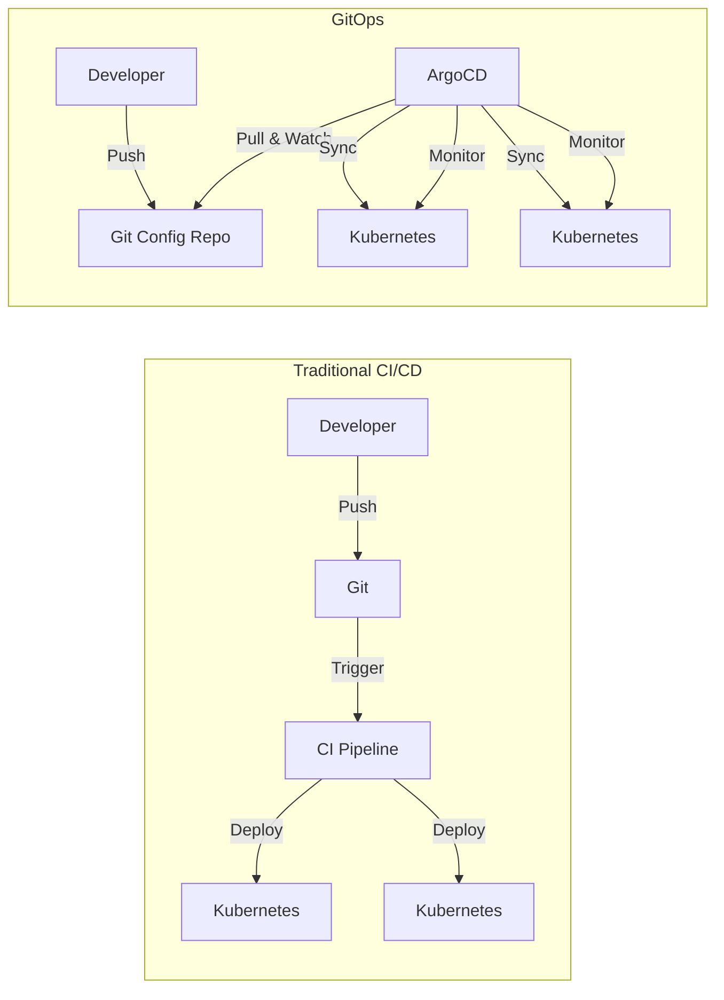

# 🔄 GitOps with ArgoCD 완벽 가이드

> 💡 **목표**: GitOps 원칙을 이해하고 ArgoCD를 활용한 선언적 배포 파이프라인을 구축합니다.

## 📚 목차

1. [**GitOps 개념**](#gitops-개념)
2. [**ArgoCD 설치와 설정**](#argocd-설치와-설정)
3. [**Application 배포**](#application-배포)
4. [**고급 배포 전략**](#고급-배포-전략)
5. [**멀티 클러스터 관리**](#멀티-클러스터-관리)
6. [**실전 CI/CD 파이프라인**](#실전-cicd-파이프라인)
7. [**Best Practices**](#best-practices)

---

## 🎯 GitOps 개념

### GitOps란?

Git을 단일 진실의 소스(Single Source of Truth)로 사용하는 운영 모델



### GitOps 원칙

| 원칙 | 설명 |
|-----|------|
| **선언적** | 모든 시스템을 선언적으로 정의 |
| **버전 관리** | 모든 설정을 Git으로 버전 관리 |
| **자동 적용** | 승인된 변경사항 자동 적용 |
| **지속적 조정** | 실제 상태와 원하는 상태 지속 비교 |

### Push vs Pull 모델

| 특성 | Push (전통적) | Pull (GitOps) |
|------|-------------|--------------|
| **보안** | CI가 클러스터 접근 필요 | 클러스터가 Git만 접근 |
| **네트워크** | 외부에서 내부 접근 | 내부에서 외부 접근 |
| **확장성** | 클러스터마다 설정 | 자동 확장 |
| **감사** | 별도 로깅 필요 | Git 히스토리 = 감사 로그 |

---

## 🚀 ArgoCD 설치와 설정

### 1. ArgoCD 설치

```bash
# Namespace 생성
kubectl create namespace argocd

# ArgoCD 설치
kubectl apply -n argocd -f https://raw.githubusercontent.com/argoproj/argo-cd/stable/manifests/install.yaml

# 또는 Helm으로 설치
helm repo add argo https://argoproj.github.io/argo-helm
helm install argocd argo/argo-cd \
  --namespace argocd \
  --create-namespace \
  --set server.service.type=LoadBalancer \
  --set configs.params."server.insecure"=true
```

### 2. ArgoCD CLI 설치

```bash
# macOS
brew install argocd

# Linux
curl -sSL -o argocd https://github.com/argoproj/argo-cd/releases/latest/download/argocd-linux-amd64
chmod +x argocd
sudo mv argocd /usr/local/bin/

# Windows
choco install argocd-cli
```

### 3. 초기 설정

```bash
# 초기 admin 비밀번호 확인
kubectl -n argocd get secret argocd-initial-admin-secret \
  -o jsonpath="{.data.password}" | base64 -d

# Port Forward로 접속
kubectl port-forward svc/argocd-server -n argocd 8080:443

# CLI 로그인
argocd login localhost:8080 \
  --username admin \
  --password $(kubectl -n argocd get secret argocd-initial-admin-secret -o jsonpath="{.data.password}" | base64 -d)

# 비밀번호 변경
argocd account update-password
```

### 4. Ingress 설정

```yaml
apiVersion: networking.k8s.io/v1
kind: Ingress
metadata:
  name: argocd-server-ingress
  namespace: argocd
  annotations:
    kubernetes.io/ingress.class: nginx
    nginx.ingress.kubernetes.io/ssl-redirect: "true"
    nginx.ingress.kubernetes.io/backend-protocol: "HTTPS"
    cert-manager.io/cluster-issuer: letsencrypt-prod
spec:
  tls:
  - hosts:
    - argocd.example.com
    secretName: argocd-tls
  rules:
  - host: argocd.example.com
    http:
      paths:
      - path: /
        pathType: Prefix
        backend:
          service:
            name: argocd-server
            port:
              number: 443
```

---

## 📦 Application 배포

### 1. Git Repository 구조

```bash
# 애플리케이션 구조
my-app/
├── base/                    # Kustomize base
│   ├── deployment.yaml
│   ├── service.yaml
│   ├── configmap.yaml
│   └── kustomization.yaml
├── overlays/               # 환경별 설정
│   ├── development/
│   │   ├── kustomization.yaml
│   │   └── config-patch.yaml
│   ├── staging/
│   │   ├── kustomization.yaml
│   │   └── replica-patch.yaml
│   └── production/
│       ├── kustomization.yaml
│       ├── resource-patch.yaml
│       └── ingress.yaml
├── helm/                   # Helm charts
│   └── my-chart/
│       ├── Chart.yaml
│       ├── values.yaml
│       ├── values-dev.yaml
│       ├── values-prod.yaml
│       └── templates/
└── apps/                   # ArgoCD Applications
    ├── dev-app.yaml
    ├── staging-app.yaml
    └── prod-app.yaml
```

### 2. ArgoCD Application 생성

```yaml
# argocd-app.yaml
apiVersion: argoproj.io/v1alpha1
kind: Application
metadata:
  name: my-app-production
  namespace: argocd
  finalizers:
    - resources-finalizer.argocd.argoproj.io
spec:
  project: default
  
  source:
    repoURL: https://github.com/myorg/k8s-config
    targetRevision: HEAD
    path: overlays/production
    
    # Helm 사용 시
    # helm:
    #   valueFiles:
    #     - values-prod.yaml
    #   parameters:
    #     - name: image.tag
    #       value: v1.2.3
    
    # Kustomize 사용 시
    # kustomize:
    #   namePrefix: prod-
    #   images:
    #     - myapp=myapp:v1.2.3
  
  destination:
    server: https://kubernetes.default.svc
    namespace: production
  
  syncPolicy:
    automated:
      prune: true      # Git에서 삭제된 리소스 자동 삭제
      selfHeal: true   # 수동 변경 시 자동 복구
      allowEmpty: false
    syncOptions:
    - CreateNamespace=true
    - PrunePropagationPolicy=foreground
    - PruneLast=true
    retry:
      limit: 5
      backoff:
        duration: 5s
        factor: 2
        maxDuration: 3m
```

### 3. CLI로 Application 생성

```bash
# Git repo 추가
argocd repo add https://github.com/myorg/k8s-config \
  --username $GITHUB_USER \
  --password $GITHUB_TOKEN

# Application 생성
argocd app create my-app \
  --repo https://github.com/myorg/k8s-config \
  --path overlays/production \
  --dest-server https://kubernetes.default.svc \
  --dest-namespace production \
  --sync-policy automated \
  --auto-prune \
  --self-heal

# 수동 동기화
argocd app sync my-app

# 상태 확인
argocd app get my-app
argocd app resources my-app
argocd app history my-app
```

### 4. ApplicationSet (여러 앱 관리)

```yaml
apiVersion: argoproj.io/v1alpha1
kind: ApplicationSet
metadata:
  name: multi-env-apps
  namespace: argocd
spec:
  generators:
  - list:
      elements:
      - env: dev
        namespace: development
        cluster: https://dev.k8s.local
      - env: staging
        namespace: staging
        cluster: https://staging.k8s.local
      - env: prod
        namespace: production
        cluster: https://prod.k8s.local
  
  template:
    metadata:
      name: '{{env}}-app'
    spec:
      project: default
      source:
        repoURL: https://github.com/myorg/k8s-config
        targetRevision: HEAD
        path: 'overlays/{{env}}'
      destination:
        server: '{{cluster}}'
        namespace: '{{namespace}}'
      syncPolicy:
        automated:
          prune: true
          selfHeal: true
```

---

## 🎯 고급 배포 전략

### 1. Progressive Delivery with Argo Rollouts

```yaml
# Canary 배포
apiVersion: argoproj.io/v1alpha1
kind: Rollout
metadata:
  name: my-app-rollout
spec:
  replicas: 10
  strategy:
    canary:
      canaryService: my-app-canary
      stableService: my-app-stable
      trafficRouting:
        nginx:
          stableIngress: my-app-ingress
      steps:
      - setWeight: 10
      - pause: {duration: 1m}
      - setWeight: 20
      - pause: {duration: 2m}
      - analysis:
          templates:
          - templateName: success-rate
          args:
          - name: service-name
            value: my-app-canary
      - setWeight: 50
      - pause: {duration: 3m}
      - setWeight: 80
      - pause: {duration: 5m}
  selector:
    matchLabels:
      app: my-app
  template:
    metadata:
      labels:
        app: my-app
    spec:
      containers:
      - name: app
        image: myapp:v2.0.0
        
---
# Analysis Template
apiVersion: argoproj.io/v1alpha1
kind: AnalysisTemplate
metadata:
  name: success-rate
spec:
  args:
  - name: service-name
  metrics:
  - name: success-rate
    interval: 1m
    count: 5
    successCondition: result[0] >= 0.95
    failureLimit: 3
    provider:
      prometheus:
        address: http://prometheus:9090
        query: |
          sum(rate(http_requests_total{job="{{args.service-name}}",status=~"2.."}[5m])) /
          sum(rate(http_requests_total{job="{{args.service-name}}"}[5m]))
```

### 2. Blue-Green 배포

```yaml
apiVersion: argoproj.io/v1alpha1
kind: Rollout
metadata:
  name: my-app-bluegreen
spec:
  replicas: 5
  strategy:
    blueGreen:
      activeService: my-app-active
      previewService: my-app-preview
      autoPromotionEnabled: false
      scaleDownDelaySeconds: 30
      prePromotionAnalysis:
        templates:
        - templateName: smoke-tests
  selector:
    matchLabels:
      app: my-app
  template:
    spec:
      containers:
      - name: app
        image: myapp:v2.0.0
```

### 3. Multi-Stage 배포

```yaml
# Stage 1: Development (자동 배포)
apiVersion: argoproj.io/v1alpha1
kind: Application
metadata:
  name: app-dev
spec:
  source:
    path: overlays/development
    targetRevision: develop
  syncPolicy:
    automated:
      prune: true
      selfHeal: true

---
# Stage 2: Staging (수동 승인)
apiVersion: argoproj.io/v1alpha1
kind: Application
metadata:
  name: app-staging
spec:
  source:
    path: overlays/staging
    targetRevision: main
  syncPolicy:
    automated: false  # 수동 동기화

---
# Stage 3: Production (PR 승인 후)
apiVersion: argoproj.io/v1alpha1
kind: Application
metadata:
  name: app-prod
spec:
  source:
    path: overlays/production
    targetRevision: v1.2.3  # 태그 사용
  syncPolicy:
    automated:
      prune: false  # 프로덕션은 수동 삭제
      selfHeal: true
```

---

## 🌍 멀티 클러스터 관리

### 1. 클러스터 등록

```bash
# 클러스터 추가
argocd cluster add production-cluster \
  --name prod \
  --grpc-web

argocd cluster add staging-cluster \
  --name staging \
  --grpc-web

# 클러스터 목록
argocd cluster list
```

### 2. App of Apps 패턴

```yaml
# root-app.yaml
apiVersion: argoproj.io/v1alpha1
kind: Application
metadata:
  name: root-app
  namespace: argocd
spec:
  project: default
  source:
    repoURL: https://github.com/myorg/argocd-apps
    targetRevision: HEAD
    path: apps
  destination:
    server: https://kubernetes.default.svc
    namespace: argocd
  syncPolicy:
    automated:
      prune: true
      selfHeal: true

---
# apps/cluster-apps.yaml
apiVersion: argoproj.io/v1alpha1
kind: ApplicationSet
metadata:
  name: cluster-apps
spec:
  generators:
  - clusters: {}  # 모든 등록된 클러스터
  template:
    metadata:
      name: '{{name}}-infra'
    spec:
      project: default
      source:
        repoURL: https://github.com/myorg/k8s-infra
        targetRevision: HEAD
        path: 'clusters/{{name}}'
      destination:
        server: '{{server}}'
        namespace: argocd
```

### 3. 멀티 테넌트 구성

```yaml
# AppProject로 격리
apiVersion: argoproj.io/v1alpha1
kind: AppProject
metadata:
  name: team-a
  namespace: argocd
spec:
  description: Team A Project
  
  sourceRepos:
  - 'https://github.com/myorg/team-a-*'
  
  destinations:
  - namespace: 'team-a-*'
    server: https://kubernetes.default.svc
  
  clusterResourceWhitelist:
  - group: ''
    kind: Namespace
  
  namespaceResourceWhitelist:
  - group: '*'
    kind: '*'
  
  roles:
  - name: admin
    policies:
    - p, proj:team-a:admin, applications, *, team-a/*, allow
    groups:
    - team-a-admins
  
  - name: developer
    policies:
    - p, proj:team-a:developer, applications, get, team-a/*, allow
    - p, proj:team-a:developer, applications, sync, team-a/*, allow
    groups:
    - team-a-developers
```

---

## 🔄 실전 CI/CD 파이프라인

### 1. GitHub Actions + ArgoCD

```yaml
# .github/workflows/deploy.yml
name: Deploy to Kubernetes

on:
  push:
    branches: [main]
    paths:
    - 'src/**'
    - 'Dockerfile'

jobs:
  build-and-push:
    runs-on: ubuntu-latest
    outputs:
      image-tag: ${{ steps.meta.outputs.tags }}
    
    steps:
    - uses: actions/checkout@v3
    
    - name: Set up Docker Buildx
      uses: docker/setup-buildx-action@v2
    
    - name: Login to Registry
      uses: docker/login-action@v2
      with:
        registry: ghcr.io
        username: ${{ github.actor }}
        password: ${{ secrets.GITHUB_TOKEN }}
    
    - name: Generate metadata
      id: meta
      uses: docker/metadata-action@v4
      with:
        images: ghcr.io/${{ github.repository }}
        tags: |
          type=ref,event=branch
          type=sha,prefix={{branch}}-
    
    - name: Build and push
      uses: docker/build-push-action@v4
      with:
        push: true
        tags: ${{ steps.meta.outputs.tags }}
        cache-from: type=gha
        cache-to: type=gha,mode=max
  
  update-manifest:
    needs: build-and-push
    runs-on: ubuntu-latest
    
    steps:
    - uses: actions/checkout@v3
      with:
        repository: myorg/k8s-config
        token: ${{ secrets.DEPLOY_TOKEN }}
        path: k8s-config
    
    - name: Update image tag
      run: |
        cd k8s-config
        IMAGE_TAG=${{ needs.build-and-push.outputs.image-tag }}
        sed -i "s|image: .*|image: ${IMAGE_TAG}|g" overlays/production/deployment.yaml
    
    - name: Commit and push
      run: |
        cd k8s-config
        git config user.name "GitHub Actions"
        git config user.email "actions@github.com"
        git add .
        git commit -m "Update image to ${IMAGE_TAG}"
        git push
```

### 2. Webhook 통합

```yaml
# ArgoCD Webhook 설정
apiVersion: v1
kind: ConfigMap
metadata:
  name: argocd-notifications-cm
  namespace: argocd
data:
  service.webhook.github: |
    url: https://api.github.com/repos/myorg/myrepo
    headers:
    - name: Authorization
      value: token $github-token
  
  template.app-deployed: |
    webhook:
      github:
        method: POST
        path: /statuses/{{.app.status.sync.revision}}
        body: |
          {
            "state": "success",
            "description": "Deployment successful",
            "context": "ArgoCD"
          }
  
  trigger.on-deployed: |
    - when: app.status.operationState.phase in ['Succeeded']
      send: [app-deployed]
```

### 3. Slack 알림

```yaml
apiVersion: v1
kind: ConfigMap
metadata:
  name: argocd-notifications-cm
data:
  service.slack: |
    token: $slack-token
  
  template.app-sync-succeeded: |
    message: |
      {{if eq .serviceType "slack"}}:white_check_mark:{{end}} Application {{.app.metadata.name}} is synced.
      Sync Status: {{.app.status.sync.status}}
      Health: {{.app.status.health.status}}
      Revision: {{.app.status.sync.revision}}
  
  trigger.on-sync-succeeded: |
    - when: app.status.operationState.phase in ['Succeeded']
      send: [app-sync-succeeded]
```

---

## ✅ Best Practices

### 1. Git Repository 전략

```bash
# Repository 분리
app-code/           # 애플리케이션 코드
├── src/
├── Dockerfile
└── .github/workflows/

k8s-config/         # Kubernetes 매니페스트
├── base/
├── overlays/
└── apps/

helm-charts/        # Helm Charts
├── charts/
└── releases/
```

### 2. 보안

```yaml
# 1. Private Repository 인증
apiVersion: v1
kind: Secret
metadata:
  name: private-repo
  namespace: argocd
  labels:
    argocd.argoproj.io/secret-type: repository
stringData:
  type: git
  url: https://github.com/myorg/private-repo
  username: $GITHUB_USER
  password: $GITHUB_TOKEN

---
# 2. Sealed Secrets 사용
apiVersion: bitnami.com/v1alpha1
kind: SealedSecret
metadata:
  name: my-secret
  namespace: production
spec:
  encryptedData:
    password: AgXZO...  # 암호화된 데이터

---
# 3. RBAC 설정
apiVersion: v1
kind: ConfigMap
metadata:
  name: argocd-rbac-cm
data:
  policy.default: role:readonly
  policy.csv: |
    p, role:admin, applications, *, */*, allow
    p, role:developer, applications, get, */*, allow
    p, role:developer, applications, sync, */*, allow
    g, argocd-admins, role:admin
    g, developers, role:developer
```

### 3. 모니터링

```yaml
# Prometheus 메트릭
apiVersion: v1
kind: ServiceMonitor
metadata:
  name: argocd-metrics
spec:
  selector:
    matchLabels:
      app.kubernetes.io/name: argocd-metrics
  endpoints:
  - port: metrics
    interval: 30s
    path: /metrics

---
# 대시보드 ID
# Grafana: 14584 (ArgoCD)
```

### 4. Disaster Recovery

```bash
# 백업
# 1. Application 백업
argocd app list -o yaml > apps-backup.yaml

# 2. Repository/Cluster 설정 백업
kubectl get secrets,configmaps -n argocd -o yaml > argocd-backup.yaml

# 3. 전체 백업 (Velero)
velero backup create argocd-backup --include-namespaces argocd

# 복구
kubectl apply -f argocd-backup.yaml
argocd app create -f apps-backup.yaml
```

---

## 🔧 트러블슈팅

### Sync 실패

```bash
# 상태 확인
argocd app get my-app

# 수동 동기화 (강제)
argocd app sync my-app --force

# Hook 건너뛰기
argocd app sync my-app --skip-hooks

# 특정 리소스만 동기화
argocd app sync my-app --resource Deployment:my-deployment
```

### OutOfSync 상태

```bash
# Diff 확인
argocd app diff my-app

# 로컬 변경 무시
kubectl annotate deployment my-deployment \
  argocd.argoproj.io/sync-options=Prune=false

# Refresh
argocd app refresh my-app
```

### 성능 최적화

```yaml
# Redis HA
apiVersion: v1
kind: ConfigMap
metadata:
  name: argocd-server-config
data:
  redis.server: "redis-ha-haproxy:6379"
  
# Repository 캐시
  timeout.reconciliation: "60s"
  repositories: |
    - url: https://github.com/myorg/config
      passwordSecret:
        name: repo-secret
        key: password
      cacheDuration: "1h"
```

---

## 💡 고급 팁

### 1. Kustomize + Helm 조합

```yaml
apiVersion: argoproj.io/v1alpha1
kind: Application
spec:
  source:
    plugin:
      name: kustomized-helm
      env:
        - name: HELM_VALUES
          value: |
            image:
              tag: v1.2.3
```

### 2. Image Updater

```yaml
# 자동 이미지 업데이트
apiVersion: v1
kind: Application
metadata:
  annotations:
    argocd-image-updater.argoproj.io/image-list: myapp=myregistry/myapp
    argocd-image-updater.argoproj.io/myapp.update-strategy: latest
    argocd-image-updater.argoproj.io/write-back-method: git
```

### 3. Jsonnet 지원

```jsonnet
// application.jsonnet
local app = import 'lib/app.libsonnet';

app.new('my-app', 'production') {
  image: 'myapp:v1.2.3',
  replicas: 5,
  resources: {
    requests: { cpu: '100m', memory: '128Mi' },
    limits: { cpu: '500m', memory: '512Mi' },
  },
}
```

---

> 🚀 GitOps와 ArgoCD로 선언적이고 자동화된 배포 파이프라인을 구축했습니다!