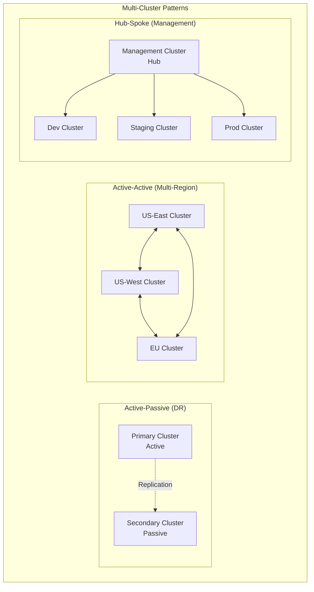

# 🌐 Multi-Cluster Kubernetes 완벽 가이드

> 💡 **목표**: Multi-Cluster Kubernetes 환경을 구축하고 관리하여 고가용성, 재해복구, 지역별 배포를 구현하는 방법을 마스터합니다.

## 📚 목차

1. [**Multi-Cluster 개념**](#multi-cluster-개념)
2. [**Cluster Federation**](#cluster-federation)
3. [**Multi-Cluster Service Discovery**](#multi-cluster-service-discovery)
4. [**Cross-Cluster Networking**](#cross-cluster-networking)
5. [**배포 전략**](#배포-전략)
6. [**데이터 동기화**](#데이터-동기화)
7. [**모니터링과 관리**](#모니터링과-관리)
8. [**Best Practices**](#best-practices)

---

## 🎯 Multi-Cluster 개념

### Multi-Cluster 아키텍처 패턴



### Multi-Cluster 사용 사례

| 사용 사례 | 설명 | 장점 |
|-----------|------|------|
| **Disaster Recovery** | 주/보조 클러스터로 백업 | RTO/RPO 단축 |
| **Multi-Region** | 지역별 클러스터 배포 | 지연시간 감소, 규정 준수 |
| **Blue-Green** | 클러스터 단위 배포 | 무중단 배포 |
| **Resource Bursting** | 부하 분산용 확장 | 비용 최적화 |
| **Environment Isolation** | 개발/스테이징/프로덕션 분리 | 격리된 환경 |

---

## 🔗 Cluster Federation

### Kubernetes Cluster Federation v2

```yaml
# Federation Control Plane 설치
apiVersion: v1
kind: Namespace
metadata:
  name: federation-system

---
# FederatedCluster 정의
apiVersion: core.federation.k8s.io/v1beta1
kind: FederatedCluster
metadata:
  name: cluster-1
  namespace: federation-system
spec:
  clusterRef:
    name: cluster-1
  apiEndpoint: https://cluster-1.example.com:6443
  secretRef:
    name: cluster-1-secret

---
apiVersion: core.federation.k8s.io/v1beta1
kind: FederatedCluster
metadata:
  name: cluster-2
  namespace: federation-system
spec:
  clusterRef:
    name: cluster-2
  apiEndpoint: https://cluster-2.example.com:6443
  secretRef:
    name: cluster-2-secret
```

### Federated Resources

```yaml
# FederatedDeployment
apiVersion: types.federation.k8s.io/v1beta1
kind: FederatedDeployment
metadata:
  name: test-deployment
  namespace: test-namespace
spec:
  template:
    metadata:
      labels:
        app: nginx
    spec:
      replicas: 3
      selector:
        matchLabels:
          app: nginx
      template:
        metadata:
          labels:
            app: nginx
        spec:
          containers:
          - image: nginx
            name: nginx
  
  placement:
    clusters:
    - name: cluster-1
    - name: cluster-2
  
  overrides:
  - clusterName: cluster-1
    clusterOverrides:
    - path: "spec.replicas"
      value: 5
  - clusterName: cluster-2
    clusterOverrides:
    - path: "spec.replicas"
      value: 2

---
# FederatedService
apiVersion: types.federation.k8s.io/v1beta1
kind: FederatedService
metadata:
  name: test-service
  namespace: test-namespace
spec:
  template:
    spec:
      type: LoadBalancer
      selector:
        app: nginx
      ports:
      - port: 80
        targetPort: 80
  
  placement:
    clusters:
    - name: cluster-1
    - name: cluster-2
```

---

## 🔍 Multi-Cluster Service Discovery

### Admiral (Service Discovery)

```yaml
# Admiral 설치
apiVersion: v1
kind: Namespace
metadata:
  name: admiral-sync

---
apiVersion: apps/v1
kind: Deployment
metadata:
  name: admiral
  namespace: admiral-sync
spec:
  replicas: 1
  selector:
    matchLabels:
      app: admiral
  template:
    metadata:
      labels:
        app: admiral
    spec:
      serviceAccountName: admiral
      containers:
      - name: admiral
        image: istio/admiral:latest
        env:
        - name: ADMIRAL_PARAMS
          value: |
            clusters=cluster1=https://cluster1.example.com,cluster2=https://cluster2.example.com
        - name: LOG_LEVEL
          value: "info"
        ports:
        - containerPort: 8080

---
# GlobalTrafficPolicy
apiVersion: admiral.io/v1alpha1
kind: GlobalTrafficPolicy
metadata:
  name: productpage-gtp
spec:
  selector:
    identity: productpage
  policy:
  - dns: productpage.global
    lbType: 1  # Round Robin
    target:
    - region: us-west-2
      weight: 50
    - region: us-east-1  
      weight: 50
```

### Service Mesh Multi-Cluster (Istio)

```yaml
# Primary Cluster 설정
apiVersion: install.istio.io/v1alpha1
kind: IstioOperator
metadata:
  name: primary
spec:
  values:
    pilot:
      env:
        EXTERNAL_ISTIOD: true
    global:
      meshID: mesh1
      multiCluster:
        clusterName: primary
      network: network1

---
# Remote Cluster 설정
apiVersion: install.istio.io/v1alpha1
kind: IstioOperator
metadata:
  name: remote
spec:
  values:
    pilot:
      env:
        EXTERNAL_ISTIOD: true
    global:
      meshID: mesh1
      multiCluster:
        clusterName: remote
      network: network2
      remotePilotAddress: <DISCOVERY_ADDRESS>

---
# Cross-cluster service
apiVersion: networking.istio.io/v1beta1
kind: ServiceEntry
metadata:
  name: cross-cluster-service
spec:
  hosts:
  - productpage.production.global
  location: MESH_EXTERNAL
  ports:
  - number: 9080
    name: http
    protocol: HTTP
  resolution: DNS
  addresses:
  - 240.0.0.1  # Virtual IP
  endpoints:
  - address: productpage.production.svc.cluster.local
    network: network1
    locality: region1/zone1
    ports:
      http: 9080
  - address: productpage.production.svc.cluster.local
    network: network2
    locality: region2/zone1
    ports:
      http: 9080
```

### Submariner (Cross-Cluster Connectivity)

```bash
# Submariner Broker 설치 (중앙 클러스터)
subctl deploy-broker

# Cluster join
subctl join --kubeconfig cluster1.yaml broker-info.subm
subctl join --kubeconfig cluster2.yaml broker-info.subm

# 연결성 확인
subctl verify --kubeconfig cluster1.yaml --tocontext cluster2

# Service Export
kubectl label service my-service multicluster.x-k8s.io/service-export=true
```

```yaml
# ServiceExport
apiVersion: multicluster.x-k8s.io/v1alpha1
kind: ServiceExport
metadata:
  name: nginx-service
spec: {}

---
# ServiceImport (자동 생성됨)
apiVersion: multicluster.x-k8s.io/v1alpha1
kind: ServiceImport
metadata:
  name: nginx-service
spec:
  type: ClusterSetIP
  ports:
  - port: 80
    protocol: TCP
    targetPort: 80
```

---

## 🌐 Cross-Cluster Networking

### VPN 기반 연결

```yaml
# IPSec VPN 설정 (strongSwan)
apiVersion: v1
kind: ConfigMap
metadata:
  name: strongswan-config
data:
  ipsec.conf: |
    config setup
        charondebug="all"
        uniqueids=yes
        strictcrlpolicy=no

    conn cluster-to-cluster
        auto=start
        left=10.1.0.1
        leftsubnet=10.1.0.0/16
        right=10.2.0.1
        rightsubnet=10.2.0.0/16
        ike=aes256-sha2_256-modp2048!
        esp=aes256-sha2_256!
        keyingtries=0
        ikelifetime=1h
        lifetime=8h
        dpddelay=30
        dpdtimeout=120
        dpdaction=restart
        authby=secret

  ipsec.secrets: |
    10.1.0.1 10.2.0.1 : PSK "your-pre-shared-key"

---
apiVersion: apps/v1
kind: DaemonSet
metadata:
  name: strongswan
  namespace: kube-system
spec:
  selector:
    matchLabels:
      app: strongswan
  template:
    metadata:
      labels:
        app: strongswan
    spec:
      hostNetwork: true
      containers:
      - name: strongswan
        image: strongswan:latest
        securityContext:
          privileged: true
        volumeMounts:
        - name: config
          mountPath: /etc/ipsec.conf
          subPath: ipsec.conf
        - name: secrets
          mountPath: /etc/ipsec.secrets
          subPath: ipsec.secrets
      volumes:
      - name: config
        configMap:
          name: strongswan-config
```

### WireGuard 기반 연결

```yaml
# WireGuard 설정
apiVersion: v1
kind: Secret
metadata:
  name: wireguard-config
type: Opaque
data:
  privatekey: <base64-encoded-private-key>
  publickey: <base64-encoded-public-key>

---
apiVersion: apps/v1
kind: DaemonSet
metadata:
  name: wireguard
  namespace: kube-system
spec:
  selector:
    matchLabels:
      app: wireguard
  template:
    metadata:
      labels:
        app: wireguard
    spec:
      hostNetwork: true
      containers:
      - name: wireguard
        image: linuxserver/wireguard:latest
        securityContext:
          privileged: true
          capabilities:
            add: ["NET_ADMIN"]
        env:
        - name: PUID
          value: "1000"
        - name: PGID
          value: "1000"
        volumeMounts:
        - name: wg-config
          mountPath: /config/wg0.conf
          subPath: wg0.conf
      volumes:
      - name: wg-config
        configMap:
          name: wireguard-config
```

---

## 🚀 배포 전략

### GitOps Multi-Cluster (ArgoCD)

```yaml
# ArgoCD ApplicationSet for Multi-Cluster
apiVersion: argoproj.io/v1alpha1
kind: ApplicationSet
metadata:
  name: multi-cluster-apps
spec:
  generators:
  - clusters:
      selector:
        matchLabels:
          environment: production
  template:
    metadata:
      name: '{{name}}-app'
    spec:
      project: default
      source:
        repoURL: https://github.com/company/k8s-manifests
        targetRevision: HEAD
        path: apps/{{name}}
        helm:
          valueFiles:
          - values-{{name}}.yaml
      destination:
        server: '{{server}}'
        namespace: default
      syncPolicy:
        automated:
          prune: true
          selfHeal: true

---
# Cluster-specific Application
apiVersion: argoproj.io/v1alpha1
kind: Application
metadata:
  name: us-west-app
spec:
  project: default
  source:
    repoURL: https://github.com/company/k8s-manifests
    targetRevision: HEAD
    path: apps/regional
    helm:
      valueFiles:
      - values-us-west.yaml
      parameters:
      - name: global.cluster
        value: us-west
      - name: global.region
        value: us-west-2
  destination:
    server: https://us-west-cluster.example.com
    namespace: production
```

### Flux Multi-Cluster

```yaml
# Flux GitRepository
apiVersion: source.toolkit.fluxcd.io/v1beta2
kind: GitRepository
metadata:
  name: multi-cluster-repo
spec:
  interval: 1m
  ref:
    branch: main
  url: https://github.com/company/k8s-config

---
# Cluster-specific Kustomization
apiVersion: kustomize.toolkit.fluxcd.io/v1beta2
kind: Kustomization
metadata:
  name: cluster-us-east
spec:
  interval: 5m
  path: ./clusters/us-east
  prune: true
  sourceRef:
    kind: GitRepository
    name: multi-cluster-repo
  postBuild:
    substitute:
      cluster_name: "us-east"
      region: "us-east-1"

---
apiVersion: kustomize.toolkit.fluxcd.io/v1beta2
kind: Kustomization
metadata:
  name: cluster-us-west
spec:
  interval: 5m
  path: ./clusters/us-west
  prune: true
  sourceRef:
    kind: GitRepository
    name: multi-cluster-repo
  postBuild:
    substitute:
      cluster_name: "us-west"
      region: "us-west-2"
```

### Helm Multi-Cluster

```yaml
# Values template for multi-cluster
# values-template.yaml
global:
  cluster: {{ .Values.cluster }}
  region: {{ .Values.region }}
  
image:
  repository: myapp
  tag: "1.0.0"

service:
  type: LoadBalancer
  annotations:
    service.beta.kubernetes.io/aws-load-balancer-type: nlb
    service.beta.kubernetes.io/aws-load-balancer-cross-zone-load-balancing-enabled: "true"

resources:
  limits:
    cpu: 500m
    memory: 512Mi
  requests:
    cpu: 100m
    memory: 128Mi

# Cluster-specific overrides
nodeSelector:
  {{- if eq .Values.cluster "us-west" }}
  topology.kubernetes.io/zone: us-west-2a
  {{- else if eq .Values.cluster "us-east" }}
  topology.kubernetes.io/zone: us-east-1a
  {{- end }}

tolerations:
  {{- if eq .Values.cluster "spot-cluster" }}
  - key: spot
    operator: Equal
    value: "true"
    effect: NoSchedule
  {{- end }}
```

```bash
# Multi-cluster deployment script
#!/bin/bash

CLUSTERS=("us-east" "us-west" "eu-central")

for cluster in "${CLUSTERS[@]}"; do
  echo "Deploying to $cluster..."
  
  helm upgrade --install myapp ./helm-chart \
    --kubeconfig ~/.kube/config-$cluster \
    --namespace production \
    --create-namespace \
    --set global.cluster=$cluster \
    --set global.region=$(get_region $cluster) \
    --values values-$cluster.yaml
done
```

---

## 🔄 데이터 동기화

### StatefulSet Multi-Cluster Replication

```yaml
# Primary MySQL Cluster
apiVersion: apps/v1
kind: StatefulSet
metadata:
  name: mysql-primary
  namespace: database
spec:
  serviceName: mysql-primary
  replicas: 3
  selector:
    matchLabels:
      app: mysql
      role: primary
  template:
    metadata:
      labels:
        app: mysql
        role: primary
    spec:
      containers:
      - name: mysql
        image: mysql:8.0
        env:
        - name: MYSQL_ROOT_PASSWORD
          valueFrom:
            secretKeyRef:
              name: mysql-secret
              key: root-password
        - name: MYSQL_REPLICATION_MODE
          value: "master"
        - name: MYSQL_REPLICATION_USER
          value: "replicator"
        - name: MYSQL_REPLICATION_PASSWORD
          valueFrom:
            secretKeyRef:
              name: mysql-secret
              key: replication-password
        ports:
        - containerPort: 3306
        volumeMounts:
        - name: mysql-data
          mountPath: /var/lib/mysql
  volumeClaimTemplates:
  - metadata:
      name: mysql-data
    spec:
      accessModes: ["ReadWriteOnce"]
      resources:
        requests:
          storage: 100Gi

---
# Secondary MySQL Cluster (다른 클러스터)
apiVersion: apps/v1
kind: StatefulSet
metadata:
  name: mysql-secondary
  namespace: database
spec:
  serviceName: mysql-secondary
  replicas: 2
  selector:
    matchLabels:
      app: mysql
      role: secondary
  template:
    metadata:
      labels:
        app: mysql
        role: secondary
    spec:
      containers:
      - name: mysql
        image: mysql:8.0
        env:
        - name: MYSQL_ROOT_PASSWORD
          valueFrom:
            secretKeyRef:
              name: mysql-secret
              key: root-password
        - name: MYSQL_REPLICATION_MODE
          value: "slave"
        - name: MYSQL_MASTER_HOST
          value: "mysql-primary.database.cluster1.example.com"
        - name: MYSQL_REPLICATION_USER
          value: "replicator"
        - name: MYSQL_REPLICATION_PASSWORD
          valueFrom:
            secretKeyRef:
              name: mysql-secret
              key: replication-password
```

### External-DNS Multi-Cluster

```yaml
# External-DNS for multi-cluster
apiVersion: apps/v1
kind: Deployment
metadata:
  name: external-dns
spec:
  selector:
    matchLabels:
      app: external-dns
  template:
    metadata:
      labels:
        app: external-dns
    spec:
      serviceAccountName: external-dns
      containers:
      - name: external-dns
        image: k8s.gcr.io/external-dns/external-dns:v0.13.1
        args:
        - --source=service
        - --source=ingress
        - --domain-filter=example.com
        - --provider=aws
        - --policy=upsert-only
        - --aws-zone-type=public
        - --registry=txt
        - --txt-owner-id=cluster-us-east
        - --txt-prefix=cluster-us-east-
        env:
        - name: AWS_DEFAULT_REGION
          value: us-east-1

---
# Multi-cluster service with geoDNS
apiVersion: v1
kind: Service
metadata:
  name: frontend
  annotations:
    external-dns.alpha.kubernetes.io/hostname: app.example.com
    external-dns.alpha.kubernetes.io/set-identifier: us-east-1
    external-dns.alpha.kubernetes.io/aws-geolocation-continent-code: NA
    external-dns.alpha.kubernetes.io/aws-health-check-id: frontend-health-check
spec:
  type: LoadBalancer
  ports:
  - port: 80
    targetPort: 8080
  selector:
    app: frontend
```

---

## 📊 모니터링과 관리

### Prometheus Federation

```yaml
# Global Prometheus (Federation)
apiVersion: v1
kind: ConfigMap
metadata:
  name: prometheus-global-config
data:
  prometheus.yml: |
    global:
      scrape_interval: 15s
      external_labels:
        cluster: 'global'
        region: 'global'
    
    scrape_configs:
    - job_name: 'federate-us-east'
      scrape_interval: 15s
      honor_labels: true
      metrics_path: '/federate'
      params:
        'match[]':
          - '{job=~"kubernetes-.*"}'
          - '{__name__=~"job:.*"}'
      static_configs:
      - targets:
        - 'prometheus.us-east.example.com:9090'
    
    - job_name: 'federate-us-west'
      scrape_interval: 15s
      honor_labels: true
      metrics_path: '/federate'
      params:
        'match[]':
          - '{job=~"kubernetes-.*"}'
          - '{__name__=~"job:.*"}'
      static_configs:
      - targets:
        - 'prometheus.us-west.example.com:9090'

---
# Cluster-specific Prometheus
apiVersion: v1
kind: ConfigMap
metadata:
  name: prometheus-cluster-config
data:
  prometheus.yml: |
    global:
      scrape_interval: 15s
      external_labels:
        cluster: 'us-east-1'
        region: 'us-east'
    
    scrape_configs:
    - job_name: 'kubernetes-apiservers'
      kubernetes_sd_configs:
      - role: endpoints
      scheme: https
      tls_config:
        ca_file: /var/run/secrets/kubernetes.io/serviceaccount/ca.crt
      bearer_token_file: /var/run/secrets/kubernetes.io/serviceaccount/token
      relabel_configs:
      - source_labels: [__meta_kubernetes_namespace, __meta_kubernetes_service_name, __meta_kubernetes_endpoint_port_name]
        action: keep
        regex: default;kubernetes;https
```

### Grafana Multi-Cluster Dashboard

```json
{
  "dashboard": {
    "title": "Multi-Cluster Overview",
    "panels": [
      {
        "title": "Cluster Status",
        "type": "stat",
        "targets": [
          {
            "expr": "up{job=\"kubernetes-apiservers\"} by (cluster)",
            "legendFormat": "{{cluster}}"
          }
        ]
      },
      {
        "title": "Cross-Cluster Request Rate",
        "type": "graph",
        "targets": [
          {
            "expr": "sum(rate(http_requests_total[5m])) by (cluster, source_cluster)",
            "legendFormat": "{{cluster}} <- {{source_cluster}}"
          }
        ]
      },
      {
        "title": "Service Mesh Cross-Cluster Traffic",
        "type": "graph",
        "targets": [
          {
            "expr": "sum(rate(istio_requests_total{source_cluster!=\"unknown\",destination_cluster!=\"unknown\"}[5m])) by (source_cluster, destination_cluster)",
            "legendFormat": "{{source_cluster}} -> {{destination_cluster}}"
          }
        ]
      }
    ]
  }
}
```

### Jaeger Multi-Cluster Tracing

```yaml
# Jaeger Collector with multi-cluster support
apiVersion: jaegertracing.io/v1
kind: Jaeger
metadata:
  name: multi-cluster-jaeger
spec:
  strategy: production
  collector:
    replicas: 3
    config: |
      receivers:
        otlp:
          protocols:
            grpc:
              endpoint: 0.0.0.0:14250
            http:
              endpoint: 0.0.0.0:14268
      processors:
        batch:
          send_batch_size: 1024
          timeout: 5s
        resource:
          attributes:
          - key: cluster.name
            from_attribute: cluster
            action: upsert
      exporters:
        jaeger:
          endpoint: jaeger-collector:14250
          tls:
            insecure: true
  
  storage:
    type: elasticsearch
    elasticsearch:
      nodeCount: 3
      redundancyPolicy: SingleRedundancy
      storage:
        storageClassName: "fast-ssd"
        size: 100Gi
```

---

## ✅ Best Practices

### 1. 네트워킹 보안

```yaml
# NetworkPolicy for cross-cluster communication
apiVersion: networking.k8s.io/v1
kind: NetworkPolicy
metadata:
  name: cross-cluster-policy
spec:
  podSelector:
    matchLabels:
      app: cross-cluster-service
  policyTypes:
  - Ingress
  - Egress
  ingress:
  - from:
    # 다른 클러스터의 특정 CIDR만 허용
    - ipBlock:
        cidr: 10.2.0.0/16  # 다른 클러스터 CIDR
    - namespaceSelector:
        matchLabels:
          name: istio-system  # Service Mesh 트래픽
    ports:
    - protocol: TCP
      port: 8080
  egress:
  - to:
    - ipBlock:
        cidr: 10.2.0.0/16
    ports:
    - protocol: TCP
      port: 8080
```

### 2. 데이터 일관성

```yaml
# Database consistency check job
apiVersion: batch/v1
kind: CronJob
metadata:
  name: db-consistency-check
spec:
  schedule: "0 */4 * * *"  # 4시간마다
  jobTemplate:
    spec:
      template:
        spec:
          containers:
          - name: consistency-check
            image: consistency-checker:latest
            env:
            - name: PRIMARY_DB_HOST
              value: "mysql-primary.cluster1.example.com"
            - name: SECONDARY_DB_HOST
              value: "mysql-secondary.cluster2.example.com"
            - name: SLACK_WEBHOOK
              valueFrom:
                secretKeyRef:
                  name: notification-secret
                  key: slack-webhook
            command:
            - /bin/sh
            - -c
            - |
              echo "Checking database consistency..."
              
              PRIMARY_COUNT=$(mysql -h $PRIMARY_DB_HOST -u checker -e "SELECT COUNT(*) FROM users" | tail -1)
              SECONDARY_COUNT=$(mysql -h $SECONDARY_DB_HOST -u checker -e "SELECT COUNT(*) FROM users" | tail -1)
              
              if [ "$PRIMARY_COUNT" != "$SECONDARY_COUNT" ]; then
                echo "Inconsistency detected: Primary=$PRIMARY_COUNT, Secondary=$SECONDARY_COUNT"
                curl -X POST -H 'Content-type: application/json' \
                  --data "{\"text\":\"Database inconsistency: Primary=$PRIMARY_COUNT, Secondary=$SECONDARY_COUNT\"}" \
                  $SLACK_WEBHOOK
                exit 1
              fi
              
              echo "Database consistency check passed"
          restartPolicy: Never
```

### 3. 장애 복구 자동화

```yaml
# Automated failover controller
apiVersion: apps/v1
kind: Deployment
metadata:
  name: failover-controller
spec:
  replicas: 1
  selector:
    matchLabels:
      app: failover-controller
  template:
    metadata:
      labels:
        app: failover-controller
    spec:
      containers:
      - name: controller
        image: failover-controller:latest
        env:
        - name: PRIMARY_CLUSTER
          value: "https://primary.example.com"
        - name: SECONDARY_CLUSTER  
          value: "https://secondary.example.com"
        - name: DNS_PROVIDER
          value: "route53"
        - name: HEALTH_CHECK_INTERVAL
          value: "30s"
        command:
        - /bin/sh
        - -c
        - |
          while true; do
            if ! curl -f $PRIMARY_CLUSTER/healthz; then
              echo "Primary cluster unhealthy, initiating failover..."
              
              # Update DNS to point to secondary
              aws route53 change-resource-record-sets \
                --hosted-zone-id Z1D633PJN98FT9 \
                --change-batch '{
                  "Changes": [{
                    "Action": "UPSERT",
                    "ResourceRecordSet": {
                      "Name": "app.example.com",
                      "Type": "A",
                      "TTL": 60,
                      "ResourceRecords": [{"Value": "'$SECONDARY_IP'"}]
                    }
                  }]
                }'
              
              # Notify operations team
              curl -X POST $SLACK_WEBHOOK \
                -d '{"text":"Automatic failover initiated to secondary cluster"}'
              
              sleep 300  # Wait 5 minutes before checking again
            fi
            sleep 30
          done
```

### 4. Cost Optimization

```yaml
# Spot instance cluster configuration
apiVersion: v1
kind: Node
metadata:
  name: spot-cluster-config
  labels:
    node.kubernetes.io/lifecycle: spot
    node.kubernetes.io/instance-type: m5.large
spec:
  taints:
  - key: spot
    value: "true"
    effect: NoSchedule

---
# Workload suitable for spot instances
apiVersion: apps/v1
kind: Deployment
metadata:
  name: batch-processor
spec:
  replicas: 10
  selector:
    matchLabels:
      app: batch-processor
  template:
    metadata:
      labels:
        app: batch-processor
    spec:
      nodeSelector:
        node.kubernetes.io/lifecycle: spot
      tolerations:
      - key: spot
        operator: Equal
        value: "true"
        effect: NoSchedule
      containers:
      - name: processor
        image: batch-processor:latest
        resources:
          requests:
            cpu: 100m
            memory: 256Mi
          limits:
            cpu: 500m
            memory: 512Mi
```

---

## 🔧 트러블슈팅

### 네트워크 연결성 문제

```bash
# Cross-cluster connectivity test
kubectl run network-test --image=busybox --rm -it -- sh

# DNS resolution test
nslookup service.namespace.svc.cluster.local

# Cross-cluster service test
wget -O- http://service.namespace.cluster2.local/health

# VPN tunnel status
kubectl exec -n kube-system daemonset/strongswan -- ipsec status

# Submariner connectivity
subctl verify --kubeconfig cluster1.yaml --tocontext cluster2
```

### Service Discovery 문제

```bash
# ServiceExport/ServiceImport 확인
kubectl get serviceexport -A
kubectl get serviceimport -A

# Admiral 상태 확인
kubectl logs -n admiral-sync deployment/admiral

# DNS 전파 확인
kubectl run dns-test --image=busybox --rm -it -- nslookup service.global
```

### 데이터 동기화 문제

```bash
# MySQL replication 상태 확인
kubectl exec mysql-primary-0 -- mysql -u root -p -e "SHOW MASTER STATUS;"
kubectl exec mysql-secondary-0 -- mysql -u root -p -e "SHOW SLAVE STATUS\G;"

# 데이터 일관성 확인
kubectl exec mysql-primary-0 -- mysql -u root -p -e "SELECT COUNT(*) FROM users;"
kubectl exec mysql-secondary-0 -- mysql -u root -p -e "SELECT COUNT(*) FROM users;"
```

---

## 💡 고급 팁

### 1. GitOps Multi-Cluster 자동화

```yaml
# ArgoCD ApplicationSet with PR-based environments
apiVersion: argoproj.io/v1alpha1
kind: ApplicationSet
metadata:
  name: pr-environments
spec:
  generators:
  - pullRequest:
      github:
        owner: company
        repo: k8s-manifests
        tokenRef:
          secretName: github-token
          key: token
  template:
    metadata:
      name: 'pr-{{number}}-{{branch}}'
    spec:
      source:
        repoURL: https://github.com/company/k8s-manifests
        targetRevision: '{{head_sha}}'
        path: manifests
      destination:
        server: https://dev-cluster.example.com
        namespace: 'pr-{{number}}'
```

### 2. 비용 최적화 자동화

```yaml
# Cluster auto-scaler for cost optimization
apiVersion: apps/v1
kind: Deployment
metadata:
  name: cost-optimizer
spec:
  template:
    spec:
      containers:
      - name: optimizer
        image: cost-optimizer:latest
        env:
        - name: PROMETHEUS_URL
          value: "http://prometheus.monitoring.svc.cluster.local:9090"
        - name: CLUSTER_CONFIGS
          value: |
            clusters:
            - name: primary
              min_nodes: 3
              max_nodes: 100
              cost_per_hour: 0.5
            - name: spot
              min_nodes: 0
              max_nodes: 50
              cost_per_hour: 0.15
        command:
        - /bin/sh
        - -c
        - |
          while true; do
            # Get current load
            LOAD=$(curl -s "$PROMETHEUS_URL/api/v1/query?query=avg(rate(container_cpu_usage_seconds_total[5m]))")
            
            # Scale spot cluster based on load
            if [ "$LOAD" > "0.7" ]; then
              kubectl scale deployment batch-jobs --replicas=20 \
                --kubeconfig ~/.kube/spot-cluster
            else
              kubectl scale deployment batch-jobs --replicas=5 \
                --kubeconfig ~/.kube/spot-cluster
            fi
            
            sleep 300  # Check every 5 minutes
          done
```

### 3. Disaster Recovery 자동화

```bash
#!/bin/bash
# dr-failover.sh - Automated DR failover script

PRIMARY_CLUSTER="https://primary.example.com"
DR_CLUSTER="https://dr.example.com"

# Health check function
check_cluster_health() {
  local cluster=$1
  kubectl --server=$cluster get nodes --no-headers | \
    awk '{if($2=="Ready") ready++; total++} END {print ready/total*100}'
}

# Failover function  
initiate_failover() {
  echo "Initiating failover to DR cluster..."
  
  # 1. Stop writes to primary DB
  kubectl --server=$PRIMARY_CLUSTER patch deployment mysql \
    -p '{"spec":{"replicas":0}}'
  
  # 2. Promote DR database to primary
  kubectl --server=$DR_CLUSTER exec mysql-0 -- \
    mysql -u root -p -e "STOP SLAVE; RESET MASTER;"
  
  # 3. Update DNS
  aws route53 change-resource-record-sets \
    --hosted-zone-id Z1D633PJN98FT9 \
    --change-batch file://failover-dns.json
  
  # 4. Scale up DR applications
  kubectl --server=$DR_CLUSTER scale deployment web-app --replicas=5
  
  # 5. Notify team
  curl -X POST $SLACK_WEBHOOK \
    -d '{"text":"DR failover completed successfully"}'
}

# Main logic
PRIMARY_HEALTH=$(check_cluster_health $PRIMARY_CLUSTER)
if [ $(echo "$PRIMARY_HEALTH < 50" | bc -l) -eq 1 ]; then
  initiate_failover
fi
```

---

> 🚀 Multi-Cluster Kubernetes는 현대적인 클라우드 네이티브 아키텍처의 필수 요소입니다!