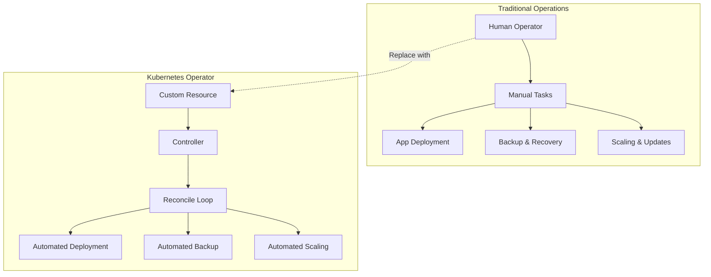

# ⚙️ Kubernetes Operators 완벽 가이드

> 💡 **목표**: Kubernetes Operators의 개념을 이해하고, 직접 개발하며 운영하는 방법을 마스터합니다.

## 📚 목차

1. [**Operator 개념**](#operator-개념)
2. [**Custom Resources & Controllers**](#custom-resources--controllers)
3. [**Operator Framework**](#operator-framework)
4. [**실전 Operator 개발**](#실전-operator-개발)
5. [**인기 Operators**](#인기-operators)
6. [**Operator 운영**](#operator-운영)
7. [**Best Practices**](#best-practices)

---

## 🎯 Operator 개념

### Operator Pattern



### Operator vs Helm vs Plain YAML

| 기능 | Plain YAML | Helm Chart | Operator |
|------|------------|------------|----------|
| **배포** | ✅ | ✅ | ✅ |
| **설정 관리** | ❌ | ✅ | ✅ |
| **업데이트** | 수동 | 수동 | 자동 |
| **백업/복구** | 수동 | 수동 | 자동 |
| **모니터링** | 별도 | 별도 | 내장 |
| **자동 복구** | ❌ | ❌ | ✅ |
| **복잡한 로직** | ❌ | 제한적 | ✅ |

---

## 🔧 Custom Resources & Controllers

### Custom Resource Definition (CRD)

```yaml
apiVersion: apiextensions.k8s.io/v1
kind: CustomResourceDefinition
metadata:
  name: databases.example.com
spec:
  group: example.com
  versions:
  - name: v1
    served: true
    storage: true
    schema:
      openAPIV3Schema:
        type: object
        properties:
          spec:
            type: object
            properties:
              size:
                type: string
                pattern: "^[0-9]+Gi$"
              version:
                type: string
                enum: ["5.7", "8.0"]
              backup:
                type: object
                properties:
                  enabled:
                    type: boolean
                  schedule:
                    type: string
                required: ["enabled"]
            required: ["size", "version"]
          status:
            type: object
            properties:
              phase:
                type: string
                enum: ["Pending", "Running", "Failed"]
              conditions:
                type: array
                items:
                  type: object
                  properties:
                    type:
                      type: string
                    status:
                      type: string
                    reason:
                      type: string
                    message:
                      type: string
        required: ["spec"]
  scope: Namespaced
  names:
    plural: databases
    singular: database
    kind: Database
    shortNames: ["db"]

---
# Status subresource 활성화
apiVersion: apiextensions.k8s.io/v1
kind: CustomResourceDefinition
metadata:
  name: databases.example.com
spec:
  # ... (위와 동일)
  versions:
  - name: v1
    served: true
    storage: true
    subresources:
      status: {}  # Status subresource 활성화
      scale:      # Scale subresource (옵션)
        specReplicasPath: .spec.replicas
        statusReplicasPath: .status.replicas
    # ... schema 정의
```

### Custom Resource 사용

```yaml
# Database CR 생성
apiVersion: example.com/v1
kind: Database
metadata:
  name: my-mysql
  namespace: production
spec:
  size: "10Gi"
  version: "8.0"
  backup:
    enabled: true
    schedule: "0 2 * * *"
  config:
    maxConnections: 100
    queryTimeout: "30s"

---
# 여러 인스턴스
apiVersion: example.com/v1
kind: Database
metadata:
  name: analytics-db
  namespace: analytics
spec:
  size: "100Gi"
  version: "8.0"
  backup:
    enabled: true
    schedule: "0 1 * * *"
  replicas: 3  # 복제본 수
  config:
    maxConnections: 500
    queryTimeout: "60s"
```

### Validation과 Webhooks

```yaml
apiVersion: apiextensions.k8s.io/v1
kind: CustomResourceDefinition
metadata:
  name: databases.example.com
spec:
  group: example.com
  versions:
  - name: v1
    served: true
    storage: true
    schema:
      openAPIV3Schema:
        type: object
        properties:
          spec:
            type: object
            properties:
              version:
                type: string
                enum: ["5.7", "8.0"]
              size:
                type: string
                pattern: "^[1-9][0-9]*Gi$"
              replicas:
                type: integer
                minimum: 1
                maximum: 10
            required: ["version", "size"]
        required: ["spec"]
  scope: Namespaced
  names:
    plural: databases
    singular: database
    kind: Database

---
# Admission Webhook (고급)
apiVersion: admissionregistration.k8s.io/v1
kind: ValidatingAdmissionWebhook
metadata:
  name: database-validator
webhooks:
- name: validate.database.example.com
  clientConfig:
    service:
      name: database-webhook
      namespace: database-system
      path: /validate
  rules:
  - operations: ["CREATE", "UPDATE"]
    apiGroups: ["example.com"]
    apiVersions: ["v1"]
    resources: ["databases"]
```

---

## 🛠️ Operator Framework

### Operator SDK 시작하기

```bash
# Operator SDK 설치
curl -LO https://github.com/operator-framework/operator-sdk/releases/download/v1.34.1/operator-sdk_linux_amd64
sudo install operator-sdk_linux_amd64 /usr/local/bin/operator-sdk

# Go Operator 초기화
operator-sdk init --domain example.com --repo github.com/example/database-operator

# API 생성
operator-sdk create api --group database --version v1 --kind Database --resource --controller

# Webhook 생성 (옵션)
operator-sdk create webhook --group database --version v1 --kind Database --defaulting --programmatic-validation
```

### Go Controller 개발

```go
// api/v1/database_types.go
package v1

import (
    metav1 "k8s.io/apimachinery/pkg/apis/meta/v1"
)

// DatabaseSpec defines the desired state of Database
type DatabaseSpec struct {
    Size     string            `json:"size"`
    Version  string            `json:"version"`
    Backup   BackupSpec        `json:"backup,omitempty"`
    Config   map[string]string `json:"config,omitempty"`
    Replicas *int32            `json:"replicas,omitempty"`
}

type BackupSpec struct {
    Enabled  bool   `json:"enabled"`
    Schedule string `json:"schedule,omitempty"`
}

// DatabaseStatus defines the observed state of Database
type DatabaseStatus struct {
    Phase      string             `json:"phase,omitempty"`
    Conditions []metav1.Condition `json:"conditions,omitempty"`
    Replicas   int32              `json:"replicas,omitempty"`
}

// +kubebuilder:object:root=true
// +kubebuilder:subresource:status
// +kubebuilder:subresource:scale:specpath=.spec.replicas,statuspath=.status.replicas
// +kubebuilder:printcolumn:name="Version",type="string",JSONPath=".spec.version"
// +kubebuilder:printcolumn:name="Size",type="string",JSONPath=".spec.size"
// +kubebuilder:printcolumn:name="Phase",type="string",JSONPath=".status.phase"

// Database is the Schema for the databases API
type Database struct {
    metav1.TypeMeta   `json:",inline"`
    metav1.ObjectMeta `json:"metadata,omitempty"`

    Spec   DatabaseSpec   `json:"spec,omitempty"`
    Status DatabaseStatus `json:"status,omitempty"`
}

// +kubebuilder:object:root=true

// DatabaseList contains a list of Database
type DatabaseList struct {
    metav1.TypeMeta `json:",inline"`
    metav1.ListMeta `json:"metadata,omitempty"`
    Items           []Database `json:"items"`
}

func init() {
    SchemeBuilder.Register(&Database{}, &DatabaseList{})
}
```

### Controller Logic

```go
// controllers/database_controller.go
package controllers

import (
    "context"
    "fmt"
    "time"

    appsv1 "k8s.io/api/apps/v1"
    corev1 "k8s.io/api/core/v1"
    "k8s.io/apimachinery/pkg/api/errors"
    metav1 "k8s.io/apimachinery/pkg/apis/meta/v1"
    "k8s.io/apimachinery/pkg/runtime"
    "k8s.io/apimachinery/pkg/util/intstr"
    ctrl "sigs.k8s.io/controller-runtime"
    "sigs.k8s.io/controller-runtime/pkg/client"
    "sigs.k8s.io/controller-runtime/pkg/controller/controllerutil"

    databasev1 "github.com/example/database-operator/api/v1"
)

// DatabaseReconciler reconciles a Database object
type DatabaseReconciler struct {
    client.Client
    Scheme *runtime.Scheme
}

// +kubebuilder:rbac:groups=database.example.com,resources=databases,verbs=get;list;watch;create;update;patch;delete
// +kubebuilder:rbac:groups=database.example.com,resources=databases/status,verbs=get;update;patch
// +kubebuilder:rbac:groups=database.example.com,resources=databases/finalizers,verbs=update
// +kubebuilder:rbac:groups=apps,resources=deployments,verbs=get;list;watch;create;update;patch;delete
// +kubebuilder:rbac:groups=core,resources=services;persistentvolumeclaims,verbs=get;list;watch;create;update;patch;delete

func (r *DatabaseReconciler) Reconcile(ctx context.Context, req ctrl.Request) (ctrl.Result, error) {
    log := ctrl.LoggerFrom(ctx)

    // Database CR 가져오기
    var database databasev1.Database
    if err := r.Get(ctx, req.NamespacedName, &database); err != nil {
        if errors.IsNotFound(err) {
            log.Info("Database resource not found. Ignoring since object must be deleted")
            return ctrl.Result{}, nil
        }
        log.Error(err, "Failed to get Database")
        return ctrl.Result{}, err
    }

    // Finalizer 처리
    if database.ObjectMeta.DeletionTimestamp.IsZero() {
        if !controllerutil.ContainsFinalizer(&database, "database.example.com/finalizer") {
            controllerutil.AddFinalizer(&database, "database.example.com/finalizer")
            return ctrl.Result{}, r.Update(ctx, &database)
        }
    } else {
        if controllerutil.ContainsFinalizer(&database, "database.example.com/finalizer") {
            // 정리 작업 수행
            if err := r.cleanup(ctx, &database); err != nil {
                return ctrl.Result{}, err
            }
            controllerutil.RemoveFinalizer(&database, "database.example.com/finalizer")
            return ctrl.Result{}, r.Update(ctx, &database)
        }
        return ctrl.Result{}, nil
    }

    // PVC 생성
    if err := r.ensurePVC(ctx, &database); err != nil {
        return ctrl.Result{}, err
    }

    // Deployment 생성/업데이트
    if err := r.ensureDeployment(ctx, &database); err != nil {
        return ctrl.Result{}, err
    }

    // Service 생성
    if err := r.ensureService(ctx, &database); err != nil {
        return ctrl.Result{}, err
    }

    // Status 업데이트
    if err := r.updateStatus(ctx, &database); err != nil {
        return ctrl.Result{}, err
    }

    // 주기적 재조정
    return ctrl.Result{RequeueAfter: time.Minute * 5}, nil
}

func (r *DatabaseReconciler) ensureDeployment(ctx context.Context, db *databasev1.Database) error {
    deployment := &appsv1.Deployment{
        ObjectMeta: metav1.ObjectMeta{
            Name:      db.Name,
            Namespace: db.Namespace,
        },
        Spec: appsv1.DeploymentSpec{
            Replicas: db.Spec.Replicas,
            Selector: &metav1.LabelSelector{
                MatchLabels: map[string]string{
                    "app": db.Name,
                },
            },
            Template: corev1.PodTemplateSpec{
                ObjectMeta: metav1.ObjectMeta{
                    Labels: map[string]string{
                        "app": db.Name,
                    },
                },
                Spec: corev1.PodSpec{
                    Containers: []corev1.Container{{
                        Name:  "mysql",
                        Image: fmt.Sprintf("mysql:%s", db.Spec.Version),
                        Ports: []corev1.ContainerPort{{
                            ContainerPort: 3306,
                        }},
                        Env: []corev1.EnvVar{
                            {
                                Name:  "MYSQL_ROOT_PASSWORD",
                                Value: "rootpassword", // 실제로는 Secret 사용
                            },
                        },
                        VolumeM ounts: []corev1.VolumeMount{{
                            Name:      "data",
                            MountPath: "/var/lib/mysql",
                        }},
                    }},
                    Volumes: []corev1.Volume{{
                        Name: "data",
                        VolumeSource: corev1.VolumeSource{
                            PersistentVolumeClaim: &corev1.PersistentVolumeClaimVolumeSource{
                                ClaimName: db.Name + "-pvc",
                            },
                        },
                    }},
                },
            },
        },
    }

    // Owner Reference 설정
    if err := controllerutil.SetControllerReference(db, deployment, r.Scheme); err != nil {
        return err
    }

    // Create or Update
    if err := r.Client.Create(ctx, deployment); err != nil {
        if !errors.IsAlreadyExists(err) {
            return err
        }
        // Update existing deployment
        return r.Client.Update(ctx, deployment)
    }

    return nil
}

// SetupWithManager sets up the controller with the Manager.
func (r *DatabaseReconciler) SetupWithManager(mgr ctrl.Manager) error {
    return ctrl.NewControllerManagedBy(mgr).
        For(&databasev1.Database{}).
        Owns(&appsv1.Deployment{}).
        Owns(&corev1.Service{}).
        Owns(&corev1.PersistentVolumeClaim{}).
        Complete(r)
}
```

### Ansible Operator

```yaml
# playbooks/database.yml
---
- name: Database Operator
  hosts: localhost
  gather_facts: false
  vars:
    database_name: "{{ ansible_operator_meta.name }}"
    database_namespace: "{{ ansible_operator_meta.namespace }}"
    size: "{{ spec.size | default('10Gi') }}"
    version: "{{ spec.version | default('8.0') }}"
    replicas: "{{ spec.replicas | default(1) }}"

  tasks:
  - name: Create PVC
    kubernetes.core.k8s:
      definition:
        apiVersion: v1
        kind: PersistentVolumeClaim
        metadata:
          name: "{{ database_name }}-pvc"
          namespace: "{{ database_namespace }}"
        spec:
          accessModes:
          - ReadWriteOnce
          resources:
            requests:
              storage: "{{ size }}"

  - name: Create Deployment
    kubernetes.core.k8s:
      definition:
        apiVersion: apps/v1
        kind: Deployment
        metadata:
          name: "{{ database_name }}"
          namespace: "{{ database_namespace }}"
        spec:
          replicas: "{{ replicas }}"
          selector:
            matchLabels:
              app: "{{ database_name }}"
          template:
            metadata:
              labels:
                app: "{{ database_name }}"
            spec:
              containers:
              - name: mysql
                image: "mysql:{{ version }}"
                env:
                - name: MYSQL_ROOT_PASSWORD
                  value: "rootpassword"
                ports:
                - containerPort: 3306
                volumeMounts:
                - name: data
                  mountPath: /var/lib/mysql
              volumes:
              - name: data
                persistentVolumeClaim:
                  claimName: "{{ database_name }}-pvc"

  - name: Update Status
    kubernetes.core.k8s_status:
      api_version: database.example.com/v1
      kind: Database
      name: "{{ database_name }}"
      namespace: "{{ database_namespace }}"
      status:
        phase: "Running"
        conditions:
        - type: "Ready"
          status: "True"
          reason: "DatabaseCreated"
```

---

## 💼 실전 Operator 개발

### Redis Operator 예제

```go
// RedisCluster CRD
type RedisClusterSpec struct {
    Nodes      int32                       `json:"nodes"`
    Image      string                      `json:"image,omitempty"`
    Resources  corev1.ResourceRequirements `json:"resources,omitempty"`
    Storage    StorageSpec                 `json:"storage"`
    Config     map[string]string           `json:"config,omitempty"`
}

type StorageSpec struct {
    Size         string `json:"size"`
    StorageClass string `json:"storageClass,omitempty"`
}

type RedisClusterStatus struct {
    Phase       string             `json:"phase,omitempty"`
    Conditions  []metav1.Condition `json:"conditions,omitempty"`
    ReadyNodes  int32              `json:"readyNodes"`
    ClusterInfo string             `json:"clusterInfo,omitempty"`
}

// Controller Logic
func (r *RedisClusterReconciler) Reconcile(ctx context.Context, req ctrl.Request) (ctrl.Result, error) {
    var cluster redisv1.RedisCluster
    if err := r.Get(ctx, req.NamespacedName, &cluster); err != nil {
        return ctrl.Result{}, client.IgnoreNotFound(err)
    }

    // 1. StatefulSet 생성/업데이트
    if err := r.ensureStatefulSet(ctx, &cluster); err != nil {
        return ctrl.Result{}, err
    }

    // 2. Service 생성
    if err := r.ensureService(ctx, &cluster); err != nil {
        return ctrl.Result{}, err
    }

    // 3. Redis Cluster 초기화
    if cluster.Status.Phase != "Running" {
        if err := r.initializeCluster(ctx, &cluster); err != nil {
            return ctrl.Result{RequeueAfter: time.Minute}, err
        }
    }

    // 4. 노드 추가/제거 (스케일링)
    if err := r.handleScaling(ctx, &cluster); err != nil {
        return ctrl.Result{}, err
    }

    return ctrl.Result{RequeueAfter: time.Minute * 5}, nil
}

func (r *RedisClusterReconciler) initializeCluster(ctx context.Context, cluster *redisv1.RedisCluster) error {
    // Pod 목록 가져오기
    pods := &corev1.PodList{}
    if err := r.List(ctx, pods, client.InNamespace(cluster.Namespace), 
        client.MatchingLabels{"app": cluster.Name}); err != nil {
        return err
    }

    // 모든 Pod가 Ready 상태인지 확인
    readyPods := 0
    var podIPs []string
    for _, pod := range pods.Items {
        if pod.Status.Phase == corev1.PodRunning && pod.Status.PodIP != "" {
            readyPods++
            podIPs = append(podIPs, pod.Status.PodIP+":6379")
        }
    }

    if readyPods < int(cluster.Spec.Nodes) {
        return fmt.Errorf("waiting for all pods to be ready: %d/%d", 
            readyPods, cluster.Spec.Nodes)
    }

    // Redis cluster create 명령 실행
    cmd := fmt.Sprintf("redis-cli --cluster create %s --cluster-replicas 0 --cluster-yes",
        strings.Join(podIPs, " "))
    
    // 첫 번째 Pod에서 명령 실행
    if len(pods.Items) > 0 {
        if err := r.execInPod(ctx, &pods.Items[0], cmd); err != nil {
            return err
        }
    }

    // Status 업데이트
    cluster.Status.Phase = "Running"
    cluster.Status.ReadyNodes = int32(readyPods)
    return r.Status().Update(ctx, cluster)
}
```

### Backup Operator 통합

```go
// Backup CRD
type DatabaseBackup struct {
    metav1.TypeMeta   `json:",inline"`
    metav1.ObjectMeta `json:"metadata,omitempty"`
    
    Spec   DatabaseBackupSpec   `json:"spec,omitempty"`
    Status DatabaseBackupStatus `json:"status,omitempty"`
}

type DatabaseBackupSpec struct {
    DatabaseRef corev1.LocalObjectReference `json:"databaseRef"`
    Schedule    string                        `json:"schedule,omitempty"`
    Retention   int32                         `json:"retention,omitempty"`
    Destination BackupDestination             `json:"destination"`
}

type BackupDestination struct {
    S3 *S3Destination `json:"s3,omitempty"`
    PVC *PVCDestination `json:"pvc,omitempty"`
}

// Backup Controller
func (r *DatabaseBackupReconciler) Reconcile(ctx context.Context, req ctrl.Request) (ctrl.Result, error) {
    var backup databasev1.DatabaseBackup
    if err := r.Get(ctx, req.NamespacedName, &backup); err != nil {
        return ctrl.Result{}, client.IgnoreNotFound(err)
    }

    // CronJob 생성 (스케줄 백업)
    if backup.Spec.Schedule != "" {
        if err := r.ensureBackupCronJob(ctx, &backup); err != nil {
            return ctrl.Result{}, err
        }
    } else {
        // 즉시 백업
        if err := r.performBackup(ctx, &backup); err != nil {
            return ctrl.Result{}, err
        }
    }

    return ctrl.Result{}, nil
}
```

---

## 🚀 인기 Operators

### Prometheus Operator

```yaml
# ServiceMonitor 예제
apiVersion: monitoring.coreos.com/v1
kind: ServiceMonitor
metadata:
  name: my-app-monitor
spec:
  selector:
    matchLabels:
      app: my-app
  endpoints:
  - port: metrics
    interval: 30s
    path: /metrics

---
# PrometheusRule 예제
apiVersion: monitoring.coreos.com/v1
kind: PrometheusRule
metadata:
  name: my-app-rules
spec:
  groups:
  - name: my-app.rules
    rules:
    - alert: HighCPUUsage
      expr: cpu_usage > 80
      for: 5m
      annotations:
        summary: "High CPU usage detected"

---
# Prometheus 인스턴스
apiVersion: monitoring.coreos.com/v1
kind: Prometheus
metadata:
  name: prometheus
spec:
  serviceAccountName: prometheus
  serviceMonitorSelector: {}
  ruleSelector: {}
  resources:
    requests:
      memory: 400Mi
  retention: 30d
  storage:
    volumeClaimTemplate:
      spec:
        accessModes: ["ReadWriteOnce"]
        resources:
          requests:
            storage: 10Gi
```

### Cert-Manager

```yaml
# ClusterIssuer
apiVersion: cert-manager.io/v1
kind: ClusterIssuer
metadata:
  name: letsencrypt-prod
spec:
  acme:
    server: https://acme-v02.api.letsencrypt.org/directory
    email: admin@example.com
    privateKeySecretRef:
      name: letsencrypt-prod
    solvers:
    - http01:
        ingress:
          class: nginx

---
# Certificate
apiVersion: cert-manager.io/v1
kind: Certificate
metadata:
  name: example-tls
spec:
  secretName: example-tls
  issuerRef:
    name: letsencrypt-prod
    kind: ClusterIssuer
  dnsNames:
  - example.com
  - www.example.com
```

### ArgoCD Operator

```yaml
apiVersion: argoproj.io/v1alpha1
kind: ArgoCD
metadata:
  name: argocd
spec:
  server:
    replicas: 2
    route:
      enabled: true
      host: argocd.example.com
  dex:
    config: |
      connectors:
      - type: github
        id: github
        name: GitHub
        config:
          clientID: $github-client-id
          clientSecret: $github-client-secret
  rbac:
    defaultPolicy: 'role:readonly'
    policy: |
      g, argocd-admins, role:admin
  repo:
    replicas: 2
```

---

## 🔧 Operator 운영

### 배포 및 업그레이드

```bash
# Operator 빌드 및 배포
make docker-build docker-push IMG=controller:latest
make deploy IMG=controller:latest

# Helm으로 배포
helm create database-operator-chart
helm install database-operator ./database-operator-chart

# OLM (Operator Lifecycle Manager) 사용
operator-sdk generate bundle --version 0.1.0
operator-sdk bundle validate ./bundle
operator-courier push ./bundle my-namespace my-package 0.1.0 $QUAY_TOKEN
```

### 모니터링

```yaml
# Operator 메트릭
apiVersion: v1
kind: Service
metadata:
  name: database-operator-metrics
spec:
  ports:
  - name: https
    port: 8443
    targetPort: https
  selector:
    control-plane: controller-manager

---
# ServiceMonitor
apiVersion: monitoring.coreos.com/v1
kind: ServiceMonitor
metadata:
  name: database-operator
spec:
  endpoints:
  - path: /metrics
    port: https
    scheme: https
    bearerTokenFile: /var/run/secrets/kubernetes.io/serviceaccount/token
    tlsConfig:
      insecureSkipVerify: true
  selector:
    matchLabels:
      control-plane: controller-manager
```

### 디버깅

```bash
# Operator 로그 확인
kubectl logs -n database-system deployment/database-operator-controller-manager

# Custom Resource 상태 확인
kubectl get databases -A
kubectl describe database my-database

# Controller 메트릭 확인
kubectl port-forward -n database-system service/database-operator-metrics 8443:8443
curl -k https://localhost:8443/metrics

# 이벤트 확인
kubectl get events --field-selector involvedObject.kind=Database
```

---

## ✅ Best Practices

### 1. 안전한 Controller 설계

```go
// Idempotent operations
func (r *DatabaseReconciler) ensureDeployment(ctx context.Context, db *Database) error {
    deployment := &appsv1.Deployment{}
    err := r.Get(ctx, types.NamespacedName{
        Name: db.Name, 
        Namespace: db.Namespace,
    }, deployment)
    
    if errors.IsNotFound(err) {
        // Create new deployment
        deployment = r.deploymentForDatabase(db)
        return r.Create(ctx, deployment)
    } else if err != nil {
        return err
    }
    
    // Update existing deployment if needed
    if !reflect.DeepEqual(deployment.Spec, r.deploymentSpecForDatabase(db)) {
        deployment.Spec = r.deploymentSpecForDatabase(db)
        return r.Update(ctx, deployment)
    }
    
    return nil
}

// Graceful error handling
func (r *DatabaseReconciler) Reconcile(ctx context.Context, req ctrl.Request) (ctrl.Result, error) {
    var database Database
    if err := r.Get(ctx, req.NamespacedName, &database); err != nil {
        return ctrl.Result{}, client.IgnoreNotFound(err)
    }
    
    // Set status to indicate reconciliation started
    database.Status.Phase = "Reconciling"
    if err := r.Status().Update(ctx, &database); err != nil {
        return ctrl.Result{}, err
    }
    
    // Main reconciliation logic
    if err := r.reconcileDatabase(ctx, &database); err != nil {
        // Update status with error
        database.Status.Phase = "Failed"
        database.Status.Conditions = append(database.Status.Conditions, metav1.Condition{
            Type: "Ready",
            Status: metav1.ConditionFalse,
            Reason: "ReconcileFailed",
            Message: err.Error(),
        })
        r.Status().Update(ctx, &database)
        return ctrl.Result{RequeueAfter: time.Minute}, err
    }
    
    return ctrl.Result{}, nil
}
```

### 2. Resource Management

```go
// Owner Reference 설정
func (r *DatabaseReconciler) createResource(ctx context.Context, owner *Database, obj client.Object) error {
    if err := controllerutil.SetControllerReference(owner, obj, r.Scheme); err != nil {
        return err
    }
    return r.Create(ctx, obj)
}

// Finalizer 패턴
const DatabaseFinalizer = "database.example.com/finalizer"

func (r *DatabaseReconciler) handleDeletion(ctx context.Context, db *Database) (ctrl.Result, error) {
    if !db.ObjectMeta.DeletionTimestamp.IsZero() {
        if controllerutil.ContainsFinalizer(db, DatabaseFinalizer) {
            // Cleanup external resources
            if err := r.cleanupExternalResources(ctx, db); err != nil {
                return ctrl.Result{}, err
            }
            
            // Remove finalizer
            controllerutil.RemoveFinalizer(db, DatabaseFinalizer)
            return ctrl.Result{}, r.Update(ctx, db)
        }
    }
    return ctrl.Result{}, nil
}
```

### 3. Status Management

```go
// Status update helper
func (r *DatabaseReconciler) updateStatus(ctx context.Context, db *Database, phase string, message string) error {
    db.Status.Phase = phase
    db.Status.Conditions = []metav1.Condition{
        {
            Type:    "Ready",
            Status:  metav1.ConditionTrue,
            Reason:  "DatabaseReady",
            Message: message,
        },
    }
    return r.Status().Update(ctx, db)
}

// Observed generation tracking
func (r *DatabaseReconciler) isUpToDate(db *Database) bool {
    return db.Status.ObservedGeneration == db.Generation
}
```

### 4. 테스팅

```go
// Unit Test 예제
func TestDatabaseController(t *testing.T) {
    scheme := runtime.NewScheme()
    _ = databasev1.AddToScheme(scheme)
    _ = appsv1.AddToScheme(scheme)
    
    client := fake.NewClientBuilder().
        WithScheme(scheme).
        WithRuntimeObjects().
        Build()
    
    reconciler := &DatabaseReconciler{
        Client: client,
        Scheme: scheme,
    }
    
    database := &databasev1.Database{
        ObjectMeta: metav1.ObjectMeta{
            Name:      "test-db",
            Namespace: "default",
        },
        Spec: databasev1.DatabaseSpec{
            Version: "8.0",
            Size:    "10Gi",
        },
    }
    
    // Create Database
    err := client.Create(context.TODO(), database)
    assert.NoError(t, err)
    
    // Reconcile
    result, err := reconciler.Reconcile(context.TODO(), ctrl.Request{
        NamespacedName: types.NamespacedName{
            Name:      "test-db",
            Namespace: "default",
        },
    })
    
    assert.NoError(t, err)
    assert.Equal(t, ctrl.Result{}, result)
    
    // Verify Deployment created
    deployment := &appsv1.Deployment{}
    err = client.Get(context.TODO(), types.NamespacedName{
        Name: "test-db", Namespace: "default",
    }, deployment)
    assert.NoError(t, err)
}
```

---

## 💡 고급 팁

### 1. Multi-tenancy 지원

```go
// Namespace-scoped vs Cluster-scoped
type MultiTenantDatabase struct {
    metav1.TypeMeta   `json:",inline"`
    metav1.ObjectMeta `json:"metadata,omitempty"`
    
    Spec MultiTenantDatabaseSpec `json:"spec,omitempty"`
}

type MultiTenantDatabaseSpec struct {
    Tenants []TenantSpec `json:"tenants"`
}

type TenantSpec struct {
    Name      string `json:"name"`
    Namespace string `json:"namespace"`
    Config    map[string]string `json:"config,omitempty"`
}
```

### 2. Webhook 통합

```go
// Validation Webhook
func (r *Database) ValidateCreate() error {
    if r.Spec.Version == "" {
        return fmt.Errorf("version is required")
    }
    if !isValidVersion(r.Spec.Version) {
        return fmt.Errorf("unsupported version: %s", r.Spec.Version)
    }
    return nil
}

// Defaulting Webhook
func (r *Database) Default() {
    if r.Spec.Replicas == nil {
        r.Spec.Replicas = &[]int32{1}[0]
    }
    if r.Spec.Size == "" {
        r.Spec.Size = "10Gi"
    }
}
```

### 3. Cross-namespace Operations

```go
// Cross-namespace resource management
func (r *DatabaseReconciler) ensureCrossNamespaceResources(ctx context.Context, db *Database) error {
    // Create secret in different namespace
    secret := &corev1.Secret{
        ObjectMeta: metav1.ObjectMeta{
            Name:      db.Name + "-credentials",
            Namespace: "shared-secrets",
        },
        Data: map[string][]byte{
            "username": []byte("admin"),
            "password": []byte(generatePassword()),
        },
    }
    
    // Note: Owner references can't work across namespaces
    // Need alternative cleanup strategy
    return r.Create(ctx, secret)
}
```

---

> 🚀 Operators는 Kubernetes를 진정한 플랫폼으로 만들어주는 핵심 기술입니다!