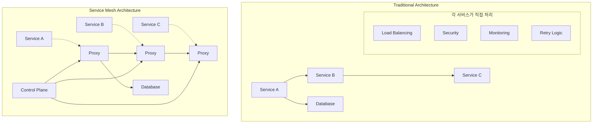
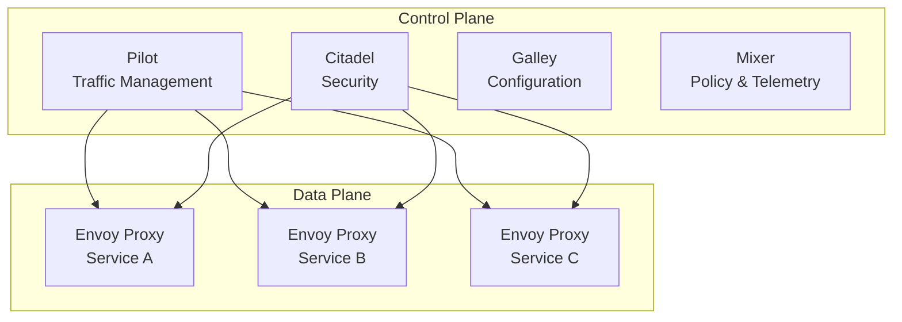

# 🕸️ Service Mesh 완벽 가이드

> 💡 **목표**: Service Mesh의 개념을 이해하고 Istio를 활용하여 마이크로서비스 간 통신을 안전하고 효율적으로 관리하는 방법을 마스터합니다.

## 📚 목차

1. [**Service Mesh 개념**](#service-mesh-개념)
2. [**Istio 아키텍처**](#istio-아키텍처)
3. [**Traffic Management**](#traffic-management)
4. [**Security**](#security)
5. [**Observability**](#observability)
6. [**실전 구현**](#실전-구현)
7. [**대안 솔루션**](#대안-솔루션)
8. [**Best Practices**](#best-practices)

---

## 🎯 Service Mesh 개념

### Service Mesh란?



### Service Mesh vs API Gateway

| 구분 | Service Mesh | API Gateway |
|------|--------------|-------------|
| **위치** | 서비스 간 (East-West) | 클라이언트-서비스 (North-South) |
| **목적** | 서비스 간 통신 관리 | 외부 API 관리 |
| **배포** | Sidecar Pattern | Gateway Pattern |
| **기능** | 트래픽, 보안, 관찰성 | 인증, 라우팅, Rate Limiting |

---

## 🏗️ Istio 아키텍처

### Istio 구성 요소



### Istio 설치

```bash
# Istio 다운로드
curl -L https://istio.io/downloadIstio | sh -
cd istio-*
export PATH=$PWD/bin:$PATH

# Istio 설치
istioctl install --set values.defaultRevision=default

# 또는 Demo 프로파일로 설치
istioctl install --set values.defaultRevision=default \
  --set values.pilot.env.EXTERNAL_ISTIOD=false \
  --set values.global.meshID=mesh1 \
  --set values.global.multiCluster.clusterName=cluster1 \
  --set values.global.network=network1

# Namespace에 sidecar injection 활성화
kubectl label namespace default istio-injection=enabled

# 설치 확인
kubectl get pods -n istio-system
istioctl proxy-status
```

### Istio Gateway & VirtualService

```yaml
# Gateway 정의
apiVersion: networking.istio.io/v1beta1
kind: Gateway
metadata:
  name: bookinfo-gateway
spec:
  selector:
    istio: ingressgateway
  servers:
  - port:
      number: 80
      name: http
      protocol: HTTP
    hosts:
    - "*"
  - port:
      number: 443
      name: https
      protocol: HTTPS
    tls:
      mode: SIMPLE
      credentialName: bookinfo-tls
    hosts:
    - bookinfo.example.com

---
# VirtualService 정의
apiVersion: networking.istio.io/v1beta1
kind: VirtualService
metadata:
  name: bookinfo
spec:
  hosts:
  - "*"
  gateways:
  - bookinfo-gateway
  http:
  - match:
    - uri:
        exact: /productpage
    - uri:
        prefix: /static
    - uri:
        exact: /login
    - uri:
        exact: /logout
    - uri:
        prefix: /api/v1/products
    route:
    - destination:
        host: productpage
        port:
          number: 9080
```

---

## 🚦 Traffic Management

### Canary Deployment

```yaml
# DestinationRule로 서비스 버전 정의
apiVersion: networking.istio.io/v1beta1
kind: DestinationRule
metadata:
  name: reviews-destination
spec:
  host: reviews
  subsets:
  - name: v1
    labels:
      version: v1
  - name: v2
    labels:
      version: v2
  - name: v3
    labels:
      version: v3

---
# VirtualService로 트래픽 분산
apiVersion: networking.istio.io/v1beta1
kind: VirtualService
metadata:
  name: reviews-canary
spec:
  hosts:
  - reviews
  http:
  - match:
    - headers:
        end-user:
          exact: jason
    route:
    - destination:
        host: reviews
        subset: v2
  - route:
    - destination:
        host: reviews
        subset: v1
      weight: 90  # 90% 트래픽
    - destination:
        host: reviews
        subset: v2
      weight: 10  # 10% 트래픽 (Canary)
```

### Blue-Green Deployment

```yaml
# Blue-Green 전환
apiVersion: networking.istio.io/v1beta1
kind: VirtualService
metadata:
  name: app-bluegreen
spec:
  hosts:
  - app-service
  http:
  - route:
    - destination:
        host: app-service
        subset: green  # Green으로 모든 트래픽
      weight: 100

---
# 즉시 전환
# kubectl patch vs app-bluegreen --type merge -p '
# {
#   "spec": {
#     "http": [{
#       "route": [{
#         "destination": {
#           "host": "app-service",
#           "subset": "blue"
#         },
#         "weight": 100
#       }]
#     }]
#   }
# }'
```

### Circuit Breaker

```yaml
apiVersion: networking.istio.io/v1beta1
kind: DestinationRule
metadata:
  name: httpbin-circuit-breaker
spec:
  host: httpbin
  trafficPolicy:
    connectionPool:
      tcp:
        maxConnections: 10        # 최대 연결 수
        connectTimeout: 30s       # 연결 타임아웃
        keepAlive:
          time: 7200s
          interval: 75s
      http:
        http1MaxPendingRequests: 10    # 대기 요청 수
        http2MaxRequests: 100          # 최대 요청 수
        maxRequestsPerConnection: 10   # 연결당 최대 요청
        maxRetries: 3                  # 최대 재시도
        consecutiveGatewayErrors: 5    # 연속 에러 허용
        interval: 30s                  # 분석 간격
        baseEjectionTime: 30s          # 차단 시간
        maxEjectionPercent: 50         # 최대 차단 비율
        minHealthPercent: 30           # 최소 건강한 비율
    outlierDetection:
      consecutiveGatewayErrors: 5
      consecutive5xxErrors: 5
      interval: 30s
      baseEjectionTime: 30s
      maxEjectionPercent: 50
      minHealthPercent: 30
```

### Retry & Timeout

```yaml
apiVersion: networking.istio.io/v1beta1
kind: VirtualService
metadata:
  name: ratings-retry
spec:
  hosts:
  - ratings
  http:
  - route:
    - destination:
        host: ratings
    timeout: 10s
    retries:
      attempts: 3
      perTryTimeout: 2s
      retryOn: gateway-error,connect-failure,refused-stream
      retryRemoteLocalities: false
```

### Traffic Mirroring

```yaml
# 프로덕션 트래픽을 테스트 환경으로 복사
apiVersion: networking.istio.io/v1beta1
kind: VirtualService
metadata:
  name: httpbin-mirror
spec:
  hosts:
  - httpbin
  http:
  - route:
    - destination:
        host: httpbin
        subset: v1
      weight: 100
    mirror:
      host: httpbin
      subset: v2
    mirrorPercentage:
      value: 100.0  # 100% 미러링
```

---

## 🔒 Security

### mTLS (Mutual TLS)

```yaml
# Namespace 전체에 mTLS 적용
apiVersion: security.istio.io/v1beta1
kind: PeerAuthentication
metadata:
  name: default
  namespace: production
spec:
  mtls:
    mode: STRICT  # PERMISSIVE, STRICT, DISABLE

---
# 특정 서비스에 mTLS 적용
apiVersion: security.istio.io/v1beta1
kind: PeerAuthentication
metadata:
  name: httpbin-mtls
spec:
  selector:
    matchLabels:
      app: httpbin
  mtls:
    mode: STRICT
  portLevelMtls:
    9000:
      mode: DISABLE  # 특정 포트만 비활성화
```

### Authorization Policy

```yaml
# Deny-all 정책
apiVersion: security.istio.io/v1beta1
kind: AuthorizationPolicy
metadata:
  name: deny-all
  namespace: production
spec: {}  # 빈 spec은 모든 요청 차단

---
# 특정 서비스 접근 허용
apiVersion: security.istio.io/v1beta1
kind: AuthorizationPolicy
metadata:
  name: httpbin-viewer
  namespace: production
spec:
  selector:
    matchLabels:
      app: httpbin
  rules:
  - from:
    - source:
        principals: ["cluster.local/ns/production/sa/httpbin-client"]
  - to:
    - operation:
        methods: ["GET", "POST"]
        paths: ["/status/*", "/delay/*"]
  - when:
    - key: request.headers[version]
      values: ["v1", "v2"]

---
# JWT 기반 인증
apiVersion: security.istio.io/v1beta1
kind: RequestAuthentication
metadata:
  name: jwt-auth
  namespace: production
spec:
  selector:
    matchLabels:
      app: httpbin
  jwtRules:
  - issuer: "https://auth.example.com"
    jwksUri: "https://auth.example.com/.well-known/jwks.json"
    audiences:
    - "httpbin-service"
    outputPayloadToHeader: "x-jwt-payload"

---
apiVersion: security.istio.io/v1beta1
kind: AuthorizationPolicy
metadata:
  name: jwt-policy
  namespace: production
spec:
  selector:
    matchLabels:
      app: httpbin
  rules:
  - from:
    - source:
        requestPrincipals: ["https://auth.example.com/user@example.com"]
  - when:
    - key: request.auth.claims[role]
      values: ["admin", "user"]
```

### Security Policies 예제

```yaml
# 네임스페이스 간 통신 제한
apiVersion: security.istio.io/v1beta1
kind: AuthorizationPolicy
metadata:
  name: namespace-isolation
  namespace: sensitive
spec:
  rules:
  - from:
    - source:
        namespaces: ["sensitive", "trusted"]
  - to:
    - operation:
        methods: ["GET", "POST"]

---
# 시간 기반 접근 제어
apiVersion: security.istio.io/v1beta1
kind: AuthorizationPolicy
metadata:
  name: business-hours-only
spec:
  selector:
    matchLabels:
      app: business-app
  rules:
  - when:
    - key: request.time
      values: ["09:00", "17:00"]  # 비즈니스 시간만
```

---

## 📊 Observability

### Metrics 수집 설정

```yaml
# Telemetry API v2 설정
apiVersion: telemetry.istio.io/v1alpha1
kind: Telemetry
metadata:
  name: default
  namespace: istio-system
spec:
  metrics:
  - providers:
    - name: prometheus
  - overrides:
    - match:
        metric: ALL_METRICS
      tagOverrides:
        destination_service_name:
          value: "%{DESTINATION_SERVICE_NAME | 'unknown'}"
        destination_service_namespace:
          value: "%{DESTINATION_SERVICE_NAMESPACE | 'unknown'}"

---
# Custom Metrics
apiVersion: telemetry.istio.io/v1alpha1
kind: Telemetry
metadata:
  name: custom-metrics
spec:
  metrics:
  - providers:
    - name: prometheus
  - overrides:
    - match:
        metric: requests_total
      tagOverrides:
        user_type:
          value: "%{REQUEST_HEADERS['user-type'] | 'guest'}"
        request_id:
          value: "%{REQUEST_HEADERS['x-request-id'] | 'none'}"
```

### Distributed Tracing

```yaml
# Jaeger 설치
apiVersion: v1
kind: Namespace
metadata:
  name: observability

---
apiVersion: apps/v1
kind: Deployment
metadata:
  name: jaeger
  namespace: observability
spec:
  replicas: 1
  selector:
    matchLabels:
      app: jaeger
  template:
    metadata:
      labels:
        app: jaeger
    spec:
      containers:
      - name: jaeger
        image: jaegertracing/all-in-one:1.35
        ports:
        - containerPort: 16686
        - containerPort: 14268
        env:
        - name: COLLECTOR_OTLP_ENABLED
          value: "true"

---
# Istio Tracing 설정
apiVersion: v1
kind: ConfigMap
metadata:
  name: istio-tracing
  namespace: istio-system
data:
  mesh: |
    defaultConfig:
      proxyStatsMatcher:
        inclusionRegexps:
        - ".*circuit_breakers.*"
        - ".*upstream_rq_retry.*"
        - ".*_cx_.*"
        exclusionRegexps:
        - ".*osconfig.*"
    extensionProviders:
    - name: jaeger
      envoyOtelAls:
        service: jaeger-collector.observability.svc.cluster.local
        port: 14268
```

### Access Logging

```yaml
# EnvoyFilter로 Access Log 설정
apiVersion: networking.istio.io/v1alpha3
kind: EnvoyFilter
metadata:
  name: access-log-format
  namespace: istio-system
spec:
  configPatches:
  - applyTo: HTTP_FILTER
    match:
      context: SIDECAR_INBOUND
      listener:
        filterChain:
          filter:
            name: "envoy.filters.network.http_connection_manager"
    patch:
      operation: MERGE
      value:
        typed_config:
          access_log:
          - name: envoy.access_loggers.file
            typed_config:
              "@type": type.googleapis.com/envoy.extensions.access_loggers.file.v3.FileAccessLog
              path: /dev/stdout
              format: |
                {
                  "timestamp": "%START_TIME%",
                  "method": "%REQ(:METHOD)%",
                  "path": "%REQ(X-ENVOY-ORIGINAL-PATH?:PATH)%",
                  "protocol": "%PROTOCOL%",
                  "response_code": "%RESPONSE_CODE%",
                  "response_flags": "%RESPONSE_FLAGS%",
                  "bytes_received": "%BYTES_RECEIVED%",
                  "bytes_sent": "%BYTES_SENT%",
                  "duration": "%DURATION%",
                  "upstream_service_time": "%RESP(X-ENVOY-UPSTREAM-SERVICE-TIME)%",
                  "x_forwarded_for": "%REQ(X-FORWARDED-FOR)%",
                  "user_agent": "%REQ(USER-AGENT)%",
                  "request_id": "%REQ(X-REQUEST-ID)%",
                  "authority": "%REQ(:AUTHORITY)%",
                  "upstream_host": "%UPSTREAM_HOST%",
                  "upstream_cluster": "%UPSTREAM_CLUSTER%"
                }
```

---

## 🏗️ 실전 구현

### E-commerce Microservices with Istio

```yaml
# Frontend Service
apiVersion: v1
kind: Service
metadata:
  name: frontend
  labels:
    app: frontend
spec:
  ports:
  - port: 80
    targetPort: 8080
  selector:
    app: frontend

---
apiVersion: apps/v1
kind: Deployment
metadata:
  name: frontend-v1
spec:
  replicas: 3
  selector:
    matchLabels:
      app: frontend
      version: v1
  template:
    metadata:
      labels:
        app: frontend
        version: v1
    spec:
      containers:
      - name: frontend
        image: frontend:v1
        ports:
        - containerPort: 8080
        env:
        - name: CATALOG_SERVICE_URL
          value: "http://catalog:80"
        - name: USER_SERVICE_URL
          value: "http://users:80"
        - name: ORDER_SERVICE_URL
          value: "http://orders:80"

---
# Catalog Service (v1, v2 for A/B testing)
apiVersion: v1
kind: Service
metadata:
  name: catalog
  labels:
    app: catalog
spec:
  ports:
  - port: 80
    targetPort: 8080
  selector:
    app: catalog

---
apiVersion: apps/v1
kind: Deployment
metadata:
  name: catalog-v1
spec:
  replicas: 2
  selector:
    matchLabels:
      app: catalog
      version: v1
  template:
    metadata:
      labels:
        app: catalog
        version: v1
    spec:
      containers:
      - name: catalog
        image: catalog:v1
        ports:
        - containerPort: 8080

---
apiVersion: apps/v1
kind: Deployment
metadata:
  name: catalog-v2
spec:
  replicas: 1
  selector:
    matchLabels:
      app: catalog
      version: v2
  template:
    metadata:
      labels:
        app: catalog
        version: v2
    spec:
      containers:
      - name: catalog
        image: catalog:v2
        ports:
        - containerPort: 8080
```

### Traffic Management 설정

```yaml
# Gateway
apiVersion: networking.istio.io/v1beta1
kind: Gateway
metadata:
  name: ecommerce-gateway
spec:
  selector:
    istio: ingressgateway
  servers:
  - port:
      number: 80
      name: http
      protocol: HTTP
    hosts:
    - shop.example.com

---
# VirtualService for Frontend
apiVersion: networking.istio.io/v1beta1
kind: VirtualService
metadata:
  name: frontend-vs
spec:
  hosts:
  - shop.example.com
  gateways:
  - ecommerce-gateway
  http:
  - match:
    - uri:
        prefix: /
    route:
    - destination:
        host: frontend
        port:
          number: 80

---
# DestinationRule for Catalog
apiVersion: networking.istio.io/v1beta1
kind: DestinationRule
metadata:
  name: catalog-dr
spec:
  host: catalog
  subsets:
  - name: v1
    labels:
      version: v1
  - name: v2
    labels:
      version: v2
  trafficPolicy:
    connectionPool:
      tcp:
        maxConnections: 50
      http:
        http1MaxPendingRequests: 20
        maxRequestsPerConnection: 10
    outlierDetection:
      consecutiveGatewayErrors: 3
      interval: 30s
      baseEjectionTime: 30s

---
# A/B Testing for Catalog
apiVersion: networking.istio.io/v1beta1
kind: VirtualService
metadata:
  name: catalog-ab-test
spec:
  hosts:
  - catalog
  http:
  # Premium users get v2
  - match:
    - headers:
        user-type:
          exact: premium
    route:
    - destination:
        host: catalog
        subset: v2
  # Regular users get mixed traffic
  - route:
    - destination:
        host: catalog
        subset: v1
      weight: 80
    - destination:
        host: catalog
        subset: v2
      weight: 20
```

### Security 설정

```yaml
# mTLS for entire namespace
apiVersion: security.istio.io/v1beta1
kind: PeerAuthentication
metadata:
  name: default
  namespace: ecommerce
spec:
  mtls:
    mode: STRICT

---
# Authorization policies
apiVersion: security.istio.io/v1beta1
kind: AuthorizationPolicy
metadata:
  name: frontend-policy
spec:
  selector:
    matchLabels:
      app: frontend
  rules:
  - from:
    - source:
        principals: ["cluster.local/ns/istio-system/sa/istio-ingressgateway-service-account"]
  - to:
    - operation:
        methods: ["GET", "POST"]

---
apiVersion: security.istio.io/v1beta1
kind: AuthorizationPolicy
metadata:
  name: catalog-policy
spec:
  selector:
    matchLabels:
      app: catalog
  rules:
  - from:
    - source:
        principals: ["cluster.local/ns/ecommerce/sa/frontend"]
  - to:
    - operation:
        methods: ["GET"]
        paths: ["/api/products*", "/health"]

---
apiVersion: security.istio.io/v1beta1
kind: AuthorizationPolicy
metadata:
  name: orders-policy
spec:
  selector:
    matchLabels:
      app: orders
  rules:
  - from:
    - source:
        principals: ["cluster.local/ns/ecommerce/sa/frontend"]
  - to:
    - operation:
        methods: ["GET", "POST", "PUT"]
  - when:
    - key: request.headers[authorization]
      values: ["Bearer *"]  # JWT token required
```

---

## 🔄 대안 솔루션

### Linkerd vs Istio

```yaml
# Linkerd 설치
# linkerd install | kubectl apply -f -
# linkerd viz install | kubectl apply -f -

# Linkerd ServiceProfile
apiVersion: linkerd.io/v1alpha2
kind: ServiceProfile
metadata:
  name: webapp
  namespace: default
spec:
  routes:
  - name: books
    condition:
      method: GET
      pathRegex: "/books/[0-9]+"
    responseClasses:
    - condition:
        status:
          min: 500
          max: 599
      isFailure: true
    timeout: 30s
    retryBudget:
      retryRatio: 0.2
      minRetriesPerSecond: 10
      ttl: 10s

---
# Linkerd TrafficSplit (SMI)
apiVersion: split.smi-spec.io/v1alpha1
kind: TrafficSplit
metadata:
  name: webapp-split
  namespace: default
spec:
  service: webapp
  backends:
  - service: webapp-v1
    weight: 80
  - service: webapp-v2
    weight: 20
```

### Consul Connect

```yaml
# Consul Connect with Kubernetes
apiVersion: consul.hashicorp.com/v1alpha1
kind: ServiceDefaults
metadata:
  name: web
spec:
  protocol: http

---
apiVersion: consul.hashicorp.com/v1alpha1
kind: ServiceSplitter
metadata:
  name: web
spec:
  splits:
  - weight: 90
    service: web
    serviceSubset: v1
  - weight: 10
    service: web
    serviceSubset: v2

---
apiVersion: consul.hashicorp.com/v1alpha1
kind: ServiceResolver
metadata:
  name: web
spec:
  subsets:
    v1:
      filter: 'version == "v1"'
    v2:
      filter: 'version == "v2"'
```

---

## ✅ Best Practices

### 1. 점진적 도입

```yaml
# 1단계: mTLS PERMISSIVE 모드로 시작
apiVersion: security.istio.io/v1beta1
kind: PeerAuthentication
metadata:
  name: default
  namespace: production
spec:
  mtls:
    mode: PERMISSIVE  # Plain text와 mTLS 모두 허용

# 2단계: 모든 서비스 준비 완료 후 STRICT으로 변경
# kubectl patch peerauthentication default -n production \
#   -p '{"spec":{"mtls":{"mode":"STRICT"}}}'
```

### 2. 모니터링 및 관찰성

```yaml
# Istio 대시보드 설정
apiVersion: v1
kind: ConfigMap
metadata:
  name: istio-grafana-dashboards
  namespace: istio-system
data:
  dashboards.yaml: |
    apiVersion: 1
    providers:
    - name: istio
      type: file
      options:
        path: /var/lib/grafana/dashboards/istio

---
# ServiceMonitor for Istio metrics
apiVersion: monitoring.coreos.com/v1
kind: ServiceMonitor
metadata:
  name: istio-mesh
spec:
  selector:
    matchLabels:
      app: istiod
  endpoints:
  - port: http-monitoring
    interval: 15s
    path: /stats/prometheus
```

### 3. 성능 최적화

```yaml
# Istio Pilot 리소스 조정
apiVersion: v1
kind: ConfigMap
metadata:
  name: istio
  namespace: istio-system
data:
  mesh: |
    defaultConfig:
      discoveryRefreshDelay: 10s    # 기본값: 10s
      proxyStatsMatcher:
        inclusionRegexps:
        - ".*circuit_breakers.*"
        - ".*upstream_rq_retry.*"
        exclusionRegexps:
        - ".*osconfig.*"
      concurrency: 2                # Envoy worker threads
      
---
# Sidecar 리소스 제한
apiVersion: v1
kind: ConfigMap
metadata:
  name: istio-sidecar-injector
  namespace: istio-system
data:
  config: |
    policy: enabled
    alwaysInjectSelector:
    neverInjectSelector:
    template: |
      spec:
        containers:
        - name: istio-proxy
          resources:
            requests:
              cpu: 100m
              memory: 128Mi
            limits:
              cpu: 200m
              memory: 256Mi
```

### 4. 보안 강화

```yaml
# 네임스페이스별 보안 정책
apiVersion: security.istio.io/v1beta1
kind: AuthorizationPolicy
metadata:
  name: default-deny-all
  namespace: production
spec: {}

---
apiVersion: security.istio.io/v1beta1
kind: AuthorizationPolicy
metadata:
  name: allow-within-namespace
  namespace: production
spec:
  rules:
  - from:
    - source:
        namespaces: ["production"]

---
# 외부 통신 제한
apiVersion: networking.istio.io/v1beta1
kind: Sidecar
metadata:
  name: default
  namespace: production
spec:
  egress:
  - hosts:
    - "./*"                    # 같은 네임스페이스만
    - "istio-system/*"         # Istio 시스템 서비스
    - "./external-api.com"     # 승인된 외부 서비스만
```

---

## 🔧 트러블슈팅

### 일반적인 문제들

```bash
# 1. Sidecar Injection 문제
kubectl get namespace -L istio-injection
kubectl describe pod <pod-name> | grep -i injection

# 2. mTLS 연결 문제
istioctl authn tls-check <pod-name>.<namespace>

# 3. 설정 동기화 문제
istioctl proxy-status
istioctl proxy-config cluster <pod-name> -n <namespace>

# 4. 트래픽 라우팅 문제
istioctl proxy-config route <pod-name> -n <namespace>
istioctl proxy-config listener <pod-name> -n <namespace>

# 5. 성능 문제 진단
kubectl exec <pod-name> -c istio-proxy -- pilot-agent request GET stats/prometheus | grep istio
```

### 로그 분석

```bash
# Istio Control Plane 로그
kubectl logs -n istio-system deployment/istiod

# Envoy Access Log 활성화
kubectl exec <pod-name> -c istio-proxy -- curl -X POST localhost:15000/logging?level=debug

# Envoy 통계
kubectl exec <pod-name> -c istio-proxy -- curl localhost:15000/stats | grep <metric-name>
```

---

## 💡 고급 팁

### 1. Multi-cluster Service Mesh

```yaml
# Primary cluster 설정
apiVersion: v1
kind: Secret
metadata:
  name: cacerts
  namespace: istio-system
data:
  root-cert.pem: <base64-encoded-cert>
  cert-chain.pem: <base64-encoded-cert>
  ca-cert.pem: <base64-encoded-cert>
  ca-key.pem: <base64-encoded-key>

---
# Cross-cluster service discovery
apiVersion: networking.istio.io/v1beta1
kind: ServiceEntry
metadata:
  name: remote-service
spec:
  hosts:
  - remote-service.remote-namespace.svc.cluster.local
  location: MESH_EXTERNAL
  ports:
  - number: 80
    name: http
    protocol: HTTP
  resolution: DNS
  addresses:
  - 240.0.0.1
  endpoints:
  - address: remote-cluster-endpoint
```

### 2. Custom Extensions

```yaml
# Wasm Plugin 예제
apiVersion: extensions.istio.io/v1alpha1
kind: WasmPlugin
metadata:
  name: custom-auth
spec:
  selector:
    matchLabels:
      app: httpbin
  url: oci://my-registry/custom-auth:latest
  phase: AUTHN
  pluginConfig:
    auth_header: "authorization"
    auth_service: "http://auth-service:8080/validate"
```

### 3. Cost Optimization

```yaml
# 선택적 Sidecar Injection
apiVersion: v1
kind: Pod
metadata:
  name: no-sidecar-pod
  annotations:
    sidecar.istio.io/inject: "false"
spec:
  containers:
  - name: app
    image: myapp

---
# Ambient Mode (Istio 1.15+)
# Sidecar 없이 ztunnel 사용
kubectl label namespace production istio.io/dataplane-mode=ambient
```

---

> 🚀 Service Mesh는 복잡한 마이크로서비스 환경의 운영성과 보안을 획기적으로 개선합니다!