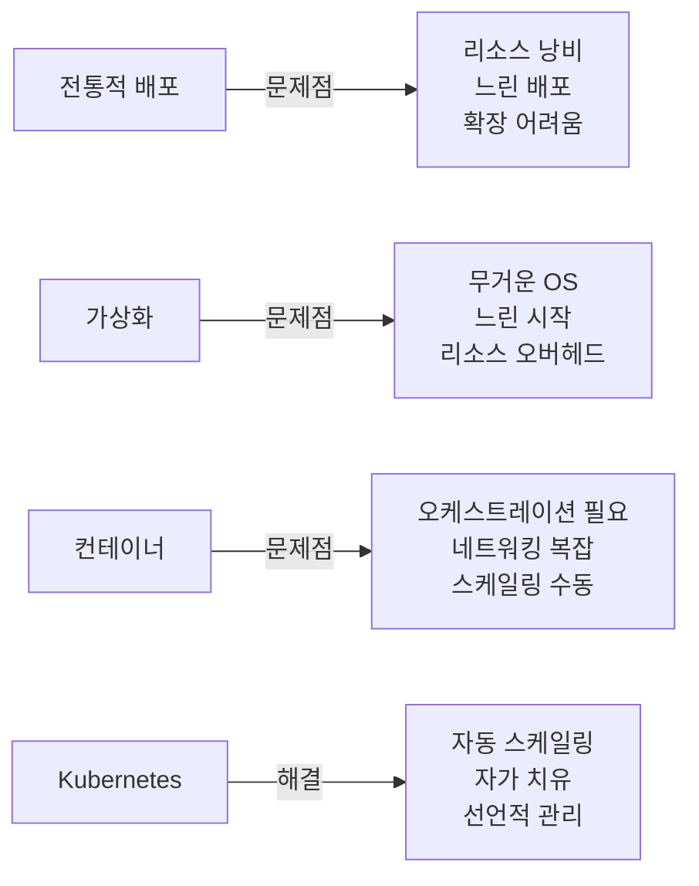

# 🚀 Kubernetes 완벽 학습 가이드

> 💡 **초보자부터 운영자까지** - 쿠버네티스를 단계별로 마스터하는 완벽한 로드맵

## 📚 목차

1. [**왜 Kubernetes인가?**](#왜-kubernetes인가)
2. [**학습 로드맵**](#학습-로드맵)
3. [**실습 환경 구축**](#실습-환경-구축)
4. [**핵심 개념 Quick Start**](#핵심-개념-quick-start)
5. [**운영 도구 모음**](#운영-도구-모음)
6. [**Best Practices**](#best-practices)
7. [**자주 묻는 질문**](#자주-묻는-질문)

---

## 🎯 왜 Kubernetes인가?

### 🔍 Kubernetes가 해결하는 문제들



### 💰 실제 비즈니스 가치

| 문제 상황 | Kubernetes 없이 | Kubernetes 있으면 |
|---------|---------------|-----------------|
| 트래픽 급증 | 수동으로 서버 추가 (30분~1시간) | 자동 스케일링 (1~2분) |
| 서버 장애 | 수동 복구 필요 | 자동 재시작 및 재배치 |
| 배포 | 서비스 중단 필요 | 무중단 롤링 업데이트 |
| 리소스 관리 | 서버별 개별 관리 | 클러스터 전체 최적화 |

---

## 📈 학습 로드맵

### 🎓 Level 1: 초급 (1-2주)
```bash
📁 01-basics/
├── 📖 core-concepts.md      # Pod, Node, Cluster 이해
├── 🏗️ architecture.md       # Control Plane, Worker Node
└── 🚀 first-deployment.md   # 첫 애플리케이션 배포
```

**핵심 학습 목표:**
- ✅ Kubernetes가 무엇인지 설명할 수 있다
- ✅ Pod와 Container의 차이를 안다
- ✅ kubectl 기본 명령어를 사용할 수 있다
- ✅ 간단한 애플리케이션을 배포할 수 있다

### 🎓 Level 2: 중급 (2-4주)
```bash
📁 02-workloads/          # Deployment, StatefulSet, DaemonSet
📁 03-networking/         # Service, Ingress, DNS
📁 04-storage/           # Volume, PV/PVC, StorageClass
📁 05-configuration/     # ConfigMap, Secret, Environment
```

**핵심 학습 목표:**
- ✅ 다양한 워크로드 타입을 구분하여 사용한다
- ✅ 서비스 간 통신을 설정할 수 있다
- ✅ 영구 저장소를 연결할 수 있다
- ✅ 설정과 민감 정보를 관리할 수 있다

### 🎓 Level 3: 고급 (4-8주)
```bash
📁 06-security/          # RBAC, Security Policy, Network Policy
📁 07-operations/        # Monitoring, Logging, Helm, GitOps
📁 08-advanced/         # Operator, Service Mesh, Multi-cluster
```

**핵심 학습 목표:**
- ✅ 프로덕션 수준의 보안을 구현한다
- ✅ 모니터링과 로깅 시스템을 구축한다
- ✅ GitOps로 배포를 자동화한다
- ✅ 복잡한 마이크로서비스를 운영한다

---

## 🛠️ 실습 환경 구축

### 🏠 로컬 개발 환경

#### 옵션 1: Minikube (추천 ⭐⭐⭐⭐⭐)
```bash
# macOS
brew install minikube
minikube start --cpus=4 --memory=8192

# Windows (관리자 권한 PowerShell)
choco install minikube
minikube start --cpus=4 --memory=8192

# Linux
curl -LO https://storage.googleapis.com/minikube/releases/latest/minikube-linux-amd64
sudo install minikube-linux-amd64 /usr/local/bin/minikube
minikube start --cpus=4 --memory=8192
```

#### 옵션 2: Kind (Docker 필요)
```bash
# Kind 설치
brew install kind  # macOS
# 또는
GO111MODULE="on" go install sigs.k8s.io/kind@latest

# 클러스터 생성
kind create cluster --name learning --config kind-config.yaml
```

**kind-config.yaml:**
```yaml
kind: Cluster
apiVersion: kind.x-k8s.io/v1alpha4
nodes:
- role: control-plane
- role: worker
- role: worker
```

#### 옵션 3: K3s (경량화 버전)
```bash
curl -sfL https://get.k3s.io | sh -
sudo k3s kubectl get nodes
```

### ☁️ 클라우드 환경

| 제공자 | 무료 크레딧 | 특징 | 추천도 |
|-------|----------|------|-------|
| GKE (Google) | $300 / 90일 | 가장 쉬운 설정 | ⭐⭐⭐⭐⭐ |
| EKS (AWS) | $300 / 12개월 | 엔터프라이즈 표준 | ⭐⭐⭐⭐ |
| AKS (Azure) | $200 / 30일 | Windows 컨테이너 지원 | ⭐⭐⭐ |

---

## 🎮 핵심 개념 Quick Start

### 🏃 10분 만에 첫 배포하기

#### Step 1: 애플리케이션 배포
```bash
# nginx 배포
kubectl create deployment my-app --image=nginx --replicas=3

# 배포 확인
kubectl get deployments
kubectl get pods

# 상세 정보
kubectl describe deployment my-app
```

#### Step 2: 서비스 노출
```bash
# Service 생성
kubectl expose deployment my-app --port=80 --type=LoadBalancer

# 서비스 확인
kubectl get services
```

#### Step 3: 스케일링
```bash
# 수동 스케일링
kubectl scale deployment my-app --replicas=5

# 자동 스케일링 설정
kubectl autoscale deployment my-app --min=3 --max=10 --cpu-percent=80
```

#### Step 4: 업데이트
```bash
# 이미지 업데이트
kubectl set image deployment/my-app nginx=nginx:1.21

# 롤아웃 상태 확인
kubectl rollout status deployment/my-app

# 롤백 (필요시)
kubectl rollout undo deployment/my-app
```

### 📝 YAML로 선언적 관리

**deployment.yaml:**
```yaml
apiVersion: apps/v1
kind: Deployment
metadata:
  name: my-app
  labels:
    app: nginx
spec:
  replicas: 3
  selector:
    matchLabels:
      app: nginx
  template:
    metadata:
      labels:
        app: nginx
    spec:
      containers:
      - name: nginx
        image: nginx:1.21
        ports:
        - containerPort: 80
        resources:
          requests:
            memory: "64Mi"
            cpu: "250m"
          limits:
            memory: "128Mi"
            cpu: "500m"
```

**service.yaml:**
```yaml
apiVersion: v1
kind: Service
metadata:
  name: my-app-service
spec:
  selector:
    app: nginx
  ports:
    - protocol: TCP
      port: 80
      targetPort: 80
  type: LoadBalancer
```

적용:
```bash
kubectl apply -f deployment.yaml
kubectl apply -f service.yaml
```

---

## 🔧 운영 도구 모음

### 📊 모니터링 & 옵저버빌리티

#### 1. **Prometheus + Grafana** (필수 ⭐⭐⭐⭐⭐)
```bash
# Helm으로 설치
helm repo add prometheus-community https://prometheus-community.github.io/helm-charts
helm repo add grafana https://grafana.github.io/helm-charts
helm repo update

# Prometheus 설치
helm install prometheus prometheus-community/prometheus \
  --namespace monitoring --create-namespace

# Grafana 설치
helm install grafana grafana/grafana \
  --namespace monitoring \
  --set adminPassword='admin123'

# 대시보드 접근
kubectl port-forward -n monitoring svc/grafana 3000:80
```

**추천 Grafana 대시보드:**
- K8s Cluster Overview (ID: 8685)
- Kubernetes Pods (ID: 6336)
- Node Exporter (ID: 1860)

#### 2. **Kubernetes Dashboard**
```bash
kubectl apply -f https://raw.githubusercontent.com/kubernetes/dashboard/v2.7.0/aio/deploy/recommended.yaml

# 토큰 생성
kubectl create serviceaccount dashboard-admin -n kubernetes-dashboard
kubectl create clusterrolebinding dashboard-admin \
  --clusterrole=cluster-admin \
  --serviceaccount=kubernetes-dashboard:dashboard-admin

# 토큰 확인
kubectl -n kubernetes-dashboard create token dashboard-admin
```

### 📝 로깅 시스템

#### **EFK Stack** (Elasticsearch + Fluentd + Kibana)
```yaml
# fluentd-config.yaml
apiVersion: v1
kind: ConfigMap
metadata:
  name: fluentd-config
  namespace: kube-system
data:
  fluent.conf: |
    <source>
      @type tail
      path /var/log/containers/*.log
      pos_file /var/log/fluentd-containers.log.pos
      tag kubernetes.*
      <parse>
        @type json
      </parse>
    </source>
    
    <match kubernetes.**>
      @type elasticsearch
      host elasticsearch.logging.svc.cluster.local
      port 9200
      logstash_format true
      logstash_prefix kubernetes
    </match>
```

### 🚀 CI/CD 도구

#### **ArgoCD** (GitOps)
```bash
# ArgoCD 설치
kubectl create namespace argocd
kubectl apply -n argocd -f https://raw.githubusercontent.com/argoproj/argo-cd/stable/manifests/install.yaml

# CLI 설치
brew install argocd  # macOS

# 초기 비밀번호
kubectl -n argocd get secret argocd-initial-admin-secret -o jsonpath="{.data.password}" | base64 -d

# UI 접근
kubectl port-forward svc/argocd-server -n argocd 8080:443
```

### 🛡️ 보안 도구

#### **Falco** (런타임 보안)
```bash
helm repo add falcosecurity https://falcosecurity.github.io/charts
helm install falco falcosecurity/falco \
  --namespace falco --create-namespace \
  --set falco.grpc.enabled=true \
  --set falco.grpcOutput.enabled=true
```

#### **OPA** (정책 엔진)
```yaml
# opa-deployment.yaml
apiVersion: apps/v1
kind: Deployment
metadata:
  name: opa
  namespace: opa
spec:
  replicas: 1
  selector:
    matchLabels:
      app: opa
  template:
    metadata:
      labels:
        app: opa
    spec:
      containers:
      - name: opa
        image: openpolicyagent/opa:latest-envoy
        ports:
        - containerPort: 8181
        args:
          - "run"
          - "--server"
          - "--addr=0.0.0.0:8181"
```

### 🎯 개발자 도구

#### **kubectl 플러그인**
```bash
# Krew 설치 (kubectl 플러그인 매니저)
(
  set -x; cd "$(mktemp -d)" &&
  OS="$(uname | tr '[:upper:]' '[:lower:]')" &&
  ARCH="$(uname -m | sed -e 's/x86_64/amd64/' -e 's/\(arm\)\(64\)\?.*/\1\2/' -e 's/aarch64$/arm64/')" &&
  KREW="krew-${OS}_${ARCH}" &&
  curl -fsSLO "https://github.com/kubernetes-sigs/krew/releases/latest/download/${KREW}.tar.gz" &&
  tar zxvf "${KREW}.tar.gz" &&
  ./"${KREW}" install krew
)

# 유용한 플러그인 설치
kubectl krew install ctx       # 컨텍스트 전환
kubectl krew install ns        # 네임스페이스 전환
kubectl krew install tree      # 리소스 트리 보기
kubectl krew install neat      # YAML 정리
kubectl krew install debug     # 디버깅 도구
```

#### **k9s** (터미널 UI)
```bash
# 설치
brew install k9s  # macOS
# 또는
curl -sS https://webinstall.dev/k9s | bash

# 실행
k9s
```

**k9s 단축키:**
- `:` - 명령어 모드
- `/` - 검색
- `d` - describe
- `l` - logs
- `e` - edit
- `ctrl-d` - delete

#### **Lens** (Desktop IDE)
- 다운로드: https://k8slens.dev/
- 특징:
  - 멀티 클러스터 관리
  - 내장 터미널
  - 리소스 에디터
  - 메트릭 시각화

### 📦 패키지 관리

#### **Helm** (Kubernetes 패키지 매니저)
```bash
# Helm 설치
curl https://raw.githubusercontent.com/helm/helm/main/scripts/get-helm-3 | bash

# Chart 생성
helm create my-chart

# values.yaml 커스터마이징
cat <<EOF > my-values.yaml
replicaCount: 3
image:
  repository: nginx
  tag: "1.21"
service:
  type: LoadBalancer
  port: 80
resources:
  limits:
    cpu: 200m
    memory: 256Mi
EOF

# 설치
helm install my-release ./my-chart -f my-values.yaml

# 업그레이드
helm upgrade my-release ./my-chart -f my-values.yaml

# 롤백
helm rollback my-release 1
```

---

## 📋 Best Practices

### ✅ 프로덕션 체크리스트

#### 🏗️ 아키텍처
- [ ] 고가용성(HA) Control Plane 구성 (최소 3개 마스터)
- [ ] Worker Node 최소 3개 이상
- [ ] 멀티 AZ 배포
- [ ] 네트워크 정책 구현
- [ ] Ingress Controller 이중화

#### 🛡️ 보안
- [ ] RBAC 활성화 및 최소 권한 원칙
- [ ] Network Policy로 Pod 간 통신 제한
- [ ] Secret 암호화 (Sealed Secrets, SOPS)
- [ ] Pod Security Standards 적용
- [ ] 이미지 스캔 파이프라인
- [ ] Admission Controller 구성

#### 📊 모니터링
- [ ] 메트릭 수집 (Prometheus)
- [ ] 로그 집계 (EFK/ELK)
- [ ] 분산 추적 (Jaeger)
- [ ] 알림 설정 (AlertManager)
- [ ] SLI/SLO 정의

#### 🔄 운영
- [ ] 자동 백업 (Velero)
- [ ] Disaster Recovery 계획
- [ ] GitOps 배포 파이프라인
- [ ] 자동 스케일링 정책
- [ ] 리소스 쿼터 설정

### 🎯 리소스 관리 가이드

```yaml
apiVersion: apps/v1
kind: Deployment
metadata:
  name: production-app
spec:
  replicas: 3
  strategy:
    type: RollingUpdate
    rollingUpdate:
      maxSurge: 1
      maxUnavailable: 0  # 무중단 배포
  template:
    spec:
      containers:
      - name: app
        image: myapp:1.0.0
        # 리소스 제한 필수
        resources:
          requests:
            memory: "256Mi"
            cpu: "250m"
          limits:
            memory: "512Mi"
            cpu: "500m"
        # 헬스체크 필수
        livenessProbe:
          httpGet:
            path: /health
            port: 8080
          initialDelaySeconds: 30
          periodSeconds: 10
        readinessProbe:
          httpGet:
            path: /ready
            port: 8080
          initialDelaySeconds: 5
          periodSeconds: 5
        # 환경 변수
        env:
        - name: ENV
          value: "production"
        - name: DB_PASSWORD
          valueFrom:
            secretKeyRef:
              name: db-secret
              key: password
```

### 🚫 Anti-patterns (피해야 할 것들)

| ❌ 하지 마세요 | ✅ 이렇게 하세요 |
|--------------|---------------|
| latest 태그 사용 | 명확한 버전 태그 사용 |
| 하드코딩된 설정 | ConfigMap/Secret 사용 |
| root 사용자 실행 | 비root 사용자 지정 |
| 리소스 제한 없음 | requests/limits 설정 |
| 단일 replica | 최소 2개 이상 replica |
| HTTP 통신 | TLS/mTLS 사용 |

---

## ❓ 자주 묻는 질문

### Q1: Pod가 계속 재시작됩니다
```bash
# 1. 로그 확인
kubectl logs <pod-name> --previous

# 2. 이벤트 확인
kubectl describe pod <pod-name>

# 3. 리소스 부족 확인
kubectl top nodes
kubectl top pods

# 흔한 원인:
# - OOMKilled: 메모리 부족 → limits 증가
# - CrashLoopBackOff: 앱 오류 → 로그 확인
# - ImagePullBackOff: 이미지 못찾음 → 이미지 경로 확인
```

### Q2: Service에 접속이 안 됩니다
```bash
# 1. 엔드포인트 확인
kubectl get endpoints <service-name>

# 2. 셀렉터 매칭 확인
kubectl get pods -l <label-selector>

# 3. 포트 확인
kubectl get svc <service-name> -o yaml

# 4. DNS 확인
kubectl run -it --rm debug --image=busybox --restart=Never -- nslookup <service-name>
```

### Q3: 디스크 공간이 부족합니다
```bash
# 1. 사용하지 않는 이미지 정리
docker system prune -a

# 2. 오래된 로그 정리
kubectl logs --since=1h <pod-name>

# 3. PVC 사용량 확인
kubectl exec -it <pod-name> -- df -h

# 4. 임시 파일 정리
kubectl exec -it <pod-name> -- rm -rf /tmp/*
```

### Q4: kubectl 명령어가 느립니다
```bash
# 1. API 서버 응답 확인
kubectl get --raw /healthz

# 2. 컨텍스트 확인
kubectl config current-context

# 3. 캐시 정리
rm -rf ~/.kube/cache

# 4. 타임아웃 설정
kubectl get pods --request-timeout=60s
```

---

## 📚 다음 단계

### 📖 심화 학습
- [01-basics/core-concepts.md](01-basics/core-concepts.md) - 핵심 개념 깊이 이해하기
- [02-workloads/deployments.md](02-workloads/deployments.md) - 배포 전략 마스터하기
- [07-operations/monitoring.md](07-operations/monitoring.md) - 프로덕션 모니터링 구축

### 🏆 인증 준비
- **CKA** (Certified Kubernetes Administrator)
- **CKAD** (Certified Kubernetes Application Developer)
- **CKS** (Certified Kubernetes Security Specialist)

### 🌟 커뮤니티
- [Kubernetes Slack](https://kubernetes.slack.com)
- [CNCF Slack](https://cloud-native.slack.com)
- [Kubernetes 한국 사용자 그룹](https://www.facebook.com/groups/k8skr/)

---

## 💪 도전 과제

### 🎯 Level 1: Hello Kubernetes
1. nginx Pod 생성하기
2. Service로 노출하기
3. 브라우저로 접속하기

### 🎯 Level 2: 무중단 배포
1. 3개 replica Deployment 생성
2. Rolling Update 수행
3. 롤백 테스트

### 🎯 Level 3: 풀스택 애플리케이션
1. Frontend + Backend + Database 배포
2. ConfigMap으로 설정 관리
3. Secret으로 비밀번호 관리
4. PVC로 데이터 영구 저장

### 🎯 Level 4: 프로덕션 준비
1. Prometheus + Grafana 모니터링
2. EFK 로깅 스택
3. Ingress + TLS 설정
4. HPA 자동 스케일링

---

> 📌 **팁**: 각 폴더의 README를 순서대로 따라가며 학습하세요. 실습 예제를 직접 해보는 것이 가장 빠른 학습 방법입니다!

> 🤝 **기여 환영**: 이 가이드를 개선할 아이디어가 있다면 PR을 보내주세요!

---

**마지막 업데이트**: 2024년 12월
**작성자**: 태현
**버전**: 1.0.0