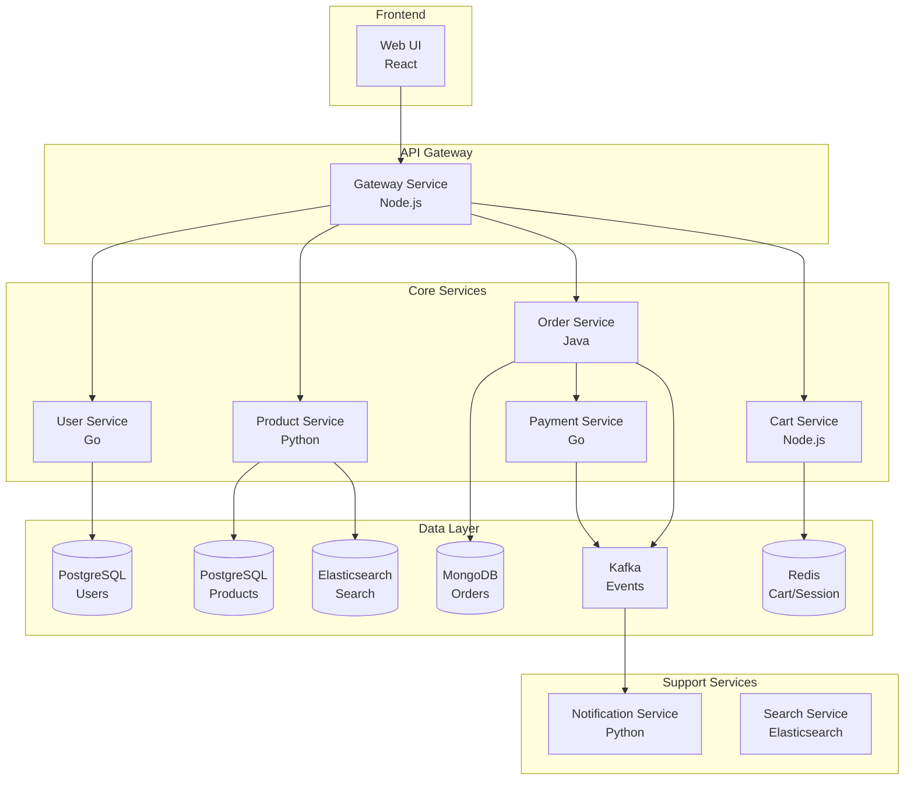

# 🏗️ Microservices E-Commerce Platform on Kubernetes

> 완벽한 마이크로서비스 아키텍처 예제 - E-Commerce 플랫폼

## 📋 아키텍처



## 🚀 빠른 시작

### 전체 배포
```bash
# Namespace 생성
kubectl create namespace microservices

# 전체 서비스 배포
kubectl apply -f deploy-all.yaml -n microservices

# 상태 확인
kubectl get all -n microservices

# Ingress 주소 확인
kubectl get ingress -n microservices
```

### 개별 서비스 배포
```bash
# 인프라 서비스 먼저 배포
kubectl apply -f infrastructure/ -n microservices

# 코어 서비스 배포
kubectl apply -f services/ -n microservices

# Frontend 배포
kubectl apply -f frontend/ -n microservices
```

## 📦 서비스 상세

### User Service (Go)
- 사용자 인증/인가
- JWT 토큰 발급
- 프로필 관리

### Product Service (Python)
- 상품 카탈로그
- 재고 관리
- Elasticsearch 연동

### Order Service (Java Spring Boot)
- 주문 처리
- 결제 연동
- 이벤트 발행

### Cart Service (Node.js)
- 장바구니 관리
- Redis 세션
- 실시간 업데이트

### Payment Service (Go)
- 결제 처리
- 외부 PG 연동
- 트랜잭션 관리

### Notification Service (Python)
- 이메일/SMS 알림
- Kafka 컨슈머
- 템플릿 관리

## 🔧 기술 스택

- **Languages**: Go, Python, Java, Node.js
- **Databases**: PostgreSQL, MongoDB, Redis
- **Message Queue**: Kafka
- **Search**: Elasticsearch
- **Monitoring**: Prometheus + Grafana
- **Tracing**: Jaeger
- **Service Mesh**: Istio (옵션)
- **CI/CD**: ArgoCD

## 📊 모니터링

### Grafana 대시보드
```bash
# Port forward
kubectl port-forward -n monitoring svc/grafana 3000:80

# 브라우저 접속
http://localhost:3000
# admin / admin
```

### Jaeger Tracing
```bash
kubectl port-forward -n tracing svc/jaeger-query 16686:80
# http://localhost:16686
```

## 🔐 보안

- JWT 기반 인증
- mTLS 서비스 간 통신
- NetworkPolicy 적용
- Secret 암호화

## 📈 확장성

- HorizontalPodAutoscaler 설정
- Database 읽기 복제본
- 캐싱 레이어
- 비동기 처리

## 🧪 테스트

```bash
# API 테스트
./test/api-test.sh

# 부하 테스트
./test/load-test.sh

# Chaos 테스트
kubectl apply -f test/chaos/
```

## 📝 API 문서

각 서비스는 Swagger/OpenAPI 문서를 제공합니다:

- User Service: http://[gateway]/api/users/docs
- Product Service: http://[gateway]/api/products/docs
- Order Service: http://[gateway]/api/orders/docs
- Cart Service: http://[gateway]/api/cart/docs

## 🛠️ 개발 환경

```bash
# Skaffold로 로컬 개발
skaffold dev

# Telepresence로 원격 디버깅
telepresence intercept user-service --port 8080
```

## 📋 환경 설정

### Development
```bash
kubectl apply -k overlays/development/
```

### Staging
```bash
kubectl apply -k overlays/staging/
```

### Production
```bash
kubectl apply -k overlays/production/
```

## 🔄 CI/CD Pipeline

GitHub Actions → Docker Build → ArgoCD → Kubernetes

## 📚 추가 문서

- [서비스 간 통신](./docs/communication.md)
- [데이터베이스 설계](./docs/database.md)
- [보안 가이드](./docs/security.md)
- [운영 가이드](./docs/operations.md)